# WpfHexEditor Studio — Présentation du projet

> **Un environnement desktop piloté par `.whfmt` — un langage de définition déclaratif  
> qui est le véritable cœur de l'IDE : il décide comment chaque fichier est ouvert, parsé, coloré et analysé.**  
> *Tu peux analyser un binaire. Tu peux coder une solution .NET. Tu peux faire les deux en même temps.*  
> *Et tout ça — sans une ligne de C# de plus. Juste un `.whfmt`.*

---

## 1. Contexte et motivation

Les éditeurs hex existants (HxD, 010 Editor, Hex Fiend) font bien un travail :
afficher et éditer des bytes. Mais ils s'arrêtent là.

Ils ne comprennent pas ce que ces bytes **représentent**.  
Ils ne permettent pas d'**analyser**, de **comparer**, de **désassembler**, ni d'**agir** sur le fichier dans un workflow intégré.  
Ils ne sont pas extensibles.

**L'objectif** : construire un outil piloté par les données, pas par le code — où ajouter
le support d'un nouveau format de fichier ne nécessite pas de modifier le C#, mais d'écrire
une définition `.whfmt`.

Ce n'est pas un simple éditeur hex.  
Ce n'est pas non plus une IDE généraliste comme Visual Studio.  
C'est un environnement **data-driven** : `.whfmt` est le cerveau, le HexEditor est le moteur,
et le reste de l'IDE est l'écosystème autour. Quelqu'un qui analyse des binaires y trouve ses outils.
Quelqu'un qui veut uniquement écrire du code .NET peut ouvrir une solution, coder, déboguer,
versionner — sans jamais toucher un byte.

---

## 2. Ce que fait l'IDE

WpfHexEditor Studio est un **environnement d'analyse et d'édition de fichiers**,
conçu autour d'un HexEditor haute performance, entouré de tout ce qui permet d'aller plus loin :

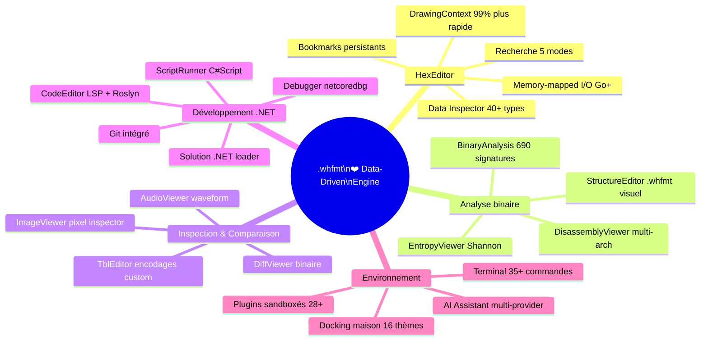

---

## 3. Chiffres clés

```
Version actuelle        : 0.6.4.75
Projets de production   : 91  (104 total — 13 samples/tests exclus)
  dont Editors          : 24 projets
  dont Plugins          : 32 projets
Définitions .whfmt      : 690  (formats binaires, langages, images, ROMs, documents)
Plugins intégrés        : 28
Langages de code        : 55+  (C#, Rust, Go, Python, Lua, F#, VB.NET, Assembly…)
Formats binaires        : 690 détectés via magic bytes + confidence scoring
Thèmes UI               : 16  (Dark, Light, Dracula, Nord, Tokyo Night, Catppuccin…)
Cible                   : .NET 8.0 / WPF / Windows
```

---

## 4. `.whfmt` — Le vrai cœur de l'IDE

`.whfmt` est un **langage de définition déclaratif maison** — le cerveau qui rend toute l'IDE
*data-driven* plutôt que *code-driven*.

> **Ajouter le support d'un nouveau format de fichier ?  
> Écrire un `.whfmt` — aucune ligne de C# nécessaire.**

Un seul fichier `.whfmt` décide de **tout** pour un type de fichier :

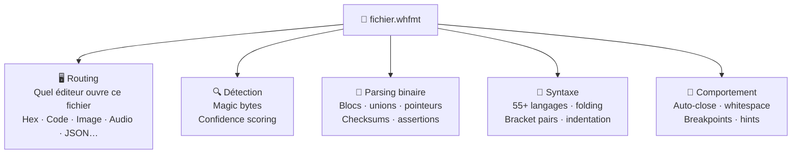

**690 définitions intégrées** couvrent les formats binaires courants, les formats d'images,
les ROMs de consoles, les formats de documents, et 55+ langages de programmation.

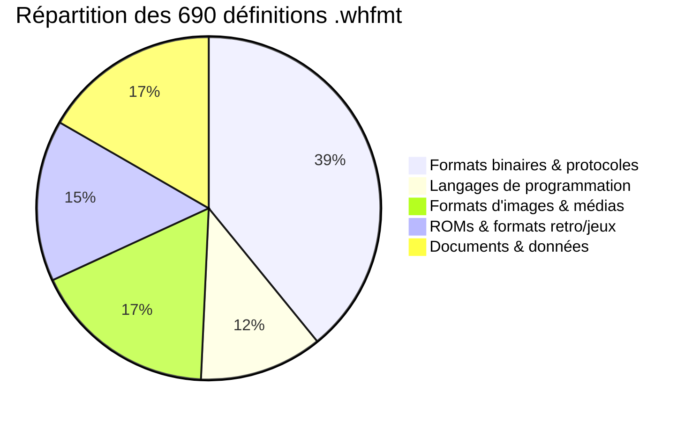

### Pourquoi c'est unique

Après analyse des outils et IDEs existants, **aucun ne combine ces quatre responsabilités dans un seul fichier**.
L'industrie les fragmente systématiquement :

| Outil | Routing fichier | Parsing binaire | Syntaxe | Comportement éditeur |
|---|:---:|:---:|:---:|:---:|
| **Visual Studio** | `.pkgdef` + MEF | `IVsEditorFactory` C# | `IClassifier` C# | `language-config.json` séparé |
| **VS Code** | extension séparée | ✗ | `.tmLanguage` séparé | `language-config.json` séparé |
| **010 Editor** | ✗ manuel | ✅ templates | ✗ | ✗ |
| **Kaitai Struct** | ✗ | ✅ parsing seul | ✗ | ✗ |
| **Sublime / TextMate** | ✗ | ✗ | `.tmLanguage` seul | ✗ |
| **HxD / Hex Workshop** | ✗ | ✗ | ✗ | ✗ |
| **`.whfmt`** | ✅ | ✅ | ✅ | ✅ |

> **C'est l'insight architectural central du projet** :  
> unifier en un seul fichier déclaratif ce que l'industrie éparpille en plusieurs systèmes distincts.

### Ajouter un nouveau format ou langage — Visual Studio vs WpfHexEditor

```mermaid
flowchart TB
    subgraph WH ["❤️ WpfHexEditor — 3 étapes"]
        WH1["1. Créer monformat.whfmt"]
        WH2["2. Écrire les règles JSON\nrouting · parsing · syntaxe · comportement"]
        WH3["✅ 3. Déposer dans %AppData%\nRechargement à chaud — terminé"]
        WH1 --> WH2 --> WH3
    end

    subgraph VS ["🏢 Visual Studio — 8 étapes"]
        VS1["1. Créer un projet VSIX"]
        VS2["2. ContentTypeDefinition\n+ MEF export"]
        VS3["3. FileExtensionToContentTypeDefinition\n+ .pkgdef"]
        VS4["4. IVsEditorFactory\n+ IVsWindowPane"]
        VS5["5. IClassifierProvider\n+ IClassifier"]
        VS6["6. IClassificationTypeRegistryService\n+ .pkgdef entries"]
        VS7["7. language-configuration.json"]
        VS8["8. Build · Sign · Deploy VSIX\nRedémarrer Visual Studio"]
        VS1 --> VS2 --> VS3 --> VS4 --> VS5 --> VS6 --> VS7 --> VS8
    end
```

| | Visual Studio | WpfHexEditor |
|---|---|---|
| **Fichiers à créer** | 7–10 classes C# + 3 fichiers config | **1 fichier `.whfmt`** |
| **Code C# requis** | Oui — MEF, interfaces, tokenizer | **Non** |
| **Redémarrage requis** | Oui — rebuild + redémarrage VS | **Non** — rechargement à chaud |
| **Compétences requises** | VSIX, MEF, extensibility APIs | JSON |
| **Temps estimé** | Plusieurs heures à plusieurs jours | **Minutes** |

---

## 5. Architecture globale

L'IDE est structurée en couches strictement séparées, sans couplage entre modules.

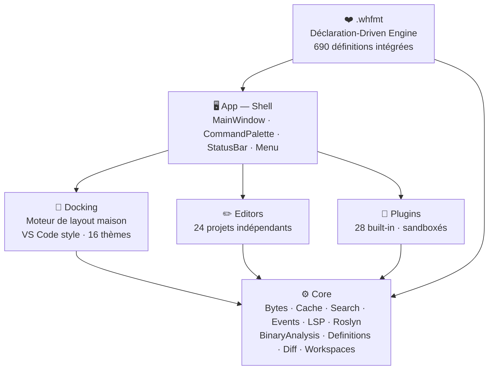

**Principes appliqués** : SOLID, composition > héritage, 1 fichier = 1 responsabilité,
fonctions ≤ 25 lignes, zéro effet de bord caché.

---

## 6. Les composants principaux

### HexEditor — Le moteur central

L'éditeur hexadécimal est le composant fondateur, piloté par `.whfmt` pour chaque format ouvert.
Il a subi plusieurs générations de refactoring pour atteindre des performances de niveau production :

- **Rendu** : DrawingContext natif — 99% plus rapide qu'un ItemsControl WPF standard
- **Mémoire** : fichier de 10 Mo = 85 Mo RAM (contre 950 Mo en v1) via memory-mapped I/O
- **Recherche** : 5 modes — Hex, Texte, Regex, TBL, Wildcard — 100× plus rapide
- **Formats** : 690 définitions `.whfmt` avec coloration syntaxique overlay
- **Navigation** : bookmarks persistants, Data Inspector 40+ types au curseur, undo/redo illimité
- **Encodages** : UTF-8, Latin-1, Shift-JIS, tables TBL custom

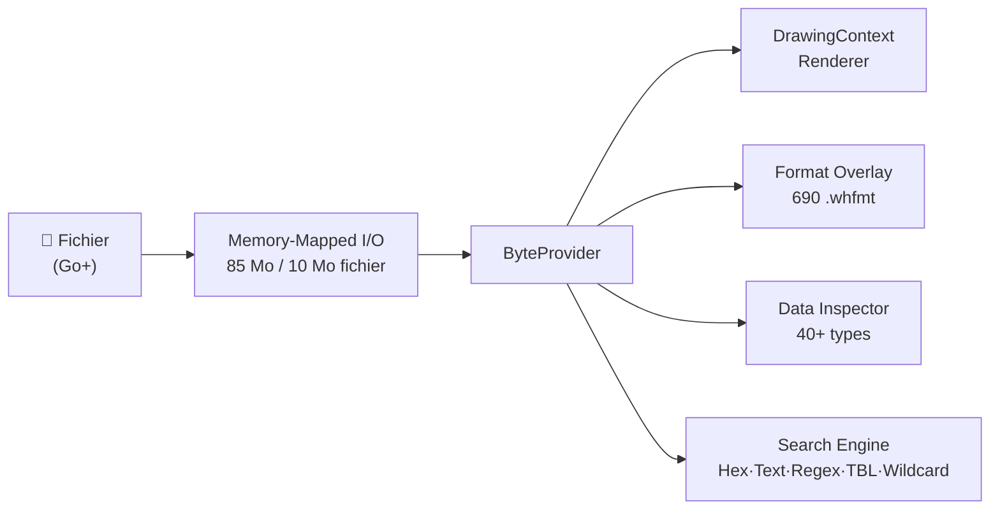

### Éditeurs d'analyse — Comprendre ce que contient le fichier

Ce sont les outils qui transforment des bytes bruts en **information lisible** :

| Éditeur | Ce qu'il apporte |
|---|---|
| **EntropyViewer** | Graphique d'entropie Shannon par blocs — détecte les zones chiffrées, compressées ou structurées |
| **DiffViewer** | Comparaison binaire côte-à-côte — régions colorées (modifié / ajouté / supprimé) |
| **DisassemblyViewer** | Désassemblage multi-arch : x86, ARM, ELF, WASM, ROM GameBoy/NES |
| **StructureEditor** | Éditeur visuel de définitions de formats `.whfmt` — créer et tester ses propres formats |
| **TblEditor** | Éditeur de tables de caractères avec validation et diagnostics live |
| **ImageViewer** | Prévisualisation PNG/BMP/JPG/GIF/DDS/TGA avec pixel inspector ARGB/hex |

### Éditeurs de support — Agir sur ce qu'on a trouvé

Ces outils complètent le workflow sans quitter l'environnement :

- **CodeEditor** : édition de scripts et définitions `.whfmt`/`.whlang`, LSP + Roslyn, 55+ langages
- **TextEditor** : rendu virtualisé, pour lire les fichiers texte adjacents
- **ScriptRunner** : exécuter des scripts C# directement sur les données inspectées
- **Debugger** : débogueur intégré (netcoredbg), breakpoints avec conditions et hit counts
- **Git** : versionner le travail d'analyse et les définitions de formats

---

## 7. Système de plugins

Le système de plugins est conçu pour être **sûr, isolé et extensible** sans modifier le cœur.

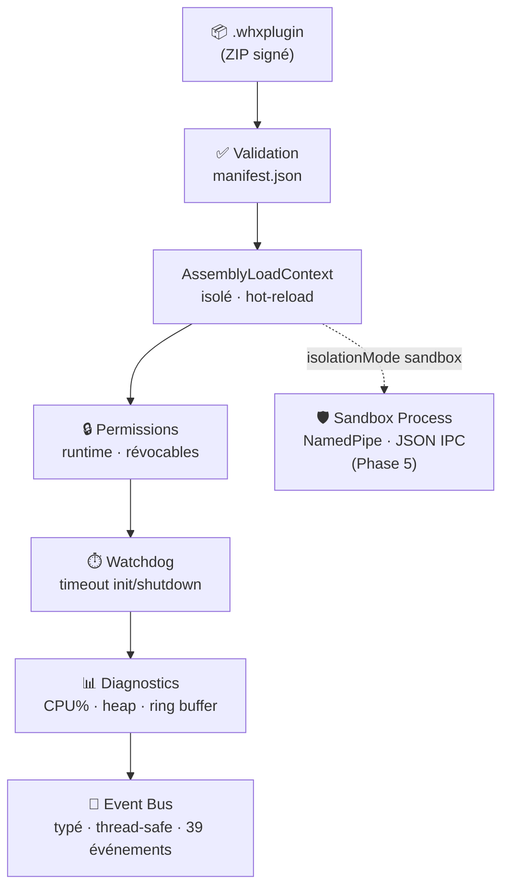

**Plugins intégrés notables** : AI Assistant, Debugger, Git, DataInspector, FileComparison,
AssemblyExplorer, ScriptRunner, SolutionLoader (VS / .NET Folder), DiagnosticTools.

---

## 8. Système de docking

Le docking est un **framework maison** (non basé sur AvalonDock ou autre bibliothèque tierce),
conçu comme un moteur indépendant du framework UI.

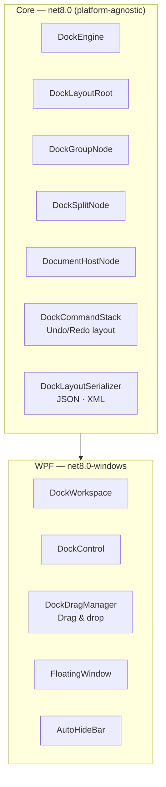

---

## 9. Cycle de développement — Comment l'IDE a été construite

Chaque fonctionnalité significative suit ce cycle, outillé par l'IA à chaque étape.

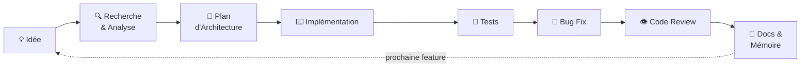

| # | Étape | Outils IA |
|:---:|---|---|
| 💡 | **Idée** — besoin identifié, manque dans les outils existants | — |
| 🔍 | **Recherche & Analyse** — exploration des solutions existantes, contraintes techniques | ChatGPT · Claude |
| 📐 | **Plan d'Architecture** — design des interfaces, couches, contrats · ADR documenté | Claude → validation · ChatGPT → patterns |
| ⌨️ | **Implémentation** — coding principal | Copilot → complétion · Claude → boilerplate |
| 🧪 | **Tests** — xUnit, tests visuels UI | Claude → cas de test · couverture |
| 🐛 | **Bug Fix** — root cause obligatoire, jamais de patch cosmétique | Claude → stack trace · ChatGPT → deuxième opinion |
| 👁️ | **Code Review** — SOLID, performance, sécurité, validation finale | Claude → revue complète |
| 📝 | **Docs & Mémoire** — README par module, ADR, décisions et risques | Claude → rédaction |

> Le cycle recommence — chaque feature livrée alimente la prochaine idée.

### Rôle de chaque outil IA

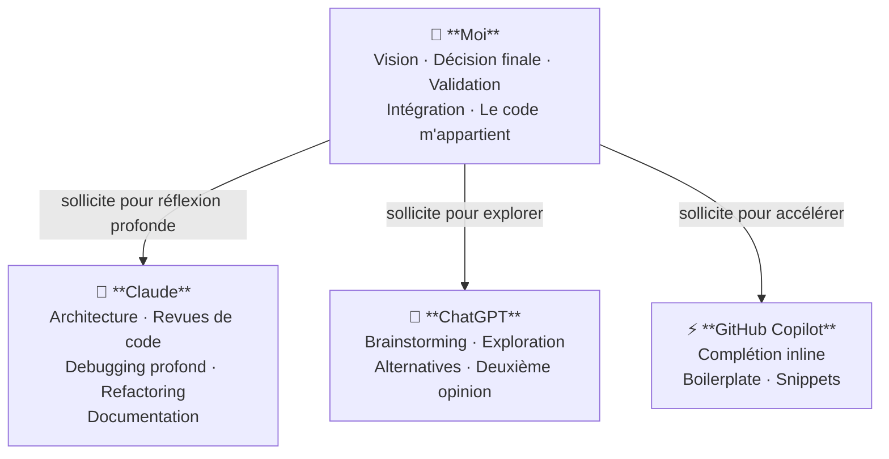

> **Point clé** : l'IA propose, j'évalue, j'adapte ou je rejette.  
> Chaque ligne de code qui entre dans le projet a été lue, comprise et validée par moi.

---

## 10. Ce que ce projet m'a appris

- **`.whfmt` data-driven** : externaliser l'intelligence du format dans des données plutôt que dans le code
  transforme radicalement la maintenabilité — ajouter 690 formats sans toucher au C# de l'éditeur
- **Docking maison** : construire un moteur de layout arborescent est un problème de
  composition récursive de nœuds — plus proche d'un compilateur que d'un TabControl
- **Performance WPF** : DrawingContext vs ItemsControl = différence de 99%. Le framework
  ne scale pas sans rendu custom sur les volumes de données binaires
- **Isolation de plugins** : AssemblyLoadContext + NamedPipe + permission model =
  3 niveaux de défense nécessaires pour un système de plugins production-grade
- **Collaboration avec l'IA** : définir des règles précises (CLAUDE.md) transforme
  l'IA d'un générateur de code en véritable pair de développement

---

## 11. Statistiques de développement

> **3 145 commits · 10 ans · 79 000 lignes C# actives · 278 plans · 1 909 prompts Claude**

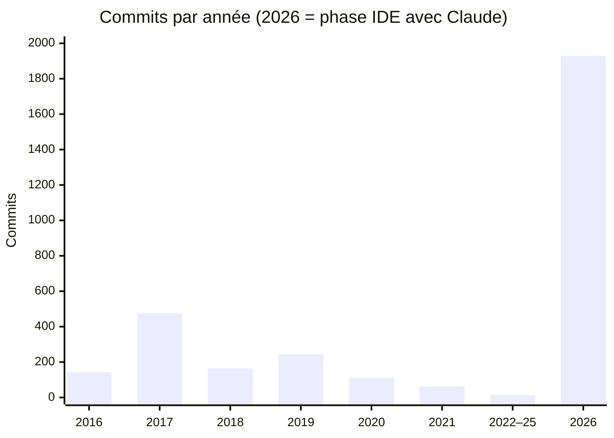

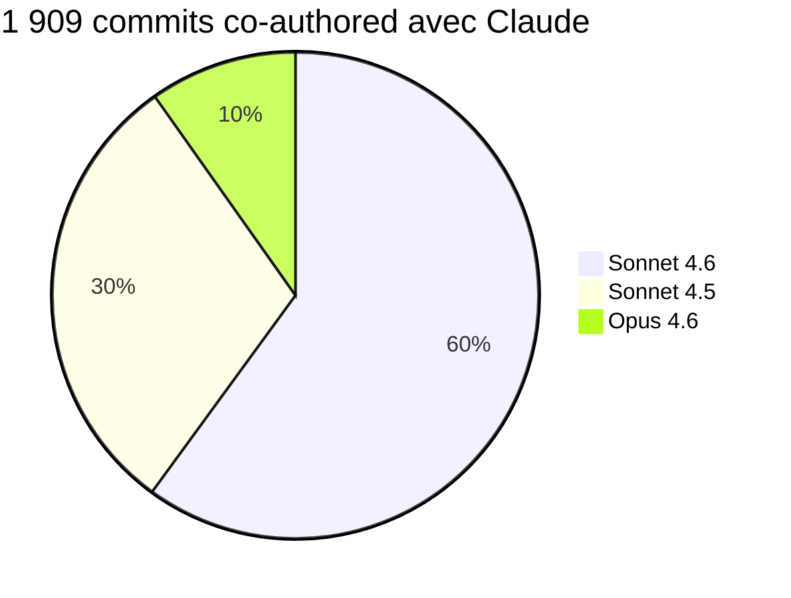

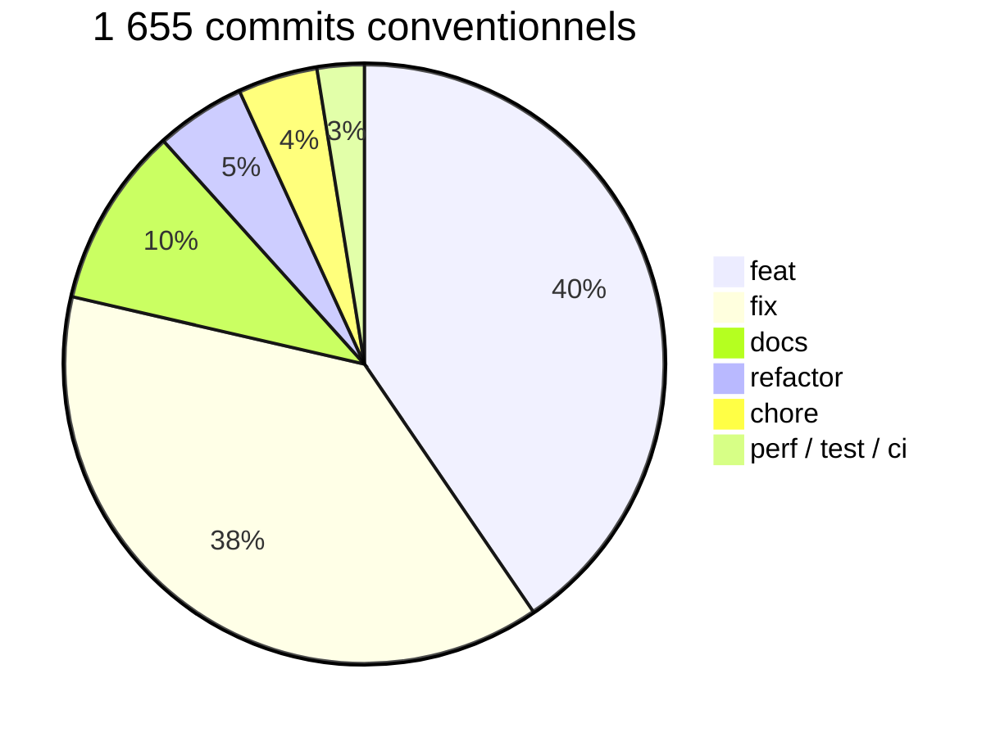

| Métrique | Valeur |
|---|---|
| **Code C# actif** | ~79 000 lignes · 2 150 fichiers |
| **XAML** | 284 fichiers |
| **Définitions .whfmt** | 690 |
| **Commits totaux** | 3 145 sur 449 jours actifs |
| **Plans d'architecture** | 278 (23 manuels + 255 Claude) |
| **Prompts Claude** | 1 909 commits co-authored |

---

## 12. Roadmap

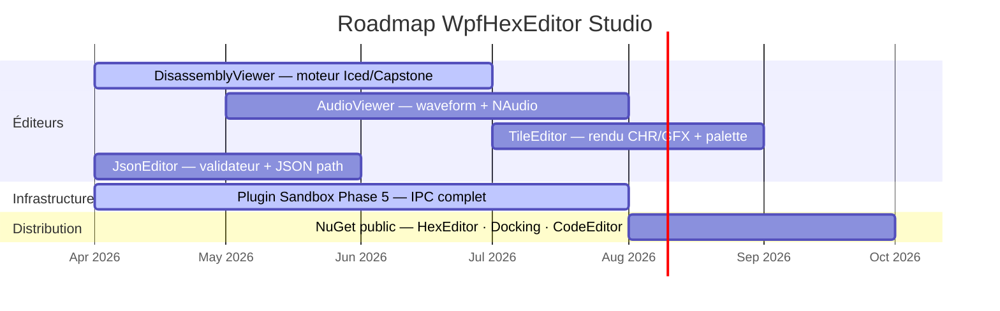

---

*WpfHexEditor Studio — v0.6.4.75 — .NET 8.0 / WPF / Windows*  
*Développé par abbaye avec Claude, ChatGPT, GitHub Copilot*  
*Statistiques extraites automatiquement du dépôt git le 2026-04-16*
