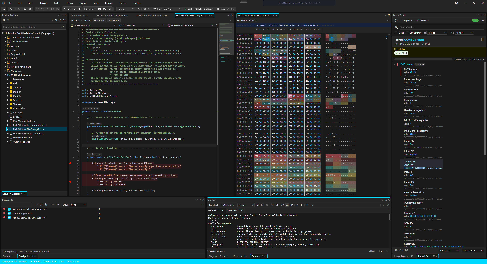
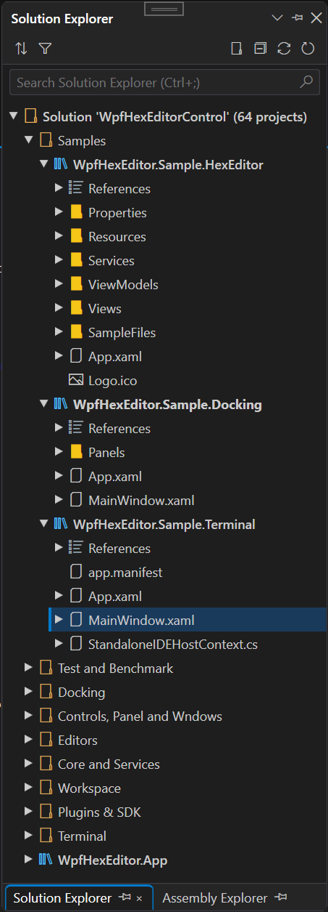

<div align="center">
  <a href="Images/Logo2026.png"></a>
  <br/><br/>

  <h3>🖥️ A full-featured open-source IDE for .NET — Binary analysis, reverse engineering & build tooling</h3>

[](https://dotnet.microsoft.com/)
  [](https://github.com/abbaye/WpfHexEditorIDE)
  [](https://github.com/abbaye/WpfHexEditorIDE/releases)
  [](https://www.gnu.org/licenses/agpl-3.0)
  [](https://github.com/abbaye/WpfHexEditorIDE/commits/master)
  [](docs/ROADMAP.md)

  <br/>

  > 🚧 **Active Development** — New features, editors and panels are added regularly. Contributions welcome!

  <br/>

  <a href="Images/App-Editors-Welcome.png"></a>
  <br/>
  <sub><i>WpfHexEditor — Full IDE with VS-style docking, project system, and multiple editors</i></sub>

  <p>
    <a href="#-the-ide-application"><b>The IDE</b></a> •
    <a href="#-editors"><b>Editors</b></a> •
    <a href="#-standalone-controls--libraries"><b>Controls</b></a> •
    <a href="#-ide-panels"><b>Panels</b></a> •
    <a href="#-quick-start"><b>Quick Start</b></a> •
    <a href="#-documentation"><b>Docs</b></a> •
    <a href="docs/CHANGELOG.md"><b>Changelog</b></a>
  </p>
</div>

---

## 🖥️ The IDE Application

**WpfHexEditor** is a full-featured binary analysis IDE for Windows, built with WPF and .NET 8. Think Visual Studio for binary files.

| | |
|---|---|
| **🏗️ Project System** | `.whsln` / `.whproj` + VS `.sln`/`.csproj`/`.vbproj` · MSBuild build/rebuild/clean · virtual & physical folders · per-file state persistence · format auto-migration |
| **🪟 Docking** *(100% in-house)* | Float · dock · auto-hide · colored tabs · **19 built-in themes** (Dark, Light, VS2022Dark, DarkGlass, Dracula, Nord, Tokyo Night, Catppuccin Mocha/Latte, Gruvbox Dark, Forest, Matrix, Synthwave 84, Cyberpunk, High Contrast…) · tab placement L/R/Bottom |
| **📋 IDE Infrastructure** | `IDocumentEditor` plugin contract · shared `UndoEngine` (coalescence 500 ms, transactions, HexEditor block-undo, VS-style history dropdown) · `Ctrl+Z/Y` across all editors · rect selection (Alt+Click) · VS2022 status bar · Options (9 pages) · Workspace system `.whidews` · Dynamic View Menu (Flat/Categorized/ByDockSide) · Middle-click pan mode · NuGet Solution Manager · DI via `Microsoft.Extensions.DependencyInjection` |
| **⌨️ Command & Terminal** | Command Palette (`Ctrl+Shift+P`, 9 modes) · `CommandRegistry` (~50 commands) · `KeyBindingService` · Integrated Terminal (`Ctrl+\``, 35+ commands incl. `plugin-reload`) · `ITerminalService` plugin API |
| **🔌 Plugin System** | SDK 2.0.0 (frozen) · `.whxplugin` packages · Plugin Manager · EventBus (39+ events) · Capability Registry · Extension Points · Dependency Graph · plugin signing · out-of-process sandbox |
| **🔍 Binary Intelligence** | 400+ format detection · `.whfmt` v2.0 (`repeating`/`union`/`versionedBlocks`/`pointer`/`checksums`/`assertions`/`forensic`/`aiHints`) · 20 critical formats upgraded (PE/ELF/ZIP/PNG/MP4/SQLITE/PDF/JPEG/WASM…) · Parsed Fields (reactive, forensic alerts, FormatNavigator) · Format Field Overlay · Data Inspector (40+ types) · Assembly Explorer (.NET PE + ILSpy decompilation) |

---

## 📝 Editors

Every editor is a standalone `IDocumentEditor` plugin — reusable outside the IDE.

| Editor | Progress | Description |
|--------|----------|-------------|
| **[Hex Editor](Sources/WpfHexEditor.HexEditor/README.md)** | ~65% | Binary editing — insert/overwrite, 400+ format detection, search, bookmarks, TBL, block undo |
| **[Code Editor](Sources/WpfHexEditor.Editor.CodeEditor/README.md)** | ~85% | 55+ languages (F# + VB.NET), LSP (13 providers + call/type hierarchy + linked editing + pull diagnostics), sticky scroll, Find All References, multi-caret, bracket-depth colorizer (4-level), color swatch preview, column rulers, code formatting, split view |
| **[XAML Designer](Sources/WpfHexEditor.Editor.XamlDesigner/README.md)** | ~40% | Live WPF canvas with bidirectional sync, move/resize/rotate, property inspector (F4), 4 split layouts, undo/redo |
| **[Document Editor](Sources/WpfHexEditor.Editor.DocumentEditor/README.md)** | ~35% | WYSIWYG RTF / DOCX / ODT — DrawingContext renderer, cursor/formatting/tables, styles panel, find/replace, page settings, save, split hex pane |
| **[TBL Editor](Sources/WpfHexEditor.Editor.TblEditor/README.md)** | ~75% | Character table editor for custom encodings and ROM hacking |
| **[Text Editor](Sources/WpfHexEditor.Editor.TextEditor/README.md)** | ~40% | 26 embedded language definitions, auto-detection, encoding support |
| **[Diff / Changeset Viewer](Sources/WpfHexEditor.Editor.DiffViewer/README.md)** | ~65% | Binary + text + structure diff — GlyphRun canvas renderers, word-level diff, overview ruler, Myers/Binary/Semantic algorithms, format field overlay |
| **[Entropy Viewer](Sources/WpfHexEditor.Editor.EntropyViewer/README.md)** | ~30% | Visual entropy graph — detect encryption, compression, packed regions |
| **[Image Viewer](Sources/WpfHexEditor.Editor.ImageViewer/README.md)** | ~40% | Zoom/pan, rotate/flip/crop/resize, concurrent open |
| **[Structure Editor](Sources/WpfHexEditor.Editor.StructureEditor/README.md)** | ~30% | `.whfmt` binary template editor — block DataGrid, live save |
| **[Disassembly Viewer](Sources/WpfHexEditor.Editor.DisassemblyViewer/README.md)** | ~20% | x86/x64/ARM binary disassembler |
| **[Script Editor](Sources/WpfHexEditor.Editor.ScriptEditor/README.md)** | ~40% | `CodeEditorSplitHost` with C#Script language + LSP SmartComplete, `ScriptGlobalsCompletionProvider`, `HxScriptEngine` |
| **[Audio Viewer](Sources/WpfHexEditor.Editor.AudioViewer/README.md)** | ~5% | Waveform display stub (#174) |
| **[Tile Editor](Sources/WpfHexEditor.Editor.TileEditor/README.md)** | ~5% | Tile/palette editor for ROM assets stub (#175) |
| **Decompiled Source Viewer** | ~0% | C# / IL view via ILSpy — planned (#106) |
| **Memory Snapshot Viewer** | ~0% | Windows `.dmp` / Linux core-dump — planned (#117) |
| **PCAP Viewer** | ~0% | `.pcap`/`.pcapng` packet viewer — planned (#136) |

> New editor? See [IDocumentEditor contract](Sources/WpfHexEditor.Editor.Core/README.md) and register via `EditorRegistry`.

---

## 🧩 Standalone Controls & Libraries

All controls are **independently reusable** — no IDE required.

### UI Controls

| Control | Progress | Description |
|---------|----------|-------------|
| **[HexEditor](Sources/WpfHexEditor.HexEditor/README.md)** | ~70% | Full hex editor UserControl — MVVM, 16 services, 400+ format detection |
| **[HexBox](Sources/WpfHexEditor.HexBox/README.md)** | ~70% | Lightweight hex input field — zero dependencies |
| **[ColorPicker](Sources/WpfHexEditor.ColorPicker/README.md)** | ~90% | RGB/HSV/hex color picker |
| **[BarChart](Sources/WpfHexEditor.BarChart/README.md)** | ~80% | Byte-frequency bar chart (net48 \| net8.0-windows) |
| **[Shell](Sources/WpfHexEditor.Shell/README.md)** | ~60% | 100% in-house VS-style docking engine — 19 themes, float/dock/auto-hide |

### Libraries

| Library | Description |
|---------|-------------|
| **[Core](Sources/WpfHexEditor.Core/README.md)** | ByteProvider, 16 services, data layer |
| **[Editor.Core](Sources/WpfHexEditor.Editor.Core/README.md)** | `IDocumentEditor` contract, editor registry, changeset system, `PanModeController` |
| **[BinaryAnalysis](Sources/WpfHexEditor.BinaryAnalysis/README.md)** | 400+ format detection engine, binary templates, DataInspector |
| **[Definitions](Sources/WpfHexEditor.Definitions/README.md)** | Embedded format catalog (400+ signatures) + syntax definitions |
| **[Events](Sources/WpfHexEditor.Events/README.md)** | Typed EventBus — 39+ event types, weak refs, IPC bridge |
| **[SDK](Sources/WpfHexEditor.SDK/README.md)** | **SemVer 2.0.0 frozen** — `IWpfHexEditorPlugin`, `IIDEHostContext`, 15+ service contracts |
| **[Core.LSP.Client](Sources/WpfHexEditor.Core.LSP.Client/README.md)** | Full JSON-RPC LSP 3.17 client — 13 providers, document sync, server capabilities |
| **[Core.Workspaces](Sources/WpfHexEditor.Core.Workspaces/README.md)** | `.whidews` workspace engine — ZIP+JSON, layout/solution/theme restore |
| **[PluginHost](Sources/WpfHexEditor.PluginHost/README.md)** | Plugin discovery, load, watchdog, `PluginManagerControl` |
| **[PluginSandbox](Sources/WpfHexEditor.PluginSandbox/README.md)** | Out-of-process plugin host — HWND embed, IPC, Job Object isolation |
| **[Docking.Core](Sources/WpfHexEditor.Docking.Core/README.md)** | Abstract docking contracts — `DockEngine`, layout model |
| **[Core.Terminal](Sources/WpfHexEditor.Core.Terminal/README.md)** | Command engine — 31+ built-in commands, `HxScriptEngine`, `CommandHistory` |
| **[Terminal](Sources/WpfHexEditor.Terminal/README.md)** | WPF terminal panel — multi-tab shell session management |
| **[Core.AssemblyAnalysis](Sources/WpfHexEditor.Core.AssemblyAnalysis/README.md)** | BCL-only .NET PE analysis — PEReader + assembly model |
| **[Core.Decompiler](Sources/WpfHexEditor.Core.Decompiler/README.md)** | `IDecompiler` contract + ILSpy/dnSpy stub (#106) |
| **[ProjectSystem](Sources/WpfHexEditor.ProjectSystem/README.md)** | `.whsln` / `.whproj` model — serialization, P2P references, dialogs |
| **[Options](Sources/WpfHexEditor.Options/README.md)** | `AppSettingsService`, `OptionsEditorControl` — settings persistence |

---

## 🗂️ IDE Panels

| Panel | Progress | Description |
|-------|----------|-------------|
| **[Solution Explorer](Sources/WpfHexEditor.Panels.IDE/README.md)** | ~75% | Project tree — virtual/physical folders, D&D, lazy source outline (types/members navigation) |
| **[Parsed Fields](Sources/Plugins/WpfHexEditor.Plugins.ParsedFields/README.md)** | ~65% | 400+ format detection — reactive, expandable groups, FormatNavigator, forensic alerts |
| **[Data Inspector](Sources/Plugins/WpfHexEditor.Plugins.DataInspector/README.md)** | ~60% | 40+ byte interpretations at caret (int/float/GUID/date/color/…) |
| **[Assembly Explorer](Sources/Plugins/WpfHexEditor.Plugins.AssemblyExplorer/README.md)** | ~30% | .NET PE tree — types/methods/fields; C# decompilation → Code Editor tab |
| **[Archive Explorer](Sources/Plugins/WpfHexEditor.Plugins.ArchiveStructure/README.md)** | ~45% | ZIP/RAR/7z/TAR tree — browse, extract, in-place hex preview |
| **[Call Hierarchy](Sources/Plugins/WpfHexEditor.Plugins.LSPTools/README.md)** | ~65% | LSP 3.17 — incoming/outgoing call tree (`Shift+Alt+H`) |
| **[Type Hierarchy](Sources/Plugins/WpfHexEditor.Plugins.LSPTools/README.md)** | ~65% | LSP 3.17 — supertypes/subtypes tree (`Ctrl+Alt+F12`) |
| **[Breakpoint Explorer](Sources/WpfHexEditor.Panels.IDE/README.md)** | ~55% | Solution-scoped breakpoints — hit counts, enable/disable, jump-to-source |
| **[File Comparison](Sources/Plugins/WpfHexEditor.Plugins.FileComparison/README.md)** | ~55% | Byte-level diff, synchronized scrolling, DiffHub launcher |
| **[Structure Overlay](Sources/Plugins/WpfHexEditor.Plugins.StructureOverlay/README.md)** | ~40% | Visual field highlighting on the hex grid |
| **[Format Info](Sources/Plugins/WpfHexEditor.Plugins.FormatInfo/README.md)** | ~50% | Detected format, MIME, magic bytes, section list |
| **[File Statistics](Sources/Plugins/WpfHexEditor.Plugins.FileStatistics/README.md)** | ~50% | Byte-frequency charts, entropy score, size breakdown |
| **[Pattern Analysis](Sources/Plugins/WpfHexEditor.Plugins.PatternAnalysis/README.md)** | ~35% | Known byte sequences, data structures and anomaly detection |
| **[Custom Parser Template](Sources/Plugins/WpfHexEditor.Plugins.CustomParserTemplate/README.md)** | ~25% | `.bt`-style schema → live parsed fields |
| **[Terminal Panel](Sources/WpfHexEditor.Terminal/README.md)** | ~65% | Multi-tab integrated terminal — `ITerminalService` plugin API |
| **[Output Panel](Sources/WpfHexEditor.Panels.IDE/README.md)** | ~70% | Build channel with severity colors, session log, auto-scroll |
| **[Error Panel](Sources/WpfHexEditor.Panels.IDE/README.md)** | ~65% | Diagnostics from any `IDiagnosticSource` editor |
| **[Properties Panel](Sources/WpfHexEditor.Panels.IDE/README.md)** | ~50% | Context-aware properties (F4) — 400 ms debounce, categorized groups |
| **[Plugin Manager](Sources/WpfHexEditor.PluginHost/README.md)** | ~55% | Browse, enable/disable, uninstall plugins |
| **[Plugin Monitoring](Sources/WpfHexEditor.Panels.IDE/README.md)** | ~50% | Real-time CPU% + memory charts per plugin (pure WPF Canvas/Polyline) |
| **[Options](Sources/WpfHexEditor.Options/README.md)** | ~70% | VS2026-style settings — 20+ pages across Environment, Hex Editor, Code Editor (Appearance & Colors / Inline Hints / Navigation / Features / Language Servers), Text Editor, Plugin System, Build & Run, Debugger, Tools |
| **Quick Search** | ~60% | Inline `Ctrl+F` overlay — find next/prev, regex toggle |
| **Advanced Search** | ~40% | 5 modes: Hex, Text, Regex, TBL, Wildcard |

---

## 📸 Screenshots

<div align="center">
  <b>🖥️ IDE Overview</b><br/>
  <sub>VS-style docking with Solution Explorer, HexEditor and ParsedFieldsPanel</sub><br/><br/>
  <a href="Images/App-IDE-Overview.png"></a>
</div>

<details>
<summary>More screenshots</summary>
<br/>

| | |
|---|---|
| <a href="Images/App-ParsedFields.png"></a><br/><sub>🔬 Parsed Fields — 400+ format detection</sub> | <a href="Images/App-Editors.png"></a><br/><sub>📝 Multi-Editor Tabs</sub> |
| <a href="Images/App-SolutionExplorer.png"></a><br/><sub>🗂️ Solution Explorer</sub> | <a href="Images/App-Theme-Light.png"></a><br/><sub>☀️ Light Theme (19 built-in themes)</sub> |
| <a href="Images/App-Output.png"></a><br/><sub>📤 Output Panel</sub> | <a href="Images/App-ErrorList.png"></a><br/><sub>🔴 Error Panel</sub> |
| <a href="Images/App-TBLEditor.png"></a><br/><sub>📋 TBL Editor</sub> | <a href="Images/TBLExplain.png"></a><br/><sub>🎮 TBL Format</sub> |

</details>

---

## ⚡ Quick Start

**Run the IDE:**
```bash
git clone https://github.com/abbaye/WpfHexEditorIDE.git
```
Open `WpfHexEditorControl.sln`, set **WpfHexEditor.App** as startup project, press F5.

> Developed on **Visual Studio 2026**. Compatible with **VS 2022** (v17.8+) and **JetBrains Rider**.

**Embed the HexEditor in your WPF app:**
```xml
<!-- Project reference -->
<ProjectReference Include="..\WpfHexEditor.Core\WpfHexEditor.Core.csproj" />
<ProjectReference Include="..\WpfHexEditor.HexEditor\WpfHexEditor.HexEditor.csproj" />
```
```xml
<!-- XAML -->
<Window xmlns:hex="clr-namespace:WpfHexEditor.HexEditor;assembly=WpfHexEditor.HexEditor">
  <hex:HexEditor FileName="data.bin" />
</Window>
```

> **[Complete Tutorial →](docs/GETTING_STARTED.md)** · NuGet packaging planned (#109)

---

## 🗺️ Roadmap

> Full details: **[ROADMAP.md](docs/ROADMAP.md)** · **[CHANGELOG.md](docs/CHANGELOG.md)**

**In Progress / Planned:**

| Feature | Status | # |
|---------|--------|---|
| **Code Editor Phase 2** — gutter change markers, peek definition, remaining LSP providers | 🔧 ~93% | #158–168 |
| **Assembly Explorer** — ILSpy backend, Ctrl+Click cross-assembly nav | 🔧 ~75% | #104–106 |
| **Document Model Phase 2** — multi-editor collaboration, buffer unification | 🔧 ~40% | #107 |
| **Integrated Terminal** — full multi-shell + macro recording | 🔧 ~70% | #92 |
| **Editors Phase 2** — TextEditor LSP, DiffViewer 3-way merge, AudioViewer, TileEditor | 🔜 Planned | #169–178 |
| **LSP Phase 3 + Roslyn** — Roslyn C#/VB.NET/F# parser (pull-diagnostics + linked editing ✅ done) | 🔧 ~40% | #190–191 |
| **Code Intelligence** — AI suggestions (SmartComplete ✅ done · Snippets ✅ done · AI pending) | 🔧 ~65% | #86–89 |
| **Git Integration** | 🔜 Planned | #91 |
| **Plugin Marketplace & Auto-Update** | 🔜 Planned | #41–43 |
| **IDE Localization Engine** | 🔜 Planned | #100 |
| **Installable Package** — MSI / MSIX / WinGet | 🔜 Planned | #109 |
| **In-IDE Plugin Development** — write/debug/deploy plugins in the IDE (hot-reload ✅ done) | 🔧 ~40% | #138 |

<details>
<summary>✅ Completed features</summary>

| Feature | Version |
|---------|---------|
| **Document Editor WYSIWYG** — RTF/DOCX/ODT, DrawingContext renderer, cursor/formatting/tables, styles panel, find/replace, page settings, 3 savers, 22 `DE_*` tokens | v0.6.4.1 |
| **WHFMT v2.0** — `TypeDecoderRegistry`, `ChecksumEngine`, `AssertionRunner`, `repeating`/`union`/`versionedBlocks`/`pointer`, 20 critical formats, FormatNavigator, forensic alerts | v0.6.4.1 |
| **Diff Canvas Overkill** — `BinaryDiffCanvas`/`TextDiffCanvas`/`StructureDiffCanvas` GlyphRun renderers, O(n) builder, O(1) patience sort, ThreadStatic pools, format overlay | v0.6.4.1 |
| **Breakpoint System Overkill** — hover popup, gutter ghost, solution-scoped persistence, hit counts, Breakpoint Explorer panel | v0.6.4.1 |
| **LSP Tools Plugin** — Call Hierarchy (`Shift+Alt+H`), Type Hierarchy (`Ctrl+Alt+F12`), Linked Editing Range | v0.6.4.1 |
| **Archive Explorer Plugin** — ZIP/7z/TAR tree, extract, in-place hex preview, `AR_*` tokens | v0.6.4.1 |
| **Code Editor Phase 2** — column rulers (`CE_RulerBrush`), bracket-depth colorizer (4-level `CE_Bracket_1/2/3/4`), color swatch preview, `BasicIndentFormatter`, format-on-save, `BracketDepthColorizer` direct-scan engine | v0.6.4.1 |
| **LSP C1/C2** — pull-diagnostics (LSP 3.18), linked editing ranges (`textDocument/linkedEditingRange`) | v0.6.4.1 |
| **CollectibleALC Hot-Reload** — `IWpfHexEditorPluginV2.ReloadAsync`, `PluginDevLoader` FileSystemWatcher, `plugin-reload` terminal command, cascade reload | v0.6.4.1 |
| **Script Editor Overkill** — `CodeEditorSplitHost` + C#Script language definition, `ScriptGlobalsCompletionProvider`, SmartComplete for script globals | v0.6.4.1 |
| **Options Tree Reorganization** — Code Editor: Appearance & Colors / Inline Hints / Navigation / Features / Language Servers | v0.6.4.1 |
| **Dynamic View Menu** — Flat/Categorized/ByDockSide modes, pin system | v0.6.4.1 |
| **Middle-click Pan Mode** — `PanModeController` across all editors/viewports | v0.6.4.1 |
| **Debugger Full Audit** — 11-bug fix, BP line highlight, `DB_*` tokens | v0.6.4.1 |
| **Architectural Refactoring 1–3** — `CompositeDisposable`, service extractions, `CodeEditor.cs` split into 5 partials | v0.6.4.1 |
| **HexEditor Block Undo** — `UndoGroup`, `BeginUndoTransaction`, coalescence, VS-style history dropdown | v0.6.3.8 |
| **Sticky Scroll** — allocation-free `OnRender`, 6 options, perf fix (100% CPU loop eliminated) | v0.6.3.7 |
| **Find All References** — `Shift+F12`, dockable panel, `F8` nav | v0.6.3.7 |
| **Integrated Debugger UI** — Debug menu, toolbar pod, execution line highlight, `BreakpointInfoPopup` | v0.6.3.7 |
| **Workspace System** — `.whidews` ZIP+JSON, layout/solution/file/theme restore | v0.6.3.7 |
| **Compare Files Overkill** — Myers/Binary/Semantic engines, Git diff, `DiffExportService`, `DiffHub` | v0.6.3.7 |
| **End-of-Block Hover Hint** — `}` / `#endregion` / `</Tag>` → VS-style popup | v0.6.3.7 |
| **LSP Engine** — full JSON-RPC client, 13 providers, breadcrumb, inlay hints, code lens, semantic tokens | v0.6.3.6 |
| **Command Palette** — `Ctrl+Shift+P`, 9 modes | v0.6.3.6 |
| **IDE EventBus** — 39+ typed events, IPC bridge | v0.6.3.6 |
| **VS `.sln` / MSBuild build** — incremental dirty tracking | v0.5.0 |

</details>

---

## 📚 Documentation

| | |
|---|---|
| **[GETTING_STARTED.md](docs/GETTING_STARTED.md)** | Run the IDE or embed the control |
| **[FEATURES.md](docs/FEATURES.md)** | Complete feature list |
| **[CHANGELOG.md](docs/CHANGELOG.md)** | Version history |
| **[MIGRATION.md](docs/migration/MIGRATION.md)** | Legacy V1 → V2 migration |
| **[Architecture Overview](docs/architecture/Overview.md)** | Services, MVVM, data flow |
| **[API Reference](docs/api-reference/)** | Full API docs with examples |
| **[Wiki](https://github.com/abbaye/WpfHexEditorIDE/wiki/Getting-Started)** | Getting started |

---

## 🔧 Requirements

**.NET 8.0-windows** — Span\<T\>, SIMD, PGO. .NET Framework 4.8 is no longer supported (use legacy NuGet `WPFHexaEditor` for .NET Framework).

**HexEditor control** supports 19 UI languages (English · French · Spanish · German · Italian · Japanese · Korean · Dutch · Polish · Portuguese · Russian · Swedish · Turkish · Chinese · Arabic · Hindi · and more) with instant runtime switching. IDE UI is English only — localization engine planned (#100).

---

## ⭐ Support & Contributing

WPF HexEditor is **100% free and open source** (GNU AGPL v3.0).

- ⭐ **Star this repo** — helps others discover it
- 🍴 **Fork & contribute** — see **[CONTRIBUTING.md](.github/CONTRIBUTING.md)**
- 🐛 **Bug reports** — [GitHub Issues](https://github.com/abbaye/WpfHexEditorIDE/issues)
- 💡 **Feature requests** — [GitHub Discussions](https://github.com/abbaye/WpfHexEditorIDE/discussions)
- 📧 **Email** — derektremblay666@gmail.com

---

<div align="center">
  <sub>Built with ❤️ by the WpfHexEditor community · AGPL v3.0</sub>
</div>
