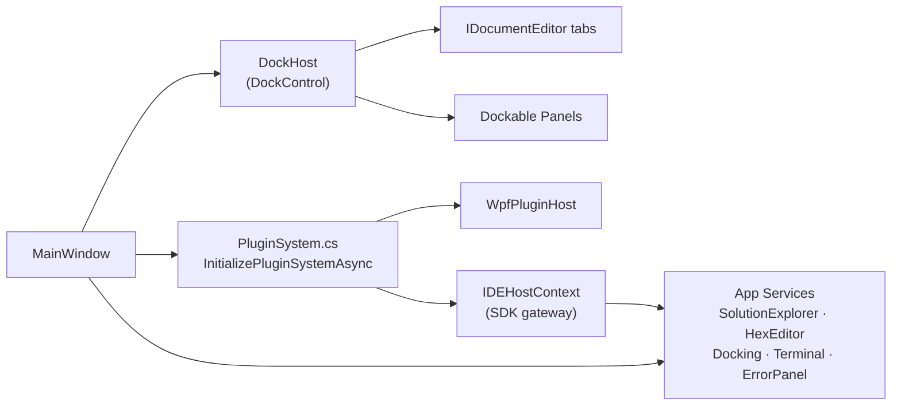
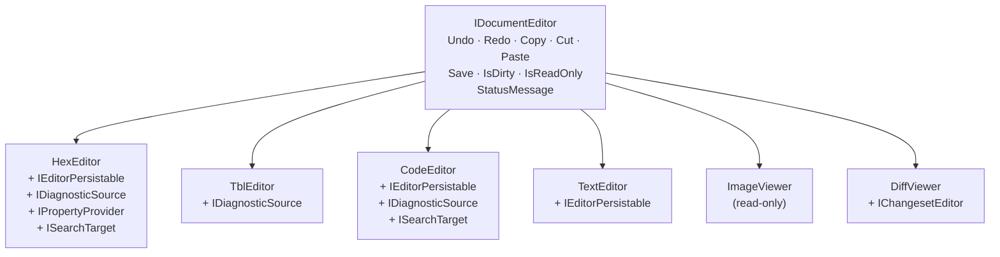
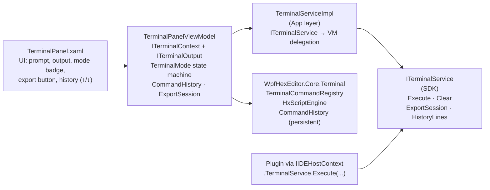
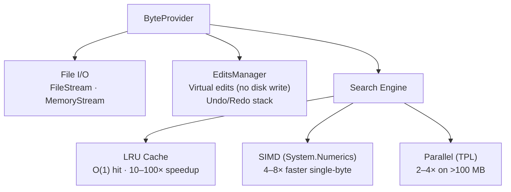
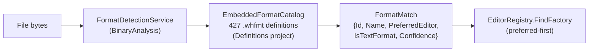
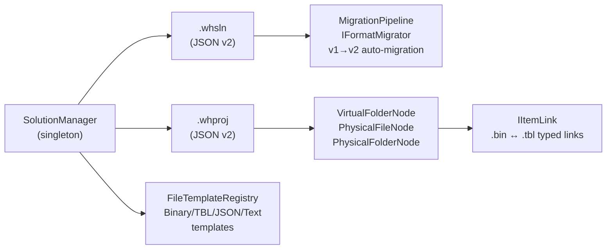

# WPF HexEditor IDE — Architecture Documentation

**Version:** 2026-03 · **Target:** .NET 8.0-windows · **Projects:** ~42 · **Authors:** Derek Tremblay, Claude Sonnet 4.6

---

## Overview

WPF HexEditor is a **full-featured binary analysis IDE** built entirely in WPF / .NET 8.0. The architecture is organized in concentric layers — from thin IDE application shell at the top, through a rich plugin and editor system, down to a high-performance core data layer.

```mermaid
graph TB
    subgraph "IDE Application Layer"
        App["WpfHexEditor.App\nMainWindow · Docking · Menu · StatusBar\nPlugin bootstrap · Service wiring"]
    end

    subgraph "Editor System  (IDocumentEditor)"
        Hex["HexEditor\n~80%"]
        Code["CodeEditor\n~55%"]
        Text["TextEditor\n~50%"]
        Tbl["TblEditor\n~60%"]
        Img["ImageViewer\n~30%"]
        Diff["DiffViewer\n~35%"]
        Struct["StructureEditor\n~30%"]
        Audio["AudioViewer stub"]
        Disasm["DisasmViewer stub"]
    end

    subgraph "Plugin System"
        SDK["WpfHexEditor.SDK\nIWpfHexEditorPlugin · IIDEHostContext\n11 service contracts"]
        Host["WpfHexEditor.PluginHost\nDiscovery · Load/Unload · Watchdog\nPluginManagerControl"]
        Sandbox["WpfHexEditor.PluginSandbox\nIsolated process (IPC named pipes)"]
        Terminal["WpfHexEditor.Terminal\nTerminalPanel · TerminalMode\nTerminalExportService"]
        CoreTerm["WpfHexEditor.Core.Terminal\n31+ commands · HxScriptEngine\nCommandHistory · ITerminalService"]
    end

    subgraph "IDE Panels"
        PanelsIDE["WpfHexEditor.Panels.IDE\nSolutionExplorer · PropertiesPanel\nErrorPanel · OutputPanel"]
        PanelsBin["WpfHexEditor.Panels.BinaryAnalysis\nParsedFieldsPanel · DataInspector\nStructureOverlay · FileStatistics\nPatternAnalysis · EnrichedFormatInfo\nCustomParserTemplate"]
        PanelsOps["WpfHexEditor.Panels.FileOps\nFileDiff · FileComparison\nArchiveStructure"]
    end

    subgraph "Controls & Libraries"
        HexCtrl["WpfHexEditor.HexEditor\nFull UserControl · 16 services\nInsert/Overwrite · Search · TBL"]
        HexBox["WpfHexEditor.HexBox\nLightweight hex input"]
        ColorPicker["WpfHexEditor.ColorPicker\nCompact RGB/HSV picker"]
        Docking["WpfHexEditor.Docking.Wpf\nVS-style engine · 8 themes\nFloat · Dock · Auto-hide"]
        Options["WpfHexEditor.Options\nVS2026 settings · 9 pages\nAppSettings · AppSettingsService"]
    end

    subgraph "Core Data Layer"
        Core["WpfHexEditor.Core (WPFHexaEditor)\nByteProvider · 16 services\nSearch (SIMD+Parallel+LRU)"]
        EditorCore["WpfHexEditor.Editor.Core\nIDocumentEditor · EditorRegistry\nChangesetSystem · IPropertyProvider"]
        BinAnalysis["WpfHexEditor.BinaryAnalysis\n400+ format detection\nDataInspectorService · ByteFreq"]
        Definitions["WpfHexEditor.Definitions\n427 .whfmt format files\nEmbeddedFormatCatalog"]
        ProjectSys["WpfHexEditor.ProjectSystem\n.whsln/.whproj · SolutionManager\nVirtual folders · Format versioning"]
    end

    App --> Hex & Code & Text & Tbl & Img & Diff & Struct
    App --> SDK
    App --> PanelsIDE & PanelsBin & PanelsOps
    App --> Docking & Options
    SDK --> Host --> Sandbox
    Host --> Terminal --> CoreTerm
    Hex & Code & Text & Tbl --> EditorCore
    PanelsIDE & PanelsBin & PanelsOps --> EditorCore
    HexCtrl --> Core & BinAnalysis & Definitions
    EditorCore --> Core
    ProjectSys --> Definitions
    App --> ProjectSys
```



---

## Project Map

| Project | Layer | Role |
|---------|-------|------|
| `WpfHexEditor.App` | IDE App | Startup, MainWindow, menu/toolbar/statusbar, service wiring, plugin bootstrap |
| `WpfHexEditor.Docking.Wpf` | IDE App | 100% in-house VS-style docking engine — float, dock, auto-hide, tab color, 8 themes |
| `WpfHexEditor.Options` | IDE App | VS2026-style settings with 9 pages, `AppSettings` / `AppSettingsService` |
| `WpfHexEditor.HexEditor` | Editor | Full-featured hex editor UserControl (16 services, MVVM, partial classes per feature) |
| `WpfHexEditor.Editor.TblEditor` | Editor | TBL character table editor — virtualized DataGrid, inline search, export |
| `WpfHexEditor.Editor.CodeEditor` | Editor | Multi-language code editor (fka JsonEditor) — syntax highlighting, find/replace |
| `WpfHexEditor.Editor.TextEditor` | Editor | Text editor with encoding support and `IEditorPersistable` |
| `WpfHexEditor.Editor.ImageViewer` | Editor | Image viewer — zoom/pan, transform pipeline, `IImageTransform` |
| `WpfHexEditor.Editor.DiffViewer` | Editor | Side-by-side binary diff with changeset replay |
| `WpfHexEditor.Editor.ChangesetEditor` | Editor | Changeset review and replay editor |
| `WpfHexEditor.Editor.StructureEditor` | Editor | Binary template / structure editor |
| `WpfHexEditor.Editor.ScriptEditor` | Editor | Script editor (`.hxscript`) |
| `WpfHexEditor.Editor.EntropyViewer` | Editor | Entropy visualization |
| `WpfHexEditor.Editor.AudioViewer` | Editor | Audio binary viewer (stub) |
| `WpfHexEditor.Editor.DisassemblyViewer` | Editor | Disassembler viewer (stub) |
| `WpfHexEditor.Editor.TileEditor` | Editor | Tile / sprite editor (stub) |
| `WpfHexEditor.SDK` | Plugin | Public plugin API — `IWpfHexEditorPlugin`, `IIDEHostContext`, 11 service contracts |
| `WpfHexEditor.PluginHost` | Plugin | Runtime — discovery, load/unload, watchdog, `PluginManagerControl` |
| `WpfHexEditor.PluginSandbox` | Plugin | Isolated out-of-process host (IPC named pipes) |
| `WpfHexEditor.Core.Terminal` | Plugin | Command engine — 31+ commands, `HxScriptEngine`, `CommandHistory` |
| `WpfHexEditor.Terminal` | Plugin | `TerminalPanel` WPF — `TerminalMode`, `TerminalExportService` |
| `WpfHexEditor.Panels.IDE` | Panels | SolutionExplorer, PropertiesPanel, ErrorPanel, OutputPanel, PluginMonitoringPanel |
| `WpfHexEditor.Panels.BinaryAnalysis` | Panels | ParsedFields, DataInspector, StructureOverlay, FileStats, PatternAnalysis, … |
| `WpfHexEditor.Panels.FileOps` | Panels | FileDiff, FileComparison, ArchiveStructure |
| `WpfHexEditor.HexBox` | Control | Lightweight hex input field — zero external dependencies |
| `WpfHexEditor.ColorPicker` | Control | Compact color picker — RGB/HSV/hex |
| `WpfHexEditor.Core` (WPFHexaEditor) | Core | ByteProvider, 16 services, SIMD/Parallel/LRU search, character tables |
| `WpfHexEditor.Editor.Core` | Core | `IDocumentEditor`, `EditorRegistry`, `IPropertyProvider`, changeset system |
| `WpfHexEditor.BinaryAnalysis` | Core | 400+ format detection engine, DataInspector, byte-frequency service |
| `WpfHexEditor.Definitions` | Core | 427 `.whfmt` format definitions, `EmbeddedFormatCatalog` |
| `WpfHexEditor.ProjectSystem` | Core | `.whsln`/`.whproj`, `SolutionManager`, virtual folders, format versioning |
| `WpfHexEditor.Decompiler.Core` | Core | Decompiler foundation (in progress) |
| `WpfHexEditor.Docking.Core` | Core | Docking data model / layout contracts (shared by Docking.Wpf) |
| `WpfHexEditor.Tests` | Tests | MSTest / xUnit — ByteProvider, services, format detection |
| `WpfHexEditor.BinaryAnalysis.Tests` | Tests | Format detection test suite |
| `WpfHexEditor.Docking.Tests` | Tests | Docking engine unit tests |
| `WpfHexEditor.PackagingTool` | Tools | `whxpack` CLI — `ManifestFinalizer` (SHA-256), `.whxplugin` packaging |
| `WpfHexEditor.PluginInstaller` | Tools | WPF installer dialog, `PluginPackageExtractor`, `--silent` mode |
| `WpfHexEditor.Sample.HexEditor` | Samples | Comprehensive sample (MVVM, ModernMainWindowViewModel) |

---

## IDE Application Layer

`WpfHexEditor.App` is a thin orchestration shell. It owns:

- **`MainWindow.xaml`** — docking host, menu, toolbar, VS2022-style status bar
- **`MainWindow.PluginSystem.cs`** — `InitializePluginSystemAsync`, plugin bootstrap, `IDEHostContext` wiring
- **`MainWindow.xaml.cs`** — `IDocumentEditor` lifecycle, `ActiveDocumentEditor` / `ActiveHexEditor` INPC, tab routing by `ContentId`
- **Services** — `SolutionExplorerServiceImpl`, `HexEditorServiceImpl`, `ErrorPanelServiceImpl`, `DockingAdapter`, `TerminalServiceImpl`
- **Options integration** — `OptionsPageRegistry`, dynamic plugin pages via `RegisterDynamic`



### ContentId Routing

Every docked item has a deterministic `ContentId`:

| ContentId | Content |
|-----------|---------|
| `doc-welcome` | WelcomePanel |
| `doc-proj-{itemId}` | Project item (default editor) |
| `doc-proj-{factoryId}-{itemId}` | Project item (specific editor) |
| `doc-file-{path}` | Standalone file |
| `panel-terminal` | TerminalPanel |
| `plugin-manager` | PluginManagerControl |
| `panel-properties` | PropertiesPanel |
| `panel-solution-explorer` | SolutionExplorerPanel |

---

## Editor System (IDocumentEditor)

Every editor implements `IDocumentEditor` from `WpfHexEditor.Editor.Core`:



**`EditorRegistry`** (`WpfHexEditor.Editor.Core`) — thread-safe registry of `IEditorFactory` implementations. `FindFactory(filePath, preferredId?)` uses format-aware preferred-first resolution via `EmbeddedFormatCatalog`.

---

## Plugin System

```mermaid
graph TB
    SDK["WpfHexEditor.SDK\nPublic contracts only — no UI dependencies"]

    subgraph "Service Contracts"
        IHex["IHexEditorService"]
        ICode["ICodeEditorService"]
        IOut["IOutputService"]
        IErr["IErrorPanelService"]
        ISol["ISolutionExplorerService"]
        IParse["IParsedFieldService"]
        ITerm["ITerminalService\n(NEW)"]
        IFocus["IFocusContextService"]
        ITheme["IThemeService"]
        IPerm["IPermissionService"]
        IMkt["IMarketplaceService"]
    end

    SDK --> IHex & ICode & IOut & IErr & ISol & IParse & ITerm & IFocus & ITheme & IPerm & IMkt

    subgraph "Plugin Host"
        Host["WpfPluginHost\nDiscovery · Load · Unload"]
        Entry["PluginEntry (public)\nState · Instance · Diagnostics\nAssemblyLoadContext (collectible)"]
        Watchdog["PluginWatchdog\nWrapAsync() → TimeSpan"]
        Crash["PluginCrashHandler"]
        EventBus["PluginEventBus"]
        Sched["PluginScheduler"]
        Perm["PermissionService"]
    end

    Host --> Entry
    Host --> Watchdog & Crash & EventBus & Sched & Perm

    subgraph "Sandbox"
        SandboxProxy["SandboxPluginProxy\nout-of-process via IpcChannel"]
        SandboxHost["WpfHexEditor.PluginSandbox\nconsole host process"]
    end

    Host --> SandboxProxy --> SandboxHost
```



### Plugin Capabilities & Permissions

`PluginManifest` declares required capabilities:

```json
{
  "pluginId": "my.plugin",
  "capabilities": ["Terminal", "HexEditor", "SolutionExplorer"],
  "permissions": ["ReadFiles", "Terminal"]
}
```

### Terminal Architecture



**TerminalMode:**
| Mode | Behaviour |
|------|-----------|
| `Interactive` | Default — accepts user commands, shows prompt |
| `Script` | Running `.hxscript` — prompt hidden, commands echoed |
| `ReadOnly` | Output only — input disabled (e.g. build output sink) |

---

## HexEditor Control Architecture

`WpfHexEditor.HexEditor` is a standalone reusable `UserControl`. It depends only on `WpfHexEditor.Core`, `WpfHexEditor.ColorPicker`, and `WpfHexEditor.BinaryAnalysis`.

### Partial Class Organization

```
HexEditor.xaml.cs               — control bootstrap, DP declarations
PartialClasses/
  Core/
    HexEditor.Init.cs           — InitializeComponent, service wiring
    HexEditor.ByteProvider.cs   — file open/close, ByteProvider lifecycle
    HexEditor.Scrolling.cs      — VerticalScroll, EnsurePositionVisible
  Features/
    HexEditor.PropertyProvider.cs  — IPropertyProvider (F4 panel binding)
    HexEditor.FormatDetection.cs   — auto-detect via BinaryAnalysis
    HexEditor.Bookmarks.cs
    HexEditor.Highlight.cs
    HexEditor.StatusBarContributor.cs
    HexEditor.DocumentEditor.cs    — IDocumentEditor implementation
    HexEditor.DiagnosticSource.cs  — IDiagnosticSource implementation
  UI/
    HexEditor.Events.cs         — keyboard nav, EnsurePositionVisible, scroll
    HexEditor.MouseEvents.cs
    HexEditor.Zoom.cs
    HexEditor.ContextMenu.cs
  Search/
    HexEditor.Search.cs
    HexEditor.SearchBar.cs
```

### EnsurePositionVisible — Scroll Model

Both UP and DOWN use an **edge-anchored** model so keyboard navigation advances exactly 1 line per keypress:

| Direction | Trigger | Target |
|-----------|---------|--------|
| **UP** | `lineNumber < currentScroll` | `scrollPosition = lineNumber` (cursor at top edge) |
| **DOWN** | `lineNumber >= lastVisibleLine` | `scrollPosition = lineNumber − viewportDepth + 1` (cursor at bottom edge) |

`lastVisibleLine` = `HexViewport.LastVisibleBytePosition / BytePerLine` — uses the pre-computed rendered-lines cache (`_linesCached`) minus the 3-line rendering buffer, giving the exact last fully visible line. `VerticalScroll.Value` is always synced with `_viewModel.ScrollPosition` to prevent ScrollBar desync (the `Scroll` event only fires on user interaction, not programmatic `.Value` changes).

### 16 Core Services

| Service | Responsibility |
|---------|---------------|
| `SelectionService` | Selection range tracking and validation |
| `ClipboardService` | Copy/paste in multiple formats (hex, text, binary, C-array) |
| `UndoRedoService` | Unlimited undo/redo — batched operations, memory-efficient |
| `ByteModificationService` | Insert / overwrite / delete with virtual edit tracking |
| `FindReplaceService` | LRU cache + SIMD + parallel search — 10–100× faster |
| `PositionService` | GoTo offset, position tracking, caret navigation |
| `HighlightService` | Colored highlight regions |
| `BookmarkService` | Named bookmarks with navigation |
| `CustomBackgroundService` | Arbitrary color blocks (annotations, overlays) |
| `TblService` | ASCII / EBCDIC / custom TBL character table rendering |
| `ComparisonService` | File diff — Standard / Parallel / SIMD implementations |
| `StateService` | Modification state, read-only mode |
| `VirtualizationService` | Virtual scroll for GB+ files |
| `LongRunningOperationService` | Background operations with progress and cancellation |
| `FormatDetectionService` | 400+ format auto-detection via BinaryAnalysis |
| `StatusBarContributorService` | Fires `HexStatusChanged` for App status bar |

---

## Core Data Layer

### ByteProvider



### Format Detection (BinaryAnalysis + Definitions)



`EmbeddedFormatCatalog` is a singleton — loaded once at startup from embedded `.whfmt` JSON resources. Each entry carries `preferredEditor` and `detection.isTextFormat` for format-aware editor selection.

### Project System



---

## Docking Engine (WpfHexEditor.Docking.Wpf)

100% in-house, zero third-party dependencies.

| Feature | Detail |
|---------|--------|
| Dock / Float / Auto-hide | Drag to dock zone, float via title-bar drag |
| Tab colorization | Per-tab color via `TabSettingsDialog` + `ColorPicker` |
| Tab placement | Left / Right / Bottom per group |
| Themes | 8 built-in: Dark, Light, VS2022Dark, DarkGlass, Minimal, Office, Cyberpunk, VisualStudio |
| Auto-hide preview | `AutoHideBarHoverPreview` — button-relative placement (fixes Win32 layered window bug) |
| Snapshot | `SnapshotReady` event fires after open animation at Render priority |

**PanelCommon.xaml** — shared toolbar styles used by all panels:
- `PanelToolbarStyle` — H=26px border
- `PanelIconButtonStyle` — 22×22 Segoe MDL2 icon button
- `PanelIconToggleStyle`, `PanelDropdownButtonStyle`, `PanelToolbarSeparatorStyle`
- `Panel_*` brush keys defined in each of the 8 `Colors.xaml` theme files

---

## Analysis Panels (WpfHexEditor.Panels.BinaryAnalysis)

All panels implement `IPropertyProvider` / `IDiagnosticSource` where relevant and auto-connect to the active HexEditor via `DockHost.ActiveItemChanged`.

| Panel | Key Features |
|-------|-------------|
| **ParsedFieldsPanel** | 400+ format field list; type overlay; inline editing; `PFP_*` theme keys |
| **DataInspectorPanel** | 40+ type interpretations at caret; plugin with settings page (endianness, format) |
| **StructureOverlayPanel** | Visual field highlighting on hex grid |
| **FileStatisticsPanel** | File size, entropy, byte distribution (replaces standalone BarChart) |
| **PatternAnalysisPanel** | Byte pattern detection and annotation |
| **EnrichedFormatInfoPanel** | Detailed format metadata from EmbeddedFormatCatalog |
| **CustomParserTemplatePanel** | User-defined binary parsing templates |

---

## PropertiesPanel (WpfHexEditor.Panels.IDE)

Auto-refreshes when `HexEditor.SelectionStart` or `SelectionStop` changes:

```
DependencyPropertyDescriptor.AddValueChanged(SelectionStartProperty)
  → OnSelectionChanged()
    → _idleRefreshTimer.Restart()  // 400 ms one-shot

OnIdleRefreshTick():
  → if position unchanged since snapshot: PropertiesChanged?.Invoke()
  → triggers BeginSelectionHashAsync (CRC32 / MD5 / SHA-256 of selection)
```

`DependencyPropertyDescriptor` is used instead of `SelectionChanged` event because the DP static callback has an anti-recursion guard that silently drops the event during keyboard navigation.

---

## Themes

8 built-in themes, each as a `ResourceDictionary` merged by the docking engine:

```
Themes/
  Dark/         Colors.xaml + Theme.xaml
  Light/        Colors.xaml + Theme.xaml
  VS2022Dark/   Colors.xaml + Theme.xaml
  DarkGlass/    Colors.xaml + Theme.xaml
  Minimal/      Colors.xaml + Theme.xaml
  Office/       Colors.xaml + Theme.xaml
  Cyberpunk/    Colors.xaml + Theme.xaml
  VisualStudio/ Colors.xaml + Theme.xaml
  PanelCommon.xaml   — shared toolbar/icon-button styles (all themes merge this)
```

Theme key naming conventions:
- `Panel_*` — generic panel toolbar chrome (PanelCommon)
- `PFP_*` — ParsedFieldsPanel specific
- `PP_*` — PropertiesPanel specific
- `ERR_*` — ErrorPanel specific
- `SE_*` — SolutionExplorer specific
- `Dock*` — docking engine chrome

---

## Performance

### Rendering Pipeline

```
Byte data → VirtualizationService (only visible lines)
          → HexViewport.OnRender() [DrawingContext]
          → GPU (WPF hardware acceleration)
```

Custom `DrawingContext` rendering is **99% faster** than the V1 `ItemsControl`-based approach.

### Search Pipeline

```
Query → LRU cache check
      → Cache hit:  O(1), ~0.2 ms (100× faster)
      → Cache miss: SIMD search (4–8×) → Parallel (2–4× on >100 MB) → cache result
```

| Benchmark (10 MB file) | V1 | V2 |
|------------------------|----|----|
| First search | 50 ms | 18 ms |
| Cached search | 50 ms | 0.2 ms (**250×**) |
| Single-byte SIMD | 20 ms | 2.5 ms (**8×**) |
| Large file parallel | 800 ms | 200 ms (**4×**) |

| Rendering | V1 FPS | V2 FPS |
|-----------|--------|--------|
| 1 MB | 15 | 60+ |
| 10 MB | 8 | 60+ |
| 100 MB | 3 | 60+ |

---

## Design Patterns

| Pattern | Applied in | Benefit |
|---------|-----------|---------|
| **Service-Oriented** | HexEditor (16 services) | Separation of concerns, testability |
| **MVVM** | HexEditor, SearchModule, SolutionExplorer, TerminalPanel | Clean UI/logic separation |
| **Plugin (IDocumentEditor)** | All editors | Hot-swappable editors, no IDE coupling |
| **Repository** | ByteProvider (IByteProvider) | Flexible data sources |
| **Strategy** | ComparisonService (Std/Parallel/SIMD), FormatDetection | Algorithm selection at runtime |
| **Observer** | DPD-based selection tracking, PluginEventBus | Decoupled change propagation |
| **Pipeline** | IImageTransform, MigrationPipeline | Composable transforms |
| **Facade** | HexEditor UserControl, IDEHostContext | Simple API over complex subsystems |
| **Singleton** | SolutionManager, EmbeddedFormatCatalog, EditorRegistry | Shared, lazily-initialized state |
| **Factory** | IEditorFactory, FileTemplateRegistry | Decoupled instantiation |
| **Decorator** | IEditorPersistable, IDiagnosticSource on editors | Opt-in capability extension |
| **Proxy** | SandboxPluginProxy (out-of-process) | Isolation without API change |

---

## Build & Test

```bash
# Full solution
dotnet build Sources/WpfHexEditorControl.sln --configuration Release

# Run IDE
dotnet run --project Sources/WpfHexEditor.App

# Tests
dotnet test Sources/WpfHexEditor.Tests/WpfHexEditor.Tests.csproj
dotnet test Sources/WpfHexEditor.BinaryAnalysis.Tests/

# Package a plugin
cd Sources/Tools/WpfHexEditor.PackagingTool
dotnet run -- pack path/to/plugin.dll --output my.whxplugin
```

---

## Key Architectural Decisions

| Decision | Rationale |
|----------|-----------|
| .NET 8.0-windows only (dropped net48) | Span\<T\>, SIMD, PGO — required for performance targets; legacy via V1 NuGet |
| 100% in-house docking engine | No third-party licensing; full control over tab behavior and theme integration |
| `EmbeddedFormatCatalog` singleton | 427 format files loaded once; `GetPreferredEditorId` is O(n) in-memory, zero I/O |
| `DependencyPropertyDescriptor` for selection tracking | Bypasses anti-recursion guard in DP static callback that silently drops `SelectionChanged` during keyboard nav |
| `TerminalPanelViewModel` implements both `ITerminalContext` and `ITerminalOutput` | Saves an adapter class; VM is the single source of truth for terminal state |
| `OpenFileHandler` delegate on `SolutionExplorerServiceImpl` | Breaks circular App↔SDK dependency without introducing a mediator project |
| `PluginEntry` made `public` | Required by `PluginMonitoringPanel` and diagnostic UI without reflection |
| `FileShare.ReadWrite` in ImageViewer | Allows concurrent access when HexEditor already holds the file open (same-file dual-open scenario) |

---

**Last Updated:** 2026-03-07
**Maintainers:** Derek Tremblay (derektremblay666@gmail.com) · Contributors: Claude Sonnet 4.6
**License:** GNU Affero General Public License v3.0
