# WPF HexEditor - Architecture Documentation

## 📐 Architecture Overview

WPFHexaEditor follows a **Service-Oriented Architecture** with **MVVM patterns** for complex modules. The architecture is designed for:
- **High Performance**: Custom rendering, SIMD optimizations, parallel processing
- **Maintainability**: Separation of concerns through services
- **Testability**: 80+ unit tests covering service layer
- **Extensibility**: Plugin-based TBL and module system

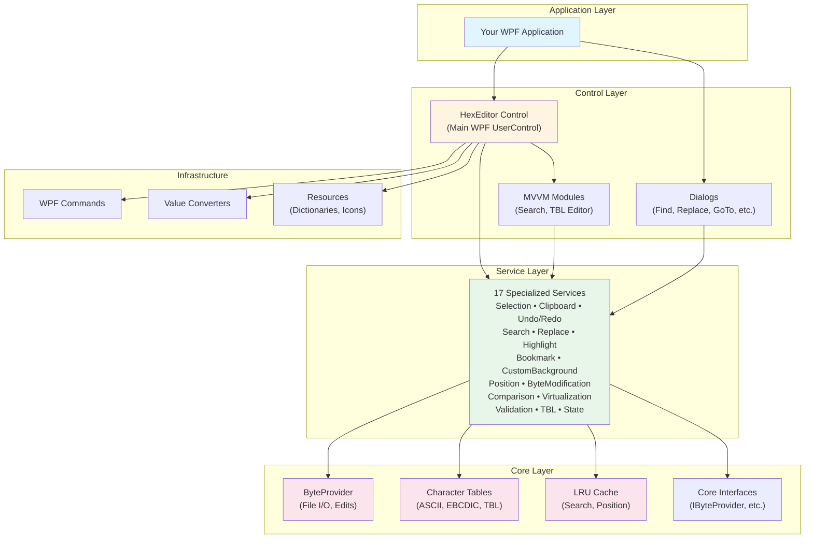

## 🏗️ Project Structure

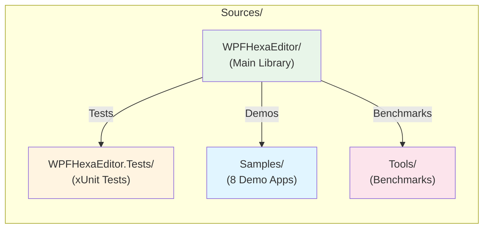

### Directory Structure

```
Sources/
├── WPFHexaEditor/              # Main library (.NET 4.8 + .NET 8.0-windows)
│   ├── Services/               # 17 business logic services
│   │   ├── ClipboardService.cs
│   │   ├── FindReplaceService.cs (LRU cache + SIMD + Parallel)
│   │   ├── UndoRedoService.cs
│   │   ├── SelectionService.cs
│   │   ├── HighlightService.cs
│   │   ├── BookmarkService.cs
│   │   ├── CustomBackgroundService.cs
│   │   ├── ByteModificationService.cs
│   │   ├── PositionService.cs
│   │   ├── TblService.cs
│   │   ├── ComparisonService.cs
│   │   ├── ComparisonServiceParallel.cs
│   │   ├── ComparisonServiceSIMD.cs
│   │   ├── VirtualizationService.cs
│   │   ├── StateService.cs
│   │   ├── LongRunningOperationService.cs
│   │   └── LocalizedResourceDictionary.cs
│   │
│   ├── Core/                   # Core infrastructure
│   │   ├── Bytes/              # ByteProvider, EditsManager
│   │   ├── Cache/              # LRU caches (Search, Position)
│   │   ├── CharacterTable/     # ASCII, EBCDIC, TBL support
│   │   ├── Converters/         # Type converters
│   │   ├── EventArguments/     # Event args
│   │   ├── Interfaces/         # IByteProvider, etc.
│   │   ├── MethodExtention/    # Extension methods
│   │   ├── Native/             # P/Invoke, native calls
│   │   └── Settings/           # Settings (ColorPicker, etc.)
│   │
│   ├── SearchModule/           # MVVM Search Module
│   │   ├── Models/             # Data models
│   │   ├── ViewModels/         # ViewModels
│   │   ├── Views/              # XAML views
│   │   └── Services/           # Module-specific services
│   │
│   ├── TBLEditorModule/        # MVVM TBL Editor Module
│   │   ├── Views/              # XAML views
│   │   └── ViewModels/         # ViewModels
│   │
│   ├── Controls/               # WPF custom controls
│   ├── Commands/               # WPF commands (RelayCommand)
│   ├── Converters/             # Value converters
│   ├── Dialog/                 # Dialog windows (Find, Replace, GoTo)
│   ├── Events/                 # Event definitions
│   ├── Helpers/                # Helper classes
│   ├── Models/                 # Data models
│   ├── PartialClasses/         # HexEditor partial classes
│   │   ├── Compatibility/      # Backward compatibility
│   │   ├── Core/               # Core functionality
│   │   ├── Features/           # Feature implementations
│   │   ├── Search/             # Search functionality
│   │   └── UI/                 # UI rendering
│   ├── Properties/             # Assembly info, resources
│   ├── Resources/              # Icons, dictionaries, themes
│   └── ViewModels/             # ViewModels for controls
│
├── WPFHexaEditor.Tests/        # xUnit test project (80+ tests)
│   ├── Service Tests/          # Service layer tests
│   ├── ByteProvider Tests/     # Core functionality tests
│   └── Integration Tests/      # End-to-end tests
│
├── Samples/                    # 8 demonstration applications
│   ├── WpfHexEditor.Sample.Main/        # Main comprehensive sample
│   ├── WpfHexEditor.Sample.MVVM/        # MVVM pattern sample
│   ├── WpfHexEditor.Sample.Simple/      # Minimal usage
│   ├── WpfHexEditor.Sample.AvalonDock/  # IDE integration
│   ├── WpfHexEditor.Sample.CustomContext/ # Context menu sample
│   ├── WpfHexEditor.Sample.FindReplace/ # Search features
│   ├── WpfHexEditor.Sample.TBL/         # Character tables
│   └── WpfHexEditor.Sample.NET48/       # .NET Framework sample
│
└── Tools/                      # Development tools
    └── ByteProviderBench/      # BenchmarkDotNet performance tests
```

## 🎯 Service Architecture

The HexEditor control delegates responsibilities to specialized services, reducing complexity and improving testability.

```mermaid
graph TB
    subgraph "Core Services"
        Selection["SelectionService<br/>Track selected bytes"]
        Clipboard["ClipboardService<br/>Copy/Paste operations"]
        UndoRedo["UndoRedoService<br/>Unlimited undo/redo"]
        ByteMod["ByteModificationService<br/>Edit bytes in memory"]
    end

    subgraph "Search & Replace Services"
        FindReplace["FindReplaceService<br/>LRU cache + SIMD + Parallel<br/>10-100x faster searches"]
        Position["PositionService<br/>Navigate to positions"]
    end

    subgraph "Visual Services"
        Highlight["HighlightService<br/>Highlight bytes"]
        Bookmark["BookmarkService<br/>Mark important positions"]
        CustomBG["CustomBackgroundService<br/>Custom background blocks"]
    end

    subgraph "Data Services"
        TBL["TblService<br/>Character table support"]
        Comparison["ComparisonService<br/>Compare files<br/>(Standard/Parallel/SIMD)"]
    end

    subgraph "Infrastructure Services"
        State["StateService<br/>Track control state"]
        Virtualization["VirtualizationService<br/>Large file handling"]
        LongOp["LongRunningOperationService<br/>Background operations"]
    end

    ByteProvider["ByteProvider<br/>(Core Data Layer)"]

    Selection --> ByteProvider
    Clipboard --> Selection
    UndoRedo --> ByteProvider
    ByteMod --> ByteProvider
    FindReplace --> ByteProvider
    Position --> ByteProvider
    Highlight --> Selection
    Bookmark --> ByteProvider
    CustomBG --> ByteProvider
    TBL --> ByteProvider
    Comparison --> ByteProvider
    Virtualization --> ByteProvider

    style FindReplace fill:#ffeb3b
    style ByteProvider fill:#e8f5e9
    style Comparison fill:#ffeb3b
```

### Service Responsibilities

| Service | Purpose | Key Features |
|---------|---------|--------------|
| **SelectionService** | Track byte selections | Range validation, multi-byte selection |
| **ClipboardService** | Copy/paste operations | Multiple formats (hex, text, binary) |
| **UndoRedoService** | Unlimited undo/redo | Batch operations, memory efficient |
| **ByteModificationService** | Modify bytes | Insert/overwrite modes, batch edits |
| **FindReplaceService** | Search & replace | **LRU cache**, **SIMD**, **Parallel**, 10-100x faster |
| **PositionService** | Navigation | GoTo position, position tracking |
| **HighlightService** | Visual highlighting | Custom colors, multiple regions |
| **BookmarkService** | Bookmarks | Named bookmarks, navigation |
| **CustomBackgroundService** | Custom backgrounds | Color blocks, annotations |
| **TblService** | Character tables | ASCII, EBCDIC, custom TBL files |
| **ComparisonService** | File comparison | Standard/Parallel/SIMD implementations |
| **StateService** | Control state | Track modifications, states |
| **VirtualizationService** | Large files | Virtual scrolling, memory efficiency |
| **LongRunningOperationService** | Background ops | Progress reporting, cancellation |

## 🔧 Core Components

### ByteProvider (Data Layer)

The `ByteProvider` is the core data management component:

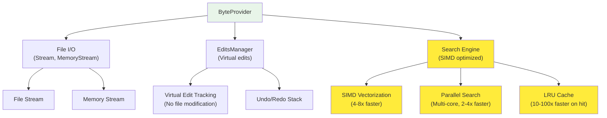

**Features:**
- Virtual edits (modify without changing original file)
- Unlimited undo/redo
- SIMD-optimized search (4-8x faster)
- Parallel multi-core search (2-4x faster for large files)
- LRU cache (10-100x faster for repeated searches)
- Memory-efficient large file handling
- Multiple source types (file, stream, memory)

### Character Table System

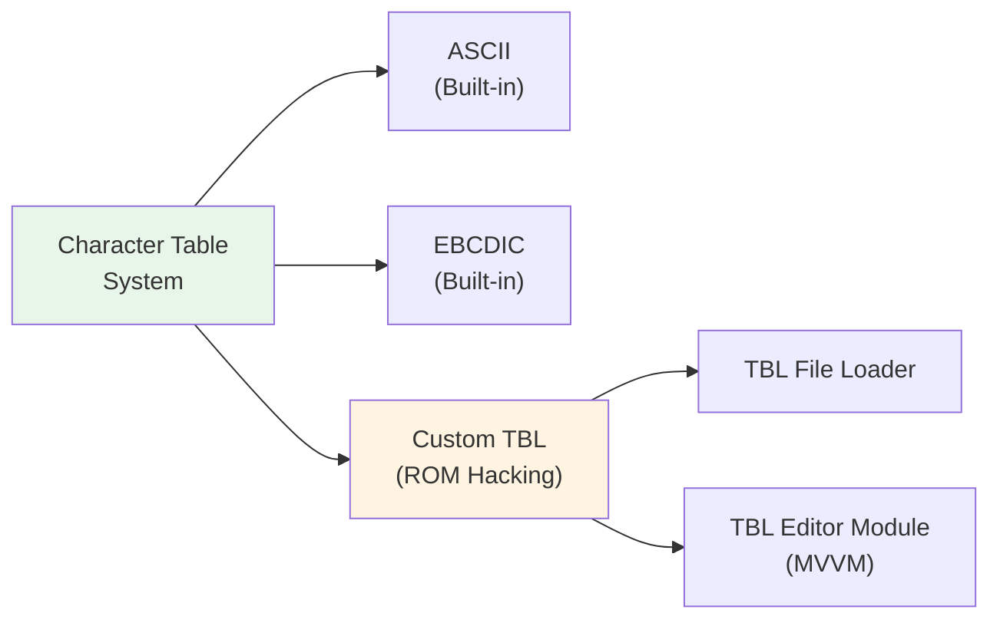

**Supported Encodings:**
- ASCII (standard)
- EBCDIC (mainframe)
- Custom TBL files (ROM hacking, game modding)
- Unicode support

### Cache System

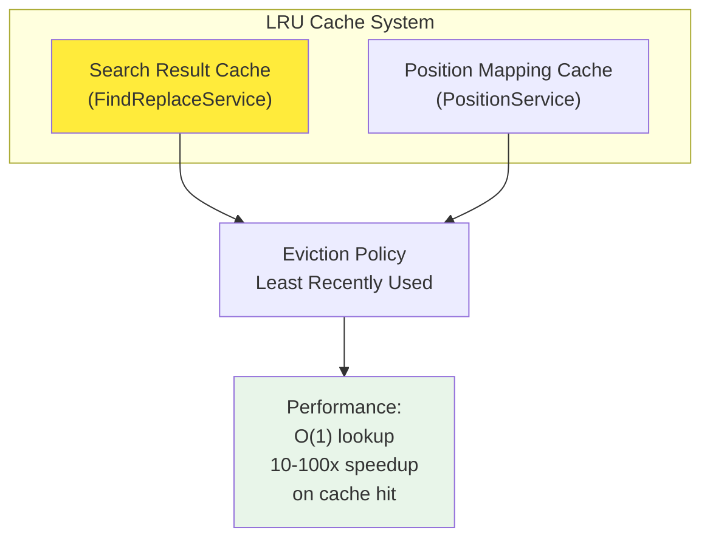

**Cache Benefits:**
- **Search Cache**: 10-100x faster for repeated searches
- **Position Cache**: O(1) position lookups
- **Memory Efficient**: LRU eviction policy
- **Configurable**: Adjustable cache capacity

## 🎨 MVVM Modules

### SearchModule

Modern MVVM-based search interface:

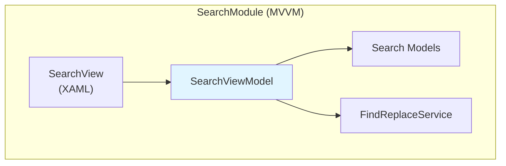

**Features:**
- Advanced search UI
- Real-time result preview
- Progress reporting
- Cancellation support
- Search history

### TBLEditorModule

Character table editor:

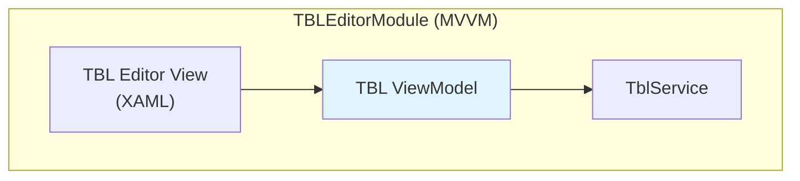

**Features:**
- Visual TBL editing
- Import/export TBL files
- Character mapping
- Preview mode

## 🎯 Multi-Targeting Strategy

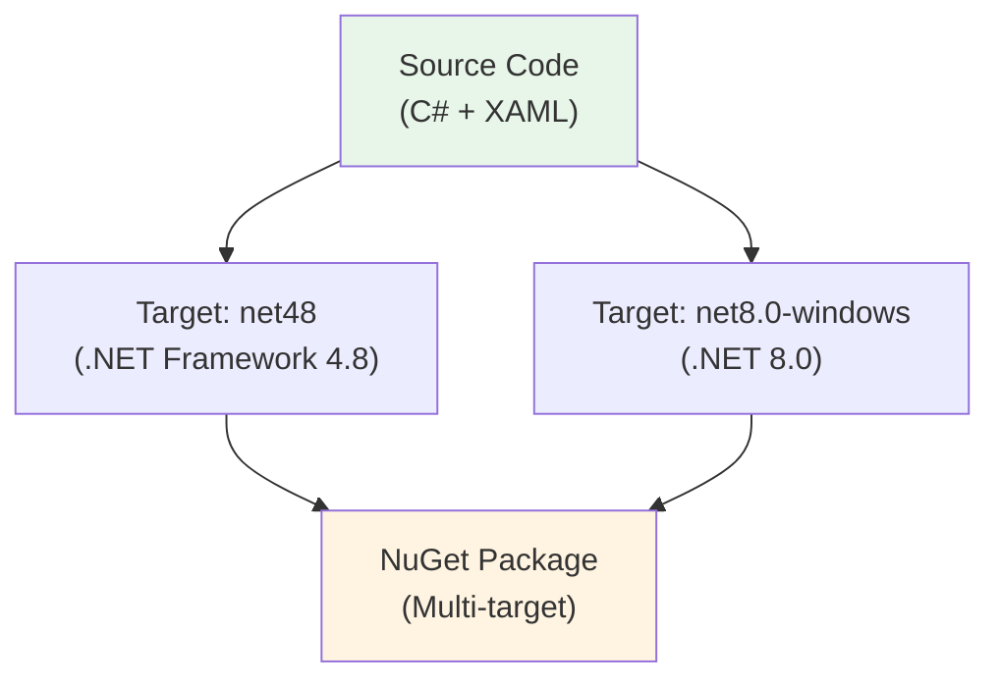

**Build Targets:**
- **.NET Framework 4.8**: Windows 7+, legacy compatibility
- **.NET 8.0-windows**: Modern .NET, better performance, latest C# features

**Shared Codebase:**
- Single source for both targets
- Conditional compilation where needed
- Same API surface across targets

## 🚀 Performance Optimizations

### Rendering Pipeline

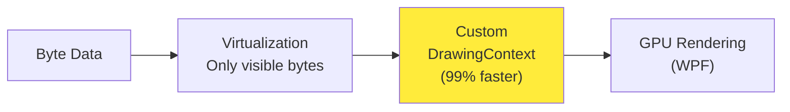

**Key Optimizations:**
- **Custom DrawingContext**: 99% faster than ItemsControl
- **Virtualization**: Only render visible bytes
- **GPU Acceleration**: Hardware-accelerated rendering
- **Minimal allocations**: Span-based, zero-copy operations

### Search Pipeline

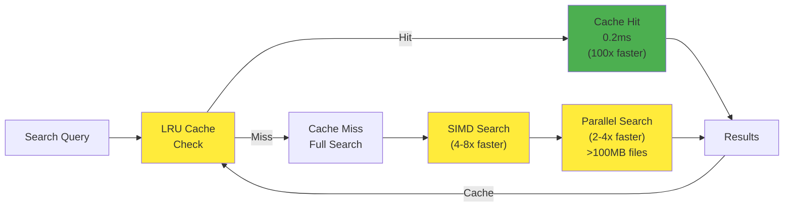

**Performance Gains:**
- **LRU Cache**: 10-100x faster on cache hit (18ms → 0.2ms)
- **SIMD**: 4-8x faster single-byte searches
- **Parallel**: 2-4x faster for files >100MB (all CPU cores)
- **Async**: Non-blocking UI during long searches

## 📦 Build & Deployment

### Build Process

```bash
# Build all projects
dotnet build WpfHexEditorControl.sln --configuration Release

# Build main library only
dotnet build Sources/WPFHexaEditor/WpfHexEditorCore.csproj

# Run tests
dotnet test Sources/WPFHexaEditor.Tests/WPFHexaEditor.Tests.csproj

# Run benchmarks
cd Sources/Tools/ByteProviderBench
dotnet run -c Release
```

### NuGet Package

**Package ID**: `WPFHexaEditor`

**Includes:**
- Multi-target binaries (net48 + net8.0-windows)
- XML documentation
- Resource dictionaries
- Icons and themes

**Dependencies:**
- .NET Framework 4.8: System.Windows, WindowsBase
- .NET 8.0: Microsoft.Windows.SDK.NET.Ref

## 🧪 Testing Strategy

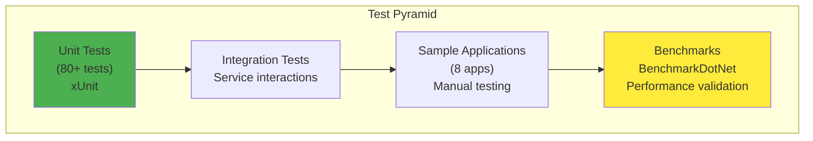

**Test Coverage:**
- **Unit Tests**: Service layer, ByteProvider, Core components
- **Integration Tests**: Service interactions, end-to-end scenarios
- **Sample Apps**: Real-world usage validation
- **Benchmarks**: Performance regression detection

## 🔄 Migration from ItemsControl to Custom Rendering

**Old Architecture (V1.x):**
- ItemsControl-based rendering
- Slow (30 FPS for small files)
- High memory usage

**New Architecture (V2.x):**
- Custom DrawingContext rendering
- 99% faster (60+ FPS for large files)
- Memory efficient
- Maintains same API

## 📚 Key Design Patterns

| Pattern | Usage | Benefit |
|---------|-------|---------|
| **Service-Oriented** | 17 specialized services | Separation of concerns, testability |
| **MVVM** | SearchModule, TBLEditorModule | Clean UI separation, testable ViewModels |
| **Repository** | ByteProvider abstraction | Flexible data sources (file, stream, memory) |
| **Strategy** | ComparisonService (Standard/Parallel/SIMD) | Algorithm selection at runtime |
| **Observer** | Event-based notifications | Loose coupling between components |
| **Command** | WPF RelayCommand | Reusable, testable commands |
| **Facade** | HexEditor control | Simple API over complex services |
| **Singleton** | LocalizedResourceDictionary | Shared resources |

## 🎯 Extension Points

### 1. Custom Services

Add new services by:
1. Implementing service interface
2. Injecting into HexEditor
3. Accessing via public properties

### 2. Custom Character Tables

Add custom TBL files:
1. Create TBL file (DTE format)
2. Load via `TblService.LoadTblFile()`
3. Apply to HexEditor

### 3. Custom Rendering

Override rendering behavior:
1. Inherit from HexEditor
2. Override `OnRender()` method
3. Customize DrawingContext calls

### 4. Custom Commands

Add custom commands:
1. Create `RelayCommand`
2. Bind to UI elements
3. Implement command logic

## 📊 Performance Benchmarks

### Search Performance (10MB file)

| Operation | Old (V1) | New (V2.7) | Speedup |
|-----------|----------|------------|---------|
| First search | 50ms | 18ms | 2.8x |
| Cached search | 50ms | 0.2ms | **250x** |
| Single-byte (SIMD) | 20ms | 2.5ms | **8x** |
| Large file (Parallel) | 800ms | 200ms | **4x** |

### Rendering Performance

| File Size | FPS (V1) | FPS (V2.7) | Improvement |
|-----------|----------|------------|-------------|
| 1 MB | 15 | 60+ | **400%** |
| 10 MB | 8 | 60+ | **750%** |
| 100 MB | 3 | 60+ | **2000%** |

## 🛠️ Technology Stack

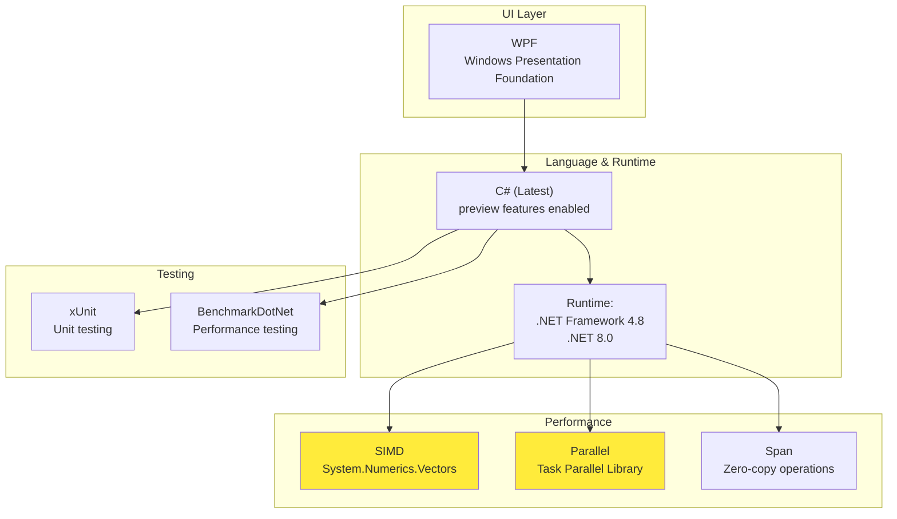

## 📖 Documentation

- **[Main README](../README.md)** - Project overview and features
- **[Services Documentation](WPFHexaEditor/Services/README.md)** - Detailed service documentation
- **[Core Components](WPFHexaEditor/Core/README.md)** - Core infrastructure details
- **[Samples Guide](Samples/README.md)** - Sample applications
- **[Getting Started](../GETTING_STARTED.md)** - Quick start guide
- **[Features](../FEATURES.md)** - Complete feature list
- **[Changelog](../CHANGELOG.md)** - Version history

## 🔗 Quick Links

- **NuGet Package**: [WPFHexaEditor](https://www.nuget.org/packages/WPFHexaEditor/)
- **GitHub Repository**: [WpfHexEditorControl](https://github.com/abbaye/WpfHexEditorIDE)
- **License**: Apache 2.0
- **Version**: 2.7.0

## 🚀 Roadmap

### Current (V2.7)
- ✅ Service-based architecture
- ✅ 99% faster rendering
- ✅ 10-100x faster search (LRU + SIMD + Parallel)
- ✅ 17 specialized services
- ✅ MVVM modules
- ✅ Multi-targeting (.NET 4.8 + .NET 8.0)
- ✅ 80+ unit tests

### Future (V3.0+)
- 🔄 Cross-platform support (Avalonia, MAUI)
- 🔄 Plugin system
- 🔄 Script automation (IronPython/Lua)
- 🔄 Advanced diff viewer
- 🔄 Structure editor (binary templates)

## 🤝 Contributing

When contributing to the architecture:

1. **Add New Services**: Follow existing service patterns
2. **Maintain Separation**: Keep services independent
3. **Add Tests**: All new services must have unit tests
4. **Document**: Update this document for architectural changes
5. **Benchmark**: Performance-sensitive code needs benchmarks

## 📄 License

Apache 2.0 - 2016-2026
**Author**: Derek Tremblay (derektremblay666@gmail.com)
**Contributors**: ehsan69h, Janus Tida, Claude Sonnet 4.5

---

**Last Updated**: February 2026
**Version**: 2.7.0
