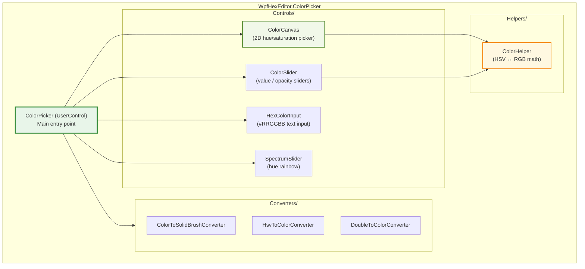
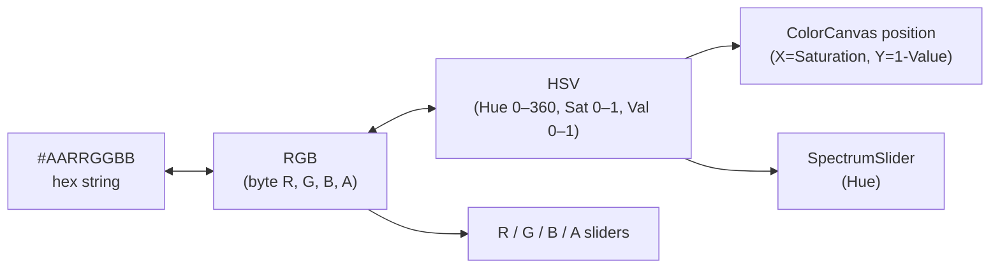

# WpfHexEditor.ColorPicker

> Compact WPF color picker UserControl — RGB / HSV sliders, hex input, and opacity control. Zero third-party dependencies.

[](https://dotnet.microsoft.com/)
[](../../LICENSE)

---

## Architecture



---

## Project Structure

```
WpfHexEditor.ColorPicker/
├── Controls/
│   ├── ColorPicker.xaml(.cs)      ← Main UserControl
│   ├── ColorCanvas.xaml(.cs)      ← 2D saturation/value picker
│   ├── SpectrumSlider.xaml(.cs)   ← Hue spectrum strip
│   ├── ColorSlider.xaml(.cs)      ← Generic color channel slider
│   └── HexColorInput.xaml(.cs)   ← Hex string input (#RRGGBB / #AARRGGBB)
│
├── Converters/
│   ├── ColorToSolidBrushConverter.cs
│   ├── HsvToColorConverter.cs
│   └── DoubleToColorConverter.cs
│
└── Helpers/
    └── ColorHelper.cs             ← HSV ↔ RGB conversion math
```

---

## Features

| Feature | Description |
|---------|-------------|
| **2D picker** | `ColorCanvas` — click to select hue+saturation in a 2D square |
| **Spectrum slider** | Hue rainbow strip (0–360°) |
| **Channel sliders** | Individual R, G, B, Alpha sliders |
| **Hex input** | Type `#FF6B3FA0` directly — supports ARGB and RGB formats |
| **Real-time preview** | Selected color shown as a live swatch |
| **Opacity** | Alpha channel support |
| **Theme-aware** | Inherits foreground/background from parent |
| **Multi-target** | .NET 4.8 and .NET 8.0-windows |

---

## Usage

### XAML

```xml
<Window xmlns:cp="clr-namespace:WpfHexEditor.ColorPicker.Controls;assembly=WpfHexEditor.ColorPicker">

    <cp:ColorPicker x:Name="Picker"
                    SelectedColor="{Binding MyColor, Mode=TwoWay}" />
</Window>
```

### Code-behind

```csharp
// Get/set color
Picker.SelectedColor = Colors.Purple;
Color chosen = Picker.SelectedColor;

// React to selection
Picker.SelectedColorChanged += (s, e) =>
    MyBrush = new SolidColorBrush(e.NewValue);
```

### Embedded in a dialog

```csharp
var dialog = new Window
{
    Title = "Choose color",
    Content = new ColorPicker { SelectedColor = current },
    SizeToContent = SizeToContent.WidthAndHeight,
    ResizeMode = ResizeMode.NoResize
};
if (dialog.ShowDialog() == true)
    ApplyColor(((ColorPicker)dialog.Content).SelectedColor);
```

---

## Color Model



---

## Integration in WpfHexEditor

`ColorPicker` is used in:
- **HexEditor** — bookmark color picker, custom background block color selection, highlight color selection
- **ParsedFieldsPanel** — field color annotation

---

## Dependencies

`WpfHexEditor.ColorPicker` has **zero project-level dependencies**.

---

## License

GNU Affero General Public License v3.0 — Copyright 2016–2026 Derek Tremblay. See [LICENSE](../../LICENSE).
