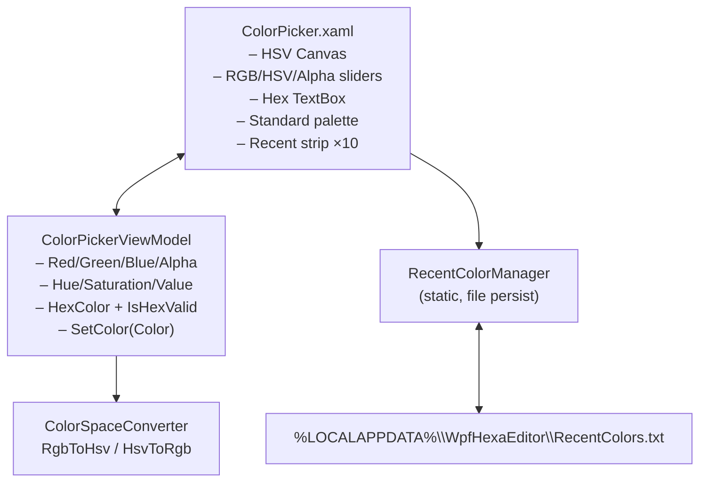

# WpfColorPicker — Documentation (v2.0.2)

> **What you get** — a modern, lightweight WPF `UserControl` for picking ARGB
> colors. Composed of an HSV saturation/value canvas, RGB/HSV sliders, hex input
> with live validation, an alpha channel, a standard-color palette, a 10-slot
> recent-color history persisted to `%LOCALAPPDATA%\WpfHexaEditor\RecentColors.txt`,
> and a built-in HSV-to-RGB / RGB-to-HSV color-space converter. Themeable via
> `DynamicResource`, localized to 28 languages, zero external NuGet dependencies.

## Table of Contents

1. [Installation](#installation)
2. [Architecture](#architecture)
3. [Public API Reference](#public-api-reference)
4. [XAML Usage Reference](#xaml-usage-reference)
5. [Usage Examples](#usage-examples)
6. [Theming](#theming)
7. [Localization](#localization)
8. [Threading and Performance Notes](#threading-and-performance-notes)
9. [License](#license)

---

## Installation

```bash
dotnet add package WpfColorPicker --version 2.0.2
```

Requirements:

| Item | Value |
|---|---|
| Target framework | `net8.0-windows` |
| WPF | required (`<UseWPF>true</UseWPF>`) |
| Transitive dependency | `WpfHexEditor.Core.Localization` (bundled, no separate reference required) |
| Source Link | enabled (step-through debugging supported) |

The assembly ships as `WpfHexEditor.ColorPicker.dll` with namespaces:

- `WpfHexEditor.ColorPicker.Controls` — the user-facing `ColorPicker` control + `ColorPickerViewModel`
- `WpfHexEditor.ColorPicker.Converters` — `IValueConverter` implementations for XAML
- `WpfHexEditor.ColorPicker.Helpers` — `ColorSpaceConverter`, `RecentColorManager`
- `WpfHexEditor.ColorPicker.Services` — `ColorPickerLocalizedDictionary` (loc wiring)
- `WpfHexEditor.ColorPicker.Properties` — `ColorPickerResources` (resx)

---

## Architecture

### Component Diagram



### Design Principles

| Principle | How it is enforced |
|---|---|
| **Zero external NuGet dependencies** | only `Microsoft.SourceLink.GitHub` (private build asset) |
| **Self-contained localization** | `ColorPickerLocalizedDictionary` extends the base `LocalizedResourceDictionary` — consumers do not need to wire a second resource manager |
| **Theme-agnostic** | every brush is a `DynamicResource`; if the host application defines `DockBorderBrush`, `DockMenuBackgroundBrush`, `DockMenuForegroundBrush`, the picker adopts the theme. Otherwise WPF's default literal fallback is used. |
| **MVVM-friendly** | `SelectedColor` is a two-way `DependencyProperty` that binds cleanly to ViewModel state |
| **No code-behind in consumer XAML** | drop the control in, bind `SelectedColor`, you are done |

---

## Public API Reference

### `class WpfHexEditor.ColorPicker.Controls.ColorPicker : UserControl`

| Member | Kind | Description |
|---|---|---|
| `SelectedColor` | `DependencyProperty` of `Color` (TwoWay, default `Colors.White`) | The currently picked color (ARGB). |
| `ShowAlphaChannel` | `DependencyProperty` of `bool` (default `true`) | Show or hide the alpha slider row. |
| `ViewModel` | `ColorPickerViewModel { get; }` | The bound view-model (single source of truth). |
| `RecentColors` | `ObservableCollection<Color> { get; }` | The 10-slot history strip, persisted to disk on every add. |
| `ColorChanged` | `event EventHandler<Color>` | Fired whenever `SelectedColor` changes (incl. from the UI). |

### `class WpfHexEditor.ColorPicker.Controls.ColorPickerViewModel : INotifyPropertyChanged`

| Member | Type | Notes |
|---|---|---|
| `Red`, `Green`, `Blue`, `Alpha` | `byte` (get/set) | 0–255. Setter triggers RGB→HSV→Hex recalc. |
| `Hue` | `double` (get/set) | 0–360°. Setter triggers HSV→RGB→Hex recalc. |
| `Saturation`, `Value` | `double` (get/set) | 0–1. Setter triggers HSV→RGB→Hex recalc. |
| `HexColor` | `string?` (get/set) | `#AARRGGBB`, `#RRGGBB`, or `#RGB`. Setter triggers validation. |
| `IsHexValid` | `bool` (get) | True when last hex assignment parsed successfully. |
| `ValidationIcon` | `string` (get) | Checkmark or cross glyph reflecting `IsHexValid`. |
| `ValidationColor` | `Color` (get) | Green (#4CAF50) when valid, Red (#F44336) when invalid. |
| `SelectedColor` | `Color` (get) | The composed `Color.FromArgb(A,R,G,B)`. |
| `SetColor(Color color)` | `void` | Programmatic update path — sets all properties atomically. |

`ColorPickerViewModel` uses an internal `_isUpdating` re-entrancy guard so that
the four pipelines (RGB / HSV / Hex / external `SetColor`) never recurse.

### `static class WpfHexEditor.ColorPicker.Helpers.ColorSpaceConverter`

| Method | Signature | Description |
|---|---|---|
| `RgbToHsv` | `static (double h, double s, double v) RgbToHsv(byte r, byte g, byte b)` | Standard RGB → HSV. Returns Hue in 0–360°, Saturation and Value in 0–1. |
| `HsvToRgb` | `static (byte r, byte g, byte b) HsvToRgb(double h, double s, double v)` | Standard HSV → RGB. Clamps inputs; returns 0–255 channels. |

Both methods are pure and allocation-free apart from the returned tuple.

### `static class WpfHexEditor.ColorPicker.Helpers.RecentColorManager`

| Method | Signature | Notes |
|---|---|---|
| `LoadRecentColors` | `static List<Color> LoadRecentColors()` | Reads `%LOCALAPPDATA%\WpfHexaEditor\RecentColors.txt`. Falls back to a default 10-color palette on read failure. |
| `SaveRecentColors` | `static void SaveRecentColors(IEnumerable<Color> colors)` | Writes hex strings, one per line. Silently fails on I/O error. |
| `AddRecentColor` | `static List<Color> AddRecentColor(Color color, List<Color> currentColors)` | Removes duplicates, prepends, caps at 10, persists. Returns the updated list. |

The maximum recent-color count is `10`.

### `namespace WpfHexEditor.ColorPicker.Converters`

| Converter | `IValueConverter` direction | Purpose |
|---|---|---|
| `ColorToBrushConverter` | `Color ↔ SolidColorBrush` | Use when binding `Color` to a `Brush` property. |
| `ColorToContrastBrushConverter` | `Color → Brushes.Black\|White` | Picks black for light backgrounds, white for dark (luminance 299/587/114 formula). One-way. |
| `HueToGradientBrushConverter` | `→ LinearGradientBrush` (cached) | Vertical rainbow gradient for hue sliders. One-way. |

### `sealed class WpfHexEditor.ColorPicker.Services.ColorPickerLocalizedDictionary : LocalizedResourceDictionary`

Drop-in self-contained loc dictionary. Add it once to `App.xaml` or any
`Window.Resources` block and every `{DynamicResource ColorPicker_*}` key
resolves with the current culture (`Thread.CurrentThread.CurrentUICulture`).

---

## XAML Usage Reference

### Minimal binding

```xml
<UserControl xmlns:cp="clr-namespace:WpfHexEditor.ColorPicker.Controls;assembly=WpfHexEditor.ColorPicker">
    <cp:ColorPicker SelectedColor="{Binding StrokeColor, Mode=TwoWay}" />
</UserControl>
```

### Dependency properties

| DP | Type | Default | Notes |
|---|---|---|---|
| `SelectedColor` | `Color` | `Colors.White` | TwoWay by default. |
| `ShowAlphaChannel` | `bool` | `true` | Set to `false` to hide the alpha row when transparency is irrelevant. |

### Routed events

The control exposes no routed events; the CLR event `ColorChanged` covers
all change notifications. Subscribe in code-behind when you need to react
without binding:

```csharp
picker.ColorChanged += (s, c) => Debug.WriteLine($"new color: {c}");
```

### Theme keys consumed

| Key | Where used | Fallback if undefined |
|---|---|---|
| `DockBorderBrush` | outer border + tab border | WPF literal `BorderBrush` default |
| `DockMenuBackgroundBrush` | popup background, hex display strip, tab content | system default |
| `DockMenuForegroundBrush` | hex display foreground, popup text | system default |

To customise the host palette, define those keys in `App.xaml` or your active
theme dictionary.

---

## Usage Examples

### Example 1 — Drop-in binding

```xml
<Window xmlns:cp="clr-namespace:WpfHexEditor.ColorPicker.Controls;assembly=WpfHexEditor.ColorPicker">
    <StackPanel>
        <TextBlock Text="Highlight color:" />
        <cp:ColorPicker SelectedColor="{Binding HighlightColor, Mode=TwoWay}" />
    </StackPanel>
</Window>
```

```csharp
public class ViewModel : INotifyPropertyChanged
{
    Color _highlightColor = Colors.LimeGreen;
    public Color HighlightColor
    {
        get => _highlightColor;
        set { _highlightColor = value; OnPropertyChanged(); }
    }
    // …PropertyChanged plumbing…
}
```

### Example 2 — Hide the alpha slider

```xml
<cp:ColorPicker SelectedColor="{Binding StrokeColor, Mode=TwoWay}"
                ShowAlphaChannel="False" />
```

Useful for opaque-only colors (pen color, text foreground, etc.).

### Example 3 — React to changes in code-behind

```csharp
var picker = new WpfHexEditor.ColorPicker.Controls.ColorPicker();
picker.ColorChanged += (sender, newColor) =>
{
    // newColor is the freshly-picked Color (ARGB).
    canvas.Background = new SolidColorBrush(newColor);
};
host.Children.Add(picker);
```

### Example 4 — Programmatic color update from code

```csharp
// Direct DP write — XAML two-way binding mirrors back to the ViewModel.
picker.SelectedColor = Color.FromArgb(0xFF, 0x00, 0x78, 0xD4);

// …or use the ViewModel's SetColor for atomic R/G/B/A/H/S/V/Hex update:
picker.ViewModel.SetColor(Colors.OrangeRed);
```

### Example 5 — Use the color-space converter standalone

```csharp
using WpfHexEditor.ColorPicker.Helpers;

// Convert an RGB triplet to its HSV representation.
var (h, s, v) = ColorSpaceConverter.RgbToHsv(0x40, 0x80, 0xFF);
// h ≈ 218.6°, s ≈ 0.75, v ≈ 1.0

// Round-trip back.
var (r, g, b) = ColorSpaceConverter.HsvToRgb(h, s, v);
// (r, g, b) ≈ (0x40, 0x80, 0xFF)
```

### Example 6 — Persist additional colors to the recent history

```csharp
using WpfHexEditor.ColorPicker.Helpers;

// Inject a corporate brand color into the user's recent strip.
var recent = RecentColorManager.LoadRecentColors();
recent = RecentColorManager.AddRecentColor(Color.FromRgb(0xFF, 0x6C, 0x00), recent);
// File is written at %LOCALAPPDATA%\WpfHexaEditor\RecentColors.txt
```

### Example 7 — Use the converters in arbitrary XAML

```xml
<Window.Resources>
    <conv:ColorToBrushConverter x:Key="C2B"
        xmlns:conv="clr-namespace:WpfHexEditor.ColorPicker.Converters;assembly=WpfHexEditor.ColorPicker"/>
    <conv:ColorToContrastBrushConverter x:Key="Contrast"
        xmlns:conv="clr-namespace:WpfHexEditor.ColorPicker.Converters;assembly=WpfHexEditor.ColorPicker"/>
</Window.Resources>

<Border Background="{Binding TileColor, Converter={StaticResource C2B}}">
    <TextBlock Text="{Binding TileLabel}"
               Foreground="{Binding TileColor, Converter={StaticResource Contrast}}"/>
</Border>
```

---

## Theming

### How dynamic resource resolution works

`ColorPicker.xaml` consumes every host-facing brush via `DynamicResource`, so:

1. At load time, WPF walks up the visual tree looking for the named key.
2. If found in an `App.xaml` resource dictionary, theme dictionary, or any
   parent `Window.Resources` block, that brush is used.
3. If not found, WPF logs a binding error (visible in Visual Studio Output)
   and falls back to the system default for that property.

### Recommended host wiring

```xml
<!-- App.xaml -->
<Application.Resources>
    <ResourceDictionary>
        <!-- Brushes consumed by WpfColorPicker -->
        <SolidColorBrush x:Key="DockBorderBrush"           Color="#3F3F46"/>
        <SolidColorBrush x:Key="DockMenuBackgroundBrush"   Color="#2D2D30"/>
        <SolidColorBrush x:Key="DockMenuForegroundBrush"   Color="#F1F1F1"/>
    </ResourceDictionary>
</Application.Resources>
```

Swap the colors at runtime to support light/dark/high-contrast themes; the
picker will repaint automatically because every brush reference is dynamic.

---

## Localization

### Wiring

Add **one** entry to `App.xaml` to enable in-tree culture switching:

```xml
<Application xmlns:cp="clr-namespace:WpfHexEditor.ColorPicker.Services;assembly=WpfHexEditor.ColorPicker">
    <Application.Resources>
        <ResourceDictionary>
            <ResourceDictionary.MergedDictionaries>
                <cp:ColorPickerLocalizedDictionary/>
            </ResourceDictionary.MergedDictionaries>
        </ResourceDictionary>
    </Application.Resources>
</Application>
```

### Localization keys

| Key | Default (en-US) |
|---|---|
| `ColorPicker_Tab_Custom` | Custom |
| `ColorPicker_Tab_Palette` | Palette |
| `ColorPicker_Section_ColorSelector` | Color Selector |
| `ColorPicker_Section_RGBValues` | RGB Values |
| `ColorPicker_Section_HexColor` | Hex Color |
| `ColorPicker_Section_StandardColors` | Standard Colors |
| `ColorPicker_Section_RecentColors` | Recent Colors |

Common buttons (`OK`, `Cancel`, …) are pulled from the base
`LocalizedResourceDictionary` shipped by `WpfHexEditor.Core.Localization` and
are not duplicated in this package.

### Supported cultures (28 + neutral en-US)

`ar-SA`, `cs-CZ`, `da-DK`, `de-DE`, `el-GR`, `es-419`, `es-ES`, `fi-FI`,
`fr-CA`, `fr-FR`, `hi-IN`, `hu-HU`, `id-ID`, `it-IT`, `ja-JP`, `ko-KR`,
`nl-NL`, `pl-PL`, `pt-BR`, `pt-PT`, `ro-RO`, `ru-RU`, `sv-SE`, `th-TH`,
`tr-TR`, `uk-UA`, `vi-VN`, `zh-CN`.

The picker honours `Thread.CurrentThread.CurrentUICulture` at the moment
`ColorPickerLocalizedDictionary` is constructed.

### Switching culture at runtime

```csharp
using System.Globalization;
using System.Threading;

Thread.CurrentThread.CurrentUICulture = new CultureInfo("fr-FR");
// Re-instantiate windows that host ColorPicker — or call
// ColorPickerLocalizedDictionary.Reload() if you own the merged dict.
```

---

## Threading and Performance Notes

### UI thread affinity

`ColorPicker` is a WPF `UserControl` — read / write its dependency properties
only from the UI thread. `ColorPickerViewModel.SetColor` likewise marshals
through `INotifyPropertyChanged`; call it from the UI thread.

### Mouse drag throttling

The HSV canvas throttles drag updates to ~60 FPS (16 ms gate) inside
`HsvCanvas_MouseMove`. This prevents excessive layout passes while the user
sweeps the saturation/value picker. The throttle uses `DateTime.Now`
comparisons — drift-tolerant, not allocation-sensitive.

### Brush caching

`HueToGradientBrushConverter` caches a single `LinearGradientBrush` instance
in a private `static` field. A single allocation is performed once per
process lifetime, regardless of how many pickers exist.

### Recent-color I/O

`RecentColorManager` persists the recent list on every `AddRecentColor` call.
Writes are synchronous (`File.WriteAllLines`) and silently swallow `IOException`
to keep the UI responsive even when the disk is full or the directory is
read-only. Expect ~1 KB of disk traffic per color pick (10 lines × ~10 chars).

### Memory footprint per instance

| Item | Size |
|---|---|
| `ColorPickerViewModel` fields | ~80 bytes |
| `ObservableCollection<Color>` (10 entries) | ~250 bytes |
| Standard-color palette `Color[32]` (boxed in `ItemsSource`) | ~250 bytes |
| **Total state per picker** | **< 1 KB** |

XAML visuals dominate the actual footprint; allocate as many pickers as
the UI requires.

### No background threads

`WpfColorPicker` does not start timers, tasks, or background threads.
Disposal is implicit (managed only).

---

## License

GNU Affero General Public License v3.0 — `AGPL-3.0-only`.

- Copyright © 2016–2026 Derek Tremblay (derektremblay666@gmail.com)
- Authors / contributors: Derek Tremblay, Claude Sonnet 4.5, Claude Sonnet 4.6
- Project URL: https://github.com/abbaye/WpfHexEditorIDE

If your application is distributed under a license incompatible with AGPL-3.0,
contact the author for an alternative licensing arrangement.
