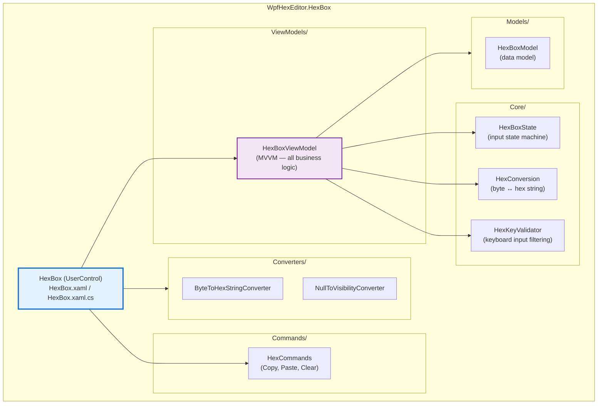
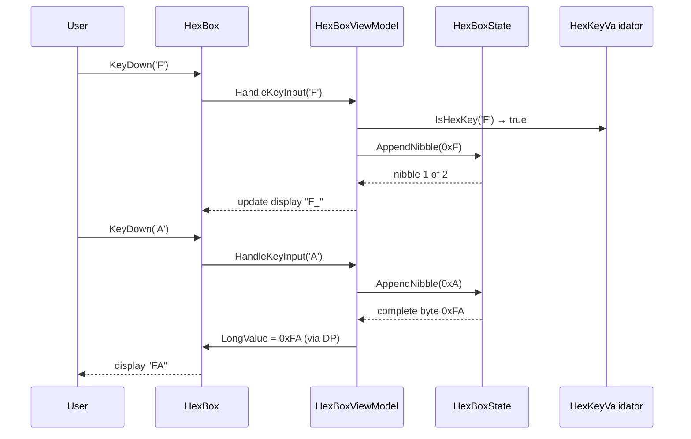

# WpfHexEditor.HexBox

> Lightweight hex input field — MVVM architecture, zero external dependencies, V1 API compatibility.

[](https://dotnet.microsoft.com/)
[](../../LICENSE)

---

## Architecture



---

## Project Structure

```
WpfHexEditor.HexBox/
├── HexBox.xaml               ← UserControl XAML
├── HexBox.xaml.cs            ← Minimal code-behind (DP sync with ViewModel)
│
├── ViewModels/
│   └── HexBoxViewModel.cs    ← All business logic
│
├── Core/
│   ├── HexBoxState.cs        ← Input state machine (nibble tracking)
│   ├── HexConversion.cs      ← Byte ↔ hex string conversion
│   └── HexKeyValidator.cs    ← Hex key filtering (0-9, A-F)
│
├── Commands/
│   └── HexCommands.cs
│
├── Converters/
│   └── ByteToHexStringConverter.cs
│
├── Models/
│   └── HexBoxModel.cs
│
└── Properties/
```

---

## Features

| Feature | Description |
|---------|-------------|
| **V1 API** | `LongValue` DependencyProperty — backward compatible with all existing XAML |
| **MVVM** | `HexBoxViewModel` contains all logic; code-behind is minimal |
| **Input validation** | Only hex characters (0–9, A–F) accepted |
| **Nibble editing** | Two-character hex input per byte (e.g. typing `F` then `F` → `0xFF`) |
| **Zero deps** | No dependency on `WpfHexEditor.Core` or any other project |
| **Multi-target** | .NET 4.8 and .NET 8.0-windows |

---

## Usage

### XAML

```xml
<Window xmlns:hb="clr-namespace:WpfHexEditor.HexBox;assembly=WpfHexEditor.HexBox">

    <!-- Simple hex input bound to a long value -->
    <hb:HexBox LongValue="{Binding ByteOffset, Mode=TwoWay}" />
</Window>
```

### Code-behind

```csharp
// Get / set the value
hexBox.LongValue = 0x1A2B3C4D;
long offset = hexBox.LongValue;

// React to changes
hexBox.LongValueChanged += (s, e) =>
    Console.WriteLine($"New offset: 0x{hexBox.LongValue:X}");
```

---

## Data Flow



---

## V1 Compatibility

`HexBox` maintains full backward compatibility with the V1 API. The `LongValue` DependencyProperty is preserved:

```csharp
// V1 usage — still works unchanged
HexEdit.LongValue = someOffset;
```

Internally, `HexBox.xaml.cs` syncs the V1 DP with `HexBoxViewModel.LongValue` via two-way binding, so upgrading from V1 to V2 requires zero changes in consuming code.

---

## Dependencies

`WpfHexEditor.HexBox` has **zero project-level dependencies** — it only uses standard WPF / .NET assemblies.

This makes it safe to use in any WPF application without pulling in the rest of the WpfHexEditor ecosystem.

---

## License

GNU Affero General Public License v3.0 — Copyright 2017–2026 Derek Tremblay. See [LICENSE](../../LICENSE).
