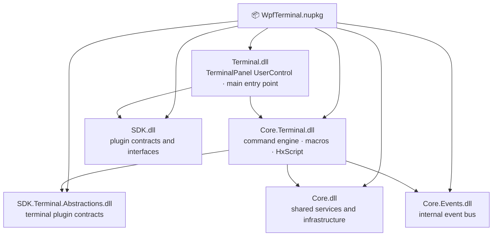
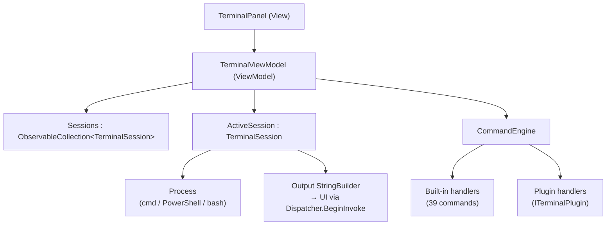

# WpfTerminal — Documentation

## Table of Contents

1. [Architecture](#architecture)
2. [API Reference](#api-reference)
3. [Integration Guide — Level 1: Basic Setup](#level-1-basic-setup)
4. [Integration Guide — Level 2: Sessions & Commands](#level-2-sessions--commands)
5. [Integration Guide — Level 3: Macros & HxScript](#level-3-macros--hxscript)
6. [Integration Guide — Level 4: Plugins & Theming](#level-4-plugins--theming)
7. [Built-in Commands Reference](#built-in-commands-reference)
8. [Settings Reference](#settings-reference)

---

## Architecture

### Assembly structure



Zero external NuGet dependencies. All assemblies are bundled inside the package.

### Type ownership

| Type | Assembly | Purpose |
|---|---|---|
| `TerminalPanel` | Terminal | Main `UserControl` — tabs, output, input bar |
| `TerminalViewModel` | Terminal | MVVM root — owns the session list |
| `TerminalSession` | Core.Terminal | Single shell tab — process wrapper + output buffer |
| `CommandEngine` | Core.Terminal | Dispatch built-in and plugin commands |
| `MacroRecorder` | Core.Terminal | Record/replay command sequences |
| `HxScriptEngine` | Core.Terminal | `.hxscript` interpreter |
| `ITerminalPlugin` | SDK.Terminal.Abstractions | Contract for terminal plugin commands |

### MVVM model



Each `TerminalSession` owns a `Process` (cmd, PowerShell, bash) and an output `StringBuilder`. Output lines stream to the UI via `Dispatcher.BeginInvoke`.

---

## API Reference

### TerminalPanel

```csharp
TerminalViewModel ViewModel { get; }

// Convenience shortcut to active session
TerminalSession? ActiveSession => ViewModel.ActiveSession;
```

### TerminalViewModel

```csharp
ObservableCollection<TerminalSession> Sessions { get; }
TerminalSession? ActiveSession { get; set; }

// Add a new tab
TerminalSession AddSession(string name, TerminalShellType shell);
// shell: Cmd | PowerShell | Bash | GitBash

// Remove a tab
void RemoveSession(TerminalSession session);
```

### TerminalSession

```csharp
string Name { get; set; }

// Execute a command
Task ExecuteCommandAsync(string command);

// Output
string FullOutput { get; }
event EventHandler<string>? OutputLineReceived;

// Find in output
void FindNext(string pattern);
void ClearOutput();

// Export
Task ExportToTextAsync(string filePath);
Task ExportToHtmlAsync(string filePath);

// Macro
MacroRecorder Recorder { get; }
```

### MacroRecorder

```csharp
void StartRecording();
void StopRecording();
void Play();
void Play(Dictionary<string, string> variables);   // variable substitution

IReadOnlyList<string> RecordedCommands { get; }
bool IsRecording { get; }
```

### HxScriptEngine

```csharp
Task RunScriptAsync(string scriptPath);
Task RunScriptAsync(string scriptContent, bool isLiteral);

event EventHandler<string>? OutputLine;
event EventHandler<Exception>? ScriptError;
```

---

## Level 1: Basic Setup

### 1 — Install

```
dotnet add package WpfTerminal
```

### 2 — Add namespace and control

```xml
<Window
    xmlns:term="clr-namespace:WpfHexEditor.Terminal;assembly=WpfHexEditor.Terminal">

    <term:TerminalPanel x:Name="Terminal" />
```

No resource dictionary merge required.

### 3 — Add a default session

```csharp
Terminal.ViewModel.AddSession("PowerShell", TerminalShellType.PowerShell);
```

### 4 — Execute a command

```csharp
await Terminal.ViewModel.ActiveSession.ExecuteCommandAsync("Get-Process");
```

---

## Level 2: Sessions & Commands

### Multiple shell tabs

```csharp
var ps   = Terminal.ViewModel.AddSession("PowerShell", TerminalShellType.PowerShell);
var cmd  = Terminal.ViewModel.AddSession("cmd",        TerminalShellType.Cmd);
var bash = Terminal.ViewModel.AddSession("bash",       TerminalShellType.Bash);

// Switch active tab
Terminal.ViewModel.ActiveSession = ps;
```

### React to output

```csharp
ps.OutputLineReceived += (_, line) =>
{
    if (line.Contains("ERROR"))
        Dispatcher.BeginInvoke(() => StatusBar.Text = $"Error: {line}");
};
```

### Search output

```csharp
// Find next match in the output panel (highlights and scrolls)
ps.FindNext("Exception");
```

### Export output

```csharp
await ps.ExportToTextAsync(@"C:\logs\session.txt");
await ps.ExportToHtmlAsync(@"C:\logs\session.html");
```

### Close a session

```csharp
Terminal.ViewModel.RemoveSession(cmd);
```

---

## Level 3: Macros & HxScript

### Record a macro

```csharp
var session = Terminal.ViewModel.ActiveSession;

session.Recorder.StartRecording();

await session.ExecuteCommandAsync("cd C:\\Projects");
await session.ExecuteCommandAsync("git status");
await session.ExecuteCommandAsync("dotnet build");

session.Recorder.StopRecording();
```

### Replay the macro

```csharp
session.Recorder.Play();
```

### Replay with variable substitution

```csharp
// Command recorded as: "cd {ROOT}"
session.Recorder.Play(new Dictionary<string, string>
{
    ["ROOT"] = @"C:\Projects\MyApp"
});
```

### HxScript

`.hxscript` files are lightweight automation scripts executed by `HxScriptEngine`.

```hxscript
// build-and-test.hxscript
cd {PROJECT}
dotnet build --configuration Release
dotnet test --no-build
```

```csharp
var engine = new HxScriptEngine();
engine.OutputLine  += (_, line) => Console.WriteLine(line);
engine.ScriptError += (_, ex)   => Console.Error.WriteLine(ex.Message);

await engine.RunScriptAsync(@"C:\scripts\build-and-test.hxscript");
```

---

## Level 4: Plugins & Theming

### Implement a terminal plugin

```csharp
using WpfHexEditor.SDK.Terminal.Abstractions;

public class HexDumpPlugin : ITerminalPlugin
{
    public string CommandName => "hexdump";
    public string Description => "Dump file as hex to terminal output";

    public async Task<string?> ExecuteAsync(string[] args, ITerminalContext context)
    {
        if (args.Length == 0) return "Usage: hexdump <file>";

        var bytes = await File.ReadAllBytesAsync(args[0]);
        return string.Join(" ", bytes.Select(b => b.ToString("X2")));
    }
}
```

### Register a plugin

```csharp
Terminal.ViewModel.CommandEngine.RegisterPlugin(new HexDumpPlugin());
```

### Theme

The terminal uses `DynamicResource` keys. Override in your `ResourceDictionary`:

```xml
<SolidColorBrush x:Key="TERM_Background"       Color="#1E1E1E" />
<SolidColorBrush x:Key="TERM_Foreground"       Color="#D4D4D4" />
<SolidColorBrush x:Key="TERM_SelectionBrush"   Color="#264F78" />
<SolidColorBrush x:Key="TERM_InputBackground"  Color="#252526" />
<SolidColorBrush x:Key="TERM_TabActive"        Color="#1E1E1E" />
<SolidColorBrush x:Key="TERM_TabInactive"      Color="#2D2D2D" />
<SolidColorBrush x:Key="TERM_ErrorForeground"  Color="#F44747" />
<SolidColorBrush x:Key="TERM_WarningForeground" Color="#CCA700" />
```

---

## Built-in Commands Reference

| Command | Description |
|---|---|
| `cd <path>` | Change working directory |
| `ls` / `dir` | List files in current directory |
| `cat <file>` | Display file content |
| `find <pattern> [path]` | Search for pattern in files |
| `grep <pattern> <file>` | Search for pattern in file content |
| `clear` | Clear terminal output |
| `echo <text>` | Print text to output |
| `set <var> <value>` | Set environment variable |
| `env` | List environment variables |
| `pwd` | Print working directory |
| `mkdir <path>` | Create directory |
| `rm <path>` | Remove file or empty directory |
| `cp <src> <dst>` | Copy file |
| `mv <src> <dst>` | Move or rename file |
| `history` | Show command history |
| `macro record` | Start recording a macro |
| `macro stop` | Stop recording |
| `macro play` | Replay last recorded macro |
| `macro list` | List saved macros |
| `macro save <name>` | Save current recording as named macro |
| `macro load <name>` | Load and replay a named macro |
| `script <file>` | Run an `.hxscript` file |
| `hex <file>` | Open file in hex editor |
| `inspect <offset>` | Inspect bytes at offset in open hex file |
| `export text <file>` | Export session output to text |
| `export html <file>` | Export session output to HTML |
| `plugin list` | List registered terminal plugins |
| `plugin run <name>` | Execute a plugin command |
| `solution open <path>` | Open solution in IDE host |
| `solution build` | Build active solution |
| `solution clean` | Clean build output |
| `diag` | Show diagnostic information |
| `theme dark` | Switch to dark theme |
| `theme light` | Switch to light theme |
| `font-size <n>` | Change terminal font size |
| `find-in-output <pattern>` | Highlight pattern in output |
| `session new <name>` | Add a new terminal tab |
| `session close` | Close active tab |
| `session list` | List open sessions |
| `help [command]` | Show help for all or specific command |

---

## Settings Reference

| Property | Type | Default | Description |
|---|---|---|---|
| `FontSize` | `double` | `13` | Terminal font size |
| `FontFamily` | `FontFamily` | Cascadia Code | Terminal font |
| `ShowLineNumbers` | `bool` | `false` | Show line numbers in output |
| `MaxOutputLines` | `int` | `10000` | Maximum buffered output lines |
| `ShowTimestamp` | `bool` | `false` | Prefix each output line with timestamp |
| `HistorySize` | `int` | `500` | Per-session command history depth |
| `AutoScrollToEnd` | `bool` | `true` | Auto-scroll output on new line |
| `WordWrap` | `bool` | `false` | Wrap long output lines |
