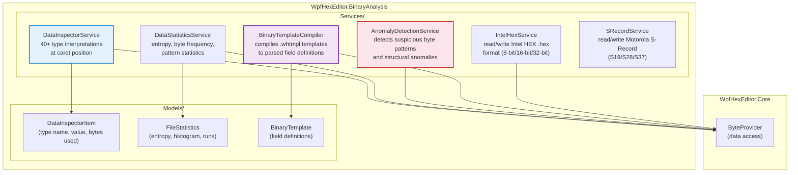
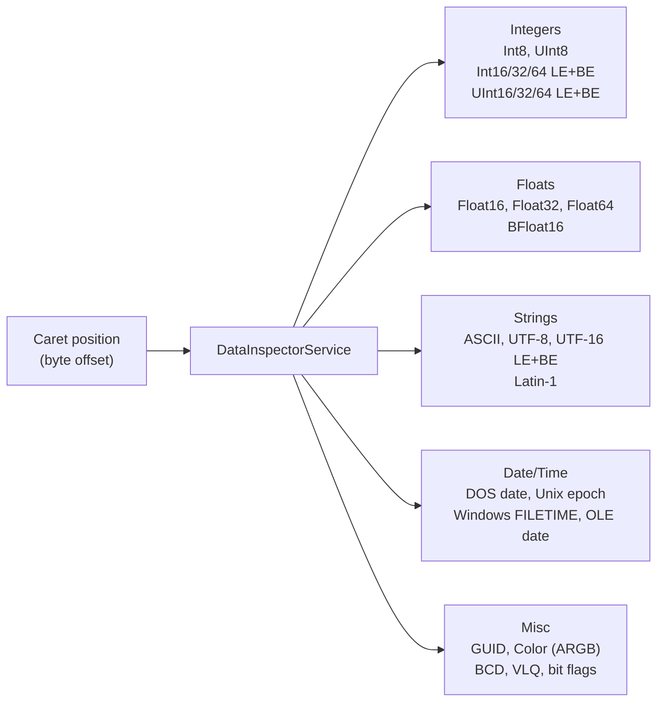
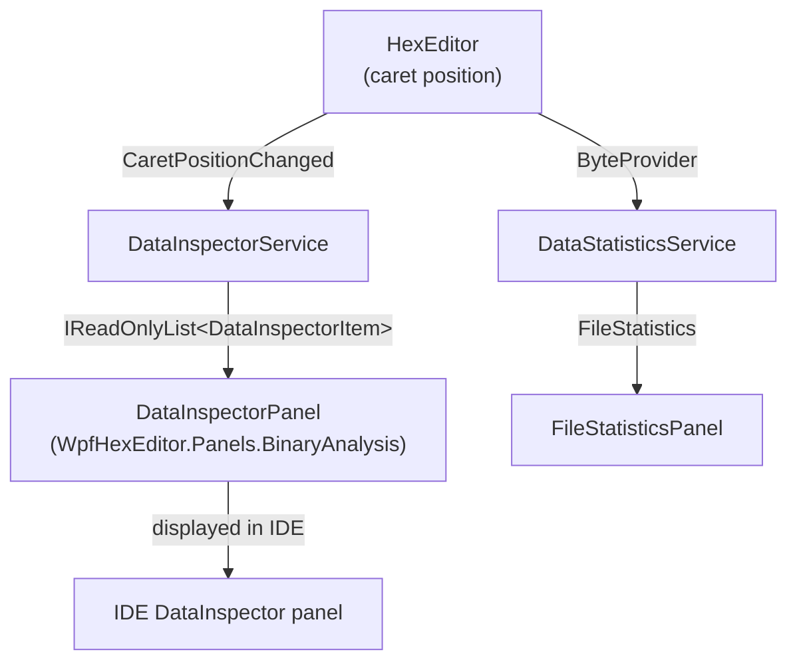

# WpfHexEditor.BinaryAnalysis

> Binary analysis engine — 40+ data type interpretations, anomaly detection, binary templates, Intel HEX / S-Record support.

[](https://dotnet.microsoft.com/)
[](../../LICENSE)

---

## Architecture



---

## Project Structure

```
WpfHexEditor.BinaryAnalysis/
├── Services/
│   ├── DataInspectorService.cs       ← 40+ type interpretations
│   ├── DataStatisticsService.cs      ← Entropy, frequency analysis
│   ├── AnomalyDetectionService.cs    ← Suspicious pattern detection
│   ├── BinaryTemplateCompiler.cs     ← .whtmpl template engine
│   ├── IntelHexService.cs            ← Intel HEX format
│   └── SRecordService.cs             ← Motorola S-Record format
│
└── Models/
    ├── DataInspectorItem.cs
    ├── FileStatistics.cs
    └── BinaryTemplate.cs
```

---

## DataInspectorService

Interprets the bytes at the current caret position as 40+ data types simultaneously:



### Usage

```csharp
var service = new DataInspectorService(byteProvider);

// Get all interpretations at offset 0x100
IReadOnlyList<DataInspectorItem> items = service.Inspect(0x100);

foreach (var item in items)
    Console.WriteLine($"{item.TypeName,-20} {item.ValueString}");

// Output example:
// Int8                 -57
// UInt8                199
// Int16 LE             -14649
// UInt16 LE            50887
// Float32              …
// ASCII                "É…"
// Unix Epoch (32-bit)  1970-01-01 00:02:19 UTC
```

---

## DataStatisticsService

```csharp
var stats = new DataStatisticsService(byteProvider);
FileStatistics result = await stats.AnalyzeAsync();

Console.WriteLine($"Entropy:         {result.Entropy:F4} bits/byte");
Console.WriteLine($"Most common:     0x{result.MostCommonByte:X2} ({result.MostCommonCount}×)");
Console.WriteLine($"Byte histogram:  {result.Histogram.Length} entries");
Console.WriteLine($"Zero runs:       {result.LongestZeroRun} bytes max");
```

---

## AnomalyDetectionService

Detects structural anomalies useful for malware analysis, file corruption detection, and format validation:

```csharp
var anomalies = await anomalyService.DetectAsync();

foreach (var a in anomalies)
    Console.WriteLine($"[{a.Severity}] {a.Description} at 0x{a.Offset:X8}");

// Example output:
// [Warning]  High entropy region (possible encryption/compression) at 0x00001000
// [Warning]  Null padding block (512 bytes) at 0x00004000
// [Info]     Repeated 4-byte pattern detected at 0x00002000
```

---

## BinaryTemplateCompiler

Compiles `.whtmpl` binary template files into parsed field definitions for the ParsedFieldsPanel:

```csharp
var compiler = new BinaryTemplateCompiler();
BinaryTemplate template = compiler.Compile(File.ReadAllText("elf64.whtmpl"));

// Apply to data
var fields = template.Parse(byteProvider, baseOffset: 0);
foreach (var field in fields)
    Console.WriteLine($"{field.Name,-30} {field.ValueString}");
```

---

## Intel HEX / S-Record Support

```csharp
// Read Intel HEX
using var hexService = new IntelHexService();
var segments = hexService.ReadFile("firmware.hex");
foreach (var seg in segments)
    Console.WriteLine($"Segment at 0x{seg.Address:X8}: {seg.Data.Length} bytes");

// Write Intel HEX
hexService.WriteFile("output.hex", segments, IntelHexFormat.I32HEX);

// Read Motorola S-Record
var srecService = new SRecordService();
var records = srecService.ReadFile("program.s19");
```

---

## Integration in the IDE



---

## Dependencies

| Project | Why |
|---------|-----|
| `WpfHexEditor.Core` | `ByteProvider` for all data access |

---

## License

GNU Affero General Public License v3.0 — Copyright 2026 Derek Tremblay. See [LICENSE](../../LICENSE).
