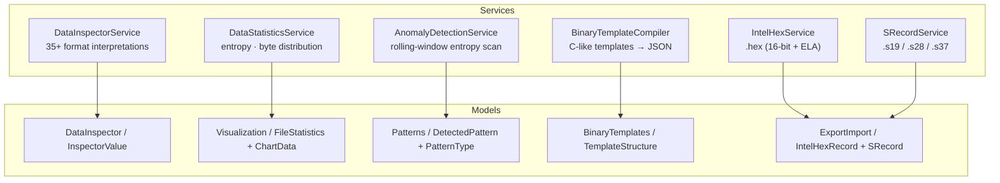
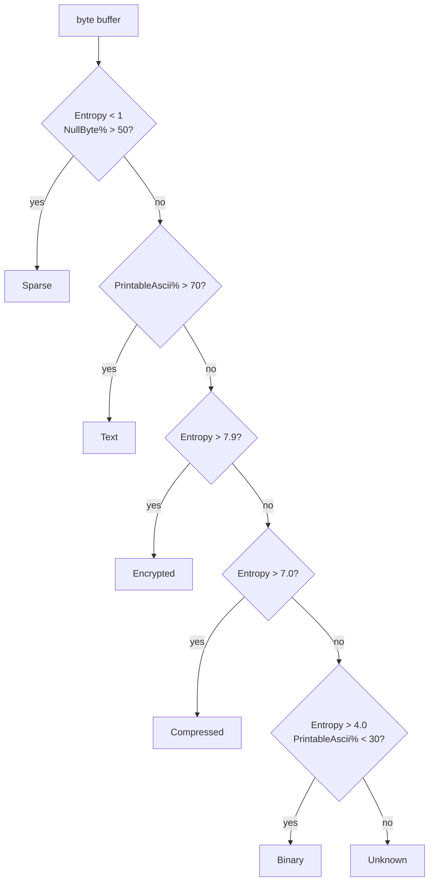

# WpfHexEditor.Core.BinaryAnalysis — Documentation (v1.0.1)

> **What you get** — a cross-platform (`net8.0`, **zero WPF**) binary-analysis
> toolkit. Interpret a byte buffer in 35+ formats (signed/unsigned integers
> LE/BE, IEEE-754 floats, Unix / FILETIME / .NET ticks, IPv4 / IPv6 / MAC,
> GUID, RGB/RGBA/ARGB/BGR, ASCII / hex / binary / octal, individual bits).
> Compute Shannon entropy + byte distribution + data-type estimation. Detect
> anomalies via rolling-window entropy. Compile 010-Editor-compatible C-like
> templates into JSON. Round-trip Intel HEX (`.hex`) and Motorola S-Record
> (`.s19` / `.s28` / `.s37`) with full checksum validation.

## Table of Contents

1. [Installation](#installation)
2. [Architecture](#architecture)
3. [Public API Reference](#public-api-reference)
4. [Usage Examples](#usage-examples)
5. [Data Inspector Reference](#data-inspector-reference)
6. [Statistics and Entropy](#statistics-and-entropy)
7. [Anomaly Detection](#anomaly-detection)
8. [Binary Templates (010 Editor Compat)](#binary-templates-010-editor-compat)
9. [Intel HEX / S-Record](#intel-hex--s-record)
10. [Threading and Performance Notes](#threading-and-performance-notes)
11. [License](#license)

---

## Installation

```bash
dotnet add package WpfHexEditor.Core.BinaryAnalysis --version 1.0.1
```

Requirements:

| Item | Value |
|---|---|
| Target framework | `net8.0` (cross-platform — Windows, Linux, macOS) |
| WPF / WinForms | **none** (`<UseWPF>false</UseWPF>`) |
| External dependencies | none |
| Source Link | enabled |

Assembly: `WpfHexEditor.Core.BinaryAnalysis.dll`. Namespaces:

- `WpfHexEditor.Core.BinaryAnalysis.Services` — `DataInspectorService`, `DataStatisticsService`, `AnomalyDetectionService`, `BinaryTemplateCompiler`, `IntelHexService`, `SRecordService`
- `WpfHexEditor.Core.BinaryAnalysis.Models.DataInspector` — `InspectorValue`
- `WpfHexEditor.Core.BinaryAnalysis.Models.Visualization` — `FileStatistics`, `DataType`, `ChartDataPoint`, `ChartData`, `ChartType`
- `WpfHexEditor.Core.BinaryAnalysis.Models.Patterns` — `PatternType`, `DetectedPattern`, `PatternAnalysisResult`
- `WpfHexEditor.Core.BinaryAnalysis.Models.BinaryTemplates` — `TemplateStructure`, `TemplateField`
- `WpfHexEditor.Core.BinaryAnalysis.Models.ExportImport` — `IntelHexRecord`, `IntelHexRecordType`, `SRecord`, `SRecordType`

---

## Architecture

### Component Diagram



### Design Principles

| Principle | How it is enforced |
|---|---|
| **Cross-platform** | `net8.0`, no Windows-specific API |
| **Zero WPF** | `<UseWPF>false</UseWPF>` — usable from any .NET host |
| **Stateless services** | every service is a plain class — instantiate freely, no DI required |
| **No I/O coupling** | all services accept `byte[]` (the only I/O are the file overloads on `IntelHexService` / `SRecordService`) |
| **Embeddable** | useful as a building block inside hex editors, AV scanners, firmware tooling, forensic pipelines |

---

## Public API Reference

### `class DataInspectorService`

Interpret a byte buffer in 35+ formats.

| Method | Signature | Returns |
|---|---|---|
| `InterpretBytes(byte[])` | `List<InspectorValue> InterpretBytes(byte[] bytes)` | One entry per applicable format (length-aware: 1 byte → 4 entries; 16 bytes → 30+ entries). |

Categories returned (depending on input length):

| Category | Formats |
|---|---|
| `Integer` | Int8, UInt8, Int16/UInt16 LE+BE, Int32/UInt32 LE+BE, Int64/UInt64 LE+BE |
| `Float` | Float32 LE+BE, Float64 LE+BE |
| `Date/Time` | Unix32 s, Unix64 ms, Windows FILETIME, .NET DateTime ticks |
| `Network` | IPv4, IPv6, MAC, Port LE+BE |
| `GUID` | plain + braced |
| `Color` | RGB, BGR, RGBA, ARGB |
| `Basic` | Hex, Binary, Octal, ASCII |
| `Bits` | per-bit MSB-first breakdown |

### `class InspectorValue : INotifyPropertyChanged`

| Property | Type | Description |
|---|---|---|
| `Category` | `string?` | e.g. `Integer`, `Date/Time`. |
| `Format` | `string?` | e.g. `Int32 LE (signed)`, `Windows FILETIME`. |
| `Value` | `string?` | Formatted display value. |
| `HexValue` | `string?` | Source byte hex (always populated). |
| `IsValid` | `bool` | Plausibility flag — e.g. `Unix Timestamp` is `false` outside 1970–2106. |
| `Description` | `string?` (init) | Tooltip-friendly explanation. |

### `class DataStatisticsService`

| Member | Description |
|---|---|
| `MaxSampleSize` | `int` (default `10 MB`) — caps the bytes analysed for very large buffers. |
| `CalculateStatistics(byte[] data)` | Returns `FileStatistics` with entropy, byte distribution, estimated type. |
| `GenerateByteDistributionChart(FileStatistics)` | Bar chart `ChartData`. |
| `GenerateEntropyChart(byte[], int windowSize = 1024)` | Sliding-window entropy line chart (50% overlap). |
| `GenerateDataTypeDistributionChart(FileStatistics)` | Null / Control / Printable / Extended distribution bar chart. |
| `GetStatisticsSummary(FileStatistics)` | Multi-line plain-text summary. |

### `class FileStatistics`

| Property | Type | Notes |
|---|---|---|
| `FileSize` | `long` | Bytes. |
| `Entropy` | `double` | 0–8 Shannon entropy. |
| `ByteFrequency` | `long[256]` | Per-byte counts. |
| `MostCommonByte` / `MostCommonByteCount` / `LeastCommonByte` | byte/long | Statistical extremes. |
| `UniqueBytesCount` | `int` | 0–256. |
| `NullBytePercentage` / `PrintableAsciiPercentage` | `double` | 0–100. |
| `AnalysisDate` / `AnalysisDurationMs` | `DateTime` / `long` | Diagnostics. |
| `EstimatedDataType` | `DataType` | Heuristic classification. |
| `GetBytePercentage(byte)` | `double` | Convenience accessor. |
| `GetSummary()` | `string` | One-liner. |

### `enum DataType`

`Unknown`, `Text`, `Binary`, `Compressed`, `Encrypted`, `Sparse`, `Image`, `Executable`.

Heuristic mapping (in `DataStatisticsService.EstimateDataType`):



| Condition | Result |
|---|---|
| `Entropy < 1 && NullByte% > 50` | `Sparse` |
| `PrintableAscii% > 70` | `Text` |
| `Entropy > 7.9` | `Encrypted` |
| `Entropy > 7.0` | `Compressed` |
| `Entropy > 4.0 && PrintableAscii% < 30` | `Binary` |
| else | `Unknown` |

### `class AnomalyDetectionService`

| Member | Default | Description |
|---|---|---|
| `EntropyWindowSize` | `1024` | Rolling-window size in bytes. |
| `HighEntropyThreshold` | `7.5` | Above → flagged as compressed/encrypted. |
| `LowEntropyThreshold` | `2.0` | Below → flagged as suspicious low entropy. |
| `EntropyChangeThreshold` | `2.0` | Δ entropy to flag a spike. |
| `MaxSampleSize` | `1 MB` | Buffer cap. |
| `DetectAnomalies(byte[] data, long baseOffset = 0)` | — | Returns `List<DetectedPattern>`. |
| `CalculateEntropy(byte[] data, int offset, int length)` | — | Reusable Shannon entropy helper. |

### `class DetectedPattern`

A flagged region — exposes `Offset`, `Length`, `PatternType`, severity / confidence, plus a human-readable `Description` (see source for full property list).

### `enum PatternType`

`RepeatedSequence`, `EmbeddedFile`, `NullPadding`, `FFPadding`, `AsciiString`,
`UnicodeString`, `RepeatingPattern`, `Corruption`, `EntropyAnomaly`,
`ChecksumHash`, `CompressedData`, `EncryptedData`, `AlignmentBoundary`,
`ImageData`, `ExecutableCode`, `Custom`.

### `class BinaryTemplateCompiler`

| Method | Returns |
|---|---|
| `CompileTemplate(string templateScript, string formatName = "Generated Format")` | `JsonObject` (System.Text.Json.Nodes) — a format definition with `formatName`, `version`, `category`, `description`, `blocks[]`. |

Recognised C-like syntax:

- `struct Name { … }` blocks
- `type name;` and `type name[N];` fields
- `typedef Existing Alias;`
- Single-line `// comment` annotations become field descriptions

Recognised type aliases (case-insensitive):

| C type | Mapped to |
|---|---|
| `char` | `int8` |
| `byte`, `uchar`, `BYTE` | `uint8` |
| `short`, `int16` | `int16` |
| `ushort`, `WORD`, `uint16` | `uint16` |
| `int`, `long`, `int32` | `int32` |
| `uint`, `ulong`, `DWORD`, `uint32` | `uint32` |
| `int64`, `QWORD` (unsigned) | `int64` / `uint64` |
| `float`, `double` | `float` / `double` |

### `class TemplateStructure` / `class TemplateField`

ObservableCollection-friendly DTOs with `Name`, `Description`, `Fields`,
`Script` (full `INotifyPropertyChanged` plumbing). Used by editor UIs that
expose template authoring.

### `class IntelHexService`

| Member | Description |
|---|---|
| `MaxBytesPerRecord` | `int` (default `16`). |
| `DefaultStartAddress` | `uint` (default `0x0000`). |
| `ExportToFile(byte[] data, string filePath, uint baseAddress = 0)` | Write a `.hex` file (ASCII). |
| `ExportToHex(byte[] data, uint baseAddress = 0)` | Returns `List<string>` of `:LLAAAATT…CC` records. |
| `ImportFromFile(string filePath)` | Round-trip read (see source). |
| `ImportFromHex(IEnumerable<string> lines)` | Stream parsing. |

### `class IntelHexRecord`

| Property | Type |
|---|---|
| `ByteCount` | `byte` |
| `Address` | `ushort` |
| `RecordType` | `IntelHexRecordType` |
| `Data` | `byte[]` |
| `Checksum` | `byte` |
| `CalculateChecksum()` / `ValidateChecksum()` | — |
| `ToHexString()` | Serialise to `:…` string. |
| `static Parse(string)` / `static TryParse(string, out IntelHexRecord)` | — |

`IntelHexRecordType` covers Data, EndOfFile, ExtendedSegmentAddress,
StartSegmentAddress, ExtendedLinearAddress, StartLinearAddress.

### `class SRecordService`

| Member | Description |
|---|---|
| `MaxBytesPerRecord` | `int` (default `32`). |
| `HeaderText` | `string` (default `"WPFHexEditor"`) — emitted as the S0 record. |
| `ExportToFile(byte[] data, string filePath, uint baseAddress = 0, bool use32BitAddress = false)` | — |
| `ExportToSRecord(byte[] data, uint baseAddress = 0, bool use32BitAddress = false)` | Returns `List<string>`. |
| `ImportFromFile(string filePath)` / `ImportFromSRecord(IEnumerable<string>)` | Round-trip read. |

Record type selection: `S1/S9` (16-bit) ≤ 0xFFFF, `S2/S8` (24-bit) ≤ 0xFFFFFF, `S3/S7` (32-bit) otherwise — or forced via `use32BitAddress`.

### `class SRecord`

Mirrors `IntelHexRecord` with one's-complement checksum and 16/24/32-bit
addresses. Provides `GetAddressLength(SRecordType)`, `CalculateChecksum`,
`ValidateChecksum`, `ToSRecordString`, `Parse`, `TryParse`.

### `enum SRecordType`

`S0_Header`, `S1_Data16`, `S2_Data24`, `S3_Data32`, `S5_Count16`,
`S6_Count24`, `S7_Start32`, `S8_Start24`, `S9_Start16`.

---

## Usage Examples

### Example 1 — Interpret 16 bytes in every applicable format

```csharp
using WpfHexEditor.Core.BinaryAnalysis.Services;

var bytes = new byte[] {
    0x40, 0x80, 0xC0, 0xFF, 0x00, 0x00, 0x00, 0x00,
    0xDE, 0xAD, 0xBE, 0xEF, 0xCA, 0xFE, 0xBA, 0xBE
};

var inspector = new DataInspectorService();
foreach (var v in inspector.InterpretBytes(bytes))
    Console.WriteLine($"{v.Category,-10} {v.Format,-30} = {v.Value}");
```

### Example 2 — Compute Shannon entropy on a file

```csharp
using WpfHexEditor.Core.BinaryAnalysis.Services;

var data = File.ReadAllBytes(@"C:\firmware.bin");
var stats = new DataStatisticsService().CalculateStatistics(data);

Console.WriteLine(stats.GetSummary());
// File: 524,288 bytes | Entropy: 7.93 | Type: Encrypted | Unique: 256/256
```

### Example 3 — Detect anomalies (encryption / compression boundaries)

```csharp
using WpfHexEditor.Core.BinaryAnalysis.Services;

var det = new AnomalyDetectionService
{
    HighEntropyThreshold = 7.6,
    LowEntropyThreshold  = 1.5,
    EntropyWindowSize    = 4096
};

foreach (var p in det.DetectAnomalies(data))
    Console.WriteLine($"{p.Offset:X8}  {p.Length,8}  {p.PatternType}");
```

### Example 4 — Compile a 010-Editor-style template

```csharp
using WpfHexEditor.Core.BinaryAnalysis.Services;

var script = @"
    struct BmpHeader {
        char     magic[2];      // 'BM'
        uint32   fileSize;      // total bytes
        uint16   reserved1;
        uint16   reserved2;
        uint32   dataOffset;
    };
";

var format = new BinaryTemplateCompiler().CompileTemplate(script, "BMP");
Console.WriteLine(format.ToJsonString(new JsonSerializerOptions { WriteIndented = true }));
```

### Example 5 — Round-trip Intel HEX

```csharp
using WpfHexEditor.Core.BinaryAnalysis.Services;

var firmware = new byte[1024];
new Random(42).NextBytes(firmware);

var ihx = new IntelHexService { MaxBytesPerRecord = 32 };
ihx.ExportToFile(firmware, @"C:\out.hex", baseAddress: 0x08000000);

// …later
var roundtrip = ihx.ImportFromFile(@"C:\out.hex"); // returns byte[]
```

### Example 6 — Export S-Record (auto-pick 16/24/32-bit)

```csharp
using WpfHexEditor.Core.BinaryAnalysis.Services;

var srec = new SRecordService
{
    HeaderText        = "ACME-FW v1.2.3",
    MaxBytesPerRecord = 32
};

srec.ExportToFile(firmware, @"C:\out.s37",
    baseAddress: 0xFFFF_0000u,
    use32BitAddress: true);
```

### Example 7 — Build an entropy line chart for a viewer

```csharp
using WpfHexEditor.Core.BinaryAnalysis.Services;

var chart = new DataStatisticsService()
    .GenerateEntropyChart(data, windowSize: 2048);

// chart.Points : IList<ChartDataPoint> with (X = file offset, Y = entropy 0-8)
foreach (var p in chart.Points.Take(5))
    Console.WriteLine($"@0x{p.X:X8}  H={p.Y:F3}");
```

---

## Data Inspector Reference

`DataInspectorService.InterpretBytes` produces interpretations strictly based
on the input length:

| Buffer length | Adds … |
|---|---|
| ≥ 1 | Int8 / UInt8, ASCII (1 byte slice), Hex / Binary / Octal (up to 8 bytes), Bits |
| ≥ 2 | Int16 / UInt16 LE + BE, Port LE + BE |
| ≥ 3 | RGB, BGR |
| ≥ 4 | Int32 / UInt32 LE + BE, Float32 LE + BE, IPv4, Unix Timestamp 32-bit, RGBA, ARGB |
| ≥ 6 | MAC Address |
| ≥ 8 | Int64 / UInt64 LE + BE, Float64 LE + BE, Unix Timestamp 64-bit ms, Windows FILETIME, .NET DateTime Ticks |
| ≥ 16 | GUID (plain + braced), IPv6 |

Date interpretations are plausibility-filtered (`IsValid = false` outside
documented epochs). Float interpretations skip NaN / Infinity silently.

---

## Statistics and Entropy

### Shannon entropy

`H = −Σ p(b)·log₂ p(b)` over the 256 byte values present in the sample.
Cap by `MaxSampleSize` (default 10 MB) so huge files do not OOM.

### Entropy chart (sliding window)

`GenerateEntropyChart` walks the buffer with a 50%-overlap window:

```
window  →  ▓▓▓▓        (entropy point @0x0000)
              ▓▓▓▓      (entropy point @0x0400, 50% overlap)
                  ▓▓▓▓  (entropy point @0x0800)
```

### Byte-distribution chart

`GenerateByteDistributionChart` emits one `ChartDataPoint` per non-zero
byte value (`X = byte value`, `Y = count`). Use directly in any charting
library (OxyPlot, LiveCharts, custom WPF, SkiaSharp).

---

## Anomaly Detection

`AnomalyDetectionService.DetectAnomalies` runs three sub-passes:

1. **Entropy spike detection** — rolling-window delta > `EntropyChangeThreshold`.
2. **High-entropy regions** — windows ≥ `HighEntropyThreshold` (default 7.5),
   merged into contiguous runs and reported as `EncryptedData` / `CompressedData`.
3. **Low-entropy regions** — windows ≤ `LowEntropyThreshold` (default 2.0),
   reported as `NullPadding` / `FFPadding` / `RepeatedSequence`.

Tune the four thresholds per use case:

| Scenario | Suggested settings |
|---|---|
| Firmware (lots of `0xFF` padding) | `LowEntropyThreshold = 0.5`, `HighEntropyThreshold = 7.7` |
| AV scanner (find packed regions) | `HighEntropyThreshold = 7.0`, `EntropyChangeThreshold = 1.5`, smaller window (`512`) |
| Forensic carving | `MaxSampleSize = 50 MB`, `EntropyWindowSize = 4096` |

---

## Binary Templates (010 Editor Compat)

The compiler accepts a subset of 010 Editor template syntax sufficient to
describe the layout of most binary file formats:

- One or more `struct Name { … }` blocks.
- Fields: `type identifier;` or `type identifier[N];` (fixed array).
- Single-line `// comment` annotations are captured as field descriptions.
- `typedef Type Alias;` introduces a synonym.

If no `struct` block is found, the compiler tries to parse the script as a
single flat block.

The result is a `JsonObject` matching the runtime format-definition schema
used by the larger `whfmt.FileFormatCatalog` ecosystem — register it through
your usual catalog plumbing.

Limitations vs full 010 Editor:

- No scripting / expressions / conditionals.
- No `local` variables, no `BigEndian()` / `LittleEndian()` directives
  (endian is inferred from the `type` itself, e.g. `uint32be`).
- No bitfields.
- No recursive nested structs (one level deep is supported).

---

## Intel HEX / S-Record

### Format support matrix

| Format | Record types written | Record types parsed | Auto extended addressing |
|---|---|---|---|
| Intel HEX | `00`, `01`, `04` (ELA) | all standard types | yes (`ExtendedLinearAddress` when `baseAddress > 0xFFFF`) |
| Motorola S-Record | `S0`, `S1`/`S9`, `S2`/`S8`, `S3`/`S7` | `S0`–`S9` | yes (auto-pick 16/24/32-bit by address range) |

### Checksum semantics

| Format | Algorithm |
|---|---|
| Intel HEX | Two's complement of `(ByteCount + AddrHi + AddrLo + Type + Σ Data) & 0xFF` |
| S-Record | One's complement of `(ByteCount + Σ Address + Σ Data) & 0xFF` |

Both `Parse(string)` methods throw `FormatException` on invalid checksum;
`TryParse(string, out …)` swallow the exception and return `false`.

### Encoding

Files are written as ASCII (no BOM, CRLF line endings via
`File.WriteAllLines`). Reading is encoding-tolerant — `Trim()` is applied
per line, leading whitespace is stripped.

---

## Threading and Performance Notes

### Thread safety

| Service | Notes |
|---|---|
| `DataInspectorService` | stateless — fully thread-safe; instantiate once and reuse. |
| `DataStatisticsService` | per-instance settings (`MaxSampleSize`); reads are thread-safe **after** configuration. |
| `AnomalyDetectionService` | same — configure once, reuse from multiple threads. |
| `BinaryTemplateCompiler` | `CompileTemplate` is pure; safe to call concurrently with distinct inputs. |
| `IntelHexService` / `SRecordService` | per-instance settings; export/import are thread-safe after configuration. |
| `InspectorValue` / `TemplateStructure` | `INotifyPropertyChanged` — single-threaded UI consumption. |

### Allocation profile

- `DataInspectorService.InterpretBytes(16-byte-buffer)` allocates ~30
  `InspectorValue` instances (~3 KB). For high-throughput inspection
  (e.g. mouse-hover preview), debounce on the UI side or call only on demand.
- `CalculateEntropy` allocates a single `long[256]` per call — cheap, but
  reuse via `AnomalyDetectionService.CalculateEntropy` when sweeping.
- `BinaryTemplateCompiler` allocates `System.Text.Json.Nodes` for the result
  — measure your `JsonObject` consumer for hot-path use.

### Big-file strategy

`DataStatisticsService.MaxSampleSize` (default 10 MB) and
`AnomalyDetectionService.MaxSampleSize` (default 1 MB) cap analysed bytes.
For files larger than these caps:

- Either raise the caps (trades CPU + memory for accuracy);
- Or feed the services in chunks and aggregate `FileStatistics.ByteFrequency`
  externally — Shannon entropy is then recomputed once over the merged
  histogram.

### Algorithmic complexity

| Operation | Complexity |
|---|---|
| `CalculateStatistics(byte[] n)` | O(n) — single pass, O(256) post-processing. |
| `GenerateEntropyChart(byte[] n, w)` | O(n) (sliding window, 50% overlap). |
| `DetectAnomalies(byte[] n)` | O(n) — three passes over the same rolling histogram. |
| `InterpretBytes(byte[])` | O(1) — input is bounded by interpretation length (≤ 16). |
| `CompileTemplate(string s)` | O(\|s\|) — single regex sweep over structs + fields. |
| Intel HEX / S-Record export | O(n / record-size). |
| Intel HEX / S-Record import | O(\|file\| / record-size) plus per-record checksum. |

---

## License

GNU Affero General Public License v3.0 — `AGPL-3.0-only`.

- Copyright © 2026 Derek Tremblay (derektremblay666@gmail.com)
- Authors / contributors: Derek Tremblay, Claude Sonnet 4.5, Claude Sonnet 4.6
- Repository: https://github.com/abbaye/WpfHexEditorControl

If your application is distributed under a license incompatible with AGPL-3.0,
contact the author for an alternative licensing arrangement.
