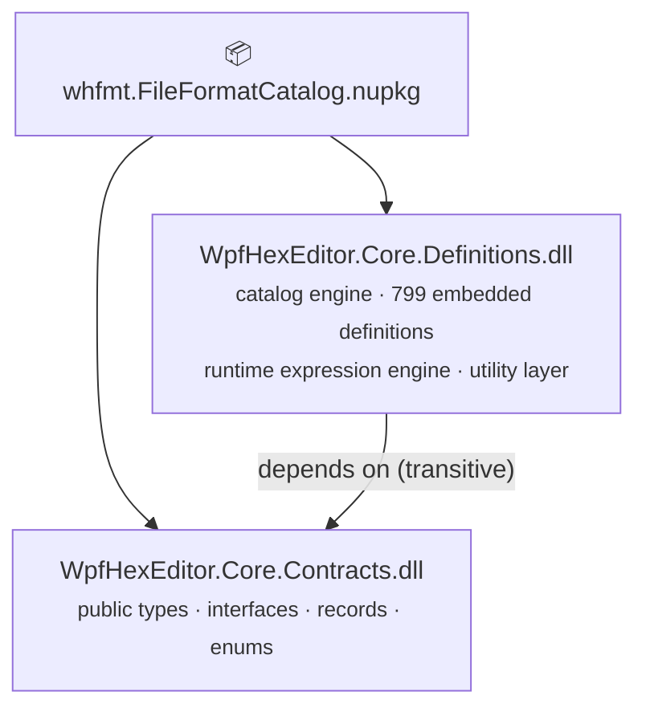
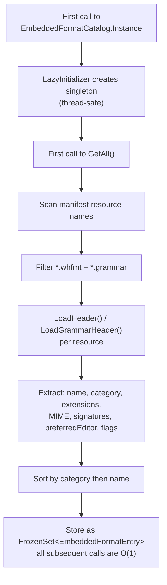
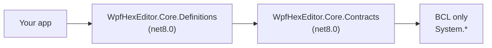
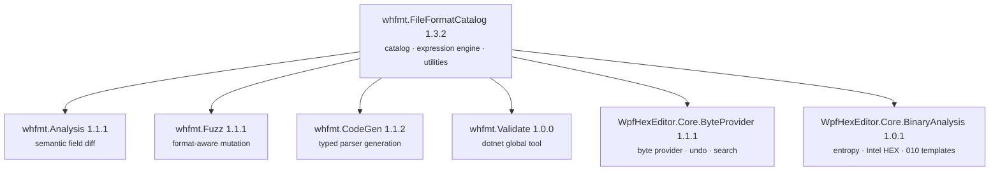

# whfmt.FileFormatCatalog — Documentation (v1.3.2 / schema v3)

> **What you get** — 799 embedded file-format definitions (789 `.whfmt` + 10 `.grammar`)
> spanning 29 categories, a runtime expression engine that evaluates `.whfmt` assertions
> live against parsed data, and a utility layer (matching, querying, metadata extraction,
> summary rendering). Cross-platform `net8.0`, zero external NuGet dependencies, zero WPF.

## Table of Contents

1. [What's new in 1.3.2](#whats-new-in-132)
2. [Architecture](#architecture)
3. [API Reference](#api-reference)
4. [Runtime Expression Engine](#runtime-expression-engine)
5. [Utility Layer](#utility-layer)
6. [Integration Guide — Level 1: Basic Detection](#level-1-basic-detection)
7. [Integration Guide — Level 2: Routing and Syntax](#level-2-routing-and-syntax)
8. [Integration Guide — Level 3: Full Pipeline](#level-3-full-pipeline)
9. [Integration Guide — Level 4: Rich Metadata](#level-4-rich-metadata)
10. [Integration Guide — Level 5: Live Assertions](#level-5-live-assertions)
11. [The .whfmt Format (schema v3)](#the-whfmt-format-schema-v3)
12. [Companion NuGet Packages](#companion-nuget-packages)
13. [Migration from v2.x](#migration-from-v2x)

---

## What's new in 1.3.2

**Pre-publication audit + Phase B blockers resolved + 2 catalog bug fixes.**

- **Bug fix — `FormatMatcher.ScoreEntry` negative offsets**: signatures declared with
  `offset: -4` (relative-from-end convention used by SHEBANG, FAT_BINARY, NE, LE,
  TRUECRYPT, etc.) no longer throw `ArgumentOutOfRangeException`. The matcher now
  normalises negative offsets to `header.Length + offset` and guards both bounds.
- **Bug fix — assertion variable ingestion**: `.whfmt` variables of type `bool` or
  `null` (e.g. `PNG.crc32Valid = false`) no longer crash downstream consumers.
- **Schema v3 enum alignment** — `category` enum extended from 19 to 31 values to
  match the 29 on-disk category directories (Firmware, Fonts, GIS, IoT, MachineLearning,
  Network, RomHacking, Science, Subtitles, Synalysis, Text, Virtualization added).
- **AST surface internalised** (B2) — `WhfmtExprNode` and the 11 record subtypes are
  now `internal`. Consumers go through `WhfmtExpressionEvaluator.Evaluate(string)`
  which returns `object?`. The evaluator implementation can now evolve (bytecode
  lowering, alternative parsers) without an ABI break.
- **New direct unit tests** (B3) — `GetJsonV3`, `FormatSummaryBuilder.BuildOneLiner` /
  `BuildPlainText`, `GetDocumentationBundle`, `FormatMatcher.Match` / `GetTopMatches`
  (covers the internal `ScoreEntry` via the public surface).
- **Catalog cleanup Lots 1-7** (cumulative since 1.3.1): 131 `matchMode` normalisations,
  32 block-type swaps (`blocks[].type = '<valueType>'` → `type='field' + valueType=X`),
  20 endian-suffixed `valueType` splits (`uint32be` → `valueType: uint32, endianness: big`),
  9 `formatId` collision renames (e.g. `DER` → `DER_CRYPTO`, `PAK` → `PAK_GAME`,
  `YAML` → `YAML_LANG`), 8 Unix-style formats given fictive extensions
  (APFS → `.apfs`, SHEBANG → `.sh`), and 12 exotic `valueType` mappings to canonical
  (`uint24` → `uint32`, `vint` → `int64`, `filetime` → `int64`, etc.).

See `Sources/Docs/whfmt-v3/audit-pre-publication/audit-SYNTHESE.md` in the repository
for the full 4-axis audit report.

---

## Architecture

### Assembly structure

The package ships two assemblies:



Consumers reference `WpfHexEditor.Core.Definitions`. `WpfHexEditor.Core.Contracts` is
bundled and flows transitively — no separate package reference needed.

### Type ownership

| Type | Assembly | Purpose |
|---|---|---|
| `EmbeddedFormatCatalog` | Core.Definitions | Singleton — catalog engine |
| `IEmbeddedFormatCatalog` | Core.Contracts | Interface — injectable abstraction |
| `EmbeddedFormatEntry` | Core.Contracts | Immutable record — one format definition |
| `FormatSignature` | Core.Contracts | Immutable record — one magic-byte signature |
| `FormatMatchResult` | Core.Contracts | Immutable record — scored detection result |
| `MatchSource` | Core.Contracts | Flags enum — Extension / MagicBytes / MimeType / Combined |
| `FormatCategory` | Core.Contracts | Enum — 29 known categories (v3) |
| `SchemaName` | Core.Contracts | Enum — embedded JSON schemas |
| `FormatMatcher` | Core.Definitions | Stateless detection façade with confidence scoring |
| `FormatFileAnalyzer` | Core.Definitions | I/O helper — file path / FileInfo / Stream / async |
| `CatalogQuery` | Core.Definitions | Fluent query builder |
| `FormatMetadataExtensions` | Core.Definitions | Extension methods — forensic, AI hints, assertions, … |
| `FormatSummaryBuilder` | Core.Definitions | Human-readable summaries — one-liner / plain / Markdown / dump |
| `FormatAssertionEvaluator` | Core.Definitions | Bridge between expression engine and catalog assertions |
| `WhfmtExpressionEvaluator` | Core.Definitions | Runtime expression engine (parser + evaluator + AST cache) |
| `WhfmtVariableStore` | Core.Definitions | Typed variable bag consumed by the evaluator |
| `WhfmtFunctionRegistry` / `IWhfmtFunction` | Core.Definitions | Extension point — register custom functions |
| `WhfmtExpressionValidator` | Core.Definitions | Static expression validator (lint) — undeclared vars + unknown fns |
| `WhfmtVersionMigrator` | Core.Definitions | In-memory v2 → v3 (PascalCase → camelCase) normaliser |

### Initialization and caching



`GetJson(resourceKey)` uses a separate `Dictionary<string, string>` cache — each
resource is read from the embedded stream exactly once, then served from memory on
all subsequent calls.

`GetJsonV3(resourceKey)` adds an extra in-memory pass through `WhfmtVersionMigrator.Migrate`
to normalise legacy PascalCase root keys (`QualityMetrics`, `MimeTypes`, `Strength`, …)
to v3 canonical camelCase. Falls back to raw JSON on migration error.

**Consequence:** the first call to `GetAll()` is the expensive one (~10–50 ms depending
on hardware). All subsequent calls are O(1). Call `PreWarm()` on a background thread
at startup to absorb this cost before the first user action.

### Thread safety

- `Instance` — safe (backed by `LazyInitializer`)
- `GetAll()` / `GetCategories()` / `GetByName()` / `GetByFormatId()` — safe; backed by immutable `FrozenSet<T>` + frozen dictionaries
- `GetJson()` / `GetJsonV3()` — safe (lock + TryAdd pattern, frozen migrator output)
- `DetectFromBytes()` — safe; read-only enumeration over immutable entries
- `FormatMatcher`, `FormatFileAnalyzer`, `CatalogQuery` — stateless; safe by construction
- `FormatAssertionEvaluator.EvaluateAll/One` — safe; pure functions over an evaluator instance
- `WhfmtExpressionEvaluator` — **not thread-safe** by design (variable store is mutable). Create one per scope, or guard access with a lock.

### Dependency graph



Zero external NuGet dependencies. No WPF, no platform-specific APIs.

---

## API Reference

### `EmbeddedFormatCatalog`

| Member | Returns | Description |
|---|---|---|
| `Instance` | `EmbeddedFormatCatalog` | Singleton — thread-safe, lazy |
| `GetAll()` | `IReadOnlySet<EmbeddedFormatEntry>` | All entries, sorted by category then name |
| `GetCategories()` | `IReadOnlySet<string>` | Distinct category names, alphabetical |
| `GetByExtension(string)` | `EmbeddedFormatEntry?` | First match by extension (case-insensitive, leading dot optional) |
| `GetByMimeType(string)` | `EmbeddedFormatEntry?` | First match by MIME type (case-insensitive) |
| `GetByCategory(string)` | `IReadOnlyList<EmbeddedFormatEntry>` | All entries in a category (string overload) |
| `GetByCategory(FormatCategory)` | `IReadOnlyList<EmbeddedFormatEntry>` | All entries in a category (enum overload) |
| `GetByName(string)` | `EmbeddedFormatEntry?` | O(1) exact-name lookup (case-insensitive) |
| `GetByFormatId(string)` | `EmbeddedFormatEntry?` | O(1) exact-formatId lookup (e.g. `"PNG"`, `"ZIP"`, `"DER_CRYPTO"`) |
| `DetectFromBytes(ReadOnlySpan<byte>)` | `EmbeddedFormatEntry?` | Best match by magic-byte scoring |
| `GetCompatibleEditorIds(string)` | `IReadOnlyList<string>` | Compatible editor IDs for a file path |
| `GetJson(string)` | `string` | Full `.whfmt` JSON for a resource key (cached, raw on-disk form) |
| `GetJsonV3(string)` | `string` | Same as `GetJson`, post-run through `WhfmtVersionMigrator` (camelCase canonical) |
| `GetSyntaxDefinitionJson(string)` | `string?` | Raw `syntaxDefinition` block JSON |
| `GetSchemaJson(string)` | `string?` | Embedded schema JSON (string overload) |
| `GetSchemaJson(SchemaName)` | `string?` | Embedded schema JSON (enum overload) |
| `PreWarm()` | `void` | Pre-load all JSON into memory cache |
| `.Query()` | `CatalogQuery` | Begin a fluent query (extension method) |

### `EmbeddedFormatEntry`

Immutable positional record. All fields populated from the `.whfmt` header at catalog load time.

| Field | Type | Notes |
|---|---|---|
| `ResourceKey` | `string` | Assembly manifest resource name — pass to `GetJson*()` / `GetSyntaxDefinitionJson()` |
| `Name` | `string` | Human-readable format name, e.g. `"ZIP Archive"` |
| `FormatId` | `string` | Stable canonical identifier (PascalCase), e.g. `"ZIP"`, `"DER_CRYPTO"` |
| `Category` | `string` | Logical category, e.g. `"Archives"` |
| `Description` | `string` | Short description of the format |
| `Extensions` | `IReadOnlyList<string>` | File extensions with leading dot, e.g. `[".zip", ".jar"]` |
| `MimeTypes` | `IReadOnlyList<string>?` | MIME types, e.g. `["application/zip"]`. Null when not declared. |
| `Signatures` | `IReadOnlyList<FormatSignature>?` | Magic-byte signatures (supports negative offsets in v1.3.2). Null when not declared. |
| `MinFileSize` | `int` | Minimum bytes required for a magic-byte match to be valid (0 = no minimum) |
| `MatchMode` | `string` | `"any"`, `"best"` (default), or `"all"` |
| `MinimumScore` | `double` | Threshold below which a scored match is discarded |
| `QualityScore` | `int` | 0–100 completeness score from `qualityMetrics.completenessScore` |
| `Version` | `string` | Format spec version, e.g. `"1.14"`. Empty when not specified. |
| `Author` | `string` | Author/organization. Empty when not specified. |
| `Platform` | `string` | Target platform for ROM/game formats. Empty otherwise. |
| `PreferredEditor` | `string?` | Recommended editor ID. Typical values: `"hex-editor"`, `"code-editor"`, `"structure-editor"`. |
| `IsTextFormat` | `bool` | True when `detection.isTextFormat` is set |
| `HasSyntaxDefinition` | `bool` | True when the `.whfmt` contains a `syntaxDefinition` block |
| `DiffMode` | `string?` | Preferred diff algorithm: `"text"`, `"semantic"`, `"binary"`. Null when absent. |

### `FormatMatchResult`

Immutable scored detection result.

| Member | Type | Description |
|---|---|---|
| `Entry` | `EmbeddedFormatEntry` | The matched format |
| `Confidence` | `double` | Normalised 0.0–1.0 confidence score |
| `Source` | `MatchSource` | Which strategy produced this match |
| `RawScore` | `double` | Accumulated signature weight before normalisation |
| `IsConfirmed` | `bool` | True when `Source == Combined` (extension + magic bytes both matched) |

### `MatchSource` flags enum

| Value | Meaning |
|---|---|
| `Extension` | Matched by file extension |
| `MagicBytes` | Matched by magic-byte signature scoring |
| `MimeType` | Matched by MIME type string |
| `Combined` | Extension + MagicBytes — highest confidence |

### `FormatCategory` enum (v3 — 29 on-disk categories + Other)

| Group | Values |
|---|---|
| Binary | `_3D`, `Archives`, `Audio`, `CAD`, `Certificates`, `Crypto`, `Data`, `Database`, `Disk`, `Documents`, `Executables`, `Firmware`, `Fonts`, `GIS`, `Game`, `Images`, `IoT`, `MachineLearning`, `Medical`, `Network`, `RomHacking`, `Science`, `Subtitles`, `Synalysis`, `System`, `Video`, `Virtualization` |
| Text | `Programming`, `Text` |
| Fallback | `Other` |

> `FormatCategory._3D` maps to the string `"3D"` — the enum overload handles this automatically.

### `SchemaName` enum

| Value | Schema file | Use case |
|---|---|---|
| `Whfmt` | `whfmt.schema.json` | Validate `.whfmt` format definitions |
| `Whcd` | `whcd.schema.json` | Class diagram visual state |
| `Whdbg` | `whdbg.schema.json` | Debug launch configuration |
| `Whidews` | `whidews.schema.json` | Workspace archive manifest |
| `Whscd` | `whscd.schema.json` | Solution-wide class diagram |

---

## Runtime Expression Engine

`.whfmt` v3 promotes the file from a passive description to an **executable declarative
program**. Three blocks contain expressions evaluated at runtime:

- `assertions[].expression` — validation rules with severity (error / warning / info)
- `blocks[].condition` / `blocks[].expression` — conditional and computed fields
- `forensic.suspiciousPatterns[].condition` — forensic pattern triggers

### Language

A JS-flavoured expression subset (operators, member access, function calls, ternary).
The full grammar is in `Models/Expressions/WhfmtExpression.cs`. Numeric coercion is
JS-like (`"1" == 1` is true, `0 == false` is true).

| Construct | Example |
|---|---|
| Literals | `42`, `0xFF`, `"text"`, `true`, `null` |
| Arithmetic | `+ - * / %` |
| Comparison | `== != < > <= >=` |
| Logical | `&& \|\| !` |
| Bitwise | `& \| ^ ~ << >>` |
| Ternary | `a ? b : c` |
| Member access | `magic.length` |
| Indexer | `nintendoLogo[0]` |
| Function call | `startsWith(magic, "PK")` |
| Method call | `title.startsWith("PK")` |

### `WhfmtExpressionEvaluator`

```csharp
using WpfHexEditor.Core.Definitions.Models.Expressions;
using WpfHexEditor.Core.Definitions.Models.Functions;

var store = new WhfmtVariableStore();
store.Set("fileSize", 1024L);
store.Set("magic", "PK");
store.Set("compressionRatio", 25.3);

var evaluator = new WhfmtExpressionEvaluator(store, WhfmtFunctionRegistry.CreateDefault());

bool ok = evaluator.EvaluateBool("magic == 'PK' && fileSize > 0");   // true
long v  = evaluator.EvaluateInt("fileSize / 2");                       // 512
object? raw = evaluator.Evaluate("compressionRatio > 1000 ? 'bomb' : 'ok'");  // "ok"
```

The AST is cached per source string in a `ConcurrentDictionary`, so re-evaluation of
the same expression with different variable values is allocation-free after the first
parse.

### `WhfmtVariableStore`

| Member | Description |
|---|---|
| `Set(name, value)` | Store a value (boxed `object?`) |
| `TryGet<T>(name, out value)` | Type-safe lookup with coercion |
| `GetRaw(name)` | Raw stored object |
| `Register(VariableDefinition)` | Pre-register a typed variable (used by `WhfmtVariableParser.BuildStore`) |
| `Names` / `Count` / `Contains(name)` | Inspection |

### `WhfmtFunctionRegistry` + `IWhfmtFunction`

Built-ins shipped via `WhfmtFunctionRegistry.CreateDefault()`:

| Name | Signature | Description |
|---|---|---|
| `startsWith(s, prefix)` | string × string → bool | |
| `endsWith(s, suffix)` | string × string → bool | |
| `contains(s, sub)` | string × string → bool | |
| `length(s)` | string → int | |
| `toLower(s)` / `toUpper(s)` | string → string | |
| `substring(s, start, len?)` | string × int × int? → string | |
| `min(a, b)` / `max(a, b)` | numeric × numeric → numeric | |
| `abs(x)` | numeric → numeric | |
| `floor(x)` / `ceil(x)` / `round(x)` | double → double | |
| `now()` | → DateTimeOffset | UTC |

Register a custom function:

```csharp
public sealed class CrcFunction : IWhfmtFunction
{
    public string Name => "crc32";
    public object? Invoke(IReadOnlyList<object?> args) => Crc32.Compute((byte[])args[0]!);
}

evaluator.Functions.Register(new CrcFunction());
evaluator.EvaluateInt("crc32(payload) == 0x12345678");
```

### `WhfmtExpressionValidator` (static lint)

Used by `whfmt.Validate lint-expressions` and by the `whfmt-guard` skill. Catches
parse errors, undeclared identifiers, and unknown function calls **without executing**.

```csharp
using WpfHexEditor.Core.Definitions.Models.Validation;

var issues = WhfmtExpressionValidator.Validate(
    expression: "fileSize > 0 && unknownVar < 100",
    declaredVars: ["fileSize"],
    declaredFns: ["startsWith"],
    fnRegistry: WhfmtFunctionRegistry.CreateDefault());

foreach (var issue in issues)
    Console.WriteLine($"[{issue.Severity}] {issue.Code}: {issue.Message}");
// [Warning] WH-EX-002: Undeclared identifier 'unknownVar'
```

### `FormatAssertionEvaluator` (bridge)

The fastest way to run all the assertions of a `.whfmt` file against a parsed payload.

```csharp
using WpfHexEditor.Core.Definitions.Metadata;

var entry = catalog.GetByFormatId("PNG")!;
var rules = entry.GetAssertions(catalog);

var store = new WhfmtVariableStore();
store.Set("fileSize", data.Length);
store.Set("pngSignature", "89504E470D0A1A0A");
store.Set("crc32Valid", true);

var evaluator = new WhfmtExpressionEvaluator(store);
var results = FormatAssertionEvaluator.EvaluateAll(evaluator, rules);

foreach (var r in results)
    Console.WriteLine($"[{r.Status}] {r.Rule.Name}: {r.Error ?? "ok"}");
// [Pass] magic valid: ok
// [Fail] crc32 matches: expected true, got false
```

`AssertionStatus` is `Pass | Fail | Skipped` (skipped when a required variable was
not provided — useful when running before all fields are parsed).

---

## Utility Layer

The utility layer sits on top of `IEmbeddedFormatCatalog` and covers four concerns:
**matching with confidence scores**, **I/O-free file analysis**, **fluent filtering**,
and **rich metadata extraction**. All utilities are cross-platform (`net8.0`, zero
external dependencies).

### Namespaces

```csharp
using WpfHexEditor.Core.Definitions.Matching;   // FormatMatcher, FormatFileAnalyzer
using WpfHexEditor.Core.Definitions.Query;      // CatalogQuery, CatalogQueryExtensions
using WpfHexEditor.Core.Definitions.Metadata;   // FormatMetadataExtensions, FormatSummaryBuilder, FormatAssertionEvaluator
using WpfHexEditor.Core.Definitions.Models.Expressions;  // WhfmtExpressionEvaluator
using WpfHexEditor.Core.Definitions.Models.Functions;    // WhfmtFunctionRegistry, IWhfmtFunction
```

### `FormatMatcher` — scored detection façade

`FormatMatcher` is a stateless class whose methods combine extension + magic-byte +
MIME-type detection into a single `FormatMatchResult` with a normalised confidence
score.

#### Confidence scale

| Confidence | Source | Meaning |
|---|---|---|
| `1.0` | `Combined` | Extension + magic bytes both agree |
| `0.51–0.99` | `MagicBytes` | Byte scoring only (no extension, or extension disagreed) |
| `0.5` | `Extension` | Extension matched, no signatures to confirm |
| `0.4` | `MimeType` | MIME type matched only |

#### Single best match

```csharp
using WpfHexEditor.Core.Definitions.Matching;

var catalog = EmbeddedFormatCatalog.Instance;
byte[] header = File.ReadAllBytes("myfile.zip")[..512];

var result = FormatMatcher.Match(catalog, ".zip", header);
// result.Entry.Name    → "ZIP Archive"
// result.Entry.FormatId→ "ZIP"
// result.Confidence    → 1.0
// result.Source        → MatchSource.Combined
// result.IsConfirmed   → true
```

#### Top-N ranked candidates

```csharp
var candidates = FormatMatcher.GetTopMatches(catalog, header, maxResults: 5);
foreach (var match in candidates)
    Console.WriteLine(match); // "ZIP Archive [MagicBytes] 99% (raw=1.00)"
```

#### All entries for an extension

```csharp
var all = FormatMatcher.GetMatchesByExtension(catalog, ".bin");
// Returns multiple FormatMatchResult sorted by QualityScore descending
```

#### MIME-type match

```csharp
var result = FormatMatcher.MatchMime(catalog, "application/pdf");
```

#### Signatures with negative offsets (v1.3.2)

Some formats (SHEBANG, FAT_BINARY, NE, LE, TRUECRYPT) declare signatures relative to
the end of the file:

```jsonc
"signatures": [
  { "value": "55AA", "offset": -2, "weight": 1.0, "label": "MBR boot sector tail" }
]
```

`FormatMatcher` normalises this to `header.Length - 2` at match time. Out-of-bounds
offsets are silently skipped (do not throw).

### `FormatFileAnalyzer` — I/O without boilerplate

Reads the first 512 bytes from a file (or stream) and delegates to `FormatMatcher`.

```csharp
var result = FormatFileAnalyzer.Analyze(catalog, @"C:\files\document.pdf");
// Also: FromStream, FromFileInfo, AnalyzeAsync, AnalyzeDirectory (batch)
```

```csharp
foreach (var (path, match) in FormatFileAnalyzer.AnalyzeDirectory(
    catalog, @"C:\Data", searchPattern: "*.*", recursive: true))
{
    var name = match?.Entry.Name ?? "Unknown";
    var conf = match?.Confidence.ToString("P0") ?? "—";
    Console.WriteLine($"{Path.GetFileName(path),-30}  {name,-25}  {conf}");
}
```

### `CatalogQuery` — fluent filtering

```csharp
using WpfHexEditor.Core.Definitions.Query;

var highQualityDiskFormats = catalog
    .Query()
    .InCategory(FormatCategory.Disk)
    .WithMinQuality(80)
    .HasMagicBytes()
    .OrderByQuality()
    .Execute();
```

#### Filter methods

| Method | Description |
|---|---|
| `.InCategory(FormatCategory)` | Restrict to a category (enum — compile-time safe) |
| `.InCategory(string)` | Restrict to a category (string overload) |
| `.WithMinQuality(int)` | Keep entries with QualityScore ≥ threshold |
| `.PriorityOnly()` | Shortcut: QualityScore ≥ 85 |
| `.HasMagicBytes()` | Only entries with at least one signature |
| `.WithExtension(string)` | Only entries that handle a given extension |
| `.TextFormatsOnly()` / `.BinaryFormatsOnly()` | Filter by `IsTextFormat` |
| `.HasSyntaxDefinition()` | Only entries with a grammar block |
| `.WithPreferredEditor(string)` / `.HasPreferredEditor()` | Editor routing filters |
| `.HasMimeType()` / `.HasPlatform()` / `.ForPlatform(string)` | Metadata filters |
| `.WithDiffMode(string)` | `"text"`, `"binary"`, or `"semantic"` |
| `.WithName(string)` / `.WithFormatId(string)` | Exact identity match |
| `.Containing(string)` | Full-text search in name + description |
| `.Where(predicate)` | Custom predicate |

#### Ordering + terminal methods

| Method | Returns | Description |
|---|---|---|
| `.OrderByQuality()` / `.OrderByName()` / `.OrderByCategoryThenName()` | `CatalogQuery` | Chainable ordering |
| `.Execute()` | `IReadOnlyList<EmbeddedFormatEntry>` | All matching entries |
| `.First()` | `EmbeddedFormatEntry?` | First match or null |
| `.Count()` / `.Any()` | `int` / `bool` | Counts |
| `.Select<T>(selector)` | `IReadOnlyList<T>` | Project each entry |
| `.ToDictionary<K,V>(keySel, valueSel)` | `Dictionary<K,V>` | Build a dictionary (auto OrdinalIgnoreCase for string keys) |
| `.ToExtensionDictionary()` / `.ToExtensionDictionary<V>(selector)` | `Dictionary<string, T>` | Flat extension routing map |
| `.GroupByCategory()` | `IReadOnlyDictionary<string, IReadOnlyList<EmbeddedFormatEntry>>` | Sorted category groups |

### `FormatMetadataExtensions` — rich whfmt metadata

Extension methods on `EmbeddedFormatEntry` that surface the deep metadata blocks.

> All methods take the catalog as a second parameter to load the JSON on demand.
> The JSON is cached after the first call.

#### Bulk parse — `GetAllMetadata()`

When you need **two or more metadata blocks** for the same entry, use `GetAllMetadata()` —
it parses the `.whfmt` JSON exactly once and returns a `FormatMetadata` record with all blocks.

```csharp
var meta = entry.GetAllMetadata(catalog);
// meta.Forensic / meta.AiHints / meta.Bookmarks / meta.Assertions /
// meta.InspectorGroups / meta.ExportTemplates / meta.TechnicalDetails
// meta.IsHighRisk / meta.SupportsEncryption  (shortcuts)
```

#### Per-block accessors

| Method | Returns |
|---|---|
| `.GetForensicSummary(catalog)` | `ForensicSummary?` |
| `.GetAiHints(catalog)` | `AiHints?` |
| `.GetNavigationBookmarks(catalog)` | `IReadOnlyList<NavigationBookmark>` |
| `.GetAssertions(catalog)` | `IReadOnlyList<AssertionRule>` |
| `.GetInspectorGroups(catalog)` | `IReadOnlyList<InspectorGroup>` |
| `.GetExportTemplates(catalog)` | `IReadOnlyList<ExportTemplate>` |
| `.GetTechnicalDetails(catalog)` | `TechnicalDetails?` |
| `.GetSoftware(catalog)` | `IReadOnlyList<SoftwareReference>` |
| `.GetUseCases(catalog)` | `IReadOnlyList<string>` |
| `.GetReferences(catalog)` | `IReadOnlyList<DocReference>` |
| `.GetFormatRelationships(catalog)` | `IReadOnlyList<FormatRelationship>` |
| `.GetInspectorHeader(catalog)` | `InspectorHeader?` |
| `.GetNavigationOverview(catalog)` | `NavigationOverview?` |
| `.GetForensicNotes(catalog)` | `string?` |
| `.GetDocumentationBundle(catalog)` | `(InspectorHeader?, NavigationOverview?, string?)` — 3-in-1 single parse |
| `.GetDiffConfig(catalog)` | `DiffConfig?` (consumed by `whfmt.Analysis`) |
| `.GetFuzzConfig(catalog)` | `FuzzConfig?` (consumed by `whfmt.Fuzz`) |
| `.GetRepairs(catalog)` | `IReadOnlyList<RepairAction>` |
| `.GetChecksums(catalog)` | `IReadOnlyList<ChecksumSpec>` |
| `.IsHighRisk(catalog)` | `bool` shortcut |
| `.SupportsEncryption(catalog)` | `bool` shortcut |

### `FormatSummaryBuilder`

Generates formatted summaries without WPF or MVVM dependency.

```csharp
string oneLine  = FormatSummaryBuilder.BuildOneLiner(entry);
string text     = FormatSummaryBuilder.BuildPlainText(entry, catalog);     // pass catalog for rich metadata
string md       = FormatSummaryBuilder.BuildMarkdown(entry, catalog);
string dump     = FormatSummaryBuilder.BuildDiagnosticDump(entry, catalog);
string hexAscii = FormatSummaryBuilder.FormatHex("504B0304");              // "50 4B 03 04"
```

---

## Level 1: Basic Detection

### Extension / formatId / name lookup

```csharp
var catalog = EmbeddedFormatCatalog.Instance;

var byExt   = catalog.GetByExtension(".zip");        // case-insensitive, dot optional
var byId    = catalog.GetByFormatId("ZIP");          // O(1) — canonical id
var byName  = catalog.GetByName("ZIP Archive");      // O(1) — exact-name lookup
var byMime  = catalog.GetByMimeType("application/zip");
```

### Magic-byte detection

```csharp
byte[] header = new byte[512];
using (var fs = File.OpenRead(filePath))
    fs.Read(header, 0, header.Length);

var entry = catalog.DetectFromBytes(header);
```

How scoring works:

```
ZIP has 3 signatures:
  "504B0304" offset 0  weight 1.0  ← Local File Header
  "504B0506" offset 0  weight 0.8  ← End of Central Directory
  "504B0708" offset 0  weight 0.5  ← Data Descriptor

A normal .zip file matches the first → score 1.0 → wins if no other format scores higher.
```

Negative offsets (v1.3.2) and the `matchMode` rules (`any` / `best` / `all`) /
`minimumScore` threshold / `minFileSize` floor are all honoured.

### Category browsing

```csharp
var archives = catalog.GetByCategory(FormatCategory.Archives);
foreach (var fmt in archives)
    Console.WriteLine($"{fmt.Name}: {string.Join(", ", fmt.Extensions)}");
```

---

## Level 2: Routing and Syntax

### Editor routing

`GetCompatibleEditorIds` returns all editor IDs that can open a given file. `"hex-editor"`
is always included as the universal fallback.

```csharp
var editors = catalog.GetCompatibleEditorIds("report.pdf");
// ["hex-editor", "structure-editor"]

var editors2 = catalog.GetCompatibleEditorIds("main.cs");
// ["hex-editor", "code-editor", "text-editor"]
```

| Condition | Editor added |
|---|---|
| Always | `"hex-editor"` |
| `PreferredEditor` set | that value |
| `IsTextFormat == true` | `"code-editor"`, `"text-editor"` |
| `Category == "Images"` | `"image-viewer"` |
| `Category == "Audio"` | `"audio-viewer"` |
| `DiffMode == "text"` | `"diff-viewer"` |

### Registering grammars for a syntax engine

```csharp
foreach (var entry in catalog.Query()
                              .InCategory(FormatCategory.Programming)
                              .HasSyntaxDefinition()
                              .Execute())
{
    string? grammar = catalog.GetSyntaxDefinitionJson(entry.ResourceKey);
    if (grammar is null) continue;
    // MyTokenizer.Register(entry.FormatId, grammar);
}
```

The catalog ships **57+ language grammars** (C#, Python, JS/TS, Go, Rust, Java, Kotlin,
Swift, YAML, TOML, Markdown, Dockerfile, HCL/Terraform, WAT, MSBuild, iCal, vCard,
DocBook, …). Each grammar's `syntaxDefinition` block contains tokenization rules,
snippets, completion items, outline rules, diagnostic patterns, bracket pairs, and
folding rules — consumed by the `WpfCodeEditor` standalone NuGet.

### Detecting extension spoofing

```csharp
using WpfHexEditor.Core.Definitions.Matching;

byte[] header = File.ReadAllBytes(filePath)[..512];
var result = FormatMatcher.Match(catalog, filePath, header);

bool spoofed = result is not null
    && result.Source == MatchSource.MagicBytes
    && !result.IsConfirmed;
```

### MIME negotiation for HTTP

```csharp
string? GetContentType(string extension)
    => catalog.GetByExtension(extension)?.MimeTypes?.FirstOrDefault()
       ?? "application/octet-stream";

string GetExtensionForMime(string mimeType)
    => catalog.GetByMimeType(mimeType)?.Extensions.FirstOrDefault() ?? ".bin";
```

---

## Level 3: Full Pipeline

### File identification (recommended path)

```csharp
using WpfHexEditor.Core.Definitions.Matching;

var catalog = EmbeddedFormatCatalog.Instance;
var result  = FormatFileAnalyzer.Analyze(catalog, filePath);

if (result is null)
    Console.WriteLine("Format not recognised.");
else
    Console.WriteLine($"{result.Entry.Name} ({result.Source}, {result.Confidence:P0}) — confirmed={result.IsConfirmed}");
```

### Dependency injection

```csharp
services.AddSingleton<IEmbeddedFormatCatalog>(EmbeddedFormatCatalog.Instance);

public class MyService(IEmbeddedFormatCatalog catalog) { ... }
```

### Background pre-warming

```csharp
_ = Task.Run(EmbeddedFormatCatalog.Instance.PreWarm);
```

### Batch folder scanner with parallel processing

```csharp
var results = Directory
    .EnumerateFiles(@"C:\Data", "*.*", SearchOption.AllDirectories)
    .AsParallel()
    .WithDegreeOfParallelism(Environment.ProcessorCount)
    .Select(path =>
    {
        FormatMatchResult? match = null;
        try { match = FormatFileAnalyzer.Analyze(catalog, path); } catch { }
        return new {
            Path      = path,
            Name      = match?.Entry.Name ?? "Unknown",
            Category  = match?.Entry.Category ?? "Unknown",
            Confidence= match?.Confidence ?? 0,
            IsSpoofed = match?.Source == MatchSource.MagicBytes && !match.IsConfirmed,
        };
    })
    .ToList();

foreach (var g in results.GroupBy(r => r.Category).OrderByDescending(g => g.Count()))
    Console.WriteLine($"{g.Key,-20} {g.Count(),5} file(s)  spoofed: {g.Count(f => f.IsSpoofed)}");
```

### Full syntax engine bootstrap

```csharp
public sealed class SyntaxEngineBootstrapper(IEmbeddedFormatCatalog catalog)
{
    private readonly Dictionary<string, string> _grammars =
        catalog.Query()
               .InCategory(FormatCategory.Programming)
               .HasSyntaxDefinition()
               .Execute()
               .SelectMany(e => e.Extensions, (e, ext) => (ext, json: catalog.GetSyntaxDefinitionJson(e.ResourceKey)))
               .Where(x => x.json is not null)
               .GroupBy(x => x.ext, StringComparer.OrdinalIgnoreCase)
               .ToDictionary(g => g.Key, g => g.First().json!, StringComparer.OrdinalIgnoreCase);

    public string? GetGrammar(string fileExtension) => _grammars.GetValueOrDefault(fileExtension);
}
```

---

## Level 4: Rich Metadata

### Security scanner — detect high-risk formats

```csharp
var result = FormatFileAnalyzer.Analyze(catalog, filePath);
if (result is null) return;

var meta = result.Entry.GetAllMetadata(catalog);    // single JSON parse, all blocks
if (meta.IsHighRisk)
{
    Console.WriteLine($"⛔ HIGH RISK: {result.Entry.Name} ({meta.Forensic!.RiskLevel})");
    foreach (var p in meta.Forensic.SuspiciousPatterns)
        Console.WriteLine($"   ⚠ {p.Name}: {p.Description}");
}

foreach (var hint in meta.AiHints?.SuggestedInspections ?? [])
    Console.WriteLine($"   → {hint}");
```

### Structure viewer — build inspector groups

```csharp
foreach (var group in entry.GetInspectorGroups(catalog))
{
    Console.WriteLine($"[{group.Icon}] {group.Name}");
    foreach (var field in group.Fields)
        Console.WriteLine($"    {field}");
}
```

### Export pipeline — enumerate available templates

```csharp
foreach (var tmpl in entry.GetExportTemplates(catalog))
{
    Console.WriteLine($"Export: {tmpl.Name} [{tmpl.Format.ToUpperInvariant()}]");
    Console.WriteLine($"  Fields: {string.Join(", ", tmpl.Fields)}");
}
```

### Navigation — jump to known offsets

```csharp
foreach (var b in entry.GetNavigationBookmarks(catalog))
{
    var pos = b.Offset.HasValue ? $"0x{b.Offset:X4}" : $"${b.OffsetVar}";
    Console.WriteLine($"  [{b.Icon,-12}] {b.Name,-25} @ {pos}");
}
```

### Diagnostic report / Markdown card

```csharp
string dump = FormatSummaryBuilder.BuildDiagnosticDump(entry, catalog);
string md   = FormatSummaryBuilder.BuildMarkdown(entry, catalog);
File.WriteAllText("apfs-format-card.md", md);
```

---

## Level 5: Live Assertions

This level shows how the expression engine and `FormatAssertionEvaluator` work
together to validate a parsed file against the `.whfmt` rules.

### End-to-end PNG validation

```csharp
using WpfHexEditor.Core.Definitions;
using WpfHexEditor.Core.Definitions.Metadata;
using WpfHexEditor.Core.Definitions.Models.Expressions;
using WpfHexEditor.Core.Definitions.Models.Functions;

var catalog = EmbeddedFormatCatalog.Instance;
var entry   = catalog.GetByFormatId("PNG")!;

// 1) Build the variable store from the parsed file.
byte[] data = File.ReadAllBytes("photo.png");
var store = new WhfmtVariableStore();
store.Set("fileSize",       (long)data.Length);
store.Set("pngSignature",   Convert.ToHexString(data.AsSpan(0, 8)));
store.Set("ihdrChunkLength",BinaryPrimitives.ReadInt32BigEndian(data.AsSpan(8, 4)));
store.Set("imageWidth",     BinaryPrimitives.ReadInt32BigEndian(data.AsSpan(16, 4)));
store.Set("imageHeight",    BinaryPrimitives.ReadInt32BigEndian(data.AsSpan(20, 4)));
store.Set("crc32Valid",     true);  // computed elsewhere

// 2) Run all assertions in one pass.
var evaluator = new WhfmtExpressionEvaluator(store, WhfmtFunctionRegistry.CreateDefault());
var results   = FormatAssertionEvaluator.EvaluateAll(evaluator, entry.GetAssertions(catalog));

// 3) Surface failures.
var failures = results.Where(r => r.Status == AssertionStatus.Fail).ToList();
if (failures.Count == 0)
{
    Console.WriteLine("✓ PNG file passes all assertions.");
}
else
{
    Console.WriteLine($"✗ {failures.Count} assertion failure(s):");
    foreach (var f in failures)
        Console.WriteLine($"   [{f.Rule.Severity}] {f.Rule.Name}: {f.Rule.Message ?? f.Rule.Expression}");
}
```

### Pre-flight static lint

Before running an assertion against real data, lint the expression itself:

```csharp
var rules = entry.GetAssertions(catalog);
var declaredVars = new[] { "fileSize", "pngSignature", "ihdrChunkLength",
                           "imageWidth", "imageHeight", "crc32Valid" };

foreach (var rule in rules)
{
    var issues = WhfmtExpressionValidator.Validate(
        rule.Expression, declaredVars,
        declaredFns: [],
        fnRegistry: WhfmtFunctionRegistry.CreateDefault());
    foreach (var i in issues)
        Console.WriteLine($"  [{i.Severity}] {rule.Name}: {i.Code} — {i.Message}");
}
```

This is exactly what `whfmt.Validate lint-expressions` does in CI to catch broken
`.whfmt` files before they ship.

---

## The .whfmt Format (schema v3)

A `.whfmt` file is a JSONC document (JSON with `//` and `/* */` comments and trailing
commas allowed) that describes a binary or text file format. **All root keys are
camelCase in v3.** Legacy PascalCase root keys (`QualityMetrics`, `MimeTypes`, …) are
still accepted via `WhfmtVersionMigrator` but will be removed in v4.

Annotated example:

```jsonc
{
  // Root identification
  "formatName": "ZIP Archive",            // Human-readable name
  "formatId":   "ZIP",                    // Canonical PascalCase identifier (unique across the catalog)
  "version":    "1.14",                   // Format spec version
  "category":   "Archives",               // Must match a FormatCategory enum value
  "description":"...",
  "author":     "WPFHexaEditor Team",
  "preferredEditor": "hex-editor",        // hex-editor | code-editor | structure-editor | image-viewer | audio-viewer
  "diffMode":   "binary",                 // text | semantic | binary

  // File association
  "extensions": [".zip", ".jar", ".apk"],
  "mimeTypes":  ["application/zip"],

  // Detection
  "detection": {
    "signatures": [
      { "value": "504B0304", "offset":  0, "weight": 1.0, "label": "Local File Header"        },
      { "value": "504B0506", "offset":  0, "weight": 0.8, "label": "End of Central Directory" },
      { "value": "55AA",     "offset": -2, "weight": 0.5, "label": "Tail marker (negative offset)" }
    ],
    "matchMode":    "best",               // any | best (default) | all
    "minimumScore": 0.5,                  // discard scored matches below this threshold
    "minFileSize":  22,                   // skip when header shorter than this
    "strength":     "Strong",             // Strong | Medium | Weak — informational only
    "isTextFormat": false,
    "validation": {
      "minFileSize": 22,
      "maxSignatureOffset": 0,
      "discriminator": {                  // NEW in v3 — resolves magic collisions
        "offset": 4, "length": 2, "endian": "little",
        "values": { "0103": "ZIP", "0203": "ZIP_NESTED" }
      }
    }
  },

  // Typed variables (v3 preferred form) — consumed by the runtime expression engine
  "variables": [
    { "name": "fileSize",       "type": "uint64", "offset": 0,        "length": 8 },
    { "name": "magic",          "type": "ascii",  "offset": 0,        "length": 4 },
    { "name": "compressionMethod", "type": "uint16", "offset": 8,    "length": 2, "endian": "little" }
  ],
  // … or the dict form (still accepted):
  // "variables": { "fileSize": 0, "magic": "", "compressionMethod": 0 }

  // Named function registry — v3 executable form (or doc-string)
  "functions": {
    "crc32":     { "params": ["bytes"], "returns": "uint32", "builtIn": "crc32" },
    "validateMagic": { "params": [], "returns": "bool", "body": "magic == 'PK'" }
  },

  // Block layout (signature/field/conditional/loop/repeating/pointer/bitfield/union)
  "blocks": [
    { "type": "signature", "name": "magic",  "offset": 0,  "length": 4, "valueType": "ascii" },
    { "type": "field",     "name": "compressionMethod",
                                            "offset": 8,  "length": 2, "valueType": "uint16", "endianness": "little",
                           "valueMap": { "0": "Store", "8": "Deflate" } },
    { "type": "conditional",
      "name": "encryptionHeader",
      "condition": "(flags & 1) != 0",      // expression engine
      "trueLabel": "encrypted",
      "falseLabel":"plain" }
  ],

  // Runtime assertions — evaluated by FormatAssertionEvaluator
  "assertions": [
    { "name": "magic valid",    "expression": "magic == 'PK'",     "severity": "error",
      "message": "Missing ZIP magic bytes" },
    { "name": "compression OK", "expression": "compressionMethod == 0 || compressionMethod == 8",
      "severity": "warning" }
  ],

  // Quality
  "qualityMetrics": { "completenessScore": 92 },

  // Forensic intelligence
  "forensic": {
    "category":  "archive",
    "riskLevel": "low",                     // low | medium | high | critical
    "suspiciousPatterns": [
      { "name": "Zip bomb", "description": "Nested archives with extreme ratio",
        "condition": "compressionRatio > 1000" }
    ]
  },

  // AI hints
  "aiHints": {
    "analysisContext":      "ZIP is a widely-used container format…",
    "suggestedInspections": [ "Check local file header counts", "Verify central directory offset" ]
  },

  // Navigation
  "navigation": {
    "entryPoint": "Local File Header",
    "structure":  [ "Local File Header[]", "Central Directory", "End of Central Directory" ],
    "bookmarks":  [
      { "name": "Local File Header", "offset": 0,           "icon": "signature" },
      { "name": "Central Directory", "offsetVar": "cdOffset", "icon": "directory" }
    ]
  },

  // Inspector layout
  "inspector": {
    "badge": "📦",
    "primaryField": "compressionMethod",
    "showQualityScore": true,
    "groups": [
      { "name": "File Header", "icon": "header",
        "fields": ["signature", "version", "flags", "compression"] }
    ]
  },

  // Export templates
  "exportTemplates": [
    { "name": "ZIP Summary (JSON)", "format": "json",
      "fields": ["signature", "version", "compression", "crc32"] }
  ],

  // Technical details
  "technicalDetails": {
    "endianness":          "little",
    "compressionMethod":   "DEFLATE / Store / BZip2 / LZMA",
    "supportsEncryption":  true,
    "encryption":          "Traditional PKWARE, AES-256"
  },

  // Diff / Fuzz / Repair / Migration — consumed by companion NuGets
  "diff":  { "keyFields": ["centralDirectoryEntries"], "ignoreFields": ["timestamp"], "groupBy": "entry" },
  "fuzz":  { "preserveChecksums": true, "maxMutationsPerFile": 5,
             "strategies": [
               { "field": "compressionMethod", "mutation": "enum_sweep",     "weight": 1.0 },
               { "field": "fileSize",          "mutation": "boundary_values","weight": 0.7 }
             ] },
  "repair": [
    { "name": "Fix central directory offset", "trigger": "centralDirOffset > fileSize",
      "action": "recompute", "target": "centralDirOffset", "algorithm": "scan_for_eocd" }
  ],
  "migration": [
    { "from": "ZIP 1.0", "to": "ZIP 1.14",
      "changes": [ { "field": "version", "changeType": "increment", "value": 14 } ] }
  ],

  // Cross-format relationships
  "formatRelationships": [
    { "format": "JAR", "relationship": "ZIP-based container" },
    { "format": "APK", "relationship": "ZIP-based Android package" }
  ],

  // Syntax grammar block (only for text/code formats) — consumed by WpfCodeEditor
  "syntaxDefinition": {
    "id": "example", "name": "Example",
    "extensions": [".ex"],
    "lineCommentPrefix": "//",
    "rules":           [ /* tokenizer rules */ ],
    "snippets":        [ /* trigger → body */ ],
    "completions":     [ /* keyword/symbol completions */ ],
    "outlineRules":    [ /* symbol list patterns */ ],
    "diagnosticRules": [ /* pattern-based diagnostics */ ]
  }
}
```

### Key fields used by the catalog API

| Field | API surface |
|---|---|
| `formatName` / `formatId` | `EmbeddedFormatEntry.Name` / `.FormatId` / `GetByName()` / `GetByFormatId()` |
| `category` | `EmbeddedFormatEntry.Category` / `GetByCategory()` / `.Query().InCategory()` |
| `extensions` | `EmbeddedFormatEntry.Extensions` / `GetByExtension()` / `.Query().WithExtension()` |
| `mimeTypes` | `EmbeddedFormatEntry.MimeTypes` / `GetByMimeType()` / `FormatMatcher.MatchMime()` |
| `detection.signatures` | `EmbeddedFormatEntry.Signatures` / `DetectFromBytes()` / `FormatMatcher.Match()` |
| `detection.matchMode` / `minimumScore` / `minFileSize` | `FormatMatcher` scoring honours all three |
| `preferredEditor` | `EmbeddedFormatEntry.PreferredEditor` / `GetCompatibleEditorIds()` |
| `detection.isTextFormat` | `EmbeddedFormatEntry.IsTextFormat` / `.Query().TextFormatsOnly()` |
| `syntaxDefinition` | `.HasSyntaxDefinition` / `GetSyntaxDefinitionJson()` / `.Query().HasSyntaxDefinition()` |
| `diffMode` | `EmbeddedFormatEntry.DiffMode` / `.Query().WithDiffMode()` |
| `qualityMetrics.completenessScore` | `EmbeddedFormatEntry.QualityScore` / `.Query().WithMinQuality()` |
| `variables` | `WhfmtVariableParser.BuildStore(json)` → `WhfmtVariableStore` |
| `functions` | feeds `WhfmtFunctionRegistry` (built-ins + user-defined) |
| `assertions` | `entry.GetAssertions(catalog)` + `FormatAssertionEvaluator.EvaluateAll` |
| `forensic` | `entry.GetForensicSummary(catalog)` / `.IsHighRisk(catalog)` |
| `aiHints` | `entry.GetAiHints(catalog)` |
| `navigation.bookmarks` | `entry.GetNavigationBookmarks(catalog)` |
| `inspector.groups` | `entry.GetInspectorGroups(catalog)` |
| `exportTemplates` | `entry.GetExportTemplates(catalog)` |
| `technicalDetails` | `entry.GetTechnicalDetails(catalog)` / `.SupportsEncryption(catalog)` |
| `diff` | `entry.GetDiffConfig(catalog)` (consumed by `whfmt.Analysis`) |
| `fuzz` | `entry.GetFuzzConfig(catalog)` (consumed by `whfmt.Fuzz`) |
| `repair` / `checksums` | `entry.GetRepairs(catalog)` / `.GetChecksums(catalog)` |
| `formatRelationships` | `entry.GetFormatRelationships(catalog)` |
| `software` / `useCases` / `references` | `entry.GetSoftware/UseCases/References(catalog)` |

### Validating your own .whfmt files

```csharp
string? schema = EmbeddedFormatCatalog.Instance.GetSchemaJson(SchemaName.Whfmt);
// Pass to JsonSchema.Net, Newtonsoft.Json.Schema, or any JSON Schema validator
```

The embedded schema (`whfmt.schema.json`) is the authoritative v3 schema. The canonical
draft lives in the repo at `Sources/Docs/whfmt-v3/whfmt-schema-canonical-v3.json`.

### Canonical category list (29 + Other)

```
3D, Archives, Audio, CAD, Certificates, Crypto, Data, Database, Disk,
Documents, Executables, Firmware, Fonts, GIS, Game, Images, IoT,
MachineLearning, Medical, Network, Programming, RomHacking, Science,
Subtitles, Synalysis, System, Text, Video, Virtualization, Other
```

---

## Companion NuGet Packages

The catalog is the ground truth. Several companion packages consume it for higher-level tasks:



| Package | Version | Role |
|---|---|---|
| `whfmt.FileFormatCatalog` | 1.3.2 | This package — catalog + expression engine + utilities |
| `whfmt.Analysis` | 1.1.1 | Field-level semantic diff between two binary files using `diff` blocks |
| `whfmt.Fuzz` | 1.1.1 | Format-aware mutation engine driven by `fuzz` strategies |
| `whfmt.CodeGen` | 1.1.2 | Generates strongly-typed parsers (C# / F# / Rust / VB.NET) from `.whfmt` |
| `whfmt.Validate` | 1.0.0 | `dotnet tool install -g whfmt.Validate` — `validate`, `list`, `info`, `repair`, `lint-expressions` CLI |
| `WpfHexEditor.Core.ByteProvider` | 1.1.1 | Cross-platform byte provider + undo/search engine |
| `WpfHexEditor.Core.BinaryAnalysis` | 1.0.1 | Entropy / data inspector / Intel HEX / S-Record / 010 templates |

All companion packages depend on `whfmt.FileFormatCatalog ≥ 1.3.2`.

---

## Migration from v2.x

### Drop-in upgrade

`v1.3.x` is wire-compatible with `v1.2.x` for the public API surface. The only
breaking change since v1.2.0 is:

- **`WhfmtExprNode` and AST records are now `internal`** — if you depended on them
  directly (unlikely), migrate to `WhfmtExpressionEvaluator.Evaluate(string)` which
  returns `object?`. This was an intentional decoupling so the parser/evaluator can
  evolve without ABI breaks.

### PascalCase → camelCase normalisation

If you load `.whfmt` files from disk (not from the embedded catalog), the deprecated
PascalCase root keys (`QualityMetrics`, `MimeTypes`, `Strength`, `EntropyHint`,
`MinimumScore`, `Software`, `UseCases`, `TechnicalDetails`) are still accepted via
`WhfmtVersionMigrator`. To future-proof, run the migrator manually:

```csharp
using WpfHexEditor.Core.Definitions.Models;

string oldJson = File.ReadAllText("legacy.whfmt");
string v3Json  = WhfmtVersionMigrator.Migrate(oldJson);
// Or preview the renames without applying:
IReadOnlyList<string> renames = WhfmtVersionMigrator.DryRun(oldJson);
```

`v4` will remove these aliases. Plan accordingly.

### Schema v3 highlights vs v2.4/v2.5

| Concept | v2.x | v3 |
|---|---|---|
| Root key case | mixed (PascalCase + camelCase) | **camelCase only** (PascalCase deprecated) |
| `formatId` | not required | **required** + unique across catalog |
| Categories | 19 in schema enum | **29 + Other** (matches on-disk dirs) |
| Block types | open string | **15 known types** (signature/field/header/data/conditional/computeFromVariables/loop/repeating/action/sentinel/union/nested/pointer/bitfield/metadata) |
| `valueType` | mixed with endianness suffix (`uint32be`) | **base type + `endianness` field** (`{ "valueType": "uint32", "endianness": "big" }`) |
| Variables | dict form only | dict **or** typed array (preferred) |
| Functions | doc-string only | **executable descriptors** (params, returns, body, builtIn) |
| Assertions | doc-string only | **evaluated at runtime** via expression engine |
| Detection | `matchMode` informal | normalised to `any | best | all`, with `minimumScore`, `minFileSize`, `discriminator` |
| Negative offsets | undefined behaviour | **supported** (offset-from-end convention) |

---

## License

GNU AGPL v3.0 — see [LICENSE.txt](https://github.com/abbaye/WpfHexEditorIDE/blob/master/LICENSE.txt).
