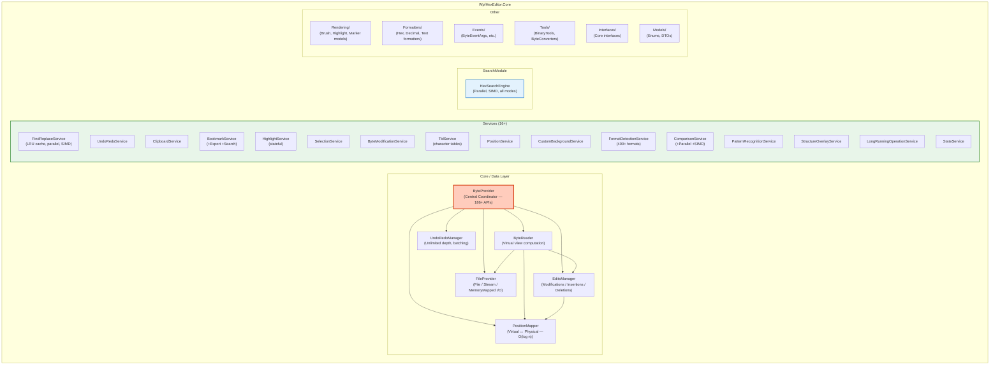
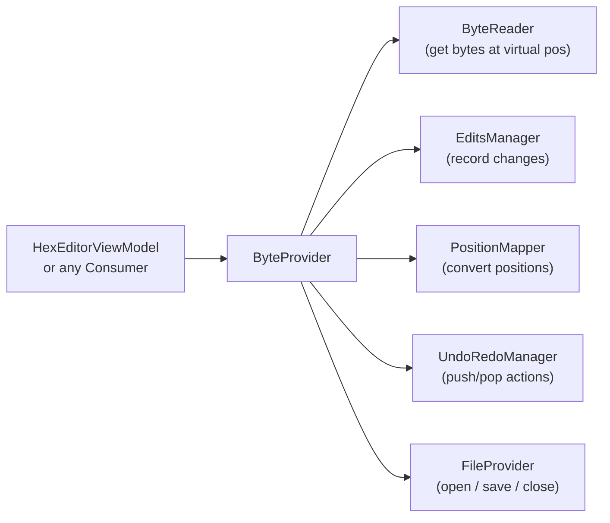
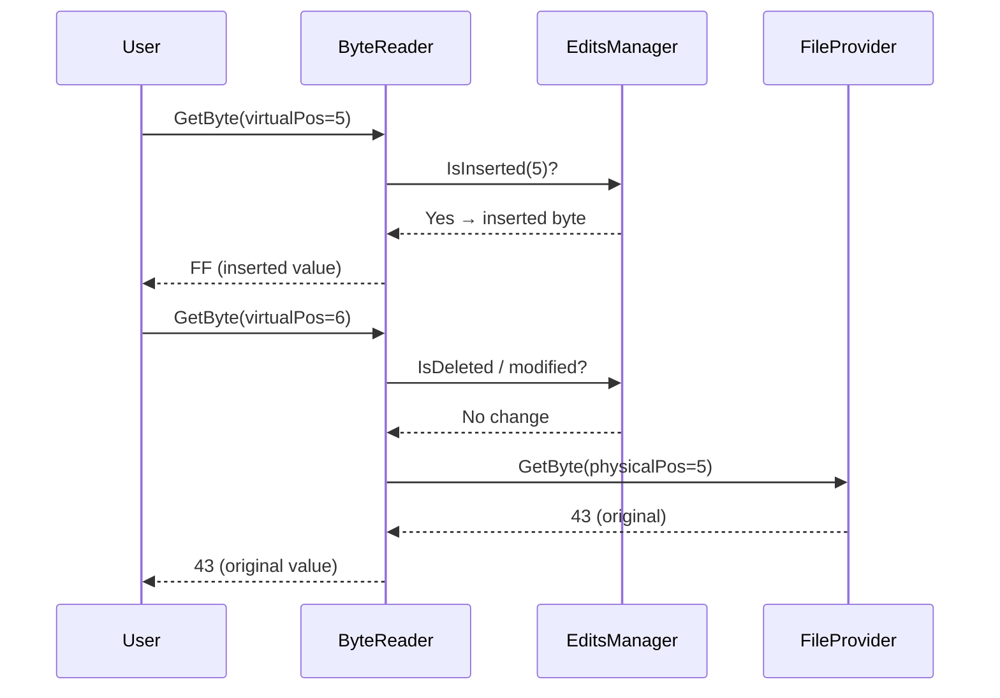
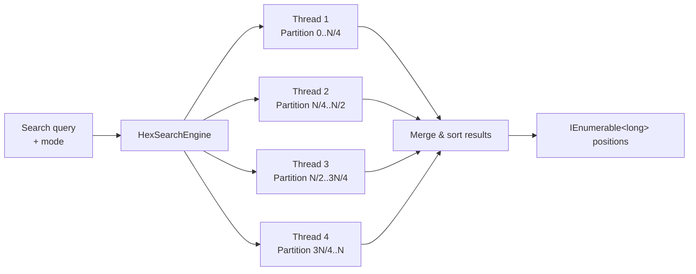

# WpfHexEditor.Core

> Data access layer and service library powering the WpfHexEditor ecosystem — ByteProvider, 16+ services, search engine, rendering models, and format detection.

[](https://dotnet.microsoft.com/)
[](../../LICENSE)

---

## Architecture



---

## Project Structure

```
WpfHexEditor.Core/
├── Core/
│   ├── Bytes/
│   │   ├── ByteProvider.cs          ← Central coordinator (186+ APIs)
│   │   ├── ByteReader.cs            ← Virtual view with edits applied
│   │   ├── EditsManager.cs          ← Track mods / inserts / deletes
│   │   ├── PositionMapper.cs        ← Virtual ↔ physical position (O(log n))
│   │   ├── UndoRedoManager.cs       ← Unlimited undo/redo + batching
│   │   └── FileProvider.cs          ← File / stream / memory-mapped I/O
│   ├── CharacterTable/              ← TBL file format parser
│   ├── Converters/                  ← WPF value converters
│   ├── EventArguments/              ← Custom EventArgs
│   ├── Interfaces/                  ← Core contracts
│   ├── MethodExtention/             ← Extension methods
│   └── Native/                      ← Windows API P/Invoke
│
├── Services/                        ← 16+ specialized services
│   ├── FindReplaceService.cs
│   ├── UndoRedoService.cs
│   ├── ClipboardService.cs
│   ├── BookmarkService.cs
│   ├── BookmarkExportService.cs
│   ├── BookmarkSearchService.cs
│   ├── HighlightService.cs
│   ├── SelectionService.cs
│   ├── ByteModificationService.cs
│   ├── TblService.cs
│   ├── PositionService.cs
│   ├── CustomBackgroundService.cs
│   ├── FormatDetectionService.cs    ← 400+ format signatures
│   ├── ComparisonService.cs
│   ├── ComparisonServiceParallel.cs
│   ├── ComparisonServiceSIMD.cs
│   ├── PatternRecognitionService.cs
│   ├── StructureOverlayService.cs
│   ├── FileDiffService.cs
│   ├── LongRunningOperationService.cs
│   ├── StateService.cs
│   └── VirtualizationService.cs
│
├── SearchModule/                    ← HexSearchEngine (parallel SIMD)
├── Rendering/                       ← Brush / highlight / marker models
├── Formatters/                      ← Hex / decimal / text output
├── Events/                          ← Event argument classes
├── Models/                          ← Enums, DTOs
├── Tools/                           ← BinaryTools, ByteConverters
├── Controls/                        ← Shared WPF controls
├── ViewModels/                      ← Shared view models
└── PartialClasses/                  ← Shared partial class infrastructure
```

---

## ByteProvider — Central API

`ByteProvider` is the single coordinator between all data-layer components. It exposes 186+ methods across categories:



### Key API groups

| Category | Examples |
|----------|---------|
| **File** | `Open(path)`, `OpenStream(stream)`, `Close()`, `SubmitChanges()` |
| **Read** | `GetByte(position)`, `GetBytes(position, count)`, `Length` |
| **Write** | `ModifyByte(position, value)`, `InsertByte(position, value)`, `DeleteByte(position)` |
| **Selection** | `SelectionStart`, `SelectionStop`, `SelectAll()` |
| **Search** | `FindFirst(pattern)`, `FindAll(pattern)`, `CountOccurrences(pattern)` |
| **Undo** | `Undo()`, `Redo()`, `ClearUndoHistory()`, `BeginBatch()`, `EndBatch()` |
| **Bookmarks** | `AddBookmark(position)`, `RemoveBookmark(position)`, `Bookmarks` |
| **State** | `IsModified`, `HasChanges`, `CanUndo`, `CanRedo`, `IsReadOnly` |

---

## Virtual View Pattern

Users always see a **virtual representation** with all pending edits applied. The original file is never modified until `SubmitChanges()`:



---

## Services

### FindReplaceService
- LRU cache for repeated patterns
- Parallel search with thread-pool partitioning
- SIMD vectorization on .NET 8 (AVX2 / SSE2)
- Modes: Hex bytes, Text (UTF-8/16/etc.), Regex, TBL, Wildcard

### FormatDetectionService
- 400+ binary format signatures (magic bytes, header patterns)
- Returns `FormatInfo` with name, confidence, sub-type
- Used by `ParsedFieldsPanel` and IDE toolbar

### ComparisonService
- Three implementations: sequential, parallel, SIMD
- Auto-selects based on file size and runtime capabilities
- Returns `DiffBlock` list for diff navigation

### BookmarkService + BookmarkExportService
- In-memory bookmark collection with position + label + color
- Export to JSON, CSV, or markdown

---

## Search Engine



---

## Performance Characteristics

| File Size | Load Time | Memory | Search |
|-----------|-----------|--------|--------|
| 1 KB | < 1 ms | ~1 MB | < 0.1 ms |
| 10 MB | ~5 ms | ~85 MB | ~10 ms |
| 100 MB | ~12 ms | ~90 MB | ~80 ms |
| 1 GB | ~20 ms | ~95 MB | ~300 ms |

Memory stays near-constant because `ByteProvider` uses memory-mapped I/O — only modified bytes are held in RAM.

---

## Dependencies

`WpfHexEditor.Core` has **zero third-party dependencies**. It only references:
- `WpfHexEditor.HexBox` (hex input controls)
- `WpfHexEditor.ColorPicker` (color selection)
- Standard .NET / WPF assemblies

---

## License

GNU Affero General Public License v3.0 — Copyright 2016–2026 Derek Tremblay. See [LICENSE](../../LICENSE).
