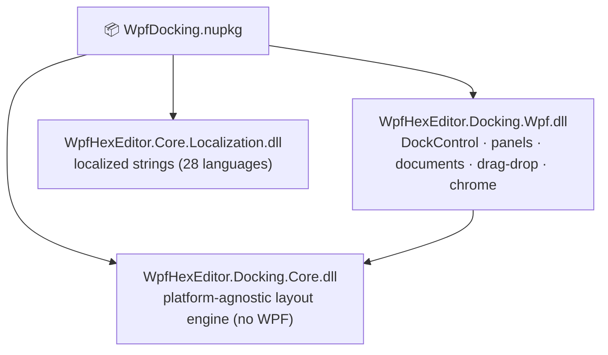
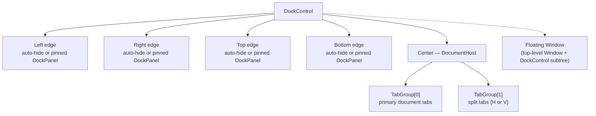

# WpfDocking — Documentation

## Table of Contents

1. [Architecture](#architecture)
2. [API Reference](#api-reference)
3. [Integration Guide — Level 1: Basic Setup](#level-1-basic-setup)
4. [Integration Guide — Level 2: Panels & Documents](#level-2-panels--documents)
5. [Integration Guide — Level 3: Tab Groups & Split View](#level-3-tab-groups--split-view)
6. [Integration Guide — Level 4: Layout Persistence](#level-4-layout-persistence)
7. [Settings Reference](#settings-reference)

---

## Architecture

### Assembly structure



Zero external NuGet dependencies. All assemblies are bundled inside the package.

### Type ownership

| Type | Assembly | Purpose |
|---|---|---|
| `DockControl` | Docking.Wpf | Main container — hosts all panels, documents and tab groups |
| `DockWorkspace` | Docking.Wpf | Layout / session manager — save/load JSON layout |
| `DockPanel` | Docking.Wpf | Tool panel base — dockable to any edge or floating |
| `DockDocument` | Docking.Wpf | Document tab base — lives in the center document host |
| `DockTabGroup` | Docking.Wpf | Split document area — horizontal or vertical group |
| `ITabGroupService` | Docking.Wpf | SDK contract for tab group creation and management |
| `DockGroupBadge` | Docking.Wpf | Numeric badge overlay on panel/group tab headers |
| `DockLayoutSerializer` | Docking.Core | JSON serialization / deserialization of layout state |
| `LayoutNode` | Docking.Core | Immutable tree node — layout snapshot used for persistence |

### Layout model



Floating windows are top-level `Window` instances that each host a `DockControl` subtree.

### Thread safety

- All layout and rendering runs on the WPF UI thread.
- `DockLayoutSerializer` is stateless and thread-safe for read operations.
- `ITabGroupService` must be called from the UI thread.

---

## API Reference

### DockControl

```csharp
// Add a tool panel to an edge
void AddPanel(DockPanel panel, DockSide side);          // Left | Right | Top | Bottom
void RemovePanel(DockPanel panel);

// Add a document tab to the active tab group
void AddDocument(DockDocument document);
void RemoveDocument(DockDocument document);
void ActivateDocument(DockDocument document);

// Tab group split
ITabGroupService TabGroups { get; }

// Active document
DockDocument? ActiveDocument { get; }
event EventHandler<DockDocument?>? ActiveDocumentChanged;
```

### DockWorkspace

```csharp
// Content factory — required before loading a layout
IContentFactory? ContentFactory { get; set; }

// Persist layout
Task SaveLayoutAsync(string filePath);
Task LoadLayoutAsync(string filePath);

// In-memory snapshot
LayoutNode CaptureLayout();
void RestoreLayout(LayoutNode layout);
```

### ITabGroupService

```csharp
// Split the active group
DockTabGroup SplitHorizontal();   // side-by-side columns
DockTabGroup SplitVertical();     // top-bottom rows

// Move active document to another group
void MoveToGroup(DockDocument document, DockTabGroup target);

// Close a group (documents moved to remaining group)
void CloseGroup(DockTabGroup group);

IReadOnlyList<DockTabGroup> Groups { get; }
DockTabGroup                ActiveGroup { get; }
event EventHandler?         GroupsChanged;
```

### DockPanel

```csharp
string   Title    { get; set; }
ImageSource? Icon { get; set; }
DockSide DefaultSide { get; set; }   // initial placement
bool     IsAutoHide  { get; set; }   // collapse to edge bar

// Badge
int  BadgeCount   { get; set; }      // 0 = hidden
bool BadgeVisible { get; }
```

### DockDocument

```csharp
string   Title    { get; set; }
bool     IsDirty  { get; set; }      // shows dot on tab
ImageSource? Icon { get; set; }

// Close guard
event EventHandler<CancelEventArgs>? Closing;
bool CanClose { get; set; }
```

---

## Level 1: Basic Setup

### 1 — Install

```
dotnet add package WpfDocking
```

### 2 — Add namespace and control

```xml
<Window
    xmlns:dock="clr-namespace:WpfHexEditor.Shell;assembly=WpfHexEditor.Docking.Wpf">

    <dock:DockControl x:Name="DockHost" />
```

No resource dictionary merge is required. The framework is self-contained.

### 3 — VS Code-style borderless window

```xml
<Window WindowStyle="None">
    <WindowChrome.WindowChrome>
        <WindowChrome ResizeBorderThickness="4" CaptionHeight="32" />
    </WindowChrome.WindowChrome>
    <dock:DockControl x:Name="DockHost" />
</Window>
```

### 4 — Add initial panels

```csharp
using WpfHexEditor.Shell;

DockHost.AddPanel(new SolutionExplorerPanel(), DockSide.Left);
DockHost.AddPanel(new OutputPanel(),           DockSide.Bottom);
DockHost.AddDocument(new WelcomeDocument());
```

---

## Level 2: Panels & Documents

### Tool panel

```csharp
public class SolutionExplorerPanel : DockPanel
{
    public SolutionExplorerPanel()
    {
        Title       = "Solution Explorer";
        DefaultSide = DockSide.Left;
        Content     = new SolutionExplorerView();
    }
}
```

### Document tab

```csharp
public class CodeDocument : DockDocument
{
    public CodeDocument(string filePath)
    {
        Title   = Path.GetFileName(filePath);
        IsDirty = false;
        Content = new CodeEditorSplitHost();
    }
}
```

### Auto-hide (collapse to edge)

```csharp
panel.IsAutoHide = true;
// Panel collapses to the edge bar; expands on hover or click.
```

### Badge on tab header

```csharp
panel.BadgeCount = 3;   // shows "3" bubble on the tab
panel.BadgeCount = 0;   // hides the badge
```

### Floating window

Drag any panel title bar away from the dock host to float it. Drag it back over a drop target to re-dock. All drop positions show VS-style overlay indicators (top / bottom / left / right / center / tab-stack).

---

## Level 3: Tab Groups & Split View

### Split the document area

```csharp
// Keyboard shortcuts: Ctrl+Alt+→ (horizontal) / Ctrl+Alt+↓ (vertical)
ITabGroupService tgs = DockHost.TabGroups;

DockTabGroup right  = tgs.SplitHorizontal();   // side-by-side
DockTabGroup bottom = tgs.SplitVertical();      // top-bottom
```

### Move a document between groups

```csharp
tgs.MoveToGroup(myDocument, right);
```

### Close a tab group

```csharp
tgs.CloseGroup(right);   // documents are merged back to the remaining group
```

### React to group changes

```csharp
tgs.GroupsChanged += (_, _) =>
{
    Console.WriteLine($"Groups: {tgs.Groups.Count}, Active: {tgs.ActiveGroup}");
};
```

### Tab group badge

Each `DockTabGroup` tab header shows a document-count badge automatically when there is more than one group. Use `TG_BadgeBrush` to theme the badge color.

---

## Level 4: Layout Persistence

### Implement IContentFactory

`DockLayoutSerializer` stores panel/document type names in JSON. On restore it calls your factory to recreate instances.

```csharp
public class MyContentFactory : IContentFactory
{
    public DockPanel?   CreatePanel   (string typeKey) => typeKey switch
    {
        "SolutionExplorer" => new SolutionExplorerPanel(),
        "Output"           => new OutputPanel(),
        _                  => null
    };

    public DockDocument? CreateDocument(string typeKey, string contentId) => typeKey switch
    {
        "CodeFile" => new CodeDocument(contentId),
        _          => null
    };
}
```

### Save and restore

```csharp
DockWorkspace.ContentFactory = new MyContentFactory();

// Save on exit
await DockWorkspace.SaveLayoutAsync("layout.json");

// Restore on startup
await DockWorkspace.LoadLayoutAsync("layout.json");
```

### In-memory snapshot (undo layout changes)

```csharp
LayoutNode snapshot = DockWorkspace.CaptureLayout();

// ... user rearranges panels ...

DockWorkspace.RestoreLayout(snapshot);   // revert
```

---

## Settings Reference

### Corner style

```csharp
DockHost.CornerStyle = DockCornerStyle.Round;   // Sharp | Soft | Round
// Live refresh — no restart required.
```

### Theme

Runtime switching via `DynamicResource`. Override keys in your `ResourceDictionary`:

```xml
<!-- Tab group tokens (TG_*) -->
<SolidColorBrush x:Key="TG_ActiveTabBrush"    Color="#1E1E1E" />
<SolidColorBrush x:Key="TG_InactiveTabBrush"  Color="#2D2D2D" />
<SolidColorBrush x:Key="TG_SplitterBrush"     Color="#3F3F46" />
<SolidColorBrush x:Key="TG_BadgeBrush"        Color="#0078D4" />

<!-- Panel tokens -->
<SolidColorBrush x:Key="DOCK_PanelBackground"    Color="#252526" />
<SolidColorBrush x:Key="DOCK_TabActiveForeground" Color="#FFFFFF" />
<SolidColorBrush x:Key="DOCK_AutoHideBackground"  Color="#2D2D2D" />
```

### DockControl properties

| Property | Type | Default | Description |
|---|---|---|---|
| `CornerStyle` | `DockCornerStyle` | `Soft` | Tab corner rounding (Sharp / Soft / Round) |
| `ShowTabGroupBadge` | `bool` | `true` | Document-count badge on group headers |
| `AllowFloating` | `bool` | `true` | Allow panels to be undocked to floating windows |
| `AllowAutoHide` | `bool` | `true` | Allow panels to collapse to edge bar |
| `TabStripPlacement` | `Dock` | `Top` | Tab strip position for document host |
