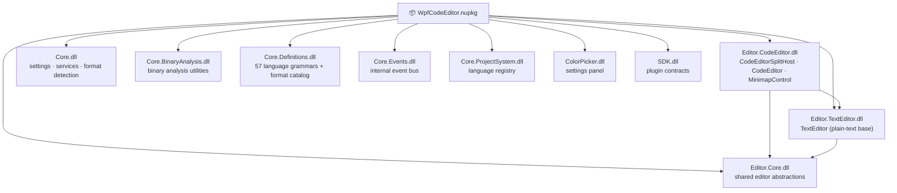
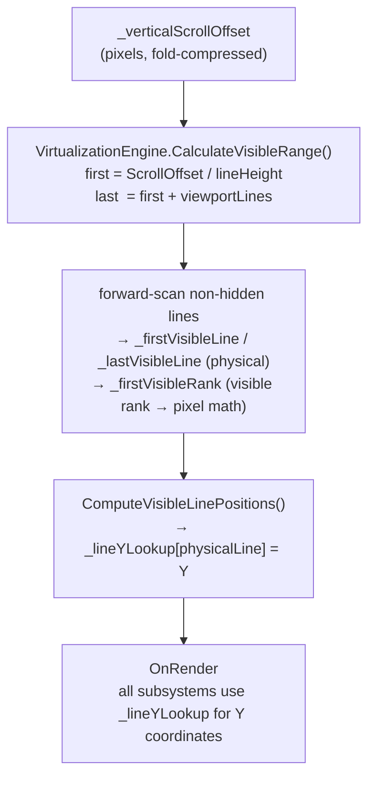

# WpfCodeEditor — Documentation

## Table of Contents

1. [Architecture](#architecture)
2. [API Reference](#api-reference)
3. [Integration Guide — Level 1: Basic Setup](#level-1-basic-setup)
4. [Integration Guide — Level 2: Language & Syntax](#level-2-language--syntax)
5. [Integration Guide — Level 3: Folding & Navigation](#level-3-folding--navigation)
6. [Integration Guide — Level 4: LSP & Diagnostics](#level-4-lsp--diagnostics)
7. [The .whfmt Format](#the-whfmt-format)
8. [Settings Reference](#settings-reference)

---

## Architecture

### Assembly structure



Zero external NuGet dependencies. All assemblies are bundled inside the package.

### Type ownership

| Type | Assembly | Purpose |
|---|---|---|
| `CodeEditorSplitHost` | Editor.CodeEditor | Main entry point — hosts primary + optional secondary editor, minimap, split view |
| `CodeEditor` | Editor.CodeEditor | Single editor pane — all rendering, input, folding, LSP |
| `TextEditor` | Editor.TextEditor | Lightweight plain-text editor (no syntax, no folding) |
| `MinimapControl` | Editor.CodeEditor | VS Code-style overview minimap |
| `FoldingEngine` | Editor.CodeEditor | Manages fold regions and hidden-line set |
| `IFoldingStrategy` | Editor.CodeEditor | Pluggable fold analysis interface |
| `CodeDocument` | Editor.Core | Document model — lines, tokens, dirty state |
| `LanguageDefinition` | Core.ProjectSystem | Parsed .whfmt record |
| `IEditorPersistable` | Editor.Core | Session save/restore contract |

### Scroll and virtualization model



Hidden lines are tracked in `FoldingEngine._hiddenLines` (HashSet — O(1) lookup). The scrollbar `Maximum` is reduced by `TotalHiddenLineCount * lineHeight` so the scroll space is always fold-compressed.

### Thread safety

- All rendering and input handling runs on the WPF UI thread.
- LSP operations are dispatched to background threads; results are marshalled back via `Dispatcher.BeginInvoke`.
- `FoldingEngine` is not thread-safe — call only from the UI thread.

---

## API Reference

### CodeEditorSplitHost

The recommended entry point. Hosts one or two `CodeEditor` panes with optional minimap.

```csharp
// Core
CodeEditor PrimaryEditor { get; }
CodeEditor SecondaryEditor { get; }
bool IsDirty { get; }
Task SaveAsync();
void SetLanguage(LanguageDefinition? lang);

// Layout
bool ShowMinimap { get; set; }
bool ShowLineNumbers { get; set; }
bool MinimapRenderCharacters { get; set; }
MinimapSide MinimapSide { get; set; }
void OpenSplitView(Orientation orientation);
void CloseSplitView();

// Session persistence (implement IEditorPersistable on your host)
EditorConfigDto GetEditorConfig();        // caret, scroll, fold state, word-wrap
void ApplyEditorConfig(EditorConfigDto);  // restore on reopen
```

### CodeEditor

```csharp
// Content
void LoadText(string text);
void LoadText(IEnumerable<string> lines);
string Text { get; }
CodeDocument? Document { get; }

// Language
LanguageDefinition? GetLanguageForExtension(string ext);
ISyntaxHighlighter? ActiveHighlighter { get; }
FoldingEngine? FoldingEngine { get; }          // fold regions + hidden-line set

// Cursor & selection
int CursorLine { get; set; }
int CursorColumn { get; set; }
void ScrollToLine(int line);

// Folding
void CollapseAll();
void ExpandAll();

// Settings (DependencyProperties — bindable)
bool ShowScopeGuides { get; set; }
bool ShowInlineHints { get; set; }
bool IsWordWrapEnabled { get; set; }
bool ShowMinimap { get; set; }
bool EnableValidation { get; set; }
bool RainbowScopeGuidesEnabled { get; set; }
bool BracketPairColorizationEnabled { get; set; }

// Events
event EventHandler? MinimapRefreshRequested;
event EventHandler<ValidationErrorsChangedEventArgs>? DiagnosticsChanged;
```

### FoldingEngine

```csharp
IReadOnlyList<FoldingRegion> Regions { get; }
int TotalHiddenLineCount { get; }          // O(1) — pre-computed HashSet
bool IsLineHidden(int line);               // O(1)
bool ToggleRegion(int startLine);          // fires RebuildHiddenSet + RegionsChanged
void CollapseAll();
void ExpandAll();
event EventHandler? RegionsChanged;
```

### FoldingRegion

```csharp
int StartLine { get; }      // 0-based, opener line
int EndLine   { get; }      // 0-based, closer line
bool IsCollapsed { get; set; }
int HiddenLineCount { get; }            // EndLine - StartLine - 1
string? Name { get; }                   // set by #region directives
FoldingRegionKind Kind { get; }         // Brace | Directive | Tag | Indent | Heading
```

---

## Level 1: Basic Setup

Minimum working integration — editor in a WPF window.

### 1 — Install

```
dotnet add package WpfCodeEditor
```

### 2 — Merge the resource dictionary

```xml
<!-- App.xaml -->
<Application.Resources>
    <ResourceDictionary>
        <ResourceDictionary.MergedDictionaries>
            <ResourceDictionary Source="pack://application:,,,/WpfHexEditor.Editor.CodeEditor;component/Themes/Generic.xaml" />
        </ResourceDictionary.MergedDictionaries>
    </ResourceDictionary>
</Application.Resources>
```

### 3 — Add namespace and control

```xml
<Window
    xmlns:ce="clr-namespace:WpfHexEditor.Editor.CodeEditor.Controls;assembly=WpfHexEditor.Editor.CodeEditor">

    <ce:CodeEditorSplitHost x:Name="Editor" />
```

### 4 — Load content

```csharp
Editor.PrimaryEditor.LoadText(File.ReadAllText("Program.cs"));
```

### 5 — Read back

```csharp
string text  = Editor.PrimaryEditor.Text;
bool isDirty = Editor.IsDirty;
await Editor.SaveAsync();
```

---

## Level 2: Language & Syntax

### Apply syntax highlighting from extension

```csharp
var lang = Editor.PrimaryEditor.GetLanguageForExtension(".cs");
Editor.SetLanguage(lang);
```

### Load file with auto-detect

```csharp
await Editor.PrimaryEditor.OpenAsync(filePath);
// Language is resolved automatically from the file extension via the embedded catalog.
```

### Apply an external highlighter

```csharp
// Implement ISyntaxHighlighter for a custom grammar
Editor.PrimaryEditor.ExternalHighlighter = new MyHighlighter();
```

### Theme tokens

All syntax colors resolve through WPF resource keys (`CE_Keyword`, `CE_String`, `CE_Comment`, etc.). Override them in your `ResourceDictionary` to apply a custom theme:

```xml
<SolidColorBrush x:Key="CE_Keyword" Color="#569CD6" />
<SolidColorBrush x:Key="CE_String"  Color="#CE9178" />
<SolidColorBrush x:Key="CE_Comment" Color="#6A9955" />
```

---

## Level 3: Folding & Navigation

### Fold state control

```csharp
// Collapse / expand all
Editor.PrimaryEditor.CollapseAll();
Editor.PrimaryEditor.ExpandAll();

// Toggle a specific region by its opener line (0-based)
Editor.PrimaryEditor.FoldingEngine?.ToggleRegion(line);

// Read current regions
foreach (var r in Editor.PrimaryEditor.FoldingEngine?.Regions ?? [])
    Console.WriteLine($"L{r.StartLine}–{r.EndLine} collapsed={r.IsCollapsed}");
```

### Session persistence — save and restore fold state

Implement `IEditorPersistable` on your document host:

```csharp
// Save (called by the IDE on tab close / app exit)
var config = ((IEditorPersistable)editor).GetEditorConfig();
// config.Extra["foldedLines"] = "12,45,78"  — comma-separated 0-based start lines

// Restore (called when tab is reopened)
((IEditorPersistable)editor).ApplyEditorConfig(config);
// Fold restore is deferred to the first RegionsChanged event so analysis has completed.
```

### Minimap

```csharp
Editor.ShowMinimap = true;
Editor.MinimapRenderCharacters = true;   // per-token colored blocks vs single rect per line
Editor.MinimapSide = MinimapSide.Right;  // Left or Right
```

The minimap is fold-aware: hidden lines are skipped during rendering and the viewport slider reflects the compressed scroll space. It subscribes directly to `FoldingEngine.RegionsChanged` and redraws on each fold toggle.

### Scope guides

```csharp
Editor.PrimaryEditor.ShowScopeGuides = true;
Editor.PrimaryEditor.RainbowScopeGuidesEnabled = true;   // depth-colored guides
Editor.PrimaryEditor.BracketPairColorizationEnabled = true;
```

Guide lines are driven by `FoldingRegion` objects — no text parsing at render time. Guides for regions inside collapsed parents are automatically excluded.

### Navigation

```csharp
// Scroll to line (0-based)
Editor.PrimaryEditor.ScrollToLine(42);

// Go to line dialog (Ctrl+G)
Editor.PrimaryEditor.ShowGotoLineDialog();
```

---

## Level 4: LSP & Diagnostics

### Connect a language server

```csharp
// Implement ILanguageServerHost and assign before opening the file
Editor.PrimaryEditor.LanguageServerHost = new RoslynLanguageServerHost(solutionPath);
```

### Push diagnostics manually

```csharp
var errors = new List<ValidationError>
{
    new(line: 5, column: 3, length: 10, message: "CS0246: type not found",
        severity: ValidationSeverity.Error)
};
Editor.PrimaryEditor.SetValidationErrors(errors);
```

Diagnostic scroll-bar ticks and squiggle underlines are automatically repositioned when folding changes.

### React to diagnostic changes

```csharp
Editor.PrimaryEditor.DiagnosticsChanged += (_, e) =>
{
    int errors   = e.Errors.Count;
    int warnings = e.Warnings.Count;
    StatusBar.Text = $"{errors} error(s), {warnings} warning(s)";
};
```

### End-of-block hover popup

Controlled per language via `.whfmt`:

```jsonc
"endOfBlockHint": {
    "enabled": true,
    "maxContextLines": 3,
    "showLineNumber": true,    // show "Line N" pill
    "showLineCount": true      // show "N lines" pill
}
```

---

## The .whfmt Format

Language definitions are JSON-with-comments files embedded in `WpfHexEditor.Core.Definitions`. Each file drives: syntax highlighting, folding strategy, comment tokens, bracket pairs, end-of-block hints, column rulers, and LSP routing.

### Minimal example

```jsonc
{
    "name": "MyLang",
    "extensions": [".ml"],
    "lineComment": "//",
    "blockCommentStart": "/*",
    "blockCommentEnd":   "*/",

    "foldingRules": {
        "startPatterns": ["\\{"],
        "endPatterns":   ["\\}"]
    }
}
```

### Folding rules

```jsonc
"foldingRules": {
    "startPatterns": ["\\{"],          // regex — lines that open a block
    "endPatterns":   ["\\}"],          // regex — lines that close a block
    "endOfBlockHint": {
        "enabled": true,
        "maxContextLines": 3,
        "showLineNumber": true,
        "showLineCount": true
    }
}
```

`PatternFoldingStrategy` counts net opens/closes per line (not boolean), so lines with both `{` and `}` (e.g. `is { } x`, single-line object initializers) are handled correctly. Multi-line block comments are tracked via `blockCommentStart` / `blockCommentEnd` so comment content does not generate phantom fold regions.

### Syntax tokens

```jsonc
"keywords":    ["class", "void", "if", "return"],
"types":       ["int", "string", "bool"],
"builtins":    ["Console", "Math"],
"operators":   ["+", "-", "=>"],
"brackets":    [["(", ")"], ["[", "]"], ["{", "}"]],
"stringDelimiters": ["\"", "'", "`"]
```

### Column rulers

```jsonc
"columnRulers": [80, 120]
```

Draws vertical guide lines at columns 80 and 120.

---

## Settings Reference

All settings are `DependencyProperty` on `CodeEditor` — bindable in XAML or set from code.

| Property | Type | Default | Description |
|---|---|---|---|
| `ShowScopeGuides` | `bool` | `true` | Vertical indent guide lines |
| `RainbowScopeGuidesEnabled` | `bool` | `false` | Depth-colored guides |
| `BracketPairColorizationEnabled` | `bool` | `true` | Rainbow bracket colors |
| `ShowInlineHints` | `bool` | `true` | LSP code-lens / declaration hints |
| `IsWordWrapEnabled` | `bool` | `false` | Soft word wrap |
| `ShowLineNumbers` | `bool` | `true` | Line number gutter |
| `EnableValidation` | `bool` | `true` | Squiggle underlines + scroll ticks |
| `SmoothScrolling` | `bool` | `true` | Animated scroll interpolation |
| `ShowMinimap` | `bool` | `false` | Overview minimap panel |
| `TabSize` | `int` | `4` | Tab → spaces expansion width |
| `FontSize` | `double` | `13` | Editor font size |
| `ReadOnly` | `bool` | `false` | Block edits; selection and copy still work |

### Persist settings to JSON

```csharp
// Export
string json = CodeEditorDefaultSettings.ExportToJson();
File.WriteAllText("editor-settings.json", json);

// Import
CodeEditorDefaultSettings.ImportFromJson(File.ReadAllText("editor-settings.json"));
```
