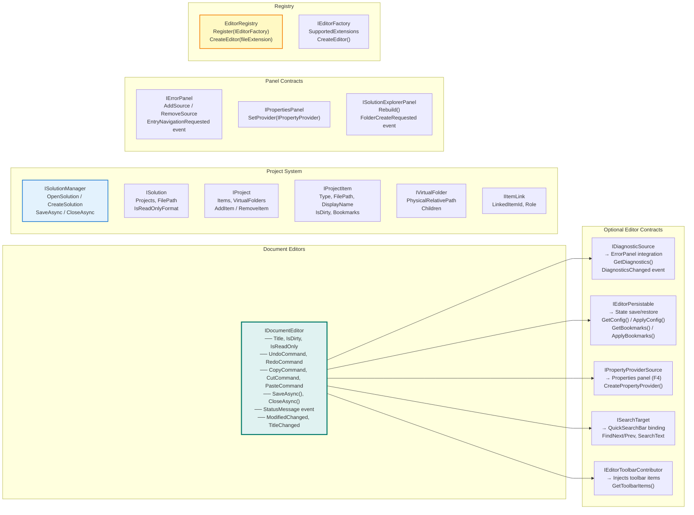

# WpfHexEditor.Editor.Core

> Plugin contracts library — `IDocumentEditor`, `IDiagnosticSource`, `ISolutionManager`, and 25+ interfaces that keep every editor, panel, and the project system fully decoupled.

[](https://dotnet.microsoft.com/)
[](../../LICENSE)

---

## Purpose

`WpfHexEditor.Editor.Core` is a **contract-only library** — it contains interfaces, DTOs, enums, and the editor registry. It has no WPF UI code (except `ICommand` declarations).

By depending only on this library, editors and panels remain fully decoupled:
- `WpfHexEditor.HexEditor` implements `IDocumentEditor` without knowing about the IDE
- `WpfHexEditor.Panels.IDE.ErrorPanel` subscribes to `IDiagnosticSource` without knowing about HexEditor
- `WpfHexEditor.ProjectSystem` implements `ISolutionManager` without knowing about any editor

---

## Interface Map



---

## Project Structure

```
WpfHexEditor.Editor.Core/
│
├── ─── Document Editor ───────────────────────────────────────────
├── IDocumentEditor.cs
├── IEditorDescriptor.cs
├── IEditorFactory.cs
├── IEditorRegistry.cs
├── IEditorToolbarContributor.cs
├── IOpenableDocument.cs
├── EditorRegistry.cs              ← Singleton registry
│
├── ─── Editor Optional Contracts ─────────────────────────────────
├── IDiagnosticSource.cs
├── IEditorPersistable.cs
├── IPropertyProvider.cs
├── IPropertyProviderSource.cs
├── ISearchTarget.cs
├── IEmbeddedFormatCatalog.cs
├── IFileValidator.cs
├── IStatusBarContributor.cs
│
├── ─── Panel Contracts ───────────────────────────────────────────
├── IErrorPanel.cs
├── IPropertiesPanel.cs
├── ISolutionExplorerPanel.cs
│
├── ─── Project System ────────────────────────────────────────────
├── ISolutionManager.cs
├── ISolution.cs
├── IProject.cs
├── IProjectItem.cs
├── IVirtualFolder.cs
├── IItemLink.cs
├── SolutionEvents.cs
│
├── ─── DTOs ──────────────────────────────────────────────────────
├── EditorConfigDto.cs             ← State (encoding, caret, scroll, bookmarks)
├── BookmarkDto.cs                 ← Bookmark (position, label, color, group)
├── DocumentOperationEventArgs.cs
│
├── ─── Models ────────────────────────────────────────────────────
├── DiagnosticEntry.cs             ← sealed record (Severity, Code, Description…)
├── DiagnosticSeverity.cs          ← Error / Warning / Message
├── ErrorPanelScope.cs             ← Solution / CurrentProject / CurrentDocument
├── FileSaveMode.cs
├── GameRomHint.cs
├── ProjectItemType.cs             ← Binary / Tbl / Json / Text / Script / …
├── ProjectItemTypeHelper.cs
├── PropertyEntry.cs               ← Properties panel row model
├── PropertyEntryType.cs
├── PropertyGroup.cs
├── StatusBarItem.cs
│
├── ─── ViewModels ────────────────────────────────────────────────
├── ViewModels/
│
├── ─── Views ─────────────────────────────────────────────────────
└── Views/
```

---

## IDocumentEditor

The core contract every editor must implement:

```csharp
public interface IDocumentEditor
{
    // State
    string  Title     { get; }
    bool    IsDirty   { get; }
    bool    IsReadOnly { get; }

    // Commands (bind to Edit menu)
    ICommand UndoCommand  { get; }
    ICommand RedoCommand  { get; }
    ICommand CopyCommand  { get; }
    ICommand CutCommand   { get; }
    ICommand PasteCommand { get; }

    // Operations
    Task SaveAsync(string? path = null);
    Task CloseAsync();

    // Events
    event EventHandler<string>? StatusMessage;
    event EventHandler?         ModifiedChanged;
    event EventHandler?         TitleChanged;
    event EventHandler?         CanUndoChanged;
    event EventHandler?         CanRedoChanged;
}
```

### Implementing a new editor

```csharp
public class MyEditor : UserControl, IDocumentEditor
{
    public string  Title      => Path.GetFileName(_filePath);
    public bool    IsDirty    => _hasChanges;
    public bool    IsReadOnly => false;

    public ICommand UndoCommand  { get; } = new RelayCommand(Undo, () => CanUndo);
    // … other commands

    public async Task SaveAsync(string? path = null) { /* save logic */ }
    public async Task CloseAsync()                   { /* cleanup */ }

    public event EventHandler<string>? StatusMessage;
    public event EventHandler?         ModifiedChanged;
    // … other events
}
```

### Register the editor factory

```csharp
// At app startup — enables the IDE to open .myext files with MyEditor
EditorRegistry.Instance.Register(new MyEditorFactory());

public class MyEditorFactory : IEditorFactory
{
    public IReadOnlyList<string> SupportedExtensions => [".myext"];
    public IDocumentEditor CreateEditor() => new MyEditor();
}
```

---

## IDiagnosticSource

Connects an editor to the ErrorPanel:

```csharp
public interface IDiagnosticSource
{
    IReadOnlyList<DiagnosticEntry> GetDiagnostics();
    event EventHandler?            DiagnosticsChanged;
}

// DiagnosticEntry (immutable record)
public sealed record DiagnosticEntry(
    DiagnosticSeverity Severity,   // Error / Warning / Message
    string?            Code,       // "TBL001", "JSON002", …
    string?            Description,
    string?            FilePath    = null,
    string?            ProjectName = null,
    long?              Offset      = null,   // → HexEditor navigation
    int?               Line        = null,   // → text editor navigation
    int?               Column      = null,
    object?            Tag         = null    // arbitrary payload (e.g. hex key)
);
```

---

## IEditorPersistable

Persists per-file state across sessions (encoding, scroll position, bookmarks):

```csharp
public interface IEditorPersistable
{
    EditorConfigDto GetConfig();
    void            ApplyConfig(EditorConfigDto config);
    BookmarkDto[]   GetBookmarks();
    void            ApplyBookmarks(BookmarkDto[] bookmarks);
}

// EditorConfigDto fields
public class EditorConfigDto
{
    public string?   EncodingName      { get; set; }
    public string?   SyntaxLanguageId  { get; set; }
    public long      ScrollOffset      { get; set; }
    public int       BytesPerLine      { get; set; }
    public string?   EditModeName      { get; set; }
    public int       CaretLine         { get; set; }   // 1-based
    public int       CaretColumn       { get; set; }   // 1-based
    public int       FirstVisibleLine  { get; set; }
}
```

---

## EditorRegistry

```csharp
// Register at startup
EditorRegistry.Instance.Register(new HexEditorFactory());
EditorRegistry.Instance.Register(new TblEditorFactory());
EditorRegistry.Instance.Register(new JsonEditorFactory());
EditorRegistry.Instance.Register(new TextEditorFactory());

// Use when opening a file
if (EditorRegistry.Instance.TryGetFactory(".tbl", out var factory))
{
    var editor = factory.CreateEditor();
    dockHost.OpenDocument(editor, item);
}
```

---

## Dependencies

`WpfHexEditor.Editor.Core` depends only on:
- Standard .NET assemblies
- `System.Windows.Input` (for `ICommand`) — requires `<UseWPF>true</UseWPF>` in the `.csproj`

---

## License

GNU Affero General Public License v3.0 — Copyright 2026 Derek Tremblay. See [LICENSE](../../LICENSE).
