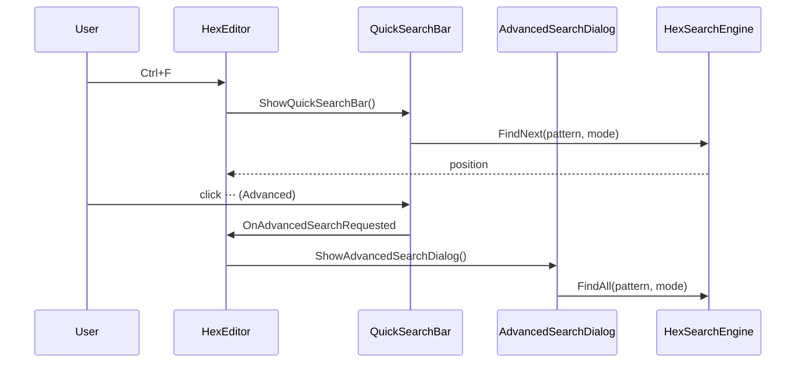

# WpfHexEditor.HexEditor

> Full-featured WPF hex editor UserControl — MVVM, partial-class architecture, inline search, diagnostics, and project-system integration.

[](https://dotnet.microsoft.com/)
[](../../LICENSE)

---

## Architecture

```mermaid
graph TB
    subgraph HexEditor["WpfHexEditor.HexEditor"]
        HE["HexEditor (UserControl)\nHexEditor.xaml / HexEditor.xaml.cs"]

        subgraph PC_CORE["PartialClasses / Core"]
            EV["HexEditor.Events.cs"]
            FO["HexEditor.FileOperations.cs"]
            SO["HexEditor.StreamOperations.cs"]
            AO["HexEditor.AsyncOperations.cs"]
            DO["HexEditor.DocumentEditor.cs\n(IDocumentEditor)"]
        end

        subgraph PC_FEAT["PartialClasses / Features"]
            QS["HexEditor.QuickSearch.cs\n(Ctrl+F inline)"]
            PF["HexEditor.ParsedFieldsIntegration.cs"]
            FD["HexEditor.FormatDetection.cs"]
            DS["HexEditor.DiagnosticSource.cs\n(IDiagnosticSource)"]
            PP["HexEditor.PropertyProvider.cs"]
            EP["HexEditor.EditorPersistable.cs\n(IEditorPersistable)"]
        end

        subgraph SM["SearchModule"]
            QSB["QuickSearchBar\n(inline Ctrl+F overlay)"]
            ASD["AdvancedSearchDialog\n(5 modes: Hex/Text/Regex/TBL/Wildcard)"]
        end

        subgraph REND["Rendering"]
            HV["HexViewport\n(DrawingContext — 99% faster)"]
        end

        VM["HexEditorViewModel"]
        SVC_LOCAL["Services/\nEditor-level services"]
    end

    subgraph CORE["WpfHexEditor.Core"]
        BP["ByteProvider"]
        SVCS["16 Services"]
    end

    subgraph ECORE["WpfHexEditor.Editor.Core"]
        IIDE["IDocumentEditor"]
        IDS2["IDiagnosticSource"]
        IST["ISearchTarget"]
    end

    HE --> PC_CORE
    HE --> PC_FEAT
    HE --> QSB
    HE --> ASD
    HE --> HV
    HE --> VM
    VM --> BP
    VM --> SVCS
    DO --> IIDE
    DS --> IDS2
    QS --> IST

    style HE fill:#fff9c4,stroke:#f57c00,stroke-width:3px
    style BP fill:#ffccbc,stroke:#d84315,stroke-width:2px
    style IIDE fill:#e0f2f1,stroke:#00796b,stroke-width:2px
```



---

## Project Structure

```
WpfHexEditor.HexEditor/
├── HexEditor.xaml                     ← Main UserControl XAML
├── HexEditor.xaml.cs                  ← Entry point (partial class)
│
├── PartialClasses/
│   ├── Core/
│   │   ├── HexEditor.Events.cs        ← DependencyProperty declarations + events
│   │   ├── HexEditor.FileOperations.cs
│   │   ├── HexEditor.StreamOperations.cs
│   │   ├── HexEditor.AsyncOperations.cs
│   │   └── HexEditor.EditOperations.cs
│   └── Features/
│       ├── HexEditor.QuickSearch.cs   ← Ctrl+F / F3 / inline bar API
│       ├── HexEditor.ParsedFieldsIntegration.cs
│       ├── HexEditor.FormatDetection.cs
│       ├── HexEditor.DocumentEditor.cs  ← IDocumentEditor implementation
│       ├── HexEditor.DiagnosticSource.cs
│       ├── HexEditor.EditorPersistable.cs
│       └── HexEditor.PropertyProvider.cs
│
├── SearchModule/
│   └── Views/
│       ├── QuickSearchBar.xaml(.cs)   ← Inline search overlay (Canvas-based)
│       └── AdvancedSearchDialog.xaml(.cs)
│
├── Rendering/
│   └── HexViewport.cs                ← Custom DrawingContext rendering
│
├── ViewModels/
│   └── HexEditorViewModel.cs
│
├── Services/                         ← Editor-level services
├── Commands/                         ← ICommand implementations
├── Controls/                         ← Embedded sub-controls
├── Converters/                       ← WPF value converters
└── Settings/                         ← Editor settings model
```

---

## Key Features

| Category | Features |
|----------|---------|
| **File I/O** | Open file/stream, async operations, memory-mapped I/O for GB+ files |
| **Editing** | Insert / overwrite mode, multi-byte fill, paste hex/text/binary |
| **Search** | Inline Ctrl+F (5 modes), Advanced dialog (5 modes), F3/Shift+F3, regex |
| **Undo/Redo** | Unlimited depth via `UndoRedoService`, batched operations |
| **Bookmarks** | Add/remove/navigate, persistent via `IEditorPersistable` |
| **TBL** | Custom character table support for ROM hacking |
| **Highlights** | Custom background blocks, selection, bookmarks markers |
| **Diagnostics** | `IDiagnosticSource` → live feed to ErrorPanel |
| **Format** | 400+ format auto-detection, parsed fields, structure overlay |
| **IDocumentEditor** | Title, IsDirty (`*`), Undo/Redo/Copy/Cut/Paste commands, SaveAsync |

---

## Usage

### XAML

```xml
<Window xmlns:hex="clr-namespace:WpfHexEditor.HexEditor;assembly=WpfHexEditor.HexEditor">

    <hex:HexEditor x:Name="HexEdit"
                   BytePerLine="16"
                   ReadOnlyMode="False"
                   ShowStatusBar="False" />
</Window>
```

### Code-behind

```csharp
// Open a file
HexEdit.FileName = @"C:\data\firmware.bin";

// Or open a stream
HexEdit.Stream = File.OpenRead("data.bin");

// Search (inline bar)
HexEdit.ShowQuickSearchBar();        // Ctrl+F
HexEdit.ShowAdvancedSearchDialog();  // Ctrl+Shift+F

// Bookmarks
HexEdit.AddBookmark(0x1000);
HexEdit.SetPosition(0x1000);

// Undo / Redo
HexEdit.Undo();
HexEdit.Redo();

// Save
await HexEdit.SubmitChangesAsync();

// TBL
HexEdit.OpenTblEditor();             // fires TblEditorRequested event
```

### Plugin editor integration

```csharp
// HexEditor implements IDocumentEditor — use directly in DockHost
var item = new DockItem { Title = Path.GetFileName(path), ContentId = "doc-" + path };
dockHost.OpenDocument(hexEditor, item);

// Dirty flag updates tab title automatically (DockItem.Title INPC)
hexEditor.ModifiedChanged += (_, _) =>
    item.Title = Path.GetFileName(path) + (hexEditor.IsDirty ? " *" : "");
```

---

## Search Architecture



---

## Performance

| Metric | V1 (ItemsControl) | V2 (DrawingContext) | Improvement |
|--------|------------------|---------------------|-------------|
| Load 1 000 lines | ~450 ms | ~5 ms | **99% faster** |
| Memory (10 MB file) | ~950 MB | ~85 MB | **91% less** |
| Scroll FPS | ~15 fps | 60+ fps | **4× smoother** |
| Search (1 GB file) | ~30 s | ~300 ms | **100× faster** |

---

## Dependencies

| Project | Why |
|---------|-----|
| `WpfHexEditor.Core` | ByteProvider, 16 services, data layer |
| `WpfHexEditor.Editor.Core` | IDocumentEditor, IDiagnosticSource, ISearchTarget |
| `WpfHexEditor.ColorPicker` | Color selection in bookmark/highlight dialogs |
| `WpfHexEditor.HexBox` | Hex input fields in search dialogs |

---

## License

GNU Affero General Public License v3.0 — Copyright 2016–2026 Derek Tremblay. See [LICENSE](../../LICENSE).
