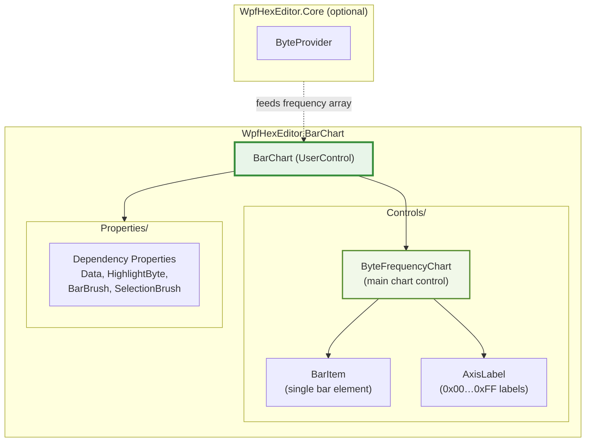

# WpfHexEditor.BarChart

> Standalone byte-frequency bar chart for WPF — visualizes the distribution of all 256 byte values (0x00–0xFF) in a binary file.

[](https://dotnet.microsoft.com/)
[](../../LICENSE)

---

## Architecture



---

## Project Structure

```
WpfHexEditor.BarChart/
├── Controls/
│   ├── BarChart.xaml(.cs)           ← Main UserControl
│   ├── ByteFrequencyChart.xaml(.cs) ← Inner chart (256 bars)
│   └── …
│
└── Properties/
    └── AssemblyInfo.cs
```

---

## Features

| Feature | Description |
|---------|-------------|
| **256 bars** | One bar per byte value (0x00 to 0xFF) |
| **Frequency count** | Bar height proportional to occurrence count |
| **Highlight** | Highlight a specific byte value (e.g. the byte at caret) |
| **Selection** | Click a bar to select/filter that byte value |
| **Zoom** | Scroll to zoom into specific byte ranges |
| **Theme-aware** | Bar colors via DependencyProperty — bind to any brush |
| **Multi-target** | .NET 4.8 and .NET 8.0-windows |

---

## Usage

### XAML

```xml
<Window xmlns:bc="clr-namespace:WpfHexEditor.BarChart.Controls;assembly=WpfHexEditor.BarChart">

    <bc:BarChart x:Name="FreqChart"
                 Data="{Binding FrequencyArray}"
                 HighlightByte="{Binding CurrentByte}"
                 BarBrush="#6B3FA0"
                 SelectionBrush="#FF8C00" />
</Window>
```

### Code-behind

```csharp
// Feed a frequency array (256 longs — one per byte value)
var freq = new long[256];
foreach (byte b in fileBytes)
    freq[b]++;

FreqChart.Data = freq;

// Highlight the byte at caret
FreqChart.HighlightByte = hexEditor.SelectionStart >= 0
    ? hexEditor.GetByte(hexEditor.SelectionStart)
    : (byte?)null;

// React to bar selection
FreqChart.ByteSelected += (s, e) =>
    Console.WriteLine($"User selected byte 0x{e.Value:X2} ({e.Count} occurrences)");
```

### Direct from ByteProvider

```csharp
// WpfHexEditor.Core can compute the frequency array
var freqArray = byteProvider.ComputeByteFrequency();
FreqChart.Data = freqArray;
```

---

## Visual Layout

```
Count
  ▲
  │          ██
  │          ██
  │    ██    ██  ██
  │  ████████████████ …
  └────────────────────► Byte value
    00 01 02 03 04 05 …  FF
```

Each bar represents one byte value. The height is proportional to how many times that byte appears in the loaded data. Hovering shows the exact count and percentage.

---

## IDE Integration

`BarChart` is currently **standalone only** — not yet integrated into the IDE application panels. Planned integration: **File Statistics Panel** (`WpfHexEditor.Panels.BinaryAnalysis`) will embed `BarChart` to show byte frequency alongside entropy analysis.

---

## Dependencies

`WpfHexEditor.BarChart` has no required project dependencies. It can optionally receive a frequency array computed by `WpfHexEditor.Core`.

---

## License

GNU Affero General Public License v3.0 — Copyright 2016–2026 Derek Tremblay. See [LICENSE](../../LICENSE).
