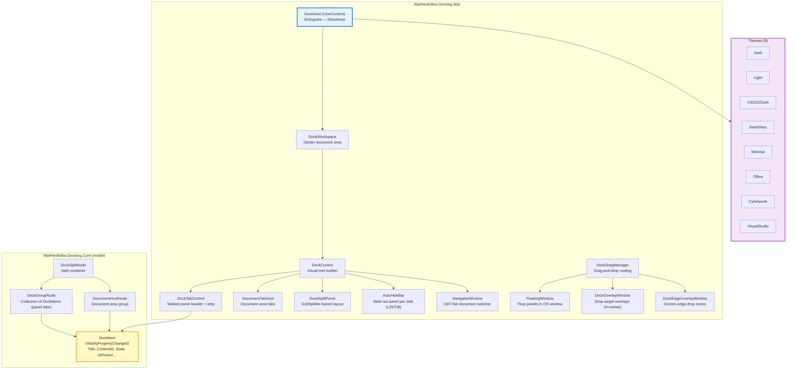
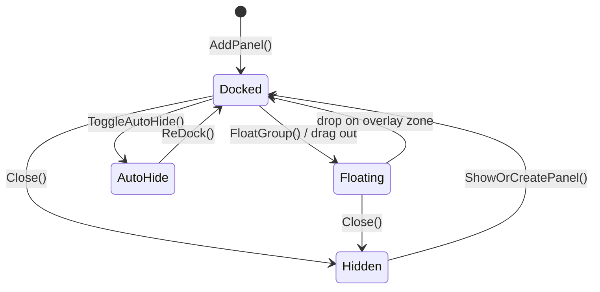

# WpfHexEditor.Docking.Wpf

> 100% in-house VS-style docking engine — float, dock, auto-hide, colored tabs, 8 themes. Zero third-party dependency.

[](https://dotnet.microsoft.com/)
[](../../LICENSE)

---

## Architecture



---

## Project Structure

```
WpfHexEditor.Docking.Wpf/
├── DockHost.cs / IDockHost.cs       ← Public API entrypoint
├── DockWorkspace.cs                 ← Document area container
├── DockControl.cs                   ← Visual tree builder (panels ↔ nodes)
├── DockTabControl.cs                ← Tab strip + colored tabs + pin/close
├── DocumentTabHost.cs               ← Document area tabs
├── DockSplitPanel.cs                ← GridSplitter-based split layout
│
├── FloatingWindow.cs                ← Float a panel in a separate OS window
├── DockDragManager.cs               ← Drag-and-drop state machine
├── DockOverlayWindow.cs             ← Drop-target overlay (5 compass zones)
├── DockEdgeOverlayWindow.cs         ← Screen-edge drop zones
│
├── AutoHideBar.cs                   ← Slide-out panels (L/R/T/B)
├── NavigatorWindow.cs               ← Ctrl+Tab switcher (VS-style)
│
├── Attached/                        ← Attached properties (DockProperties)
├── Automation/                      ← UI Automation support
├── Commands/                        ← Routed commands
├── Controls/                        ← Inner controls (tab headers, close btn)
├── Dialogs/                         ← Rename dialog, etc.
├── Helpers/
│   ├── DockTabEventWirer.cs         ← Wires tab events (close, float, etc.)
│   └── ...
├── Services/
│   ├── FloatingWindowManager.cs     ← Manages all floating windows lifecycle
│   ├── LayoutSerializer.cs          ← Save/restore layout (JSON)
│   └── DockLayoutService.cs
│
└── Themes/
    ├── Dark/                        ← Colors.xaml + Theme.xaml
    ├── Light/
    ├── VS2022Dark/
    ├── DarkGlass/
    ├── Minimal/
    ├── Office/
    ├── Cyberpunk/
    ├── VisualStudio/
    └── PanelCommon.xaml             ← Shared panel toolbar styles
```

---

## Key Concepts

### DockItem (model)

```csharp
var item = new DockItem
{
    Title     = "My Panel",
    ContentId = "panel-my",   // unique — used for layout restore
    CanClose  = true,
    CanFloat  = true,
    IsDocument = false,       // false = tool panel, true = document
    IsPinned  = false,        // pinned tabs moved left, protected from Close All
};
// Title implements INotifyPropertyChanged → tab header updates live
item.Title = "My Panel *";    // dirty flag shown immediately
```

### DockItem states



---

## Usage

### Setup (XAML)

```xml
<Window xmlns:dock="clr-namespace:WpfHexEditor.Docking.Wpf;assembly=WpfHexEditor.Docking.Wpf">
    <dock:DockHost x:Name="DockHost"
                   Theme="VS2022Dark"
                   ActiveItemChanged="OnActiveItemChanged" />
</Window>
```

### Add a panel (code-behind)

```csharp
var item    = new DockItem { Title = "Output", ContentId = "panel-output" };
var content = new OutputPanel();

DockHost.AddPanel(content, item, DockSide.Bottom);
```

### Open a document tab

```csharp
var item    = new DockItem { Title = "file.bin", ContentId = "doc-file.bin",
                             IsDocument = true };
var editor  = new HexEditor { FileName = "file.bin" };

DockHost.OpenDocument(editor, item);
DockHost.ActivateItem(item);
```

### Float a panel

```csharp
DockHost.FloatGroup(item);          // float to last known position
// or drag the tab header out of the dock
```

### Auto-hide

```csharp
DockHost.ToggleAutoHide(item);      // slides panel to side bar
```

### Save / restore layout

```csharp
// Save
string json = DockHost.SaveLayout();
File.WriteAllText("layout.json", json);

// Restore
string json = File.ReadAllText("layout.json");
DockHost.RestoreLayout(json, contentFactory);
```

---

## Themes

Switch themes at runtime:

```csharp
DockHost.Theme = "DarkGlass";       // instant, no restart
```

| Theme | Description |
|-------|-------------|
| `Dark` | Dark neutral |
| `Light` | Light neutral |
| `VS2022Dark` | Visual Studio 2022 dark (default) |
| `DarkGlass` | Translucent dark with glass effect |
| `Minimal` | Flat minimal style |
| `Office` | Microsoft Office ribbon style |
| `Cyberpunk` | High-contrast neon purple |
| `VisualStudio` | VS 2019 light |

Each theme provides: `DockWindowBackgroundBrush`, `DockBorderBrush`, `DockMenuForegroundBrush`, `Panel_*` toolbar keys, `ERR_*` Error panel keys, `SE_*` Solution Explorer keys, `PP_*` Properties panel keys.

---

## Tab Features

| Feature | Description |
|---------|-------------|
| **Colored tabs** | Per-document tab color (set via `DockItem.TabColor`) |
| **Pin** | Pinned tabs move to the left end, protected from "Close All" |
| **Close** | × button on tab (respects `DockItem.CanClose`) |
| **Dirty indicator** | `DockItem.Title = "file *"` → tab updates live via INPC |
| **Context menu** | Float, Close, Close Others, Pin, Split |
| **Ctrl+Tab** | `NavigatorWindow` — VS-style document switcher |

---

## Dependencies

| Project | Why |
|---------|-----|
| `WpfHexEditor.Docking.Core` | Model — `DockItem`, `DockGroupNode`, `DocumentHostNode` |

---

## License

GNU Affero General Public License v3.0 — Copyright 2026 Derek Tremblay. See [LICENSE](../../LICENSE).
