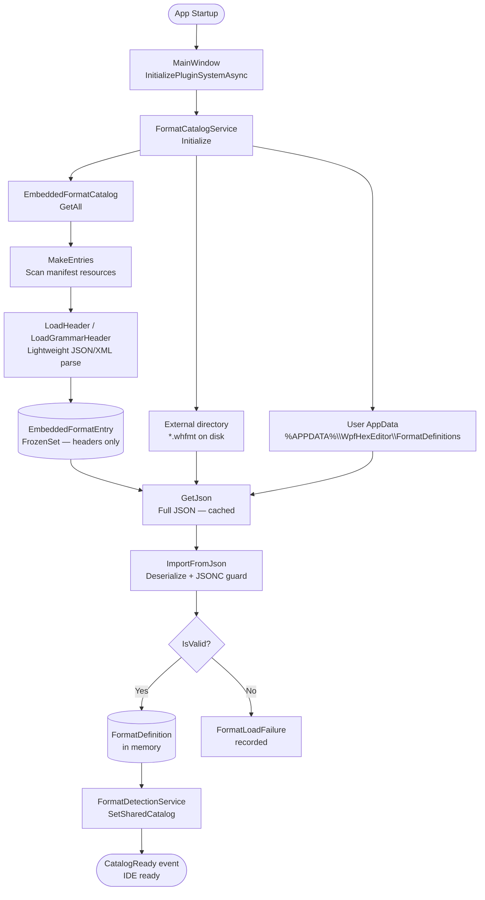
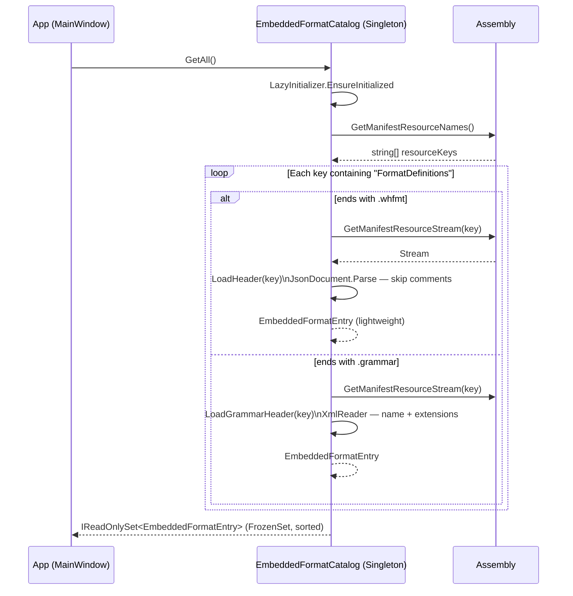
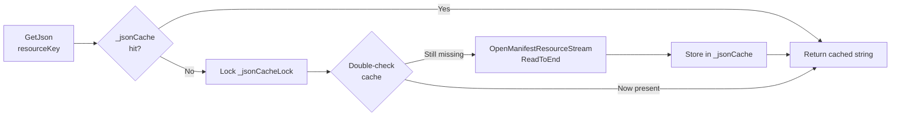
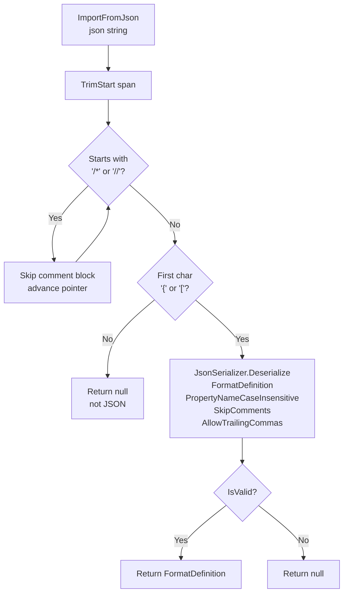
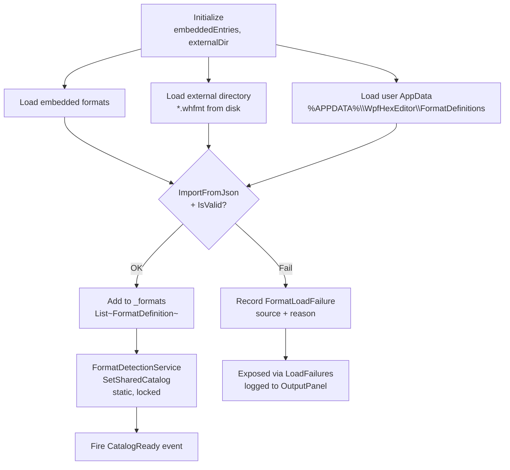
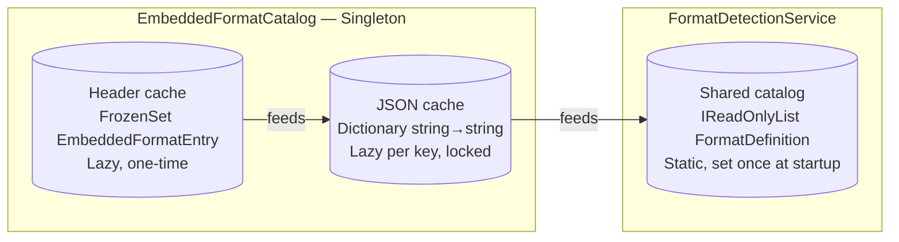
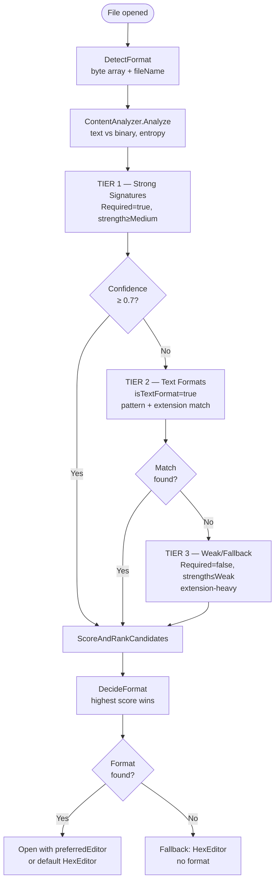
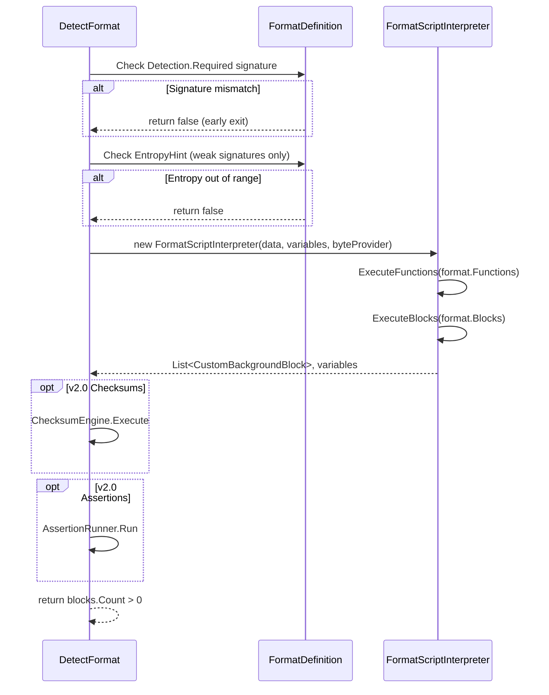
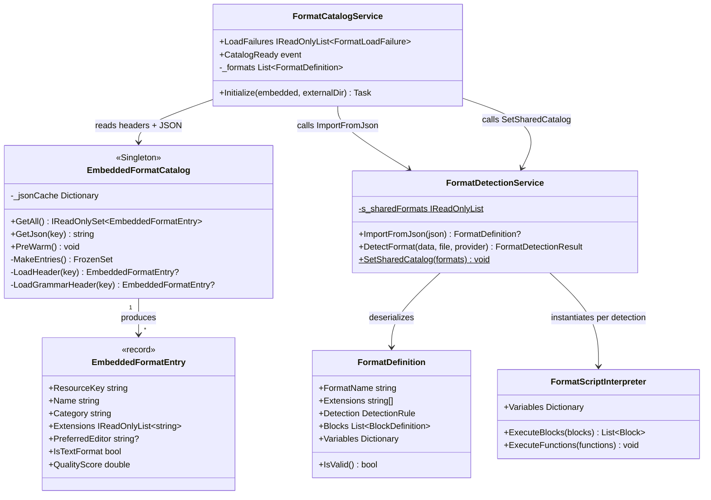

# WHFMT Loading Pipeline

> **Scope:** End-to-end lifecycle of a `.whfmt` format definition — from embedded resource to
> in-memory `FormatDefinition` and format detection.  
> **Last updated:** 2026-04-14

---

## 1. What is a `.whfmt` file?

A `.whfmt` file is a **JSONC document** (JSON + comments + trailing commas) that describes a
binary or text file format. It contains:

| Section | Purpose |
|---|---|
| `formatName`, `version`, `category` | Identity metadata |
| `extensions` | Associated file extensions |
| `detection` | Signature rules, entropy hints, text patterns |
| `blocks` | Binary structure layout (optional for text formats) |
| `variables` / `functions` | Script state & custom helpers |
| `VersionDetection`, `VersionedBlocks` | Per-version structure variants |
| `Checksums`, `Assertions` | Integrity & well-formedness constraints |
| `Forensic`, `Navigation`, `Inspector` | Analysis, UX, and tooling metadata |
| `preferredEditor`, `diffMode` | Editor routing hints |

**Validation rules (`IsValid()`):**
- `FormatName` must be non-empty.
- `Detection` must be non-null and internally valid.
- Binary formats (`isTextFormat = false`) **must** declare at least one `Block`.
- Text formats may have zero blocks (identified by extension/signature only).

---

## 2. File Organisation

```
Sources/
└── Core/
    └── WpfHexEditor.Core.Definitions/
        ├── FormatDefinitions/          ← whfmt files (embedded resources)
        │   ├── Archives/
        │   ├── Database/
        │   ├── Images/
        │   ├── Programming/
        │   └── ...
        └── WpfHexEditor.Core.Definitions.csproj
```

All `.whfmt` (and `.grammar`) files under `FormatDefinitions/` are compiled as **manifest
embedded resources** via:

```xml
<ItemGroup>
  <EmbeddedResource Include="FormatDefinitions\**\*.whfmt" />
  <EmbeddedResource Include="FormatDefinitions\**\*.grammar" />
</ItemGroup>
```

Resulting resource key pattern:
```
WpfHexEditor.Definitions.FormatDefinitions.{Category}.{FormatName}.whfmt
```

---

## 3. Complete Loading Pipeline

### 3.1 High-Level Overview



---

### 3.2 Step-by-step Breakdown

#### Step 1 — Header Scan (`EmbeddedFormatCatalog.MakeEntries`)

Triggered **once** (lazy) on first call to `GetAll()`.



**`EmbeddedFormatEntry` fields loaded at this stage:**

| Field | Source JSON path |
|---|---|
| `Name` | `formatName` |
| `Category` | Extracted from resource key path |
| `Description` | `description` |
| `Extensions` | `extensions[]` |
| `Version` | `version` |
| `Author` | `author` |
| `QualityScore` | `QualityMetrics.CompletenessScore` |
| `PreferredEditor` | `preferredEditor` |
| `IsTextFormat` | `detection.isTextFormat` |
| `HasSyntaxDefinition` | presence of `syntaxDefinition` key |
| `DiffMode` | `diffMode` |

> Block definitions, variables, and functions are **NOT** loaded at this stage.

---

#### Step 2 — JSON Cache (`EmbeddedFormatCatalog.GetJson`)



- Cache scope: **process lifetime** (assembly resources are immutable).
- Thread-safe: double-check locking pattern.
- `PreWarm()` can eagerly fill the cache at startup.

---

#### Step 3 — Deserialization & Validation (`FormatDetectionService.ImportFromJson`)



> The JSONC comment-skip guard (Step C→D) is critical: many `.whfmt` files begin with a
> `/* header block */`. Without it, the `{` check fails and the entire format is silently
> discarded. See memory: `feedback_whfmt_guard.md`.

---

#### Step 4 — Multi-Source Catalog Assembly (`FormatCatalogService.Initialize`)



**Source priority:**

| Priority | Source | Override behaviour |
|---|---|---|
| 1 | Embedded resources (DLL) | Base definitions |
| 2 | External directory (parameter) | Can override embedded by name |
| 3 | User AppData | Personal overrides (highest) |

---

## 4. Caching Map



| Cache | Type | Invalidation |
|---|---|---|
| Header entries | `FrozenSet<EmbeddedFormatEntry>` | Never — one-time lazy init |
| JSON content | `Dictionary<string, string>` | Never — assembly immutable |
| Shared catalog | `IReadOnlyList<FormatDefinition>` | Set once at `CatalogReady` |
| Instance formats | `List<FormatDefinition>` per service | `ClearFormats()` |

---

## 5. Format Detection Flow

Once the catalog is ready, detection runs each time a file is opened.



**Scoring weights:**

| Signal | Weight |
|---|---|
| Signature confidence | 30 % |
| Extension match | 30 % (40 % for shared signatures) |
| ZIP-container content analysis | 25 % |
| General content analysis | 20 % |

---

### 5.1 `TryDetectFormat` Inner Logic



---

## 6. Class Responsibility Map



---

## 7. Error Handling

| Stage | Error | Handling |
|---|---|---|
| `MakeEntries` | Parse exception on header | Entry skipped silently; next entry continues |
| `ImportFromJson` | Invalid JSON / non-JSON content | Returns `null`; not treated as failure |
| `ImportFromJson` | `IsValid()` = false | Returns `null` |
| `FormatCatalogService.Initialize` | File I/O or parse exception | `FormatLoadFailure` recorded + logged |
| `FormatCatalogService.Initialize` | `IsValid()` = false (external) | `FormatLoadFailure` recorded |
| `DetectFormat` | No match | Returns `null`; hex editor fallback |
| `DetectFormat` | Timeout (3 s) | Best candidate returned |

**User-visible surfaces:**
- **OutputPanel** — `OutputLogger.Error/Warn` for each `FormatLoadFailure`.
- **Startup is never blocked** — failures are best-effort; the catalog loads whatever succeeds.

---

## 8. Full Call Chain Example — ZIP Format

```
MainWindow.InitializePluginSystemAsync()
 └─ FormatCatalogService.Initialize(embeddedEntries, externalDir)
     └─ EmbeddedFormatCatalog.Instance.GetAll()
         └─ MakeEntries()
             └─ Assembly.GetManifestResourceNames()
                 → "WpfHexEditor.Definitions.FormatDefinitions.Archives.ZIP.whfmt"
             └─ LoadHeader("...ZIP.whfmt")
                 └─ JsonDocument.Parse (CommentHandling.Skip)
                 └─ EmbeddedFormatEntry { Name="ZIP Archive", Extensions=[".zip",".jar",...], Category="Archives" }
     └─ For each EmbeddedFormatEntry (whfmt only):
         └─ EmbeddedFormatCatalog.GetJson(entry.ResourceKey)
             └─ _jsonCache miss → OpenManifestResourceStream → ReadToEnd → cache
         └─ FormatDetectionService.ImportFromJson(json)
             └─ Skip /* comment header */
             └─ JsonSerializer.Deserialize<FormatDefinition>()
             └─ IsValid() → true
             └─ Return FormatDefinition { FormatName="ZIP Archive", Blocks=[...] }
         └─ _formats.Add(formatDefinition)
     └─ FormatDetectionService.SetSharedCatalog(_formats)  ← static, locked
     └─ Fire CatalogReady
```

---

## 9. Key Files Reference

| File | Path |
|---|---|
| `.csproj` (embedding) | `Core/WpfHexEditor.Core.Definitions/WpfHexEditor.Core.Definitions.csproj` |
| `EmbeddedFormatCatalog.cs` | `Core/WpfHexEditor.Core.Definitions/EmbeddedFormatCatalog.cs` |
| `IEmbeddedFormatCatalog.cs` | `Core/WpfHexEditor.Core.Definitions/IEmbeddedFormatCatalog.cs` |
| `FormatDefinition.cs` | `Core/WpfHexEditor.Core/Models/FormatDefinition.cs` |
| `FormatCatalogService.cs` | `Core/WpfHexEditor.Core/Services/FormatCatalogService.cs` |
| `FormatDetectionService.cs` | `Core/WpfHexEditor.Core/Services/FormatDetectionService.cs` |
| `FormatScriptInterpreter.cs` | `Core/WpfHexEditor.Core/Services/FormatScriptInterpreter.cs` |
| `HexEditor.FormatDetection.cs` | `Editors/WpfHexEditor.HexEditor/PartialClasses/Features/` |
| `MainWindow.PluginSystem.cs` | `WpfHexEditor.App/PartialClasses/MainWindow.PluginSystem.cs` |
| `EmbeddedWhfmt_Tests.cs` | `Tests/` (build gate: 400+ formats) |
