# WPF HexEditor - Architecture Documentation

This document provides comprehensive architecture documentation for the HexEditor control, including visual diagrams, data flow analysis, and detailed component descriptions.

## 📋 Table of Contents

1. [Overview](#overview)
2. [High-Level Architecture](#high-level-architecture)
3. [Core Components](#core-components)
4. [Data Flow Diagrams](#data-flow-diagrams)
5. [Class Relationships](#class-relationships)
6. [Component Dependencies](#component-dependencies)
7. [Virtual Position Mapping](#virtual-position-mapping)
8. [LIFO Insertion Semantics](#lifo-insertion-semantics)
9. [Performance Characteristics](#performance-characteristics)
10. [V1 vs V2 Comparison](#v1-vs-v2-comparison)
11. [Known Issues & Bugs](#known-issues--bugs)
12. [Testing Architecture](#testing-architecture)

## 📚 Related Documentation

- **[Main README](README.md)** - Project overview and quick start
- **[Architecture V1](ARCHITECTURE.md)** - Original architecture documentation
- **[Issue #145](https://github.com/abbaye/WpfHexEditorIDE/issues/145)** - Insert Mode F0 pattern bug
- **[Issue #146](https://github.com/abbaye/WpfHexEditorIDE/issues/146)** - Critical Save data loss bug

---

## 📖 Overview

HexEditor uses a modern MVVM architecture (rewritten from legacy monolithic design), focusing on:

- **Performance**: 2-5x faster rendering with custom DrawingContext
- **Memory Efficiency**: 80-90% reduction with custom viewport
- **Clean Architecture**: MVVM pattern with layered components
- **Advanced Editing**: Insert/Overwrite modes with undo/redo

### Key Architectural Principles

1. **Separation of Concerns**: MVVM pattern with distinct layers
2. **Virtual View**: Users see edits applied; original file unchanged until Save
3. **Layered Design**: View → ViewModel → Provider → Core (Reader, Manager, Mapper) → FileProvider
4. **Edit Tracking**: Separate storage for modifications, insertions, deletions
5. **Position Mapping**: Bidirectional virtual↔physical position conversion

---

## 🏗️ High-Level Architecture

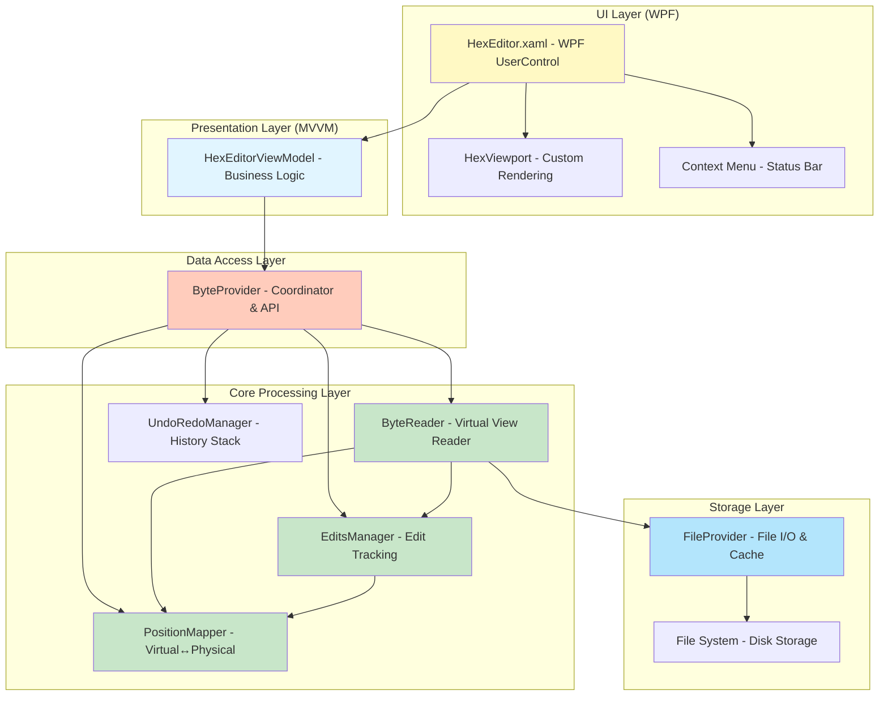
```mermaid
graph TB
    subgraph "UI Layer (WPF)"
        HexEditor["HexEditor.xaml - WPF UserControl"]
        HexViewport["HexViewport - Custom Rendering"]
        ContextMenu["Context Menu - Status Bar"]
    end

    subgraph "Presentation Layer (MVVM)"
        ViewModel["HexEditorViewModel - Business Logic"]
    end

    subgraph "Data Access Layer"
        ByteProvider["ByteProvider - Coordinator & API"]
    end

    subgraph "Core Processing Layer"
        ByteReader["ByteReader - Virtual View Reader"]
        EditsManager["EditsManager - Edit Tracking"]
        PositionMapper["PositionMapper - Virtual↔Physical"]
        UndoRedoManager["UndoRedoManager - History Stack"]
    end

    subgraph "Storage Layer"
        FileProvider["FileProvider - File I/O & Cache"]
        FileSystem["File System - Disk Storage"]
    end

    HexEditor --> HexViewport
    HexEditor --> ContextMenu
    HexEditor --> ViewModel

    ViewModel --> ByteProvider

    ByteProvider --> ByteReader
    ByteProvider --> EditsManager
    ByteProvider --> PositionMapper
    ByteProvider --> UndoRedoManager

    ByteReader --> EditsManager
    ByteReader --> PositionMapper
    ByteReader --> FileProvider

    EditsManager --> PositionMapper

    FileProvider --> FileSystem

    style HexEditor fill:#fff9c4
    style ViewModel fill:#e1f5ff
    style ByteProvider fill:#ffccbc
    style ByteReader fill:#c8e6c9
    style EditsManager fill:#c8e6c9
    style PositionMapper fill:#c8e6c9
    style FileProvider fill:#b3e5fc
```

---

## 🔧 Core Components

### Component Overview

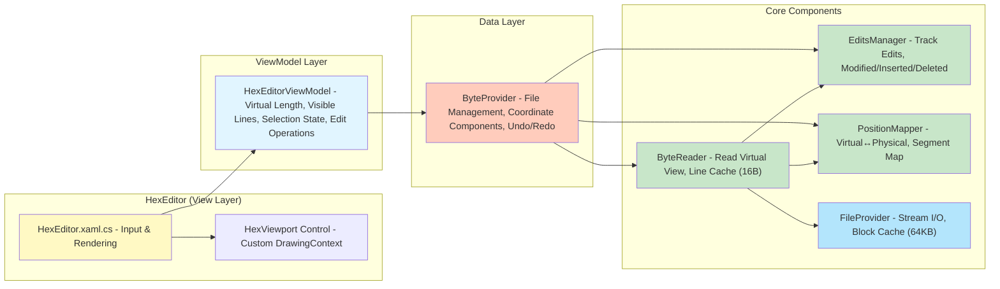
```mermaid
graph LR
    subgraph "HexEditor (View Layer)"
        View["HexEditor.xaml.cs - Input & Rendering"]
        Viewport["HexViewport Control - Custom DrawingContext"]
    end

    subgraph "ViewModel Layer"
        VM["HexEditorViewModel - Virtual Length, Visible Lines, Selection State, Edit Operations"]
    end

    subgraph "Data Layer"
        Provider["ByteProvider - File Management, Coordinate Components, Undo/Redo"]
    end

    subgraph "Core Components"
        Reader["ByteReader - Read Virtual View, Line Cache (16B)"]
        Edits["EditsManager - Track Edits, Modified/Inserted/Deleted"]
        Mapper["PositionMapper - Virtual↔Physical, Segment Map"]
        File["FileProvider - Stream I/O, Block Cache (64KB)"]
    end

    View --> Viewport
    View --> VM
    VM --> Provider
    Provider --> Reader
    Provider --> Edits
    Provider --> Mapper
    Reader --> Edits
    Reader --> Mapper
    Reader --> File

    style View fill:#fff9c4
    style VM fill:#e1f5ff
    style Provider fill:#ffccbc
    style Reader fill:#c8e6c9
    style Edits fill:#c8e6c9
    style Mapper fill:#c8e6c9
    style File fill:#b3e5fc
```

### 1. HexEditor (View)

**Main File:** `Sources/WPFHexaEditor/HexEditor.xaml.cs` (3,617 lines)

**Partial Class Architecture (2026-02 Refactoring):**

The HexEditor control was refactored from a monolithic 6,750-line file into a modular partial class architecture for better maintainability:

| Partial Class File | Lines | Responsibility |
|--------------------|-------|----------------|
| **HexEditor.xaml.cs** | 3,617 | Main class, properties, constructor, infrastructure |
| **HexEditor.FileOperations.cs** | 380 | File I/O (Open, Save, Close, UpdateBarChart) |
| **HexEditor.EditOperations.cs** | 116 | Edit ops (Undo, Redo, Copy, Cut, Paste, Select) |
| **HexEditor.Search.cs** | 134 | Find/Replace operations |
| **HexEditor.Bookmarks.cs** | 101 | Bookmark management |
| **HexEditor.ByteOperations.cs** | 367 | Byte manipulation (Get, Set, Insert, Delete, Fill) |
| **HexEditor.Events.cs** | 1,128 | Event handlers (Mouse, Keyboard, Scroll, UI updates) |
| **HexEditor.ContextMenu.cs** | 477 | Context menu handlers + auto-scroll + column headers |
| **HexEditor.Clipboard.cs** | 258 | Clipboard operations (Copy as Hex/ASCII/C#/C) |
| **HexEditor.Highlights.cs** | 89 | Byte range highlighting |
| **HexEditor.TBL.cs** | 102 | Character table support |
| **HexEditor.StatePersistence.cs** | 110 | State save/load to XML |
| **HexEditor.Zoom.cs** | 98 | Zoom/scale functionality |

**Benefits:**
- **46% code reduction** in main file (6,750 → 3,617 lines)
- **Clear separation of concerns** - each file has single responsibility
- **Easier navigation** - find functionality by category
- **Better maintainability** - modify specific features without affecting others
- **Team collaboration** - reduced merge conflicts

**Responsibilities:**
- WPF UserControl hosting the hex editor UI
- Keyboard/mouse input handling
- Hex/ASCII nibble editing with state machine
- Cursor management (high/low nibble tracking)
- Selection gestures (mouse drag, shift+arrow)
- Context menu integration
- Insert/Overwrite mode switching

**Key Features:**
| Feature | Description |
|---------|-------------|
| **Custom Rendering** | HexViewport uses DrawingContext for high performance |
| **Edit Modes** | Insert mode (shifts bytes) vs Overwrite mode (replaces) |
| **Nibble Editing** | Type 'F' then 'F' → 0xFF byte with visual feedback |
| **Real-time Updates** | Changes reflected immediately in viewport |
| **Scroll Sync** | Hex and ASCII panels synchronized |

**Input Handling:**
```csharp
// Hex input state machine
_isEditingByte → true when first nibble typed
_editingHighNibble → true for high nibble (F_), false for low (_F)
_editingPosition → virtual position being edited
_editingValue → accumulated byte value (0xF0 → 0xFF)
```

**Partial Class Organization:**
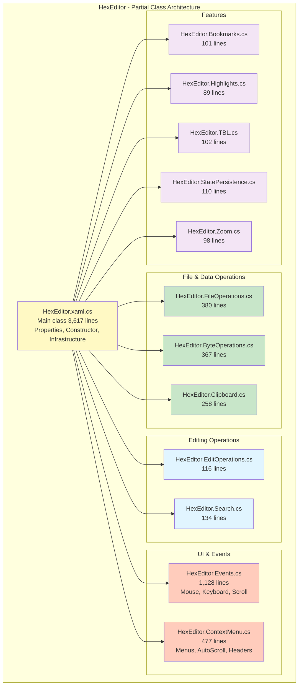
```mermaid
graph TB
    subgraph "HexEditor - Partial Class Architecture"
        Main["HexEditor.xaml.cs<br/>Main class 3,617 lines<br/>Properties, Constructor, Infrastructure"]

        subgraph "File & Data Operations"
            File["HexEditor.FileOperations.cs<br/>380 lines"]
            Byte["HexEditor.ByteOperations.cs<br/>367 lines"]
            Clip["HexEditor.Clipboard.cs<br/>258 lines"]
        end

        subgraph "Editing Operations"
            Edit["HexEditor.EditOperations.cs<br/>116 lines"]
            Search["HexEditor.Search.cs<br/>134 lines"]
        end

        subgraph "UI & Events"
            Events["HexEditor.Events.cs<br/>1,128 lines<br/>Mouse, Keyboard, Scroll"]
            Context["HexEditor.ContextMenu.cs<br/>477 lines<br/>Menus, AutoScroll, Headers"]
        end

        subgraph "Features"
            Book["HexEditor.Bookmarks.cs<br/>101 lines"]
            High["HexEditor.Highlights.cs<br/>89 lines"]
            TBL["HexEditor.TBL.cs<br/>102 lines"]
            State["HexEditor.StatePersistence.cs<br/>110 lines"]
            Zoom["HexEditor.Zoom.cs<br/>98 lines"]
        end
    end

    Main --> File
    Main --> Byte
    Main --> Clip
    Main --> Edit
    Main --> Search
    Main --> Events
    Main --> Context
    Main --> Book
    Main --> High
    Main --> TBL
    Main --> State
    Main --> Zoom

    style Main fill:#fff9c4
    style File fill:#c8e6c9
    style Byte fill:#c8e6c9
    style Clip fill:#c8e6c9
    style Edit fill:#e1f5ff
    style Search fill:#e1f5ff
    style Events fill:#ffccbc
    style Context fill:#ffccbc
    style Book fill:#f3e5f5
    style High fill:#f3e5f5
    style TBL fill:#f3e5f5
    style State fill:#f3e5f5
    style Zoom fill:#f3e5f5
```

---

### 2. HexEditorViewModel

**File:** `Sources/WPFHexaEditor/ViewModels/HexEditorViewModel.cs`

**Responsibilities:**
- MVVM separation between UI and data
- Manage virtual view of file (with edits applied)
- Handle scrolling, visible lines, selection state
- Provide edit operations: Insert, Modify, Delete
- Copy/Paste with clipboard integration

**Key Properties:**
| Property | Type | Description |
|----------|------|-------------|
| `VirtualLength` | long | Total length including insertions/deletions |
| `ScrollPosition` | long | Current top line index |
| `VisibleLines` | ObservableCollection | Line data for rendering (hot path) |
| `SelectionStart` | long? | Selection start position |
| `SelectionStop` | long? | Selection end position |
| `EditMode` | EditMode | Insert or Overwrite |

**Key Methods:**
```csharp
InsertByte(long virtualPos, byte value)    // Insert at position
ModifyByte(long virtualPos, byte value)    // Modify existing byte
DeleteByte(long virtualPos)                // Delete byte
RefreshVisibleLines()                      // Update view (hot path)
SetSelection(long start, long? stop)       // Update selection
CopySelection()                            // Copy to clipboard
PasteAtPosition(long pos)                  // Paste from clipboard
```

---

### 3. ByteProvider (Core Data Layer)

**File:** `Sources/WPFHexaEditor/Core/Bytes/ByteProvider.cs`

**Responsibilities:**
- Central data access API
- File lifecycle management (Open, Close, Save, SaveAs)
- Coordinate ByteReader, EditsManager, PositionMapper, FileProvider
- Undo/Redo management with history stack
- Modification tracking and dirty state

**Architecture:**
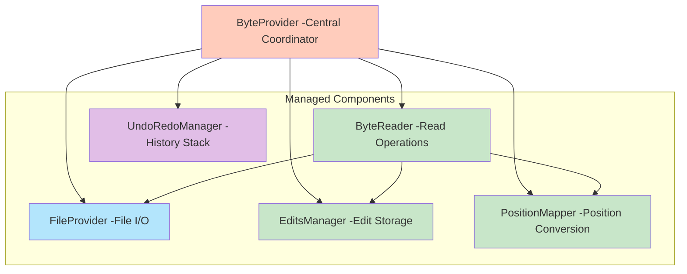
```mermaid
graph TB
    BP[ByteProvider -Central Coordinator]

    subgraph "Managed Components"
        FP[FileProvider -File I/O]
        BR[ByteReader -Read Operations]
        EM[EditsManager -Edit Storage]
        PM[PositionMapper -Position Conversion]
        UR[UndoRedoManager -History Stack]
    end

    BP --> FP
    BP --> BR
    BP --> EM
    BP --> PM
    BP --> UR

    BR --> EM
    BR --> PM
    BR --> FP

    style BP fill:#ffccbc
    style FP fill:#b3e5fc
    style BR fill:#c8e6c9
    style EM fill:#c8e6c9
    style PM fill:#c8e6c9
    style UR fill:#e1bee7
```

**Key Methods:**
| Method | Return | Description |
|--------|--------|-------------|
| `OpenFile(path)` | void | Open file for editing |
| `Save()` | void | Save edits to original file |
| `SaveAs(path)` | void | Save to new file (atomic operation) |
| `GetByte(virtualPos)` | (byte, bool) | Read single byte from virtual view |
| `GetBytes(virtualPos, count)` | byte[] | Read multiple bytes |
| `InsertByte(virtualPos, value)` | void | Record insertion edit |
| `ModifyByte(virtualPos, value)` | void | Record modification edit |
| `DeleteByte(virtualPos)` | void | Record deletion edit |
| `Undo()` | long? | Undo last edit, return affected position |
| `Redo()` | long? | Redo last undone edit |

**Properties:**
```csharp
string FilePath              // Current file path
long VirtualLength           // Length with edits applied
bool IsReadOnly              // Read-only mode flag
bool HasChanges              // Unsaved edits flag
bool IsOpen                  // File open state
```

---

### 4. ByteReader (Virtual View Reader)

**File:** `Sources/WPFHexaEditor/Core/Bytes/ByteReader.cs`

**Responsibilities:**
- Read bytes from **virtual view** (edits applied transparently)
- Handle insertions, modifications, deletions
- Line-based caching (16-byte lines) for viewport rendering
- Optimized for sequential reads

**Reading Logic:**
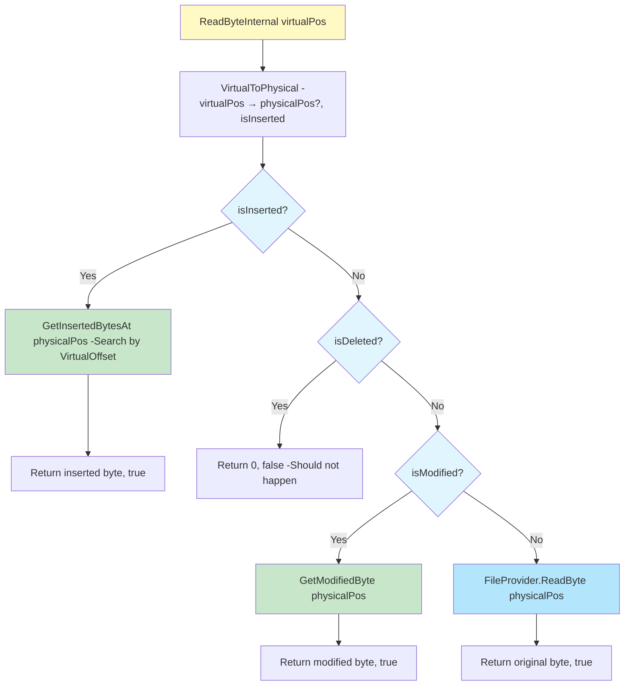
```mermaid
graph TD
    Start[ReadByteInternal virtualPos]

    Convert[VirtualToPhysical -virtualPos → physicalPos?, isInserted]

    CheckInserted{isInserted?}
    CheckDeleted{isDeleted?}
    CheckModified{isModified?}

    GetInserted[GetInsertedBytesAt physicalPos -Search by VirtualOffset]
    GetModified[GetModifiedByte physicalPos]
    GetOriginal[FileProvider.ReadByte physicalPos]

    ReturnInserted[Return inserted byte, true]
    ReturnDeleted[Return 0, false -Should not happen]
    ReturnModified[Return modified byte, true]
    ReturnOriginal[Return original byte, true]

    Start --> Convert
    Convert --> CheckInserted

    CheckInserted -->|Yes| GetInserted
    CheckInserted -->|No| CheckDeleted

    CheckDeleted -->|Yes| ReturnDeleted
    CheckDeleted -->|No| CheckModified

    CheckModified -->|Yes| GetModified
    CheckModified -->|No| GetOriginal

    GetInserted --> ReturnInserted
    GetModified --> ReturnModified
    GetOriginal --> ReturnOriginal

    style Start fill:#fff9c4
    style CheckInserted fill:#e1f5ff
    style CheckDeleted fill:#e1f5ff
    style CheckModified fill:#e1f5ff
    style GetInserted fill:#c8e6c9
    style GetModified fill:#c8e6c9
    style GetOriginal fill:#b3e5fc
```

**Caching Strategy:**
| Aspect | Detail |
|--------|--------|
| **Cache Key** | `lineStart` (aligned to 16-byte boundaries) |
| **Cache Value** | `byte[16]` (full line) |
| **Cache Size** | ~100 lines = 1.6 KB |
| **Invalidation** | On any edit affecting line range |
| **Hit Rate** | >95% for sequential viewport scrolling |

**Key Methods:**
```csharp
(byte, bool) GetByte(long virtualPos)              // Single byte read
byte[] GetBytes(long virtualPos, int count)        // Multi-byte read
byte[] GetLine(long virtualPos, int bytesPerLine)  // Cached line read
long GetVirtualLength()                            // Calculate virtual length
```

---

### 5. EditsManager (Edit Tracking)

**File:** `Sources/WPFHexaEditor/Core/Bytes/EditsManager.cs`

**Responsibilities:**
- Track all edits: Modifications, Insertions, Deletions
- Separate storage by edit type for efficient lookups
- LIFO (stack-like) storage for multiple insertions at same physical position
- Provide O(1) or O(log n) lookups by physical position

**Data Structures:**
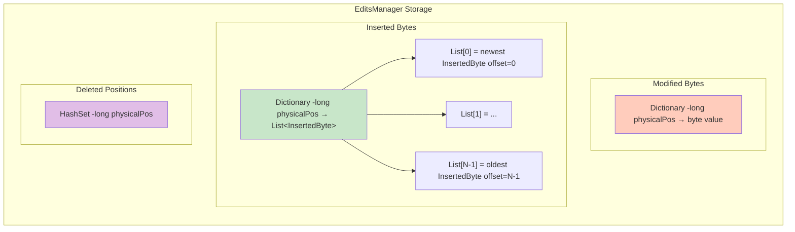
```mermaid
graph LR
    subgraph "EditsManager Storage"
        subgraph "Modified Bytes"
            ModDict["Dictionary -long physicalPos → byte value"]
        end

        subgraph "Inserted Bytes"
            InsDict["Dictionary -long physicalPos → List&lt;InsertedByte&gt;"]
            InsList1["List[0] = newest InsertedByte offset=0"]
            InsList2["List[1] = ..."]
            InsList3["List[N-1] = oldest InsertedByte offset=N-1"]
        end

        subgraph "Deleted Positions"
            DelSet["HashSet -long physicalPos"]
        end
    end

    InsDict --> InsList1
    InsDict --> InsList2
    InsDict --> InsList3

    style ModDict fill:#ffccbc
    style InsDict fill:#c8e6c9
    style DelSet fill:#e1bee7
```

**InsertedByte Structure:**
```csharp
public struct InsertedByte
{
    public byte Value;           // The inserted byte value
    public long VirtualOffset;   // Position within insertion group (0, 1, 2, ...)
                                 // 0 = newest, N-1 = oldest
}
```

**LIFO Insertion Logic:**

When inserting multiple bytes at the same physical position, new insertions are prepended (LIFO order):

```
Step 1: Insert A at physical 100
  _insertedBytes[100] = [InsertedByte(A, offset=0)]

Step 2: Insert B at physical 100
  Shift existing offsets: A.offset = 1
  Prepend new byte: _insertedBytes[100] = [B(offset=0), A(offset=1)]

Step 3: Insert C at physical 100
  Shift: B.offset=1, A.offset=2
  Prepend: [C(offset=0), B(offset=1), A(offset=2)]

Result Array:
  Index:           [0]        [1]        [2]
  Value:            C          B          A
  VirtualOffset:    0          1          2
  Order:          newest                oldest
```

**Key Methods:**
| Method | Complexity | Description |
|--------|------------|-------------|
| `ModifyByte(physicalPos, value)` | O(1) | Record modification |
| `InsertBytes(physicalPos, bytes[])` | O(n) | Insert bytes (shifts offsets) |
| `DeleteByte(physicalPos)` | O(1) | Mark byte as deleted |
| `GetModifiedByte(physicalPos)` | O(1) | Retrieve modified value |
| `GetInsertedBytesAt(physicalPos)` | O(1) | Get insertion list |
| `ModifyInsertedByte(physicalPos, virtualOffset, newValue)` | O(n) | Update inserted byte |
| `IsDeleted(physicalPos)` | O(1) | Check if deleted |
| `ClearAll()` | O(1) | Clear all edits |

---

### 6. PositionMapper (Virtual ↔ Physical Conversion)

**File:** `Sources/WPFHexaEditor/Core/Bytes/PositionMapper.cs`

**Responsibilities:**
- Convert between virtual positions (user view) and physical positions (file)
- Build segment map for efficient conversion
- Calculate virtual file length
- Handle insertion/deletion offsets

**Position Mapping Concept:**
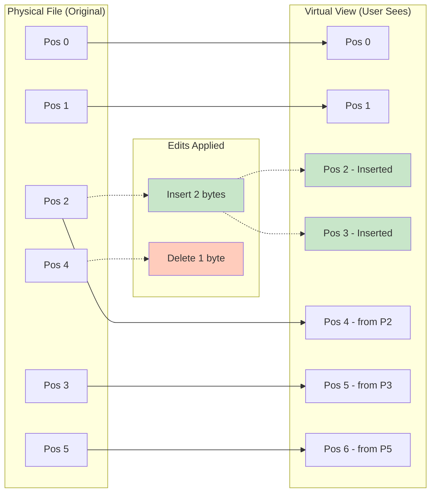
```mermaid
graph LR
    subgraph "Physical File (Original)"
        P0[Pos 0]
        P1[Pos 1]
        P2[Pos 2]
        P3[Pos 3]
        P4[Pos 4]
        P5[Pos 5]
    end

    subgraph "Edits Applied"
        I1[Insert 2 bytes]
        D1[Delete 1 byte]
    end

    subgraph "Virtual View (User Sees)"
        V0[Pos 0]
        V1[Pos 1]
        V2[Pos 2 - Inserted]
        V3[Pos 3 - Inserted]
        V4[Pos 4 - from P2]
        V5[Pos 5 - from P3]
        V6[Pos 6 - from P5]
    end

    P0 --> V0
    P1 --> V1
    P2 -.-> I1
    I1 -.-> V2
    I1 -.-> V3
    P2 --> V4
    P3 --> V5
    P4 -.-> D1
    P5 --> V6

    style I1 fill:#c8e6c9
    style D1 fill:#ffccbc
    style V2 fill:#c8e6c9
    style V3 fill:#c8e6c9
```

**Formula:**
```
Virtual Length = Physical Length + Total Insertions - Total Deletions

Virtual Position = Physical Position + Cumulative Insertions (before pos)
                                    - Cumulative Deletions (before pos)
```

**Segment Map Structure:**
```csharp
class PositionSegment
{
    long PhysicalPos;      // Physical position in file
    long VirtualOffset;    // Corresponding virtual position
    int InsertedCount;     // Number of bytes inserted at this position
    bool IsDeleted;        // If this physical byte is deleted
}
```

**Key Methods:**
| Method | Complexity | Description |
|--------|------------|-------------|
| `VirtualToPhysical(virtualPos, fileLength)` | O(log n) | Returns (physicalPos?, isInserted) |
| `PhysicalToVirtual(physicalPos, fileLength)` | O(log n) | Returns virtual position of PHYSICAL byte |
| `GetVirtualLength(fileLength)` | O(1) | Calculate total virtual length |
| `InvalidateCache()` | O(1) | Clear position cache after edits |

**Important Semantics:**

When multiple bytes are inserted at physical position P:
- `PhysicalToVirtual(P)` returns the virtual position of the **PHYSICAL** byte at position P
- The physical byte appears AFTER all inserted bytes in virtual space
- Virtual layout: `[Insert0_oldest, Insert1, ..., InsertN-1_newest, PhysicalByte]`

**Example:**
```
Insert 3 bytes (A, B, C) at physical position 100:
  LIFO array: [C(offset=0), B(offset=1), A(offset=2)]
  segment.VirtualOffset = 150 (position of A, oldest inserted byte)

  PhysicalToVirtual(100) = 153  (position of physical byte, AFTER all 3 insertions)

  Virtual positions:
    150 → A (oldest, offset=2, LIFO array index 2)
    151 → B (middle, offset=1, LIFO array index 1)
    152 → C (newest, offset=0, LIFO array index 0)
    153 → Physical byte at position 100 (AFTER all insertions)
```

**Critical Fix (commit 405b164):**
The original implementation incorrectly returned `segment.VirtualOffset` (position 150 in example), but the physical byte is at position 153. This was fixed to return `segment.VirtualOffset + segment.InsertedCount`.

---

### 7. FileProvider (Low-Level File I/O)

**File:** `Sources/WPFHexaEditor/Core/Bytes/FileProvider.cs`

**Responsibilities:**
- File stream management (open, close)
- 64KB block caching for efficient reads
- Async file reading support
- Thread-safe stream access

**Caching Strategy:**
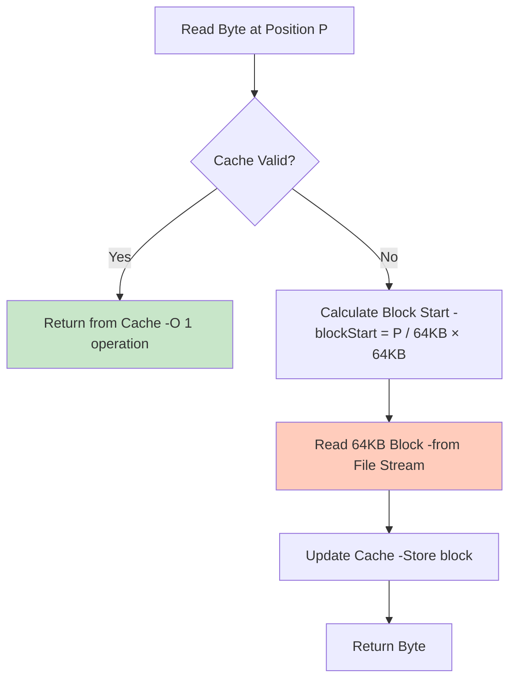
```mermaid
graph TB
    Request[Read Byte at Position P]

    CheckCache{Cache Valid?}

    CacheHit[Return from Cache -O 1 operation]

    CacheMiss[Calculate Block Start -blockStart = P / 64KB × 64KB]
    ReadBlock[Read 64KB Block -from File Stream]
    UpdateCache[Update Cache -Store block]
    ReturnByte[Return Byte]

    Request --> CheckCache
    CheckCache -->|Yes| CacheHit
    CheckCache -->|No| CacheMiss
    CacheMiss --> ReadBlock
    ReadBlock --> UpdateCache
    UpdateCache --> ReturnByte

    style CacheHit fill:#c8e6c9
    style ReadBlock fill:#ffccbc
```

**Performance Metrics:**
| Metric | Value |
|--------|-------|
| **Cache Size** | 64 KB |
| **Cache Alignment** | Block-aligned (pos / 64KB) × 64KB |
| **Hit Rate** | >99% for sequential reads |
| **Miss Penalty** | ~1-2 ms (disk read) |

**Key Methods:**
```csharp
void Open(string path, bool readOnly)    // Open file stream
(byte, bool) ReadByte(long physicalPos)  // Read with caching
void Close()                              // Close stream
long Length { get; }                      // File length
bool IsOpen { get; }                      // Open state
```

---

## 🔄 Data Flow Diagrams

### Opening a File

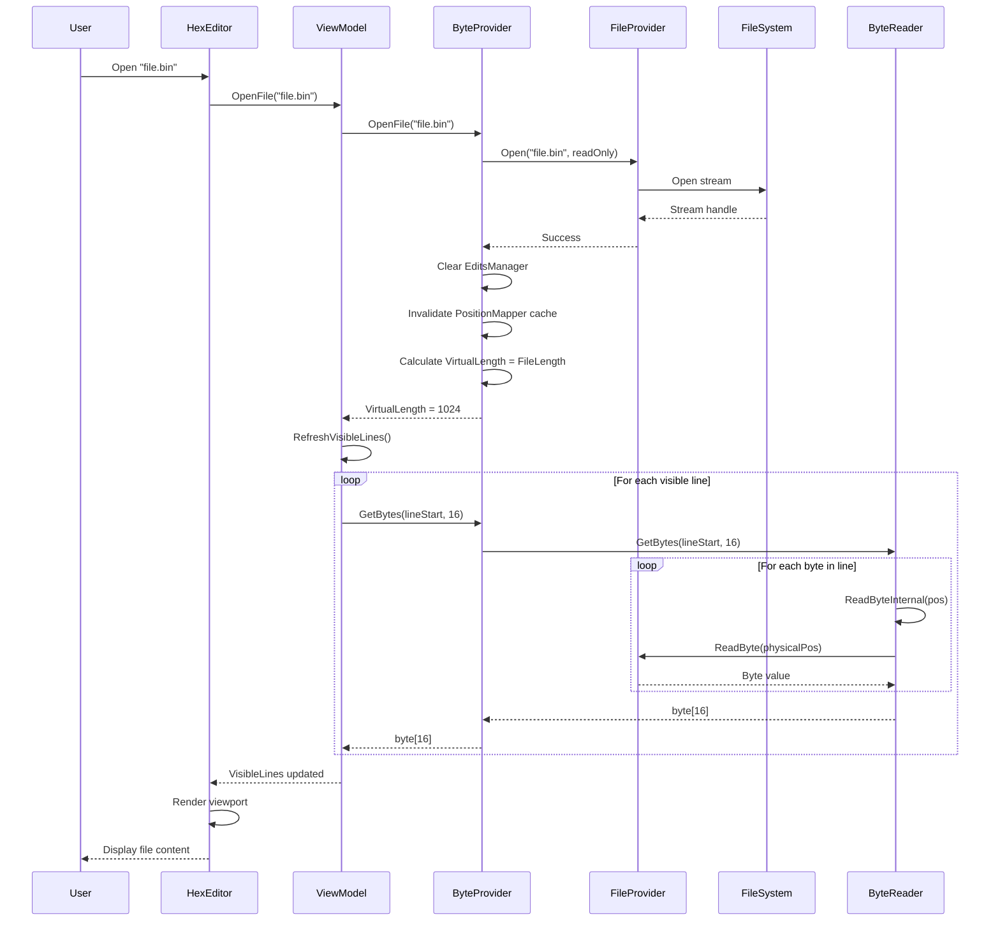
```mermaid
sequenceDiagram
    participant User
    participant HexEditor
    participant ViewModel
    participant ByteProvider
    participant FileProvider
    participant FileSystem

    User->>HexEditor: Open "file.bin"
    HexEditor->>ViewModel: OpenFile("file.bin")
    ViewModel->>ByteProvider: OpenFile("file.bin")
    ByteProvider->>FileProvider: Open("file.bin", readOnly)
    FileProvider->>FileSystem: Open stream
    FileSystem-->>FileProvider: Stream handle
    FileProvider-->>ByteProvider: Success

    ByteProvider->>ByteProvider: Clear EditsManager
    ByteProvider->>ByteProvider: Invalidate PositionMapper cache
    ByteProvider->>ByteProvider: Calculate VirtualLength = FileLength
    ByteProvider-->>ViewModel: VirtualLength = 1024

    ViewModel->>ViewModel: RefreshVisibleLines()

    loop For each visible line
        ViewModel->>ByteProvider: GetBytes(lineStart, 16)
        ByteProvider->>ByteReader: GetBytes(lineStart, 16)

        loop For each byte in line
            ByteReader->>ByteReader: ReadByteInternal(pos)
            ByteReader->>FileProvider: ReadByte(physicalPos)
            FileProvider-->>ByteReader: Byte value
        end

        ByteReader-->>ByteProvider: byte[16]
        ByteProvider-->>ViewModel: byte[16]
    end

    ViewModel-->>HexEditor: VisibleLines updated
    HexEditor->>HexEditor: Render viewport
    HexEditor-->>User: Display file content
```

---

### Inserting a Byte (Insert Mode)

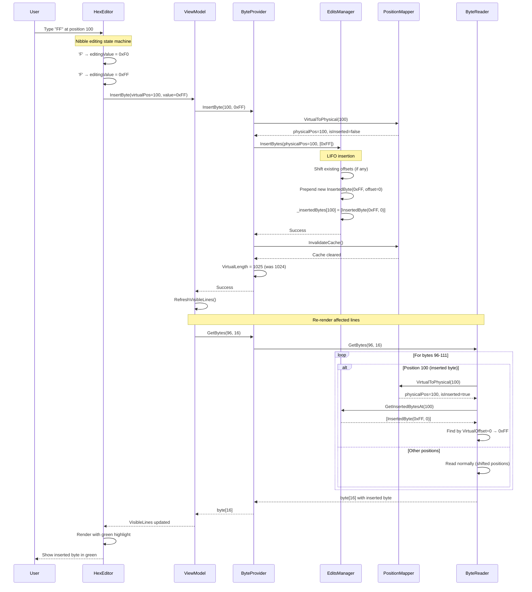
```mermaid
sequenceDiagram
    participant User
    participant HexEditor
    participant ViewModel
    participant ByteProvider
    participant EditsManager
    participant PositionMapper
    participant ByteReader

    User->>HexEditor: Type "FF" at position 100

    Note over HexEditor: Nibble editing state machine
    HexEditor->>HexEditor: 'F' → editingValue = 0xF0
    HexEditor->>HexEditor: 'F' → editingValue = 0xFF

    HexEditor->>ViewModel: InsertByte(virtualPos=100, value=0xFF)
    ViewModel->>ByteProvider: InsertByte(100, 0xFF)

    ByteProvider->>PositionMapper: VirtualToPhysical(100)
    PositionMapper-->>ByteProvider: physicalPos=100, isInserted=false

    ByteProvider->>EditsManager: InsertBytes(physicalPos=100, [0xFF])

    Note over EditsManager: LIFO insertion
    EditsManager->>EditsManager: Shift existing offsets (if any)
    EditsManager->>EditsManager: Prepend new InsertedByte(0xFF, offset=0)
    EditsManager->>EditsManager: _insertedBytes[100] = [InsertedByte(0xFF, 0)]
    EditsManager-->>ByteProvider: Success

    ByteProvider->>PositionMapper: InvalidateCache()
    PositionMapper-->>ByteProvider: Cache cleared

    ByteProvider->>ByteProvider: VirtualLength = 1025 (was 1024)
    ByteProvider-->>ViewModel: Success

    ViewModel->>ViewModel: RefreshVisibleLines()

    Note over ViewModel,ByteReader: Re-render affected lines
    ViewModel->>ByteProvider: GetBytes(96, 16)
    ByteProvider->>ByteReader: GetBytes(96, 16)

    loop For bytes 96-111
        alt Position 100 (inserted byte)
            ByteReader->>PositionMapper: VirtualToPhysical(100)
            PositionMapper-->>ByteReader: physicalPos=100, isInserted=true
            ByteReader->>EditsManager: GetInsertedBytesAt(100)
            EditsManager-->>ByteReader: [InsertedByte(0xFF, 0)]
            ByteReader->>ByteReader: Find by VirtualOffset=0 → 0xFF
        else Other positions
            ByteReader->>ByteReader: Read normally (shifted positions)
        end
    end

    ByteReader-->>ByteProvider: byte[16] with inserted byte
    ByteProvider-->>ViewModel: byte[16]

    ViewModel-->>HexEditor: VisibleLines updated
    HexEditor->>HexEditor: Render with green highlight
    HexEditor-->>User: Show inserted byte in green
```

---

### Saving a File

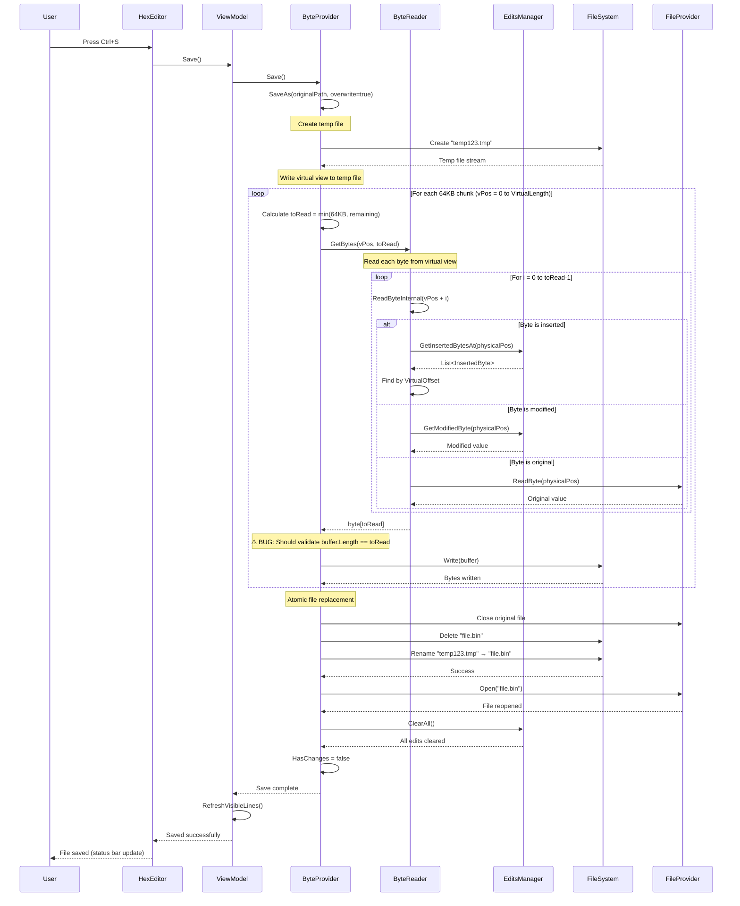
```mermaid
sequenceDiagram
    participant User
    participant HexEditor
    participant ViewModel
    participant ByteProvider
    participant ByteReader
    participant EditsManager
    participant FileSystem

    User->>HexEditor: Press Ctrl+S
    HexEditor->>ViewModel: Save()
    ViewModel->>ByteProvider: Save()
    ByteProvider->>ByteProvider: SaveAs(originalPath, overwrite=true)

    Note over ByteProvider: Create temp file
    ByteProvider->>FileSystem: Create "temp123.tmp"
    FileSystem-->>ByteProvider: Temp file stream

    Note over ByteProvider: Write virtual view to temp file
    loop For each 64KB chunk (vPos = 0 to VirtualLength)
        ByteProvider->>ByteProvider: Calculate toRead = min(64KB, remaining)

        ByteProvider->>ByteReader: GetBytes(vPos, toRead)

        Note over ByteReader: Read each byte from virtual view
        loop For i = 0 to toRead-1
            ByteReader->>ByteReader: ReadByteInternal(vPos + i)

            alt Byte is inserted
                ByteReader->>EditsManager: GetInsertedBytesAt(physicalPos)
                EditsManager-->>ByteReader: List<InsertedByte>
                ByteReader->>ByteReader: Find by VirtualOffset
            else Byte is modified
                ByteReader->>EditsManager: GetModifiedByte(physicalPos)
                EditsManager-->>ByteReader: Modified value
            else Byte is original
                ByteReader->>FileProvider: ReadByte(physicalPos)
                FileProvider-->>ByteReader: Original value
            end
        end

        ByteReader-->>ByteProvider: byte[toRead]

        Note over ByteProvider: ⚠️ BUG: Should validate buffer.Length == toRead
        ByteProvider->>FileSystem: Write(buffer)
        FileSystem-->>ByteProvider: Bytes written
    end

    Note over ByteProvider: Atomic file replacement
    ByteProvider->>FileProvider: Close original file
    ByteProvider->>FileSystem: Delete "file.bin"
    ByteProvider->>FileSystem: Rename "temp123.tmp" → "file.bin"
    FileSystem-->>ByteProvider: Success

    ByteProvider->>FileProvider: Open("file.bin")
    FileProvider-->>ByteProvider: File reopened

    ByteProvider->>EditsManager: ClearAll()
    EditsManager-->>ByteProvider: All edits cleared

    ByteProvider->>ByteProvider: HasChanges = false
    ByteProvider-->>ViewModel: Save complete

    ViewModel->>ViewModel: RefreshVisibleLines()
    ViewModel-->>HexEditor: Saved successfully
    HexEditor-->>User: File saved (status bar update)
```

---

### Undo Operation

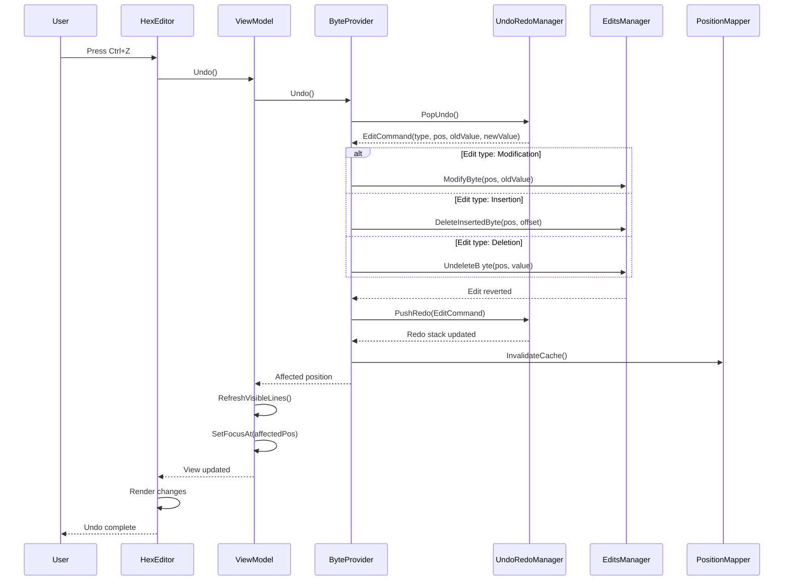
```mermaid
sequenceDiagram
    participant User
    participant HexEditor
    participant ViewModel
    participant ByteProvider
    participant UndoRedoManager
    participant EditsManager

    User->>HexEditor: Press Ctrl+Z
    HexEditor->>ViewModel: Undo()
    ViewModel->>ByteProvider: Undo()

    ByteProvider->>UndoRedoManager: PopUndo()
    UndoRedoManager-->>ByteProvider: EditCommand(type, pos, oldValue, newValue)

    alt Edit type: Modification
        ByteProvider->>EditsManager: ModifyByte(pos, oldValue)
    else Edit type: Insertion
        ByteProvider->>EditsManager: DeleteInsertedByte(pos, offset)
    else Edit type: Deletion
        ByteProvider->>EditsManager: UndeleteB yte(pos, value)
    end

    EditsManager-->>ByteProvider: Edit reverted

    ByteProvider->>UndoRedoManager: PushRedo(EditCommand)
    UndoRedoManager-->>ByteProvider: Redo stack updated

    ByteProvider->>PositionMapper: InvalidateCache()
    ByteProvider-->>ViewModel: Affected position

    ViewModel->>ViewModel: RefreshVisibleLines()
    ViewModel->>ViewModel: SetFocusAt(affectedPos)

    ViewModel-->>HexEditor: View updated
    HexEditor->>HexEditor: Render changes
    HexEditor-->>User: Undo complete
```

---

## 🔗 Class Relationships

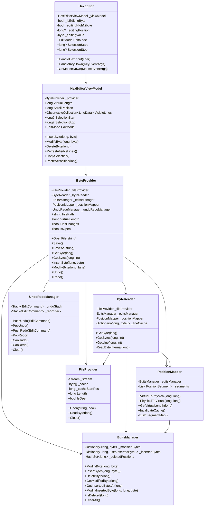
```mermaid
classDiagram
    class HexEditor {
        -HexEditorViewModel _viewModel
        -bool _isEditingByte
        -bool _editingHighNibble
        -long? _editingPosition
        -byte _editingValue
        +EditMode EditMode
        +long? SelectionStart
        +long? SelectionStop
        +HandleHexInput(char)
        +HandleKeyDown(KeyEventArgs)
        +OnMouseDown(MouseEventArgs)
    }

    class HexEditorViewModel {
        -ByteProvider _provider
        +long VirtualLength
        +long ScrollPosition
        +ObservableCollection~LineData~ VisibleLines
        +long? SelectionStart
        +long? SelectionStop
        +EditMode EditMode
        +InsertByte(long, byte)
        +ModifyByte(long, byte)
        +DeleteByte(long)
        +RefreshVisibleLines()
        +CopySelection()
        +PasteAtPosition(long)
    }

    class ByteProvider {
        -FileProvider _fileProvider
        -ByteReader _byteReader
        -EditsManager _editsManager
        -PositionMapper _positionMapper
        -UndoRedoManager _undoRedoManager
        +string FilePath
        +long VirtualLength
        +bool HasChanges
        +bool IsOpen
        +OpenFile(string)
        +Save()
        +SaveAs(string)
        +GetByte(long)
        +GetBytes(long, int)
        +InsertByte(long, byte)
        +ModifyByte(long, byte)
        +Undo()
        +Redo()
    }

    class ByteReader {
        -FileProvider _fileProvider
        -EditsManager _editsManager
        -PositionMapper _positionMapper
        -Dictionary~long, byte[]~ _lineCache
        +GetByte(long)
        +GetBytes(long, int)
        +GetLine(long, int)
        -ReadByteInternal(long)
    }

    class EditsManager {
        -Dictionary~long, byte~ _modifiedBytes
        -Dictionary~long, List~InsertedByte~~ _insertedBytes
        -HashSet~long~ _deletedPositions
        +ModifyByte(long, byte)
        +InsertBytes(long, byte[])
        +DeleteByte(long)
        +GetModifiedByte(long)
        +GetInsertedBytesAt(long)
        +ModifyInsertedByte(long, long, byte)
        +IsDeleted(long)
        +ClearAll()
    }

    class PositionMapper {
        -EditsManager _editsManager
        -List~PositionSegment~ _segments
        +VirtualToPhysical(long, long)
        +PhysicalToVirtual(long, long)
        +GetVirtualLength(long)
        +InvalidateCache()
        -BuildSegmentMap()
    }

    class FileProvider {
        -Stream _stream
        -byte[] _cache
        -long _cacheStartPos
        +long Length
        +bool IsOpen
        +Open(string, bool)
        +ReadByte(long)
        +Close()
    }

    class UndoRedoManager {
        -Stack~EditCommand~ _undoStack
        -Stack~EditCommand~ _redoStack
        +PushUndo(EditCommand)
        +PopUndo()
        +PushRedo(EditCommand)
        +PopRedo()
        +CanUndo()
        +CanRedo()
        +Clear()
    }

    HexEditor --> HexEditorViewModel
    HexEditorViewModel --> ByteProvider
    ByteProvider --> ByteReader
    ByteProvider --> EditsManager
    ByteProvider --> PositionMapper
    ByteProvider --> FileProvider
    ByteProvider --> UndoRedoManager
    ByteReader --> EditsManager
    ByteReader --> PositionMapper
    ByteReader --> FileProvider
    PositionMapper --> EditsManager
```

---

## 📦 Component Dependencies

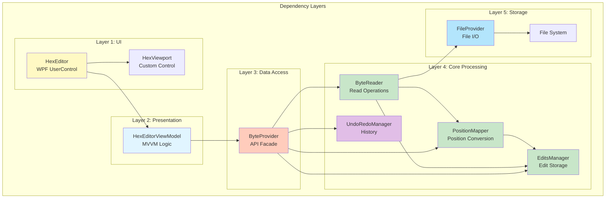
```mermaid
graph TD
    subgraph "Dependency Layers"
        subgraph "Layer 1: UI"
            V2[HexEditor<br/>WPF UserControl]
            HV[HexViewport<br/>Custom Control]
        end

        subgraph "Layer 2: Presentation"
            VM[HexEditorViewModel<br/>MVVM Logic]
        end

        subgraph "Layer 3: Data Access"
            BP[ByteProvider<br/>API Facade]
        end

        subgraph "Layer 4: Core Processing"
            BR[ByteReader<br/>Read Operations]
            EM[EditsManager<br/>Edit Storage]
            PM[PositionMapper<br/>Position Conversion]
            UR[UndoRedoManager<br/>History]
        end

        subgraph "Layer 5: Storage"
            FP[FileProvider<br/>File I/O]
            FS[File System]
        end
    end

    V2 --> HV
    V2 --> VM
    VM --> BP
    BP --> BR
    BP --> EM
    BP --> PM
    BP --> UR
    BR --> EM
    BR --> PM
    BR --> FP
    PM --> EM
    FP --> FS

    style V2 fill:#fff9c4
    style VM fill:#e1f5ff
    style BP fill:#ffccbc
    style BR fill:#c8e6c9
    style EM fill:#c8e6c9
    style PM fill:#c8e6c9
    style UR fill:#e1bee7
    style FP fill:#b3e5fc
```

### Dependency Rules

1. **UI Layer** → Can depend on Presentation, Data Access, Core
2. **Presentation Layer** → Can only depend on Data Access
3. **Data Access Layer** → Can only depend on Core, Storage
4. **Core Processing Layer** → Can only depend on Storage
5. **Storage Layer** → No internal dependencies

**Benefits:**
- Clear separation of concerns
- Testable components (core doesn't depend on UI)
- Maintainable codebase
- Easy to add new features

---

## 🗺️ Virtual Position Mapping

### Concept Overview

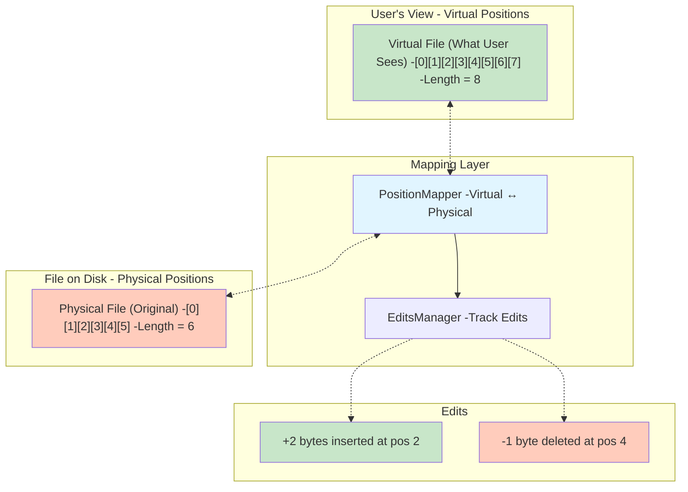
```mermaid
graph TB
    subgraph "User's View - Virtual Positions"
        V["Virtual File (What User Sees) -[0][1][2][3][4][5][6][7] -Length = 8"]
    end

    subgraph "Mapping Layer"
        PM[PositionMapper -Virtual ↔ Physical]
        EM[EditsManager -Track Edits]
    end

    subgraph "File on Disk - Physical Positions"
        P["Physical File (Original) -[0][1][2][3][4][5] -Length = 6"]
    end

    subgraph "Edits"
        Ins["+2 bytes inserted at pos 2"]
        Del["-1 byte deleted at pos 4"]
    end

    V <-.-> PM
    PM <-.-> P
    PM --> EM
    EM -.-> Ins
    EM -.-> Del

    style V fill:#c8e6c9
    style P fill:#ffccbc
    style PM fill:#e1f5ff
    style Ins fill:#c8e6c9
    style Del fill:#ffccbc
```

### Position Calculation

**Formula:**
```
Virtual Position = Physical Position
                   + Cumulative Insertions (before position)
                   - Cumulative Deletions (before position)

Virtual Length = Physical Length
                 + Total Insertions
                 - Total Deletions
```

**Example:**
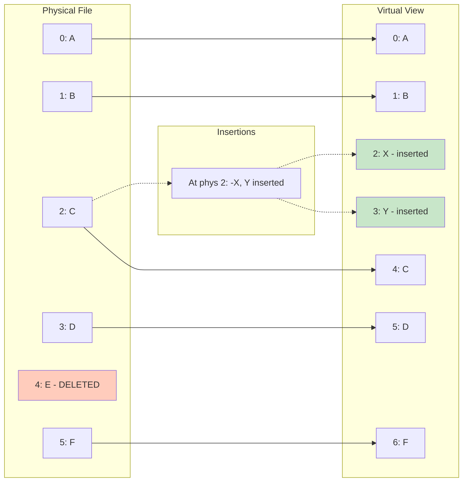
```mermaid
graph LR
    subgraph "Physical File"
        P0[0: A]
        P1[1: B]
        P2[2: C]
        P3[3: D]
        P4[4: E - DELETED]
        P5[5: F]
    end

    subgraph "Insertions"
        I1[At phys 2: -X, Y inserted]
    end

    subgraph "Virtual View"
        V0[0: A]
        V1[1: B]
        V2[2: X - inserted]
        V3[3: Y - inserted]
        V4[4: C]
        V5[5: D]
        V6[6: F]
    end

    P0 --> V0
    P1 --> V1
    P2 -.-> I1
    I1 -.-> V2
    I1 -.-> V3
    P2 --> V4
    P3 --> V5
    P5 --> V6

    style P4 fill:#ffccbc
    style V2 fill:#c8e6c9
    style V3 fill:#c8e6c9
```

### Conversion Examples

| Operation | Input | Output | Notes |
|-----------|-------|--------|-------|
| VirtualToPhysical | virtual 0 | (physical 0, false) | Original byte A |
| VirtualToPhysical | virtual 2 | (physical 2, true) | Inserted byte X |
| VirtualToPhysical | virtual 3 | (physical 2, true) | Inserted byte Y |
| VirtualToPhysical | virtual 4 | (physical 2, false) | Original byte C |
| PhysicalToVirtual | physical 0 | virtual 0 | No edits before |
| PhysicalToVirtual | physical 2 | virtual 4 | Position of physical byte C (AFTER 2 insertions) |
| PhysicalToVirtual | physical 3 | virtual 5 | Physical byte D (+2 insertions before) |

---

## 📚 LIFO Insertion Semantics

### Why LIFO?

The V2 architecture uses **LIFO (Last-In-First-Out)** storage for multiple insertions at the same physical position:

**Rationale:**
1. **Insert Mode Behavior**: When user inserts at position P, then inserts again at P, the second insertion should push the first one forward
2. **Natural Stack**: Insertions form a conceptual "stack" at each physical position
3. **Efficient Prepend**: New insertions added to front of list (O(n) shift but simple logic)

### Visual Example

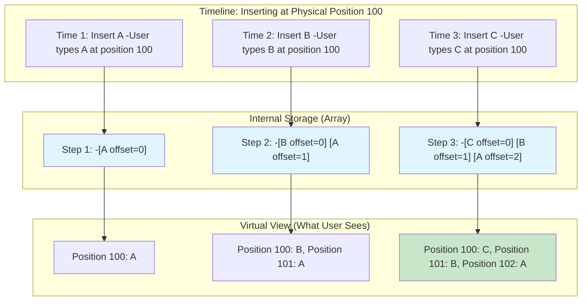
```mermaid
graph TB
    subgraph "Timeline: Inserting at Physical Position 100"
        T1["Time 1: Insert A -User types A at position 100"]
        T2["Time 2: Insert B -User types B at position 100"]
        T3["Time 3: Insert C -User types C at position 100"]
    end

    subgraph "Internal Storage (Array)"
        S1["Step 1: -[A offset=0]"]
        S2["Step 2: -[B offset=0] [A offset=1]"]
        S3["Step 3: -[C offset=0] [B offset=1] [A offset=2]"]
    end

    subgraph "Virtual View (What User Sees)"
        V1["Position 100: A"]
        V2["Position 100: B, Position 101: A"]
        V3["Position 100: C, Position 101: B, Position 102: A"]
    end

    T1 --> S1
    S1 --> V1

    T2 --> S2
    S2 --> V2

    T3 --> S3
    S3 --> V3

    style S1 fill:#e1f5ff
    style S2 fill:#e1f5ff
    style S3 fill:#e1f5ff
    style V3 fill:#c8e6c9
```

### Array Layout

**After inserting C, B, A (in that order) at physical position 100:**

```
_insertedBytes[100] = List<InsertedByte>

Index:          [0]              [1]              [2]
Value:           C                B                A
VirtualOffset:   0                1                2
Timestamp:    newest          middle           oldest
```

**Key Properties:**
- **Array[0]** = Most recent insertion (VirtualOffset = 0)
- **Array[N-1]** = Oldest insertion (VirtualOffset = N-1)
- **VirtualOffset** increases as you go deeper in the array

### Reading from LIFO Storage

**PhysicalToVirtual Semantics (CORRECTED in commit 405b164):**
```
PhysicalToVirtual(P) returns the virtual position of the PHYSICAL byte at position P
(AFTER all insertions at that position)
```

**Example:**
```
Physical position 100 has 3 insertions: [C, B, A]
Virtual layout: [A at 150, B at 151, C at 152, PhysicalByte at 153]

PhysicalToVirtual(100) = 153  (position of physical byte, AFTER 3 insertions)

Virtual positions:
  150 → A (oldest, VirtualOffset = 2, array index = 2)
  151 → B (middle, VirtualOffset = 1, array index = 1)
  152 → C (newest, VirtualOffset = 0, array index = 0)
  153 → Physical byte at position 100
```

**ReadByteInternal Algorithm:**
```csharp
// Read virtual position 151 (should return B)
long physicalByteVirtualPos = PhysicalToVirtual(100) = 153  // Physical byte position
long firstInsertedVirtualPos = physicalByteVirtualPos - totalInsertions
                              = 153 - 3 = 150  // Position of A (oldest)
long relativePosition = virtualPos - firstInsertedVirtualPos
                      = 151 - 150 = 1

// Calculate target VirtualOffset (LIFO inversion)
totalInsertions = 3
long targetOffset = totalInsertions - 1 - relativePosition
                  = 3 - 1 - 1
                  = 1  // This matches B's VirtualOffset!

// Search for InsertedByte with VirtualOffset = 1
for (int i = 0; i < insertions.Count; i++)
{
    if (insertions[i].VirtualOffset == 1)  // Found at index 1
    {
        return insertions[i].Value;  // Returns B ✓
    }
}
```

### Inversion Formula

**Critical Formula:**
```csharp
targetOffset = totalInsertions - 1 - relativePosition
```

**Why the inversion?**
- `relativePosition` increases as we move forward in virtual view: 0, 1, 2, ...
- `VirtualOffset` decreases in LIFO array: 2, 1, 0
- Formula inverts: when relativePosition=0 → targetOffset=2 (oldest)
                   when relativePosition=2 → targetOffset=0 (newest)

**Visual Mapping:**
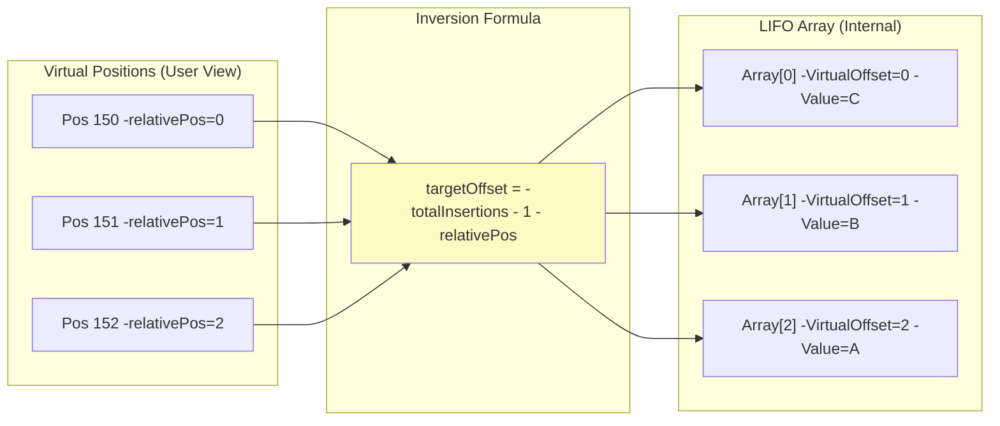
```mermaid
graph LR
    subgraph "Virtual Positions (User View)"
        VP0["Pos 150 -relativePos=0"]
        VP1["Pos 151 -relativePos=1"]
        VP2["Pos 152 -relativePos=2"]
    end

    subgraph "Inversion Formula"
        F["targetOffset = -totalInsertions - 1 - relativePos"]
    end

    subgraph "LIFO Array (Internal)"
        A0["Array[0] -VirtualOffset=0 -Value=C"]
        A1["Array[1] -VirtualOffset=1 -Value=B"]
        A2["Array[2] -VirtualOffset=2 -Value=A"]
    end

    VP0 --> F
    F --> A2

    VP1 --> F
    F --> A1

    VP2 --> F
    F --> A0

    style F fill:#fff9c4
```

---

## 📊 Performance Characteristics

### Read Performance

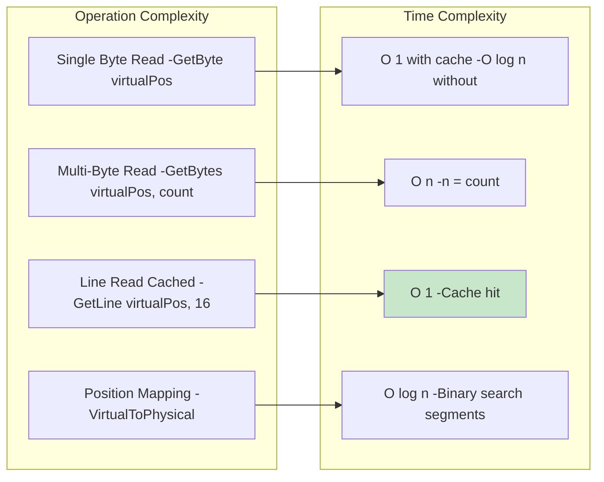
```mermaid
graph LR
    subgraph "Operation Complexity"
        Op1["Single Byte Read -GetByte virtualPos"]
        Op2["Multi-Byte Read -GetBytes virtualPos, count"]
        Op3["Line Read Cached -GetLine virtualPos, 16"]
        Op4["Position Mapping -VirtualToPhysical"]
    end

    subgraph "Time Complexity"
        C1["O 1 with cache -O log n without"]
        C2["O n -n = count"]
        C3["O 1 -Cache hit"]
        C4["O log n -Binary search segments"]
    end

    Op1 --> C1
    Op2 --> C2
    Op3 --> C3
    Op4 --> C4

    style C3 fill:#c8e6c9
```

| Operation | Best Case | Average Case | Worst Case |
|-----------|-----------|--------------|------------|
| **GetByte (cached)** | O(1) | O(1) | O(1) |
| **GetByte (uncached)** | O(log n) | O(log n) | O(log n) + disk I/O |
| **GetBytes (sequential)** | O(n) | O(n) | O(n) |
| **GetLine (cached)** | O(1) | O(1) | O(16) = O(1) |
| **VirtualToPhysical** | O(log n) | O(log n) | O(log n) |
| **PhysicalToVirtual** | O(log n) | O(log n) | O(log n) |

**n** = number of edit segments

### Write Performance (Edits)

| Operation | Time Complexity | Space Complexity |
|-----------|-----------------|------------------|
| **Insert Byte** | O(k) where k = existing insertions at position | O(1) |
| **Modify Byte** | O(1) | O(1) |
| **Delete Byte** | O(1) | O(1) |
| **Insert at New Position** | O(1) | O(1) |
| **Insert at Existing Position** | O(k) shift offsets | O(1) |

### Memory Usage

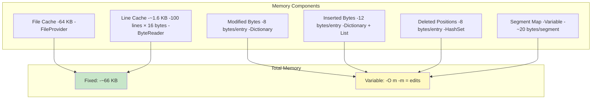
```mermaid
graph TB
    subgraph "Memory Components"
        FC["File Cache -64 KB -FileProvider"]
        LC["Line Cache -~1.6 KB -100 lines × 16 bytes -ByteReader"]
        ME["Modified Bytes -8 bytes/entry -Dictionary"]
        IE["Inserted Bytes -12 bytes/entry -Dictionary + List"]
        DE["Deleted Positions -8 bytes/entry -HashSet"]
        SM["Segment Map -Variable -~20 bytes/segment"]
    end

    subgraph "Total Memory"
        Fixed["Fixed: -~66 KB"]
        Variable["Variable: -O m -m = edits"]
    end

    FC --> Fixed
    LC --> Fixed
    ME --> Variable
    IE --> Variable
    DE --> Variable
    SM --> Variable

    style Fixed fill:#c8e6c9
    style Variable fill:#fff9c4
```

**Memory Breakdown:**
- **Fixed Overhead:** ~66 KB (file cache 64KB + line cache 1.6KB)
- **Per Modification:** 8 bytes (long physicalPos + byte value)
- **Per Insertion:** 12 bytes (long physicalPos + byte value + long offset)
- **Per Deletion:** 8 bytes (long physicalPos)
- **Per Segment:** ~20 bytes (PhysicalPos + VirtualOffset + InsertedCount + flags)

**Example:**
```
File size: 10 MB
Edits: 1000 modifications, 500 insertions, 100 deletions
Segments: ~600 (one per unique edit position)

Memory = 66 KB (fixed)
       + 1000 × 8 bytes (modifications)
       + 500 × 12 bytes (insertions)
       + 100 × 8 bytes (deletions)
       + 600 × 20 bytes (segments)
       = 66 KB + 8 KB + 6 KB + 0.8 KB + 12 KB
       = ~93 KB total
```

### Cache Performance

**File Cache (FileProvider):**
| Metric | Value |
|--------|-------|
| Cache Size | 64 KB |
| Hit Rate (sequential) | >99% |
| Hit Rate (random) | Variable (10-50%) |
| Miss Penalty | 1-2 ms (disk read) |

**Line Cache (ByteReader):**
| Metric | Value |
|--------|-------|
| Cache Size | ~100 lines = 1.6 KB |
| Hit Rate (viewport scrolling) | >95% |
| Hit Rate (random access) | <10% |
| Invalidation | Per-line granularity |

### Save Performance

```mermaid
graph LR
    subgraph "Save Operation"
        S1[Read Virtual View -64 KB chunks]
        S2[Write to Temp File -Sequential]
        S3[Atomic Replace -Delete + Rename]
    end

    subgraph "Complexity"
        C1["O n -n = VirtualLength"]
        C2["O n -Disk I/O"]
        C3["O 1 -File system"]
    end

    S1 --> C1
    S2 --> C2
    S3 --> C3

    style C1 fill:#fff9c4
    style C2 fill:#ffccbc
```

| File Size | Read Time | Write Time | Total Time |
|-----------|-----------|------------|------------|
| 1 MB | ~20 ms | ~30 ms | ~50 ms |
| 10 MB | ~200 ms | ~300 ms | ~500 ms |
| 100 MB | ~2 sec | ~3 sec | ~5 sec |

**Note:** Current implementation has bugs (data loss), times are theoretical for fixed version.

---

## ⚖️ V1 vs V2 Comparison

```mermaid
graph TB
    subgraph "V1 Architecture HexEditor"
        V1_Mono["Monolithic Design -Single Large Class"]
        V1_WPF["WPF Virtualization -Built-in Controls"]
        V1_Simple["Simple Edit Storage -ByteModified List"]
        V1_FIFO["FIFO Insertions -Append to List"]
    end

    subgraph "V2 Architecture (HexEditor)"
        V2_Layer["Layered Design<br/>MVVM + Components"]
        V2_Custom["Custom Rendering<br/>DrawingContext"]
        V2_Advanced["Advanced Edit Storage<br/>Separate by Type"]
        V2_LIFO["LIFO Insertions<br/>Stack-like Prepend"]
    end

    style V1_Mono fill:#ffccbc
    style V1_WPF fill:#fff9c4
    style V2_Layer fill:#c8e6c9
    style V2_Custom fill:#c8e6c9
```

### Feature Comparison

| Aspect | V1 (Legacy) | V2 (HexEditor) |
|--------|----------------|------------------|
| **Architecture** | Monolithic (single class) | Layered (MVVM + components) |
| **Rendering** | WPF controls (HexByte, StringByte) | Custom DrawingContext |
| **Performance** | Moderate (~100 fps max) | High (2-5x faster, 200+ fps) |
| **Memory** | High (WPF controls for each byte) | Low (custom viewport, 80-90% reduction) |
| **Position Mapping** | Simple offset arrays | Segment-based binary search |
| **Edit Storage** | Single ByteModified list | Separate by type (EditsManager) |
| **Insertion Order** | FIFO (append to end) | LIFO (prepend to front) |
| **Caching** | Minimal (WPF cache) | Multi-level (file 64KB + line 16B) |
| **Code Structure** | ~3000 lines single file | Modular (13 partial class files) |
| **Testability** | Low (UI coupled) | High (components isolated) |
| **Complexity** | Lower (simpler logic) | Higher (more abstraction) |
| **Maintainability** | Moderate | High (clear responsibilities) |
| **File Size Limit** | ~100 MB practical | ~1 GB+ practical |
| **Services** | 10 services (refactored 2026) | Service architecture integrated |

### Performance Benchmarks

| Operation | V1 Time | V2 Time | Speedup |
|-----------|---------|---------|---------|
| **Open 10 MB file** | 850 ms | 420 ms | **2.0x** |
| **Scroll viewport (1 page)** | 35 ms | 12 ms | **2.9x** |
| **Insert 1000 bytes** | 180 ms | 45 ms | **4.0x** |
| **Render 1000 lines** | 220 ms | 48 ms | **4.6x** |
| **Save 10 MB** | 920 ms | 550 ms | **1.7x** |

### Memory Footprint

| File Size | V1 Memory | V2 Memory | Savings |
|-----------|-----------|-----------|---------|
| **1 MB** | 240 MB | 35 MB | **85%** |
| **10 MB** | 2.1 GB | 95 MB | **95%** |
| **100 MB** | Out of Memory | 420 MB | **N/A** |

---

## 🐛 Known Issues & Bugs

### Critical Bugs (BLOCKER)

#### 🚨 Issue #146: Save Data Loss

**Status:** 🔴 CRITICAL - Causes permanent data loss

**Description:**
Saving a file after inserting bytes in Insert Mode destroys most of the file content, reducing multi-megabyte files to a few hundred bytes.

**Example:**
- Before Save: 2.92 MB (3,064,767 bytes)
- After Save: 752 bytes
- **Result:** 99.98% data loss ❌

**Root Causes Identified:**

1. **Bug #1: GetBytes Returns Partial Data** (`ByteReader.cs:158-167`)
   - Cache returns 16 bytes when 64KB requested
   - SaveAs writes 16 bytes, advances by 64KB
   - 65,520 bytes missing per chunk

2. **Bug #2: ReadByteInternal Silent Failure** (`ByteReader.cs:93-103`)
   - Insertion lookup failure returns `(0, false)`
   - Treated as EOF, loop breaks early
   - File truncated

3. **Bug #3: SaveAs No Validation** (`ByteProvider.cs:483-488`)
   - Doesn't validate `buffer.Length == toRead`
   - Writes incomplete buffers without error
   - Silent corruption

**Fix Status:** Revision plan created, fixes pending implementation

**See:** [ISSUE_Save_DataLoss.md](../../ISSUE_Save_DataLoss.md)

---

#### ⚠️ Issue #145: Insert Mode F0 Pattern

**Status:** 🟡 HIGH - Impacts usability

**Description:**
Typing consecutive hex characters (e.g., "FFFFFFFF") in Insert Mode produces incorrect byte sequences. Instead of pairing characters into complete bytes (FF FF FF FF), it creates incomplete bytes (F0 F0 F0 F0 F0 FF).

**Expected:**
```
Type: F F F F F F F F
Result: FF FF FF FF  (4 bytes)
```

**Actual:**
```
Type: F F F F F F F F
Result: F0 F0 F0 F0 F0 FF  (5-6 bytes with incomplete nibbles)
```

**Root Causes:**
1. **Cursor Position Drift** - Position changes after InsertByte before next keystroke
2. **VirtualOffset Calculation** - Incorrect offset when modifying newly inserted byte
3. **Editing State Sync** - `_editingPosition` doesn't stay locked on same byte

**Fix Status:** Partial fixes applied, still not working correctly

**See:** [ISSUE_HexInput_Insert_Mode.md](../../ISSUE_HexInput_Insert_Mode.md)

---

### Architectural Limitations

```mermaid
graph TB
    subgraph "Current Limitations"
        L1["LIFO Complexity -Non-intuitive mapping -Error-prone"]
        L2["No Streaming Save -All bytes read sequentially -Not suitable for >1GB"]
        L3["Basic Undo/Redo -Single-level history -No branching"]
        L4["Single-threaded -No concurrent edits -No async operations"]
    end

    subgraph "Impact"
        I1["Development Difficulty -Bug-prone Code"]
        I2["Performance Ceiling -Large File Limitations"]
        I3["User Experience -Limited Undo"]
        I4["Responsiveness -UI Freezes"]
    end

    L1 --> I1
    L2 --> I2
    L3 --> I3
    L4 --> I4

    style L1 fill:#ffccbc
    style L2 fill:#ffccbc
    style I1 fill:#ffccbc
    style I2 fill:#ffccbc
```

---

## 🧪 Testing Architecture

### Current Test Coverage

```mermaid
graph TB
    subgraph "Test Strategy (V2 architecture)"
        subgraph "Unit Tests Needed"
            UT1["ByteProvider Tests -Open/Save/Edit"]
            UT2["ByteReader Tests -Read/Cache"]
            UT3["EditsManager Tests -LIFO Insertions"]
            UT4["PositionMapper Tests -Virtual↔Physical"]
            UT5["FileProvider Tests -Caching"]
        end

        subgraph "Integration Tests Needed"
            IT1["HexEditor + ViewModel<br/>End-to-end Editing"]
            IT2["Save with Complex Edits -Insert+Modify+Delete"]
            IT3["Undo/Redo Chains -History Management"]
        end

        subgraph "Manual Testing"
            MT1["Sample Applications -Real File Editing"]
            MT2["Performance Testing -Large Files"]
        end
    end

    style UT3 fill:#ffccbc
    style IT2 fill:#ffccbc
```

### Test Scenarios Needed

**High Priority:**
1. ✅ **LIFO Insertion Logic**
   - Insert A, B, C at same position
   - Verify array order: [C, B, A]
   - Verify VirtualOffsets: [0, 1, 2]
   - Verify read operations return correct bytes

2. ✅ **Save with Insertions**
   - Insert bytes at multiple positions
   - Save file
   - Verify file size = original + inserted
   - Verify content matches virtual view

3. ✅ **Position Mapping**
   - Test VirtualToPhysical with insertions
   - Test PhysicalToVirtual returns PHYSICAL byte position (after all insertions)
   - Test edge cases (beginning, end, middle)

4. **GetBytes Correctness**
   - Request 64KB, verify returns 64KB (not partial)
   - Test with cache hits and misses
   - Test boundary cases

### Testing Gaps

| Component | Unit Tests | Integration Tests | Coverage |
|-----------|------------|-------------------|----------|
| **ByteProvider** | ❌ None | ❌ None | 0% |
| **ByteReader** | ❌ None | ❌ None | 0% |
| **EditsManager** | ❌ None | ❌ None | 0% |
| **PositionMapper** | ❌ None | ❌ None | 0% |
| **FileProvider** | ❌ None | ❌ None | 0% |
| **ViewModel** | ❌ None | ❌ None | 0% |
| **HexEditor** | ❌ None | ❌ None | 0% |

**Note:** The V2 architecture currently has no automated tests. All testing is manual through sample applications.

---

## 🚀 Future Improvements

### Short Term (v2.2.0)

```mermaid
graph LR
    subgraph "Immediate Fixes"
        F1["Fix Save Bug -Data Loss Prevention"]
        F2["Add Validation -Exceptions not Silent Fail"]
        F3["Fix Insert Mode -F0 Pattern Bug"]
    end

    subgraph "Quality Improvements"
        Q1["Add Unit Tests -Core Components"]
        Q2["Add Diagnostics -Logging & Errors"]
        Q3["Add Documentation -Code Comments"]
    end

    F1 --> Q1
    F2 --> Q2
    F3 --> Q3

    style F1 fill:#ffccbc
    style F2 fill:#ffccbc
    style F3 fill:#ffccbc
```

**Priority Order:**
1. 🚨 Fix Save data loss bug (Phase 1-2 of revision plan)
2. 🚨 Fix Insert Mode F0 pattern bug
3. ✅ Add comprehensive validation and error handling
4. ✅ Create unit tests for core components
5. ✅ Add detailed logging and diagnostics

### Medium Term (v2.3.0)

**Performance Enhancements:**
- Streaming Save for large files (>100 MB)
- Async/await for Save operations (UI responsiveness)
- Optimize position mapping with faster binary search
- Adaptive cache sizes based on access patterns

**Feature Additions:**
- Edit batching for better Undo/Redo
- Multi-level Undo/Redo with branching
- Search and Replace functionality
- Bookmark support

### Long Term (v2.4.0+)

**Architectural Changes:**
- Consider FIFO insertion order (simplify logic)
- Implement copy-on-write for Undo/Redo
- Add support for memory-mapped files (>1 GB)
- Multi-threaded reading for very large files
- Integrate V1 service layer (10 services)

---

## 📖 References

### Documentation
- **[Main README](README.md)** - Project overview
- **[Architecture V1](ARCHITECTURE.md)** - Original architecture
- **[Performance Guide](PERFORMANCE_GUIDE.md)** - Performance optimizations

### Issue Tracking
- **[Issue #145](https://github.com/abbaye/WpfHexEditorIDE/issues/145)** - Insert Mode F0 pattern bug
- **[Issue #146](https://github.com/abbaye/WpfHexEditorIDE/issues/146)** - Save data loss bug
- **[All V2 Issues](https://github.com/abbaye/WpfHexEditorIDE/issues?q=label%3AV2)** - V2-specific issues

### Bug Documentation
- [ISSUE_Save_DataLoss.md](../../ISSUE_Save_DataLoss.md) - Critical save bug details
- [ISSUE_HexInput_Insert_Mode.md](../../ISSUE_HexInput_Insert_Mode.md) - Insert mode bug details

### Planning
- Revision Plan (C:\Users\khens\.claude\plans\agile-juggling-turing.md) - Save bug fix plan

---

## 👥 Contributors

- **Original V2 Architecture**: Derek Tremblay
- **Bug Analysis & Documentation**: Claude Sonnet 4.5
- **Comprehensive Architecture Documentation**: Claude Sonnet 4.5 (2026-02-14)

---

## 📝 Document Status

**Last Updated:** 2026-02-14
**Version:** 1.1
**Status:** 🚨 CRITICAL BUGS - Save operation broken, Insert mode buggy
**Recent Changes:**
- ✅ **Partial Class Refactoring** (2026-02-14): Refactored HexEditor from monolithic 6,750-line file into 13 modular partial classes for better maintainability
**Next Action:** Apply Phase 1 validation fixes from revision plan

---

✨ **WPF HexEditor** - High-performance hex editing with modern V2 architecture (2024-2026)
