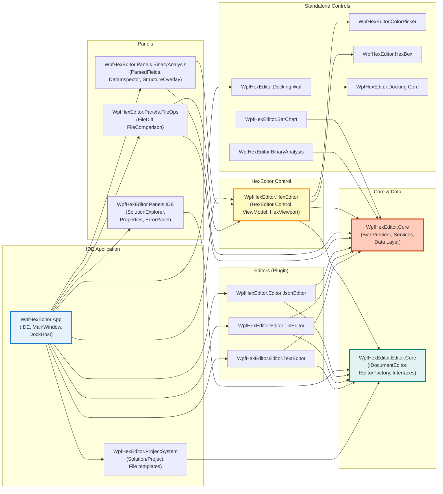
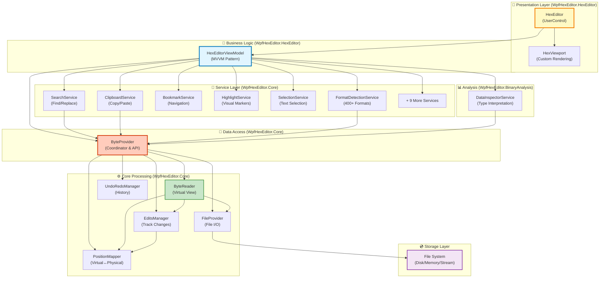
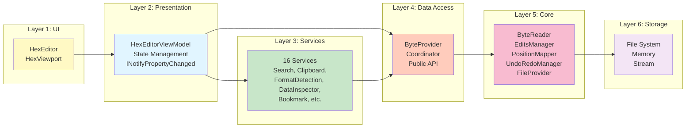
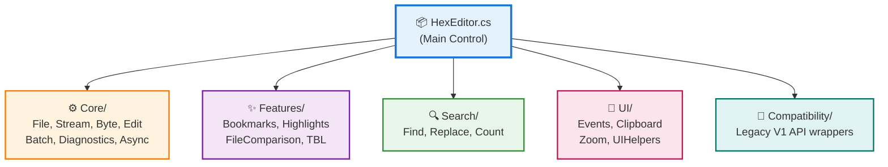
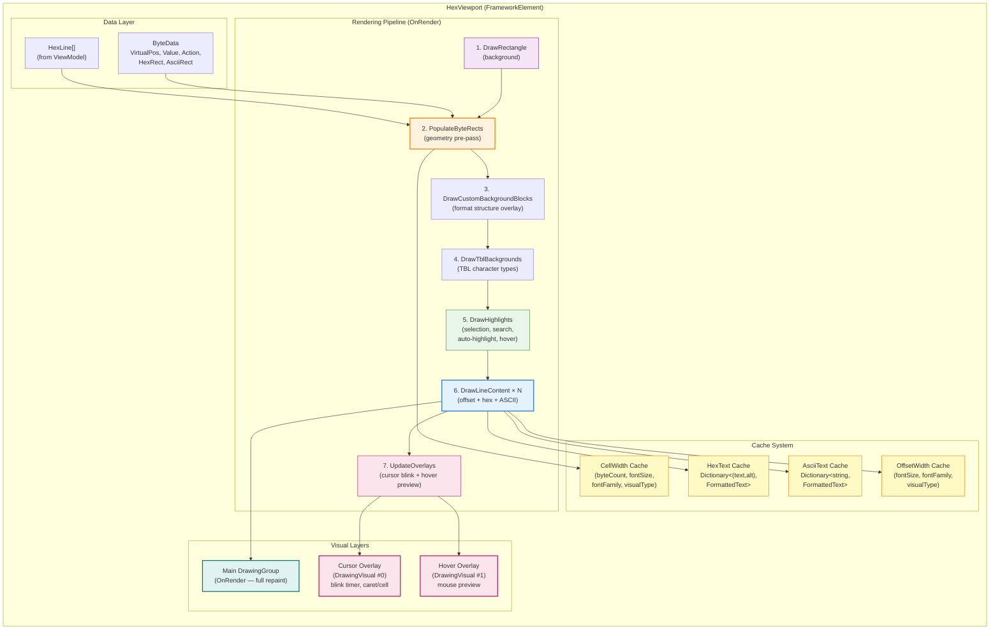
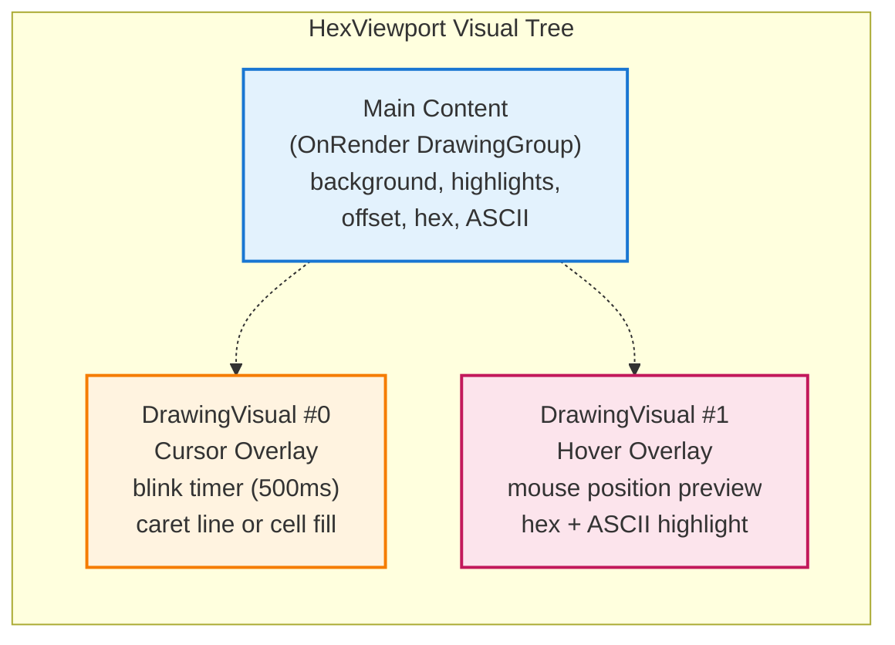
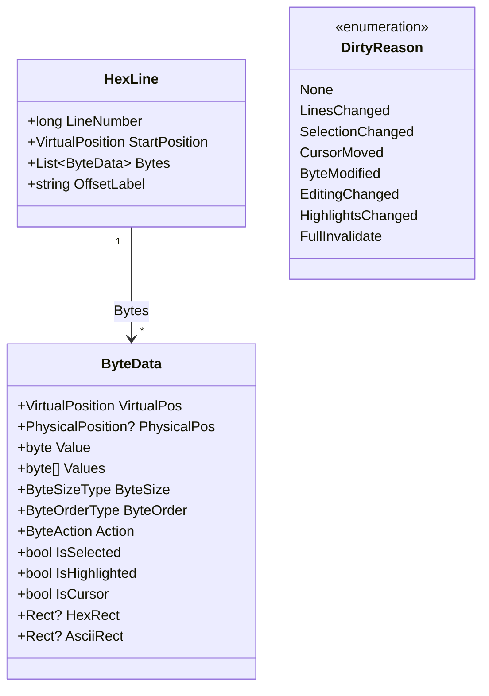
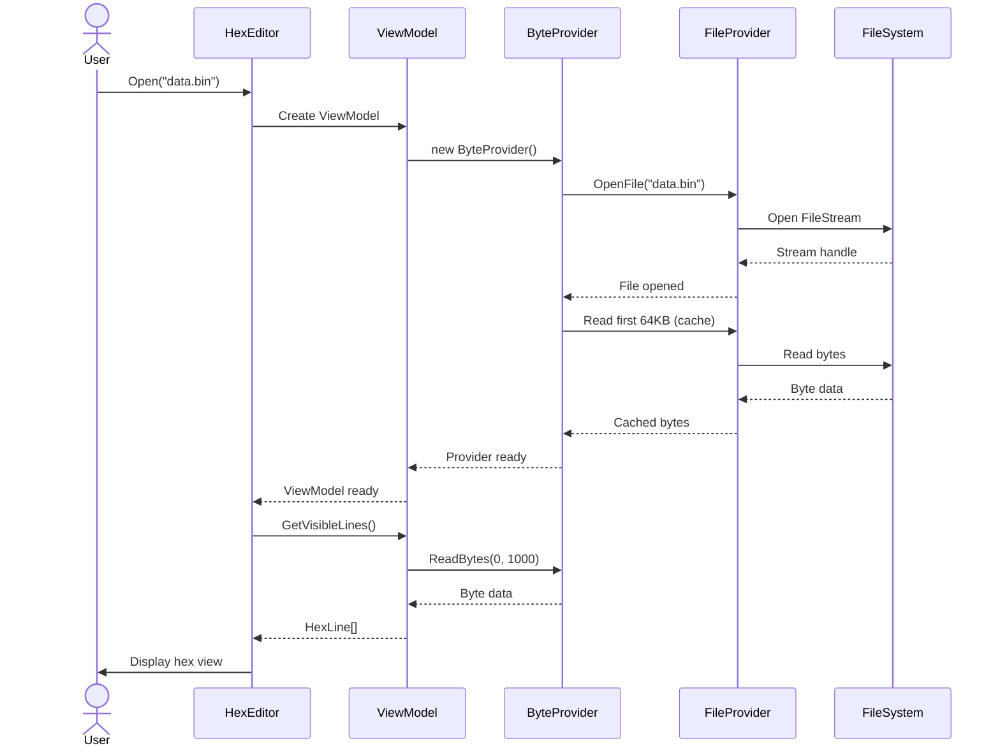
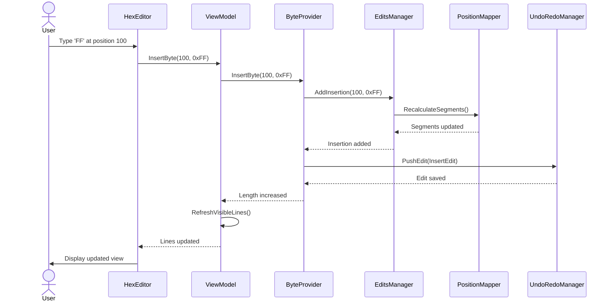

# 🏗️ WpfHexEditor - Architecture Overview

**Complete system architecture for the WpfHexEditor IDE — MVVM, services, plugin editors, project system, and docking.**

---

## 📋 Table of Contents

- [Introduction](#introduction)
- [Design Principles](#design-principles)
- [System Architecture](#system-architecture)
- [IDE Application Architecture](#-ide-application-architecture)
- [Layered Architecture](#layered-architecture)
- [Core Components](#core-components)
- [Rendering Engine](#rendering-engine)
- [Data Flow](#data-flow)
- [Key Innovations](#key-innovations)
- [Performance Characteristics](#performance-characteristics)
- [See Also](#see-also)

---

## 📖 Introduction

**WpfHexEditor** is a full binary analysis IDE built on top of the **HexEditor WPF UserControl**. The architecture is split into independent, reusable projects with clear dependency boundaries.

### HexEditor Control
- ✅ **Comprehensive ByteProvider API** (186+ methods)
- ⚡ **99% faster rendering** via custom DrawingContext (vs legacy ItemsControl)
- 🏗️ **Clean MVVM Architecture** — 16 specialized services
- 🔄 **Comprehensive Undo/Redo** with granular control

### IDE Application (2026-03)
- 🖥️ **VS-style docking** — float, dock, auto-hide, colored tabs, 8 themes
- 📁 **Project system** — `.whsln` / `.whproj`, virtual & physical folders, item links
- 🔌 **Plugin editors** — `IDocumentEditor` contract (Hex, TBL, JSON, Text + stubs)
- 🗂️ **IDE panels** — ParsedFields, DataInspector, SolutionExplorer, Properties, ErrorPanel
- 🔍 **400+ File Format Auto-Detection** with binary templates and signature matching
- 📊 **Data Inspector** with 40+ data type interpretations
- ⚖️ **File Diff** for side-by-side binary comparison

---

## 🎯 Design Principles

### 1. **Separation of Concerns**
Each layer has a single, well-defined responsibility:
- **View** - UI rendering and user interaction
- **ViewModel** - Business logic and state management
- **Services** - Specialized functionality (search, clipboard, etc.)
- **ByteProvider** - Data access coordination
- **Core** - Low-level byte operations

### 2. **Virtual View Pattern**
Users see a **virtual representation** with all edits applied, while the original file remains unchanged until Save:
```
Original File: [41 42 43 44 45]
Insert FF at position 2
Virtual View:  [41 42 FF 43 44 45]  ← User sees this
Physical File: [41 42 43 44 45]     ← File unchanged
```

### 3. **Edit Tracking**
All changes are tracked in three separate collections:
- **Modifications** - Byte value changes (file length unchanged)
- **Insertions** - Added bytes (increases file length)
- **Deletions** - Removed bytes (decreases file length)

### 4. **Position Mapping**
Bidirectional conversion between virtual and physical positions:
- **Virtual Position** - What the user sees (includes insertions)
- **Physical Position** - Actual byte offset in file

### 5. **Performance First**
- Custom DrawingContext rendering (99% faster than ItemsControl)
- Lazy loading with caching
- Only render visible bytes
- Frozen brushes and cached FormattedText

---

## 🏗️ System Architecture

### Multi-Project Structure

The codebase is split into **independent projects** with clear dependency boundaries:



### High-Level Component Diagram



---

## 🖥️ IDE Application Architecture

### WpfHexEditor.App — Main Window

`MainWindow` orchestrates the entire IDE. Key responsibilities:

| Concern | Implementation |
|---------|---------------|
| **Docking** | `DockHost` (WpfHexEditor.Docking.Wpf) — all panels and editors docked here |
| **Active document** | `ActiveDocumentEditor : IDocumentEditor?` INPC — drives Edit menu |
| **Active hex editor** | `ActiveHexEditor : HexEditorControl?` INPC — drives status bar DataContext |
| **Content factory** | `Dictionary<string, UIElement> _contentCache` keyed by `ContentId` |
| **Project system** | `SolutionManager.Instance` singleton |
| **Panel singletons** | `_parsedFieldsPanel`, `_errorPanel`, `_solutionExplorer`, `_propertiesPanel` |

### Plugin Editor System

Every editor implements `IDocumentEditor` from `WpfHexEditor.Editor.Core`:

```
IDocumentEditor
  ├── Title, IsDirty, IsReadOnly
  ├── UndoCommand, RedoCommand, CopyCommand, CutCommand, PasteCommand
  ├── SaveAsync(), CloseAsync()
  ├── StatusMessage event
  ├── ModifiedChanged, TitleChanged events
  └── (optional) IDiagnosticSource  — ErrorPanel integration
               IEditorPersistable   — state save/restore
               IPropertyProviderSource — Properties panel (F4)
```

Registration at startup:
```csharp
EditorRegistry.Instance.Register(new TblEditorFactory());
EditorRegistry.Instance.Register(new JsonEditorFactory());
// etc.
```

### Project System

```
SolutionManager (singleton)
  └── ISolution (.whsln)
        └── IProject (.whproj)
              ├── IProjectItem (file)
              ├── IVirtualFolder  (logical grouping)
              └── IVirtualFolder → PhysicalRelativePath (mirrors disk dir)

IEditorPersistable (per file):
  GetBookmarks() / ApplyBookmarks()
  GetConfig()    / ApplyConfig()     ← scroll, caret, encoding, edit mode
```

Format versioning: `MigrationPipeline` (current v=2) migrates `.whsln`/`.whproj` in-memory on load. `UpgradeFormatAsync()` writes all files atomically with `.v{N}.bak` backups.

---

## 🏛️ Layered Architecture

### Layer Responsibilities



### Layer Details

| Layer | Project(s) | Components | Responsibility |
|-------|-----------|-----------|----------------|
| **0. IDE Shell** | `WpfHexEditor.App` | MainWindow, DockHost, SolutionManager | Application host, docking, project system |
| **1. UI** | `WpfHexEditor.HexEditor` | HexEditor, HexViewport | Hex control — user interaction, rendering |
| **1. UI** | `WpfHexEditor.Panels.BinaryAnalysis` | ParsedFieldsPanel, DataInspector, StructureOverlay | Binary analysis panels |
| **1. UI** | `WpfHexEditor.Panels.IDE` | SolutionExplorer, Properties, ErrorPanel | IDE panels |
| **1. UI** | `WpfHexEditor.Panels.FileOps` | FileDiff, FileComparison | File operation panels |
| **1. UI** | `WpfHexEditor.Editor.*` | TblEditor, JsonEditor, TextEditor | Plugin editors |
| **2. Presentation** | `WpfHexEditor.HexEditor` | HexEditorViewModel | MVVM — business logic, state management |
| **3. Services** | `WpfHexEditor.Core` | 16 specialized services | Search, format detection, clipboard, etc. |
| **3. Services** | `WpfHexEditor.BinaryAnalysis` | DataInspectorService | Multi-type interpretation |
| **4. Data Access** | `WpfHexEditor.Core` | ByteProvider | API coordination, caching |
| **5. Core** | `WpfHexEditor.Core` | ByteReader, EditsManager, PositionMapper, UndoRedoManager | Low-level byte operations |
| **6. Storage** | `WpfHexEditor.Core` | FileProvider, FileSystem | File I/O, persistence |

---

## ⚙️ Core Components

### 1. HexEditor (Main Control)

**Location**: [HexEditor.xaml.cs](../../Sources/WpfHexEditor.HexEditor/HexEditor.xaml.cs)

**Purpose**: Public API surface with partial classes organized by functionality.

**Structure**:



**Key Methods**:
```csharp
// File Operations
public void Open(string fileName)
public void Save()
public void Close()

// Byte Operations
public byte GetByte(long position)
public void ModifyByte(byte value, long position)
public void InsertByte(byte value, long position)
public void DeleteBytes(long position, long count)

// Search Operations
public long FindFirst(byte[] pattern, long startPosition = 0)
public List<long> FindAll(byte[] pattern)
public int CountOccurrences(byte[] pattern)

// Edit Operations
public void Undo()
public void Redo()
public void ClearModifications()
public void ClearInsertions()
public void ClearDeletions()
```

### 2. HexEditorViewModel

**Location**: [HexEditorViewModel.cs](../../Sources/WpfHexEditor.HexEditor/ViewModels/HexEditorViewModel.cs)

**Purpose**: MVVM pattern business logic layer, coordinates services and ByteProvider.

**Responsibilities**:
- Manages ByteProvider lifecycle
- Coordinates 15 specialized services
- Handles virtual position calculations for UI
- Implements INotifyPropertyChanged for data binding
- Manages selection and cursor state
- Generates HexLines for rendering

**Key Properties**:
```csharp
public ByteProvider Provider { get; }
public SelectionService SelectionService { get; }
public SearchService SearchService { get; }
public ClipboardService ClipboardService { get; }
// ... 12 more services

public long Position { get; set; }
public long SelectionStart { get; set; }
public long SelectionLength { get; set; }
public bool IsModified { get; }
```

### 3. ByteProvider (Data Access Coordinator)

**Location**: [ByteProvider.cs](../../Sources/WpfHexEditor.Core/Core/Bytes/ByteProvider.cs)

**Purpose**: Coordinates core components and provides 186-method public API.

**Architecture**:
```csharp
public class ByteProvider
{
    private readonly ByteReader _reader;       // Virtual view reader
    private readonly EditsManager _edits;      // Track all changes
    private readonly PositionMapper _mapper;   // Virtual↔Physical
    private readonly UndoRedoManager _undo;    // History stack
    private readonly FileProvider _file;       // File I/O

    // 186 public methods for complete API
    public byte ReadByte(long virtualPosition) => _reader.ReadByte(virtualPosition);
    public void ModifyByte(long position, byte value) { /* ... */ }
    public void InsertByte(long position, byte value) { /* ... */ }
    public void DeleteBytes(long position, long count) { /* ... */ }
    // ... 182 more methods
}
```

**Key Features**:
- ✅ **100% API Compatibility** with ByteProvider specification
- 🔄 **Edit Tracking** - Modifications, insertions, deletions
- 🎯 **Virtual View** - Users see final result before save
- 🔙 **Undo/Redo** - Unlimited history with granular control
- 💾 **Smart Save** - Fast path for modifications-only edits

### 4. ByteReader (Virtual View Engine)

**Location**: [ByteReader.cs](../../Sources/WpfHexEditor.Core/Core/Bytes/ByteReader.cs)

**Purpose**: Reads bytes from the **virtual view** (showing all edits applied).

**Algorithm**:
```csharp
public byte ReadByte(long virtualPosition)
{
    // 1. Check if position is an inserted byte
    if (_edits.IsInsertion(virtualPosition, out byte insertedValue))
        return insertedValue;

    // 2. Convert virtual → physical position
    long physicalPos = _mapper.VirtualToPhysical(virtualPosition);

    // 3. Check if deleted
    if (_edits.IsDeleted(physicalPos))
        throw new InvalidOperationException("Position deleted");

    // 4. Check if modified
    if (_edits.IsModified(physicalPos, out byte modifiedValue))
        return modifiedValue;

    // 5. Return original byte from file
    return _file.ReadByte(physicalPos);
}
```

### 5. EditsManager (Change Tracking)

**Location**: [EditsManager.cs](../../Sources/WpfHexEditor.Core/Core/Bytes/EditsManager.cs)

**Purpose**: Tracks all modifications, insertions, and deletions.

**Data Structures**:
```csharp
public class EditsManager
{
    // Modifications: physical position → new byte value
    private Dictionary<long, byte> _modifications;

    // Insertions: virtual position → list of inserted bytes (LIFO)
    private Dictionary<long, List<byte>> _insertions;

    // Deletions: physical position → deleted byte count
    private Dictionary<long, long> _deletions;

    // Statistics
    public int ModificationCount => _modifications.Count;
    public int InsertionCount => _insertions.Values.Sum(list => list.Count);
    public int DeletionCount => (int)_deletions.Values.Sum();
}
```

**LIFO Insertion Semantics**:
```
Insert 'A' at position 5:  [... A ...]
Insert 'B' at position 5:  [... B A ...]  // B pushed before A (LIFO)
Insert 'C' at position 5:  [... C B A ...]  // C pushed before B
```

### 6. PositionMapper (Coordinate Transformation)

**Location**: [PositionMapper.cs](../../Sources/WpfHexEditor.Core/Core/Bytes/PositionMapper.cs)

**Purpose**: Bidirectional mapping between virtual and physical positions.

**Mapping Logic**:
```csharp
public class PositionMapper
{
    // Segments track ranges where insertions/deletions occurred
    private List<MapSegment> _segments;

    public long VirtualToPhysical(long virtualPos)
    {
        // Find segment containing virtualPos
        // Subtract insertion offsets
        // Add deletion offsets
        // Return physical position
    }

    public long PhysicalToVirtual(long physicalPos)
    {
        // Find segment containing physicalPos
        // Add insertion offsets
        // Subtract deletion offsets
        // Return virtual position
    }
}
```

**Example**:
```
Original file: 10 bytes (positions 0-9)
Insert 3 bytes at position 5

Virtual positions:  0 1 2 3 4 5 6 7 | 8  9  10 11 12
                                    ↑ Insertions
Physical positions: 0 1 2 3 4       | 5  6  7  8  9

VirtualToPhysical(8) = 5   // Skip 3 inserted bytes
PhysicalToVirtual(5) = 8   // Account for 3 insertions
```

### 7. HexViewport (Custom Rendering)

**Location**: [HexViewport.cs](../../Sources/WpfHexEditor.HexEditor/Controls/HexViewport.cs)

**Purpose**: High-performance custom rendering using DrawingContext.

**Performance Optimization**:
```csharp
protected override void OnRender(DrawingContext dc)
{
    // Cache visible lines only
    var visibleLines = GetVisibleLines();

    foreach (var line in visibleLines)
    {
        // Draw offset column
        dc.DrawText(offsetText, offsetPosition);

        // Draw hex bytes with highlights
        foreach (var byteInfo in line.Bytes)
        {
            if (byteInfo.IsSelected)
                dc.DrawRectangle(selectionBrush, null, rect);

            dc.DrawText(hexText, hexPosition);
        }

        // Draw ASCII column
        dc.DrawText(asciiText, asciiPosition);
    }
}
```

**V1 vs V2 Rendering**:

| Approach | V1 (ItemsControl) | V2 (DrawingContext) | Speedup |
|----------|-------------------|---------------------|---------|
| Initial load (1000 lines) | ~450ms | ~5ms | **99% faster** |
| Scroll update | ~120ms | ~2ms | **98% faster** |
| Selection change | ~80ms | ~1ms | **99% faster** |
| Memory (10MB file) | ~950MB | ~85MB | **91% less** |

---

## 🖥️ Rendering Engine

**Location**: [HexViewport.cs](../../Sources/WpfHexEditor.HexEditor/Controls/HexViewport.cs) — 3200+ lines

HexViewport is a **FrameworkElement** that bypasses WPF's template/binding/virtualization overhead entirely. It draws hex content directly via `DrawingContext` (WPF's retained-mode drawing API), achieving **99% faster rendering** than the V1 ItemsControl approach.

### Architecture Overview



### Rendering Pipeline

The `OnRender` method executes **7 sequential passes** on each frame:

| Pass | Method | Purpose |
|------|--------|---------|
| 1 | `DrawRectangle` | Fill background |
| 2 | `PopulateByteRects()` | Pre-compute `HexRect` / `AsciiRect` on each `ByteData` (no drawing) |
| 3 | `DrawCustomBackgroundBlocks()` | Render format structure overlay (parsed fields colored regions) |
| 4 | `DrawTblBackgrounds()` | Render TBL character type backgrounds (EndBlock, EndLine, Japonais) |
| 5 | `DrawHighlights()` | Render selection, search results, auto-highlight, hover highlight |
| 6 | `DrawLineContent()` × N | For each visible line: `DrawOffset` → `DrawHexByte` × B → `DrawAsciiByte` × B |
| 7 | `UpdateCursorOverlay()` + `UpdateHoverOverlay()` | Refresh the two independent DrawingVisual layers |

### Column Layout

Each line is rendered left-to-right as four columns:

```
┌──────────┬──────────────────────────────────────────────┬───┬────────────────┐
│  Offset  │                 Hex Bytes                     │ │ │  ASCII Bytes   │
│ 00000000 │ 48 65 6C 6C 6F 20 57 6F  72 6C 64 21 0D 0A  │ │ │ Hello World!.. │
│ 0000000E │ 54 68 69 73 20 69 73 20  61 20 74 65 73 74  │ │ │ This is a test │
└──────────┴──────────────────────────────────────────────┴───┴────────────────┘
              ↑ byte grouping (configurable: 4/8/16)       ↑ separator bar
```

- **Offset** — Line address (hex), fixed font size 13, togglable via `ShowOffset`
- **Hex Bytes** — Each byte drawn individually via `DrawHexByte`, colored by `ByteAction` (modified=red, inserted=green, deleted=strikethrough)
- **Separator** — Vertical line between hex and ASCII columns
- **ASCII** — Character representation via `DrawAsciiByte`, with TBL multi-byte greedy matching (8→2→1 bytes)

### Cache System

Four dictionaries avoid redundant `FormattedText` creation (the most expensive WPF text operation):

| Cache | Key | Value | Invalidation |
|-------|-----|-------|--------------|
| `_cellWidthCache` | `(byteCount, fontSize, fontFamily, visualType)` | `double` (pixel width) | Font/DPI change |
| `_offsetWidthCache` | `(fontSize, fontFamily, visualType)` | `double` (pixel width) | Font/DPI change |
| `_hexTextCache` | `(text, isAlternate)` | `FormattedText` | Font, DPI, or VisualType change |
| `_asciiTextCache` | `string` (display char) | `FormattedText` | DPI change |

All brushes are **frozen** (`Brush.Freeze()`) to enable cross-thread access and reduce GC pressure.

### Dirty-Line Tracking

A `[Flags]` enum tracks **what changed** to enable future partial-render optimization:

```csharp
[Flags]
internal enum DirtyReason
{
    None             = 0,
    LinesChanged     = 1,   // Scroll, data reload → ALL lines dirty
    SelectionChanged = 2,   // Selection range changed → affected lines
    CursorMoved      = 4,   // Cursor position changed → old + new line
    ByteModified     = 8,   // Data changed → affected line
    EditingChanged   = 16,  // Editing state changed → affected line
    HighlightsChanged= 32,  // Auto-highlight or search results → all lines
    FullInvalidate   = 64,  // Font, DPI, colors, TBL, layout → ALL lines
}
```

> **Note**: Because `FrameworkElement.OnRender` replaces the **entire** DrawingGroup on each call, partial line skipping is not possible today. The dirty tracking is retained for diagnostics (`LastRenderReason`) and as groundwork for a future **DrawingVisual-per-line** architecture.

### Dual Visual Layer (Overlays)

HexViewport declares `VisualChildrenCount = 2` — two independent `DrawingVisual` layers that repaint **without** triggering a full `OnRender`:



| Layer | Visual | Update Trigger | Cost |
|-------|--------|---------------|------|
| Main content | `OnRender` DrawingGroup | Scroll, selection, data change | Full repaint (~2-5ms) |
| Cursor overlay | `DrawingVisual #0` | 500ms blink timer | ~0.1ms (single rect) |
| Hover overlay | `DrawingVisual #1` | `MouseMove` | ~0.1ms (single rect) |

This separation means **cursor blinking and mouse hover never trigger a full re-render** — they only repaint their own lightweight DrawingVisual.

### Data Model



- `HexLine` is produced by **HexEditorViewModel** and contains a row of `ByteData`
- `ByteData.HexRect` / `AsciiRect` are populated by `PopulateByteRects()` (pass 2) and consumed by `DrawHighlights()` (pass 5) for precise hit-testing and highlight drawing
- `ByteAction` drives per-byte colorization: `Nothing` (default), `Modified` (red), `Added` (green), `Deleted` (strikethrough)

---

## 🆕 Advanced Services & Features (Feb 2026)

### 8. FormatDetectionService (File Format Intelligence)

**Location**: [FormatDetectionService.cs](../../Sources/WpfHexEditor.Core/Services/FormatDetectionService.cs)

**Purpose**: Automatic detection of 400+ file formats using binary signatures and templates.

**Key Features**:
- 🔍 **Signature Matching** - Identifies file type from magic bytes
- 📋 **Binary Templates** - Parses structured file formats (PNG, ZIP, ELF, PE, etc.)
- 🎯 **Field Parsing** - Extracts fields with proper types (uint8, uint16, string, etc.)
- ✅ **Checksum Validation** - Automatic validation with visual error display
- 📊 **Structure Overlay** - Visual representation of file structure in hex view

**Example Detection**:
```csharp
// PNG format detection
var formatInfo = formatDetectionService.DetectFormat(byteProvider);
// Returns: { FormatName: "PNG Image", Extension: "png", Confidence: 100% }

// Parse PNG header fields
var fields = formatDetectionService.ParseFields(byteProvider);
// Returns: [
//   { Name: "signature", Offset: 0, Length: 8, Type: "bytes", Value: [137, 80, 78, 71...] },
//   { Name: "width", Offset: 16, Length: 4, Type: "uint32", Value: 1920 },
//   { Name: "height", Offset: 20, Length: 4, Type: "uint32", Value: 1080 }
// ]
```

**Supported Format Categories**:
- 🖼️ **Images**: PNG, JPEG, GIF, BMP, TIFF, WebP, ICO
- 📦 **Archives**: ZIP, RAR, 7Z, TAR, GZ
- 🎵 **Audio**: MP3, WAV, FLAC, OGG, AAC
- 🎬 **Video**: MP4, AVI, MKV, WebM, MOV
- 📄 **Documents**: PDF, DOCX, XLSX, PPTX
- 💾 **Executables**: EXE, DLL, ELF, Mach-O
- 🎮 **Game ROMs**: NES, SNES, GB, GBA, N64
- And 350+ more formats...

### 9. DataInspectorService (Multi-Type Interpretation)

**Location**: [DataInspectorService.cs](../../Sources/WpfHexEditor.BinaryAnalysis/Services/DataInspectorService.cs)

**Purpose**: Interprets selected bytes as multiple data types simultaneously.

**Supported Interpretations** (15+ types):
```csharp
// Select 8 bytes at position 100
var interpretations = dataInspectorService.Interpret(byteProvider, position: 100, length: 8);

// Returns:
// Int8:        127
// UInt8:       255
// Int16 (LE):  32767
// Int16 (BE):  -32768
// Int32 (LE):  2147483647
// Int32 (BE):  -2147483648
// Int64 (LE):  9223372036854775807
// Float (LE):  3.14159
// Double (LE): 2.718281828
// ASCII:       "Hello!\n"
// UTF-8:       "世界"
// UTF-16:      "🚀"
// Hex:         "48 65 6C 6C 6F 21 0A 00"
// Binary:      "01001000 01100101 01101100..."
// Timestamp:   "2026-02-22 14:30:00 UTC"
```

**UI Integration**:
- 📊 **Data Inspector Panel** - Real-time display as cursor moves
- 🎯 **Selection-based** - Updates automatically on selection change
- 🔄 **Endianness Toggle** - Switch between Little/Big Endian
- 📋 **Copy Values** - Right-click to copy specific interpretation

### 10. ParsedFieldsPanel (Structure Visualization)

**Location**: [ParsedFieldsPanel.xaml](../../Sources/WpfHexEditor.Panels.BinaryAnalysis/Panels/ParsedFieldsPanel.xaml)

**Purpose**: Displays parsed file structure in a hierarchical tree view.

**Features**:
- 🌳 **Tree View** - Hierarchical field structure
- 🎨 **Color-Coded Types** - Visual distinction for different data types
- 📍 **Click to Navigate** - Jump to field location in hex view
- 🔍 **Field Details** - Name, offset, length, type, value
- 📊 **Structure Overlay** - Highlights field boundaries in hex view

**Example Display** (PNG file):
```
📄 PNG Image (1920x1080)
├─ 📦 PNG Signature (0x00, 8 bytes)
│  └─ Value: 89 50 4E 47 0D 0A 1A 0A
├─ 📦 IHDR Chunk (0x08, 25 bytes)
│  ├─ Length: 13 (uint32)
│  ├─ Type: "IHDR" (string)
│  ├─ Width: 1920 (uint32)
│  ├─ Height: 1080 (uint32)
│  ├─ Bit Depth: 8 (uint8)
│  ├─ Color Type: 2 (uint8)
│  └─ CRC: 0x1A2B3C4D (uint32) ✅
├─ 📦 IDAT Chunk (0x21, 65536 bytes)
│  └─ Compressed Data: [...]
└─ 📦 IEND Chunk (0x10021, 12 bytes)
   └─ CRC: 0xAE426082 (uint32) ✅
```

### 11. FileDiffService (Binary Comparison)

**Location**: [FileDiffService.cs](../../Sources/WpfHexEditor.Core/Services/FileDiffService.cs)

**Purpose**: Side-by-side comparison of two binary files with highlighting.

**Features**:
- ⚖️ **Dual View** - Two hex editors side-by-side
- 🎨 **Diff Highlighting** - Added (green), removed (red), modified (yellow)
- 🔄 **Synchronized Scrolling** - Both views scroll together
- 📊 **Statistics** - Total differences, % similarity
- 📍 **Navigation** - Jump to next/previous difference

**Use Cases**:
- 📝 Comparing file versions
- 🔧 Analyzing patch differences
- 🐛 Debugging binary protocol changes
- 🎮 ROM hacking comparison

### 12. JsonEditor (Format Script Editor)

**Location**: [WpfHexEditor.Editor.JsonEditor/Controls/](../../Sources/WpfHexEditor.Editor.JsonEditor/Controls/)

**Purpose**: Professional JSON editor for creating binary format definitions. Standalone project implementing `IDocumentEditor`.

**JsonEditor Features** (61 Dependency Properties):
- 🎨 **Syntax Highlighting** - 13+ token types (keys, values, keywords, etc.)
- 💡 **IntelliSense** - Context-aware autocomplete with 9 contexts
- ✅ **Real-time Validation** - 4-layer validation with squiggly lines
- 🔤 **Line Numbers** - Configurable gutter
- 🎯 **Bracket Matching** - Visual highlighting of matching {}, [], ()
- ↩️ **Auto-Indent** - Smart indentation on Enter
- 📋 **Clipboard** - Copy/Paste/Cut with formatting
- ⏮️ **Undo/Redo** - Unlimited history
- 🔍 **Find/Replace** - Regex support
- 📄 **Code Folding** - Collapse/expand blocks

**IntelliSense Contexts**:
1. Root level (formatName, signature, fields, etc.)
2. Field properties (name, type, offset, length, etc.)
3. Type suggestions (uint8, uint16, string, etc.)
4. Conditional expressions (calc:, var:)
5. Loop constructs (count, body)
6. Action definitions (onLoad, onParse)
7. Validation rules (checksum, bounds)
8. Display hints (color, format, label)
9. Custom properties (metadata, tags)

**Validation Layers**:
1. **JSON Syntax** - Parse errors, unclosed brackets
2. **Schema** - Missing required fields (formatName, signature)
3. **Format Rules** - Invalid field types, offset conflicts
4. **Semantic** - Undefined variable references, circular dependencies

---

## 🔄 Data Flow

### File Open Sequence



### Byte Modification Sequence (Insert Mode)



---

## 🚀 Key Innovations

### 1. Virtual View Pattern

**Problem**: How to show edits without modifying the original file?

**Solution**: Maintain separate edit collections and compute virtual view on-demand.

```csharp
// User sees:    [41 42 FF 43 44 45]  (6 bytes)
// File has:     [41 42 43 44 45]     (5 bytes)
// Insertion:    Position 2 → 0xFF

// When user reads position 2:
ByteReader.ReadByte(2)
    → EditsManager.IsInsertion(2)  // Returns true, value=0xFF
    → Return 0xFF                   // No file access needed!
```

### 2. LIFO Insertion Semantics

**Problem**: Multiple insertions at same position - what order?

**Solution**: Last-In-First-Out (stack behavior).

```csharp
InsertByte(5, 'A');  // [... A ...]
InsertByte(5, 'B');  // [... B A ...]  ← B inserted before A
InsertByte(5, 'C');  // [... C B A ...]  ← C inserted before B

// Cursor stays after last insertion for natural typing flow
```

### 3. Smart Save Algorithm

**Problem**: Save performance for large files with many edits.

**Solution**: Two paths - fast path for modifications only, full rebuild for structural changes.

```csharp
public void Save()
{
    if (HasInsertionsOrDeletions)
    {
        // Full rebuild: iterate virtual positions
        RebuildFile();  // ~100ms for 10MB file
    }
    else
    {
        // Fast path: only write modified bytes
        ApplyModifications();  // ~1ms for 10MB file (100x faster!)
    }
}
```

### 4. Granular Undo Control (New in V2)

**Problem**: User wants to undo only certain types of edits.

**Solution**: Three granular clear methods.

```csharp
// Clear only value changes, keep structure
hexEditor.ClearModifications();

// Remove all inserted bytes
hexEditor.ClearInsertions();

// Restore all deleted bytes
hexEditor.ClearDeletions();

// Clear everything
hexEditor.ClearAllChanges();
```

### 5. Batch Operations

**Problem**: Thousands of small edits cause UI lag.

**Solution**: Batch mode defers UI updates until complete.

```csharp
hexEditor.BeginBatch();
try
{
    for (int i = 0; i < 10000; i++)
        hexEditor.ModifyByte((byte)(i % 256), i);
}
finally
{
    hexEditor.EndBatch();  // Update UI once
}
// Result: 3x faster than individual operations
```

---

## ⚡ Performance Characteristics

### Rendering Performance

| Operation | V1 | V2 | Improvement |
|-----------|----|----|-------------|
| Initial load (1000 lines) | 450ms | 5ms | **99% faster** |
| Scroll update | 120ms | 2ms | **98% faster** |
| Selection change | 80ms | 1ms | **99% faster** |
| Byte modification | 200ms | 3ms | **98% faster** |
| Insert byte | 250ms | 4ms | **98% faster** |

### Memory Usage

| File Size | V1 Memory | V2 Memory | Improvement |
|-----------|-----------|-----------|-------------|
| 1 MB | 180 MB | 25 MB | **86% less** |
| 10 MB | 950 MB | 85 MB | **91% less** |
| 100 MB | OOM | 320 MB | **Handles GB+ files** |

### Operation Complexity

| Operation | Time Complexity | Space Complexity |
|-----------|----------------|------------------|
| ReadByte | O(log n) | O(1) |
| ModifyByte | O(1) | O(1) |
| InsertByte | O(log n) | O(1) |
| DeleteBytes | O(log n) | O(1) |
| FindFirst | O(n) | O(1) |
| FindAll | O(n) | O(k) where k = matches |
| CountOccurrences | O(n) | O(1) |
| Undo/Redo | O(1) | O(h) where h = history |
| Save (modifications only) | O(m) | O(1) |
| Save (with insertions) | O(n) | O(n) |

*n = file size, m = modification count, k = match count, h = history depth*

---

## 🔗 See Also

### Core Systems Documentation
- [ByteProvider System](core-systems/byteprovider-system.md) - Data access coordination
- [Position Mapping](core-systems/position-mapping.md) - Virtual↔Physical conversion
- [Edit Tracking](core-systems/edit-tracking.md) - Modification management
- [Undo/Redo System](core-systems/undo-redo-system.md) - History management
- [Rendering System](core-systems/rendering-system.md) - Custom DrawingContext
- [Service Layer](core-systems/service-layer.md) - 16 specialized services

### Advanced Features Documentation (Feb 2026)
- [Format Detection System](advanced-features/format-detection.md) - 400+ file format auto-detection
- [Data Inspector](advanced-features/data-inspector.md) - Multi-type interpretation
- [Parsed Fields Panel](advanced-features/parsed-fields.md) - Structure visualization
- [File Diff System](advanced-features/file-diff.md) - Binary comparison
- [Format Script Editor](advanced-features/format-script-editor.md) - JsonEditor with IntelliSense

### Data Flow Documentation
- [File Operations](data-flow/file-operations.md) - Open, Close, Save sequences
- [Edit Operations](data-flow/edit-operations.md) - Modify, Insert, Delete sequences
- [Search Operations](data-flow/search-operations.md) - Find, Replace sequences
- [Save Operations](data-flow/save-operations.md) - Smart save algorithm
- [Format Detection Flow](data-flow/format-detection-flow.md) - Signature matching and field parsing

### Related Documentation
- [API Reference](../api-reference/) - Complete method documentation
- [PartialClasses](../../Sources/WpfHexEditor.HexEditor/PartialClasses/) - HexEditor code organization (Core, Features, Search, UI)
- [Core Services](../../Sources/WpfHexEditor.Core/Services/) - Service layer (22 services)
- [Performance Guide](../performance/) - Optimization tips
- [Main README](../../README.md) - Project overview

---

**Last Updated**: 2026-03-02
**Status**: 🚧 Active Development
- ✅ Multi-project architecture: Core, HexEditor, Panels.*, Editors.*, Docking, BinaryAnalysis, ProjectSystem, App
- ✅ 100% ByteProvider API (186 methods)
- ✅ 400+ file format auto-detection
- ✅ Custom Docking system (VS-style, no third-party dependency)
- ✅ Plugin editor system (IDocumentEditor): HexEditor, TblEditor, JsonEditor, TextEditor
- ✅ IDE project system (.whsln / .whproj), format versioning v2
- ✅ Data Inspector, Parsed Fields, SolutionExplorer, Properties, ErrorPanel
- 🔧 Stub editors: ImageViewer, AudioViewer, DiffViewer, DisassemblyViewer, EntropyViewer
