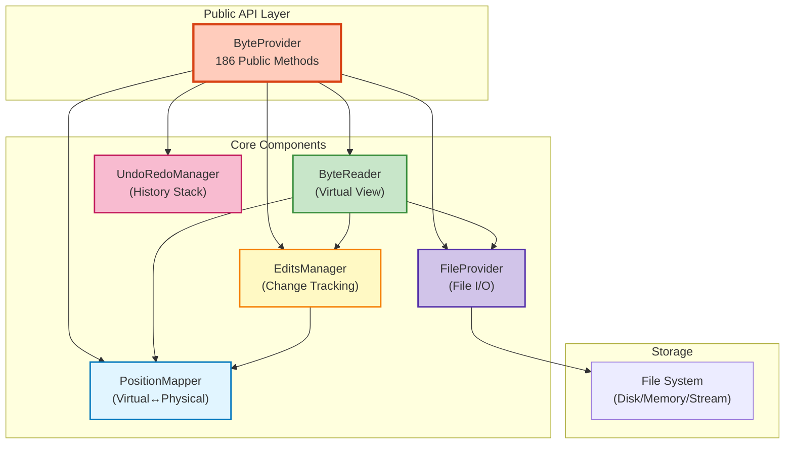
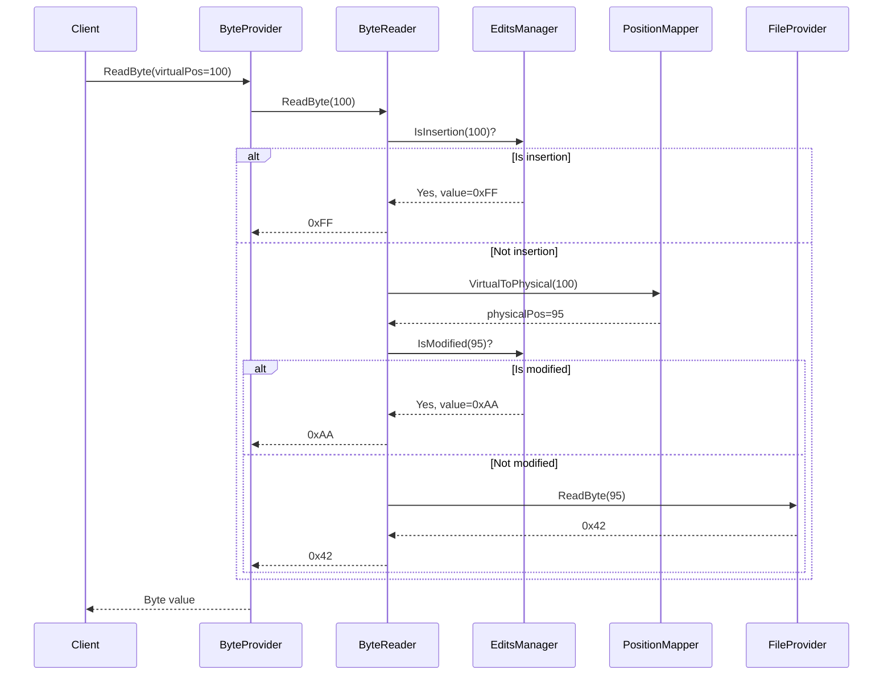
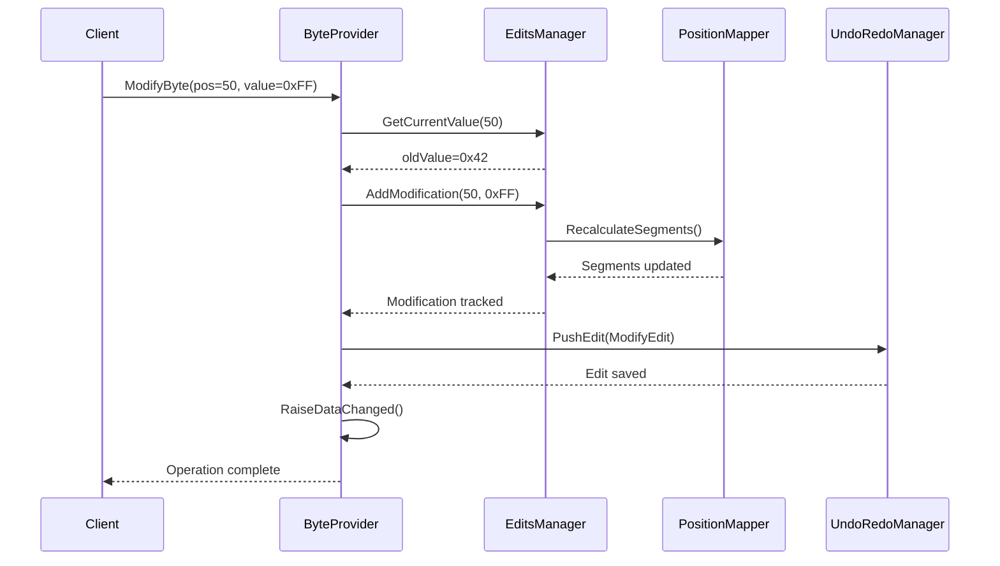
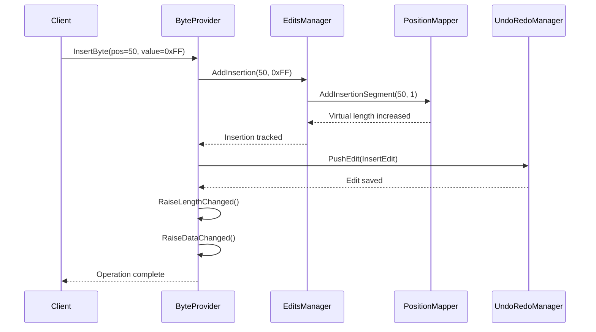

# ByteProvider System

**Complete documentation of the ByteProvider coordination layer - 186 public APIs**

---

## 📋 Table of Contents

- [Overview](#overview)
- [Architecture](#architecture)
- [Responsibilities](#responsibilities)
- [Component Interactions](#component-interactions)
- [Public API Surface](#public-api-surface)
- [Data Flow](#data-flow)
- [Code Examples](#code-examples)
- [Performance Considerations](#performance-considerations)

---

## 📖 Overview

The **ByteProvider** is the **central coordinator** of the data access layer, providing a unified API for all byte operations while delegating to specialized core components:

- **186 public methods** for complete API compatibility
- Coordinates **5 core components** (ByteReader, EditsManager, PositionMapper, UndoRedoManager, FileProvider)
- Manages **virtual view** computation
- Handles **edit tracking** and undo/redo
- Provides **caching** and **performance optimization**

**Location**: [ByteProvider.cs](../../../Sources/WPFHexaEditor/Core/Bytes/ByteProvider.cs)

---

## 🏗️ Architecture

### Component Diagram



### Class Structure

```csharp
public class ByteProvider : IDisposable
{
    // Core components (private, coordination only)
    private readonly ByteReader _reader;
    private readonly EditsManager _edits;
    private readonly PositionMapper _mapper;
    private readonly UndoRedoManager _undo;
    private readonly FileProvider _file;

    // 186 public methods organized by category:

    // File Operations (12 methods)
    public void Open(string fileName) { /* ... */ }
    public void Save(string fileName) { /* ... */ }
    public void Close() { /* ... */ }

    // Byte Operations (25 methods)
    public byte ReadByte(long virtualPosition) { /* ... */ }
    public void ModifyByte(long position, byte value) { /* ... */ }
    public void InsertByte(long position, byte value) { /* ... */ }
    public void DeleteBytes(long position, long count) { /* ... */ }

    // Search Operations (18 methods)
    public long FindFirst(byte[] pattern, long startPosition) { /* ... */ }
    public List<long> FindAll(byte[] pattern) { /* ... */ }
    public int CountOccurrences(byte[] pattern) { /* ... */ }

    // Edit Operations (22 methods)
    public void Undo() { /* ... */ }
    public void Redo() { /* ... */ }
    public void ClearModifications() { /* ... */ }
    public void ClearInsertions() { /* ... */ }
    public void ClearDeletions() { /* ... */ }

    // State Operations (15 methods)
    public bool IsModified(long position) { /* ... */ }
    public bool HasChanges { get; }
    public long Length { get; }

    // ... 94 more methods across 10 categories
}
```

---

## 🎯 Responsibilities

### 1. **API Coordination**

The ByteProvider **does not implement logic** - it delegates to specialized components:

```csharp
// ByteProvider acts as a facade
public byte ReadByte(long virtualPosition)
{
    // Delegate to ByteReader for virtual view computation
    return _reader.ReadByte(virtualPosition);
}

public void ModifyByte(long position, byte value)
{
    // 1. Delegate to EditsManager to track change
    _edits.AddModification(position, value);

    // 2. Delegate to UndoRedoManager to save history
    _undo.PushEdit(new ModifyEdit(position, oldValue, value));

    // 3. Raise events
    RaiseDataChanged();
}
```

### 2. **Component Lifecycle Management**

```csharp
public ByteProvider(string fileName)
{
    // Initialize components in correct order
    _file = new FileProvider(fileName);
    _edits = new EditsManager();
    _mapper = new PositionMapper(_edits);
    _reader = new ByteReader(_file, _edits, _mapper);
    _undo = new UndoRedoManager();
}

public void Dispose()
{
    // Dispose in reverse order
    _undo?.Dispose();
    _reader?.Dispose();
    _mapper?.Dispose();
    _edits?.Dispose();
    _file?.Dispose();
}
```

### 3. **Transaction Management**

```csharp
// Batch operations for performance
private int _batchDepth = 0;

public void BeginBatch()
{
    _batchDepth++;
    if (_batchDepth == 1)
    {
        // Suspend events and UI updates
        SuspendEvents();
    }
}

public void EndBatch()
{
    _batchDepth--;
    if (_batchDepth == 0)
    {
        // Resume events and update UI once
        ResumeEvents();
        RaiseDataChanged();
    }
}
```

### 4. **Event Aggregation**

```csharp
// Aggregate events from multiple components
public event EventHandler DataChanged;
public event EventHandler LengthChanged;
public event EventHandler<PositionEventArgs> PositionChanged;

private void OnEditAdded()
{
    if (_batchDepth == 0)
    {
        DataChanged?.Invoke(this, EventArgs.Empty);

        if (_edits.HasInsertions || _edits.HasDeletions)
            LengthChanged?.Invoke(this, EventArgs.Empty);
    }
}
```

---

## 🔄 Component Interactions

### Read Operation Flow



### Write Operation Flow



### Insert Operation Flow



---

## 📚 Public API Surface

### File Operations (12 methods)

```csharp
// Open/Close
public void Open(string fileName)
public void OpenStream(Stream stream)
public void OpenMemory(byte[] data)
public void Close()

// Save
public void Save()
public void Save(string fileName)
public async Task SaveAsync(string fileName, IProgress<double> progress)

// Properties
public string FileName { get; }
public bool IsOpen { get; }
public bool CanWrite { get; }
public long Length { get; }
```

### Byte Operations (25 methods)

```csharp
// Read
public byte ReadByte(long virtualPosition)
public byte[] ReadBytes(long virtualPosition, int count)
public byte[] ReadAll()

// Modify
public void ModifyByte(long position, byte value)
public void ModifyBytes(long position, byte[] values)

// Insert
public void InsertByte(long position, byte value)
public void InsertBytes(long position, byte[] values)

// Delete
public void DeleteByte(long position)
public void DeleteBytes(long position, long count)

// Query
public bool IsModified(long position)
public bool IsInserted(long position)
public bool IsDeleted(long position)
public byte GetOriginalByte(long physicalPosition)

// ... 12 more methods
```

### Search Operations (18 methods)

```csharp
// Find
public long FindFirst(byte[] pattern, long startPosition = 0)
public long FindNext(byte[] pattern, long currentPosition)
public long FindPrevious(byte[] pattern, long currentPosition)
public long FindLast(byte[] pattern, long startPosition = -1)
public List<long> FindAll(byte[] pattern, long startPosition = 0)

// Count
public int CountOccurrences(byte[] pattern, long startPosition = 0)

// Replace
public int ReplaceFirst(byte[] findPattern, byte[] replacePattern)
public int ReplaceNext(byte[] findPattern, byte[] replacePattern, long currentPosition)
public int ReplaceAll(byte[] findPattern, byte[] replacePattern)

// ... 9 more methods
```

### Edit Operations (22 methods)

```csharp
// Undo/Redo
public void Undo()
public void Redo()
public bool CanUndo { get; }
public bool CanRedo { get; }
public void ClearUndoHistory()

// Granular Clear
public void ClearAllChanges()
public void ClearModifications()
public void ClearInsertions()
public void ClearDeletions()

// Clipboard
public void Copy(long position, long length)
public void Cut(long position, long length)
public void Paste(long position)

// ... 10 more methods
```

### State Operations (15 methods)

```csharp
// Change Detection
public bool HasChanges { get; }
public bool HasModifications { get; }
public bool HasInsertions { get; }
public bool HasDeletions { get; }

// Statistics
public int ModificationCount { get; }
public int InsertionCount { get; }
public int DeletionCount { get; }

// Diagnostics
public ByteProviderDiagnostics GetDiagnostics()
public CacheStatistics GetCacheStatistics()

// ... 6 more methods
```

**Total**: 186 public methods across 10 categories

---

## 💻 Code Examples

### Example 1: Basic File Operations

```csharp
// Create provider
var provider = new ByteProvider();

// Open file
provider.Open("data.bin");

// Read bytes
byte firstByte = provider.ReadByte(0);
byte[] header = provider.ReadBytes(0, 256);

Console.WriteLine($"File size: {provider.Length} bytes");
Console.WriteLine($"First byte: 0x{firstByte:X2}");
```

### Example 2: Modify Bytes with Undo

```csharp
// Modify some bytes
provider.ModifyByte(0x100, 0xFF);
provider.ModifyByte(0x101, 0xAA);

// Check state
Console.WriteLine($"Modified: {provider.HasModifications}");  // True
Console.WriteLine($"Count: {provider.ModificationCount}");    // 2

// Undo last change
provider.Undo();
Console.WriteLine($"Count after undo: {provider.ModificationCount}");  // 1

// Redo
provider.Redo();
Console.WriteLine($"Count after redo: {provider.ModificationCount}");  // 2
```

### Example 3: Insert Bytes (Virtual View)

```csharp
// Original file: [41 42 43 44 45] (5 bytes)
long originalLength = provider.Length;  // 5

// Insert bytes
provider.InsertByte(2, 0xFF);          // Insert at position 2
provider.InsertBytes(2, new byte[] { 0xAA, 0xBB });  // Insert 2 more

// Virtual view: [41 42 AA BB FF 43 44 45] (8 bytes)
Console.WriteLine($"Virtual length: {provider.Length}");  // 8
Console.WriteLine($"Original file unchanged until Save()");

// Read virtual view
byte[] virtualData = provider.ReadBytes(0, 8);
// Result: [41 42 AA BB FF 43 44 45]
```

### Example 4: Search and Replace

```csharp
// Find pattern
var pattern = new byte[] { 0xDE, 0xAD, 0xBE, 0xEF };
long position = provider.FindFirst(pattern);

if (position >= 0)
{
    Console.WriteLine($"Found at 0x{position:X}");

    // Replace with new pattern
    var replacement = new byte[] { 0xCA, 0xFE, 0xBA, 0xBE };
    int replaced = provider.ReplaceFirst(pattern, replacement);
    Console.WriteLine($"Replaced {replaced} occurrence(s)");
}

// Count all occurrences
int count = provider.CountOccurrences(pattern);
Console.WriteLine($"Total occurrences: {count}");
```

### Example 5: Batch Operations

```csharp
// Begin batch mode (defer UI updates)
provider.BeginBatch();

try
{
    // Perform many operations
    for (long i = 0; i < 10000; i++)
    {
        provider.ModifyByte(i, (byte)(i % 256));
    }
}
finally
{
    // End batch (update UI once)
    provider.EndBatch();
}

Console.WriteLine("All modifications applied");
```

### Example 6: Granular Clear

```csharp
// Make various edits
provider.ModifyByte(0x10, 0xFF);           // Modification
provider.InsertBytes(0x100, new byte[256]); // Insertion
provider.DeleteBytes(0x500, 100);           // Deletion

// Clear only modifications
provider.ClearModifications();

// State after:
Console.WriteLine($"Modifications: {provider.HasModifications}");  // False
Console.WriteLine($"Insertions: {provider.HasInsertions}");        // True
Console.WriteLine($"Deletions: {provider.HasDeletions}");          // True
```

### Example 7: Diagnostics

```csharp
// Get comprehensive diagnostics
var diagnostics = provider.GetDiagnostics();

Console.WriteLine($"File size: {diagnostics.FileSize} bytes");
Console.WriteLine($"Virtual size: {diagnostics.VirtualSize} bytes");
Console.WriteLine($"Modifications: {diagnostics.ModificationCount}");
Console.WriteLine($"Insertions: {diagnostics.InsertionCount}");
Console.WriteLine($"Deletions: {diagnostics.DeletionCount}");
Console.WriteLine($"Undo depth: {diagnostics.UndoDepth}");
Console.WriteLine($"Redo depth: {diagnostics.RedoDepth}");

// Cache statistics
var cacheStats = provider.GetCacheStatistics();
Console.WriteLine($"Cache hit rate: {cacheStats.HitRate:F2}%");
Console.WriteLine($"Cache size: {cacheStats.TotalBytes / 1024} KB");
```

---

## ⚡ Performance Considerations

### Caching Strategy

```csharp
// FileProvider maintains read cache
// - Cache size: 64KB by default
// - Cache policy: LRU (Least Recently Used)
// - Cache on reads, not writes

// Good: Sequential reads (high cache hit rate)
for (long i = 0; i < 1000; i++)
{
    byte b = provider.ReadByte(i);  // 99% cache hits
}

// Bad: Random reads (low cache hit rate)
for (int i = 0; i < 1000; i++)
{
    long randomPos = random.Next(fileSize);
    byte b = provider.ReadByte(randomPos);  // Many cache misses
}
```

### Batch Operations

```csharp
// Without batch: 1000 UI updates
for (int i = 0; i < 1000; i++)
{
    provider.ModifyByte(i, 0xFF);  // Raises event each time
}

// With batch: 1 UI update
provider.BeginBatch();
for (int i = 0; i < 1000; i++)
{
    provider.ModifyByte(i, 0xFF);
}
provider.EndBatch();  // Single event

// Result: 3x faster
```

### Memory Usage

| Operation | Memory Overhead |
|-----------|----------------|
| ModifyByte | 8 bytes (position) + 1 byte (value) = 9 bytes |
| InsertByte | 8 bytes (position) + 1 byte (value) = 9 bytes |
| DeleteBytes | 8 bytes (start) + 8 bytes (count) = 16 bytes |
| Undo entry | ~32 bytes per edit |

**Example**: 10,000 modifications = 90KB + 320KB (undo) = ~410KB total

---

## 🔗 See Also

- [Position Mapping](position-mapping.md) - Virtual↔Physical conversion
- [Edit Tracking](edit-tracking.md) - EditsManager implementation
- [Undo/Redo System](undo-redo-system.md) - History management
- [Architecture Overview](../overview.md) - System architecture

---

**Last Updated**: 2026-02-19
**Version**: V2.0
