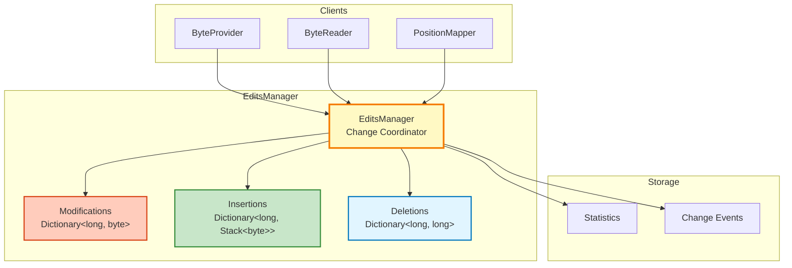

# Edit Tracking System

**Comprehensive change tracking for modifications, insertions, and deletions**

---

## 📋 Table of Contents

- [Overview](#overview)
- [Architecture](#architecture)
- [Edit Types](#edit-types)
- [Data Structures](#data-structures)
- [LIFO Insertion Semantics](#lifo-insertion-semantics)
- [Algorithms](#algorithms)
- [Code Examples](#code-examples)
- [Performance](#performance)

---

## 📖 Overview

The **EditsManager** component tracks all changes made to the byte data, maintaining three separate collections for modifications, insertions, and deletions. This enables:

- ✅ **Virtual view computation** - Show edits without modifying file
- ✅ **Granular undo** - Clear specific edit types
- ✅ **Change detection** - Query if position is modified/inserted/deleted
- ✅ **Statistics** - Count edits by type
- ✅ **Save optimization** - Fast path for modifications-only

**Location**: [EditsManager.cs](../../../Sources/WPFHexaEditor/Core/Bytes/EditsManager.cs)

---

## 🏗️ Architecture

### Component Diagram



### Class Structure

```csharp
public class EditsManager
{
    // Three separate edit collections
    private Dictionary<long, byte> _modifications;              // Position → New value
    private Dictionary<long, Stack<byte>> _insertions;          // Position → LIFO stack
    private Dictionary<long, long> _deletions;                  // Position → Count

    // Public API
    public void AddModification(long position, byte value);
    public void AddInsertion(long position, byte value);
    public void AddDeletion(long position, long count);

    public bool IsModified(long position, out byte value);
    public bool IsInsertion(long position, out byte value);
    public bool IsDeleted(long position);

    public void ClearModifications();
    public void ClearInsertions();
    public void ClearDeletions();
    public void ClearAll();

    // Statistics
    public int ModificationCount { get; }
    public int InsertionCount { get; }
    public int DeletionCount { get; }
    public bool HasChanges { get; }
}
```

---

## 📝 Edit Types

### 1. Modifications

**Definition**: Changes to existing byte values **without affecting file length**.

```
Original: [41 42 43 44 45]
Modify position 2 to 0xFF
Result:   [41 42 FF 44 45]  (length unchanged)
```

**Storage**:
```csharp
private Dictionary<long, byte> _modifications;

// Add modification
_modifications[position] = newValue;

// Check if modified
if (_modifications.TryGetValue(position, out byte value))
{
    // Position is modified, value contains new byte
}
```

### 2. Insertions

**Definition**: New bytes added **between existing bytes**, increasing file length.

```
Original: [41 42 43 44 45]  (5 bytes)
Insert 0xFF at position 2
Result:   [41 42 FF 43 44 45]  (6 bytes)
```

**Storage** (LIFO stack for same position):
```csharp
private Dictionary<long, Stack<byte>> _insertions;

// Add insertion
if (!_insertions.ContainsKey(position))
    _insertions[position] = new Stack<byte>();

_insertions[position].Push(newValue);  // LIFO order

// Check if insertion
if (_insertions.TryGetValue(position, out Stack<byte> stack))
{
    // Position has insertions
    byte[] inserted = stack.ToArray();  // [newest, ..., oldest]
}
```

### 3. Deletions

**Definition**: Removal of existing bytes, decreasing file length.

```
Original: [41 42 43 44 45]  (5 bytes)
Delete 2 bytes at position 2
Result:   [41 42 45]  (3 bytes)
```

**Storage**:
```csharp
private Dictionary<long, long> _deletions;

// Add deletion
_deletions[position] = count;

// Check if deleted
if (_deletions.ContainsKey(position))
{
    // Position is deleted (not accessible)
}
```

---

## 🎯 Data Structures

### Modifications Dictionary

```csharp
// Structure: Position → New Byte Value
private Dictionary<long, byte> _modifications = new();

// Example data:
{
    0x100: 0xFF,   // Position 0x100 modified to 0xFF
    0x200: 0xAA,   // Position 0x200 modified to 0xAA
    0x300: 0xBB    // Position 0x300 modified to 0xBB
}

// Operations:
_modifications[0x100] = 0xFF;           // Add/Update
byte value = _modifications[0x100];     // Get
_modifications.Remove(0x100);           // Remove
bool exists = _modifications.ContainsKey(0x100);  // Check
```

**Space**: 9 bytes per entry (8 bytes position + 1 byte value)

### Insertions Dictionary (LIFO Stack)

```csharp
// Structure: Position → Stack of Inserted Bytes (LIFO)
private Dictionary<long, Stack<byte>> _insertions = new();

// Example: Insert 3 bytes at position 5
// Order: Insert A, then B, then C (all at position 5)
{
    5: Stack<byte> { C, B, A }  // LIFO: C is top (most recent)
}

// When reading position 5, 6, 7:
// Position 5: C (top of stack)
// Position 6: B (second)
// Position 7: A (bottom)

// Operations:
if (!_insertions.ContainsKey(5))
    _insertions[5] = new Stack<byte>();

_insertions[5].Push(0xAA);              // Push new insertion
byte value = _insertions[5].Peek();     // Get top
byte value = _insertions[5].Pop();      // Remove top
int count = _insertions[5].Count;       // Count insertions at position
```

**Space**: 8 bytes position + 16 bytes stack overhead + 1 byte per insertion

### Deletions Dictionary

```csharp
// Structure: Position → Deletion Count
private Dictionary<long, long> _deletions = new();

// Example data:
{
    0x100: 10,    // 10 bytes deleted starting at 0x100
    0x500: 5      // 5 bytes deleted starting at 0x500
}

// Operations:
_deletions[0x100] = 10;                     // Add deletion
long count = _deletions[0x100];             // Get count
_deletions.Remove(0x100);                   // Remove
bool exists = _deletions.ContainsKey(0x100);  // Check

// Check if specific position is within deletion range:
bool IsDeleted(long position)
{
    foreach (var (start, count) in _deletions)
    {
        if (position >= start && position < start + count)
            return true;
    }
    return false;
}
```

**Space**: 16 bytes per entry (8 bytes position + 8 bytes count)

---

## 🔄 LIFO Insertion Semantics

### Why LIFO?

When multiple bytes are inserted at the **same position**, they follow **Last-In-First-Out** (stack) order to match natural typing behavior:

```
User types "ABC" at position 5 (insert mode):

Step 1: Type 'A'
Insert 'A' at position 5
Result: [... A ...]
Cursor moves to position 6

Step 2: Type 'B'
Cursor is at position 6, but we want 'B' after 'A'
Insert 'B' at position 6
Result: [... A B ...]
Cursor moves to position 7

Step 3: Type 'C'
Insert 'C' at position 7
Result: [... A B C ...]

CORRECT: "ABC" in order
```

### LIFO Implementation

```csharp
public void AddInsertion(long virtualPosition, byte value)
{
    // Get or create stack at position
    if (!_insertions.ContainsKey(virtualPosition))
        _insertions[virtualPosition] = new Stack<byte>();

    // Push to stack (LIFO)
    _insertions[virtualPosition].Push(value);

    // Update total insertion count
    _totalInsertions++;

    // Notify position mapper to recalculate segments
    OnInsertionAdded(virtualPosition, 1);
}

public bool IsInsertion(long virtualPosition, out byte value)
{
    // Check each insertion position
    foreach (var (insertPos, stack) in _insertions)
    {
        // Calculate virtual range for this insertion point
        long rangeStart = insertPos;
        long rangeEnd = insertPos + stack.Count;

        if (virtualPosition >= rangeStart && virtualPosition < rangeEnd)
        {
            // Position is within this insertion range
            int offset = (int)(virtualPosition - rangeStart);

            // Convert stack to array (top to bottom)
            byte[] insertedBytes = stack.ToArray();

            // Return byte at offset (LIFO order preserved)
            value = insertedBytes[offset];
            return true;
        }
    }

    value = 0;
    return false;
}
```

### LIFO Visual Example

```
Initial insertions dictionary: {}

Insert 'A' (0x41) at position 5:
{
    5: Stack [A]  (bottom)
}
Virtual view: [... A ...]

Insert 'B' (0x42) at position 5:
{
    5: Stack [B, A]  (B is top)
}
Virtual view: [... B A ...]

Insert 'C' (0x43) at position 5:
{
    5: Stack [C, B, A]  (C is top)
}
Virtual view: [... C B A ...]

Reading virtual positions:
- Position 5: C (top of stack, most recent)
- Position 6: B (second)
- Position 7: A (bottom, oldest)
```

---

## 🔢 Algorithms

### Algorithm 1: Add Modification

```csharp
public void AddModification(long position, byte value)
{
    // Check if position is an insertion (can't modify inserted bytes)
    if (IsInsertion(position))
    {
        throw new InvalidOperationException(
            "Cannot modify inserted byte. Modify insertion directly.");
    }

    // Check if position is deleted (can't modify deleted bytes)
    if (IsDeleted(position))
    {
        throw new InvalidOperationException(
            "Cannot modify deleted byte. Remove deletion first.");
    }

    // Add or update modification
    _modifications[position] = value;

    // Update statistics
    OnModificationAdded(position);
}
```

### Algorithm 2: Add Insertion

```csharp
public void AddInsertion(long virtualPosition, byte value)
{
    // Create stack if doesn't exist
    if (!_insertions.ContainsKey(virtualPosition))
    {
        _insertions[virtualPosition] = new Stack<byte>();
    }

    // Push to LIFO stack
    _insertions[virtualPosition].Push(value);

    // Update count
    _totalInsertions++;

    // Notify mapper to update segments
    _mapper?.OnInsertionAdded(virtualPosition, 1);

    // Raise event
    OnInsertionAdded(virtualPosition);
}
```

### Algorithm 3: Add Deletion

```csharp
public void AddDeletion(long physicalPosition, long count)
{
    // Validate parameters
    if (count <= 0)
        throw new ArgumentException("Count must be positive");

    // Check for overlapping deletions
    if (HasOverlappingDeletion(physicalPosition, count))
    {
        throw new InvalidOperationException(
            "Deletion overlaps with existing deletion");
    }

    // Add deletion
    _deletions[physicalPosition] = count;

    // Update count
    _totalDeletions += (int)count;

    // Notify mapper to update segments
    _mapper?.OnDeletionAdded(physicalPosition, count);

    // Raise event
    OnDeletionAdded(physicalPosition, count);
}
```

### Algorithm 4: Query Modification

```csharp
public bool IsModified(long position, out byte value)
{
    // Simple dictionary lookup: O(1)
    return _modifications.TryGetValue(position, out value);
}
```

### Algorithm 5: Query Insertion

```csharp
public bool IsInsertion(long virtualPosition, out byte value)
{
    // Iterate through insertion positions: O(n)
    // where n = number of distinct insertion positions
    foreach (var (insertPos, stack) in _insertions)
    {
        long rangeStart = insertPos;
        long rangeEnd = insertPos + stack.Count;

        if (virtualPosition >= rangeStart && virtualPosition < rangeEnd)
        {
            // Calculate offset within this insertion range
            int offset = (int)(virtualPosition - rangeStart);

            // Get byte from stack (LIFO order)
            byte[] bytes = stack.ToArray();
            value = bytes[offset];
            return true;
        }

        // Optimization: stop if we've passed the position
        if (virtualPosition < insertPos)
            break;
    }

    value = 0;
    return false;
}
```

### Algorithm 6: Query Deletion

```csharp
public bool IsDeleted(long physicalPosition)
{
    // Check each deletion range: O(d)
    // where d = number of distinct deletions
    foreach (var (start, count) in _deletions)
    {
        if (physicalPosition >= start && physicalPosition < start + count)
            return true;

        // Optimization: stop if we've passed the position
        if (physicalPosition < start)
            break;
    }

    return false;
}
```

---

## 💻 Code Examples

### Example 1: Track Basic Edits

```csharp
var edits = new EditsManager();

// Add modifications
edits.AddModification(0x100, 0xFF);
edits.AddModification(0x200, 0xAA);

// Add insertions
edits.AddInsertion(0x500, 0x11);
edits.AddInsertion(0x500, 0x22);  // Same position: LIFO
edits.AddInsertion(0x500, 0x33);  // Same position: LIFO

// Add deletions
edits.AddDeletion(0x1000, 50);  // Delete 50 bytes starting at 0x1000

// Query statistics
Console.WriteLine($"Modifications: {edits.ModificationCount}");  // 2
Console.WriteLine($"Insertions: {edits.InsertionCount}");        // 3
Console.WriteLine($"Deletions: {edits.DeletionCount}");          // 50
Console.WriteLine($"Has changes: {edits.HasChanges}");           // True
```

### Example 2: Query Edit State

```csharp
// Check if position is modified
if (edits.IsModified(0x100, out byte modValue))
{
    Console.WriteLine($"Position 0x100 modified to 0x{modValue:X2}");
}

// Check if position is inserted
if (edits.IsInsertion(0x500, out byte insValue))
{
    Console.WriteLine($"Position 0x500 is inserted byte: 0x{insValue:X2}");
}

// Check if position is deleted
if (edits.IsDeleted(0x1000))
{
    Console.WriteLine("Position 0x1000 is deleted");
}
```

### Example 3: Granular Clear

```csharp
// Make various edits
edits.AddModification(0x10, 0xFF);
edits.AddInsertion(0x100, 0xAA);
edits.AddDeletion(0x500, 10);

Console.WriteLine($"Total changes: {edits.HasChanges}");  // True

// Clear only modifications
edits.ClearModifications();

Console.WriteLine($"Modifications: {edits.ModificationCount}");  // 0
Console.WriteLine($"Insertions: {edits.InsertionCount}");        // 1 (kept)
Console.WriteLine($"Deletions: {edits.DeletionCount}");          // 10 (kept)

// Clear only insertions
edits.ClearInsertions();

Console.WriteLine($"Insertions: {edits.InsertionCount}");        // 0

// Clear all remaining edits
edits.ClearAll();

Console.WriteLine($"Has changes: {edits.HasChanges}");           // False
```

### Example 4: Iterate Modifications

```csharp
// Get all modifications as dictionary
var modifications = edits.GetModifications();

foreach (var (position, value) in modifications)
{
    Console.WriteLine($"Position 0x{position:X}: 0x{value:X2}");
}

// Apply modifications to file
foreach (var (position, value) in modifications)
{
    fileProvider.WriteByte(position, value);
}
```

### Example 5: Complex Edit Scenario

```csharp
// Scenario: User edits a configuration file

// 1. Modify header version byte
edits.AddModification(0x00, 0x02);  // Version 2

// 2. Insert new configuration section (256 bytes)
for (int i = 0; i < 256; i++)
{
    edits.AddInsertion(0x100 + i, (byte)i);
}

// 3. Delete old configuration section (512 bytes)
edits.AddDeletion(0x500, 512);

// 4. Modify footer checksum
edits.AddModification(0xFFFF, 0xAB);

// Statistics
var stats = new {
    TotalChanges = edits.HasChanges,
    FileGrew = edits.InsertionCount > edits.DeletionCount,
    NetChange = edits.InsertionCount - edits.DeletionCount,
    Modifications = edits.ModificationCount,
    Insertions = edits.InsertionCount,
    Deletions = edits.DeletionCount
};

Console.WriteLine($"File grew by {stats.NetChange} bytes");
// Output: "File grew by -256 bytes" (256 inserted - 512 deleted)
```

---

## ⚡ Performance

### Time Complexity

| Operation | Average | Worst Case | Notes |
|-----------|---------|------------|-------|
| AddModification | O(1) | O(1) | Dictionary insert |
| AddInsertion | O(1) | O(1) | Stack push |
| AddDeletion | O(1) | O(1) | Dictionary insert |
| IsModified | O(1) | O(1) | Dictionary lookup |
| IsInsertion | O(n) | O(n) | Iterate insertion positions |
| IsDeleted | O(d) | O(d) | Iterate deletion ranges |
| ClearModifications | O(m) | O(m) | Clear dictionary |
| ClearInsertions | O(i) | O(i) | Clear stacks |
| ClearDeletions | O(d) | O(d) | Clear dictionary |

Where:
- n = number of distinct insertion positions
- d = number of distinct deletion ranges
- m = number of modifications
- i = total inserted bytes

### Space Complexity

| Edit Type | Per-Edit Overhead | 10,000 Edits |
|-----------|------------------|--------------|
| Modifications | 9 bytes | ~90 KB |
| Insertions | 9 bytes + stack overhead | ~120 KB |
| Deletions | 16 bytes | ~160 KB |

### Optimization Techniques

```csharp
// 1. Batch operations to avoid repeated recalculations
edits.BeginBatch();
for (int i = 0; i < 10000; i++)
{
    edits.AddModification(i, 0xFF);
}
edits.EndBatch();  // Recalculate once

// 2. Use sorted structures for faster queries
private SortedDictionary<long, Stack<byte>> _insertions;

// 3. Cache frequently queried positions
private Dictionary<long, bool> _isInsertionCache;
```

---

## 🔗 See Also

- [ByteProvider System](byteprovider-system.md) - Coordination layer
- [Position Mapping](position-mapping.md) - Virtual↔Physical conversion
- [Undo/Redo System](undo-redo-system.md) - History management
- [Architecture Overview](../overview.md) - System architecture

---

**Last Updated**: 2026-02-19
**Version**: V2.0
