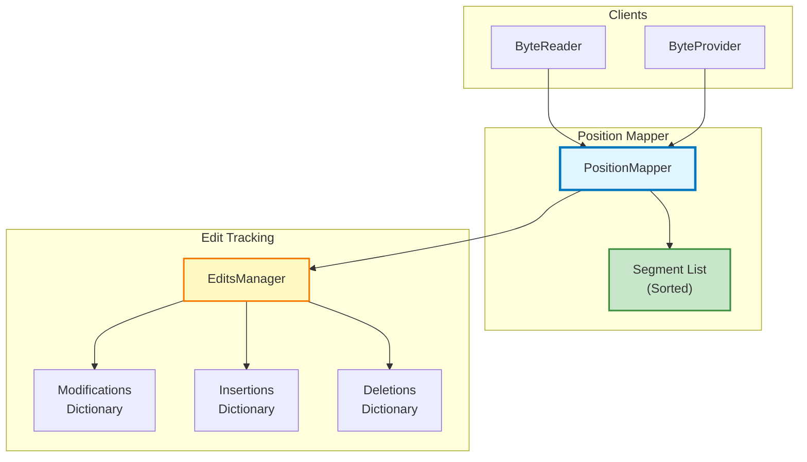
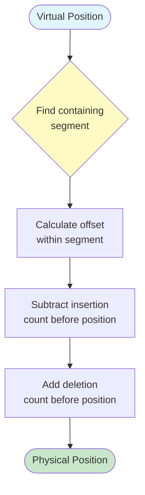

# Position Mapping System

**Bidirectional virtual↔physical position conversion with segment tracking**

---

## 📋 Table of Contents

- [Overview](#overview)
- [Problem Statement](#problem-statement)
- [Solution Architecture](#solution-architecture)
- [Segment-Based Mapping](#segment-based-mapping)
- [Algorithms](#algorithms)
- [Visual Examples](#visual-examples)
- [Code Examples](#code-examples)
- [Performance Analysis](#performance-analysis)

---

## 📖 Overview

The **PositionMapper** component provides **bidirectional position conversion** between virtual and physical address spaces, enabling the virtual view pattern that allows users to see edits without modifying the original file.

**Location**: [PositionMapper.cs](../../../Sources/WPFHexaEditor/Core/Bytes/PositionMapper.cs)

**Key Features**:
- ✅ **Virtual → Physical** conversion (skip inserted bytes)
- ✅ **Physical → Virtual** conversion (account for insertions)
- ✅ **Segment-based tracking** (O(log n) lookups)
- ✅ **Automatic recalculation** on edits
- ✅ **Deletion support** (collapsed ranges)

---

## ❓ Problem Statement

### The Challenge

When bytes are inserted or deleted, the **virtual positions** (what the user sees) diverge from **physical positions** (actual file offsets):

```
Original file (physical):
Position:  0   1   2   3   4   5   6   7   8   9
Bytes:    [41][42][43][44][45][46][47][48][49][4A]

User inserts 3 bytes at position 5:
- Insert 0xFF at position 5
- Insert 0xAA at position 5
- Insert 0xBB at position 5

Virtual view (what user sees):
Position:  0   1   2   3   4   5   6   7 | 8   9   10  11  12
Bytes:    [41][42][43][44][45][BB][AA][FF]|[46][47][48][49][4A]
                                          ↑
                                    3 inserted bytes

Physical file (unchanged):
Position:  0   1   2   3   4   5   6   7   8   9
Bytes:    [41][42][43][44][45][46][47][48][49][4A]
```

**Questions to answer**:
1. User wants byte at virtual position 8 → Which physical position? (Answer: 5)
2. User wants byte at virtual position 10 → Which physical position? (Answer: 7)
3. Byte at physical position 7 → Which virtual position? (Answer: 10)

---

## 🏗️ Solution Architecture

### Component Diagram



### Mapping Process



---

## 📦 Segment-Based Mapping

### What is a Segment?

A **segment** represents a contiguous range in the virtual address space with consistent mapping properties:

```csharp
public class MapSegment
{
    public long VirtualStart { get; set; }      // Start of range in virtual space
    public long VirtualEnd { get; set; }        // End of range in virtual space
    public long PhysicalStart { get; set; }     // Corresponding physical start
    public int InsertedCount { get; set; }      // Bytes inserted in this range
    public int DeletedCount { get; set; }       // Bytes deleted in this range
}
```

### Segment Creation Example

```
Original file: 10 bytes (positions 0-9)

Operation 1: Insert 3 bytes at position 5
Result: Creates segment [5, 7] with InsertedCount=3

Operation 2: Delete 2 bytes at position 8 (physical)
Result: Creates segment [8, 9] with DeletedCount=2

Final segments:
┌─────────────────────────────────────────┐
│ Segment 1: Virtual [0, 4] → Physical [0, 4]   │
│   InsertedCount: 0, DeletedCount: 0            │
├─────────────────────────────────────────┤
│ Segment 2: Virtual [5, 7] → Physical [5, 5]   │
│   InsertedCount: 3, DeletedCount: 0            │
├─────────────────────────────────────────┤
│ Segment 3: Virtual [8, 10] → Physical [6, 7]  │
│   InsertedCount: 0, DeletedCount: 2            │
└─────────────────────────────────────────┘
```

### Segment List Management

```csharp
public class PositionMapper
{
    // Sorted list of segments (binary search: O(log n))
    private SortedList<long, MapSegment> _segments;

    public void AddInsertionSegment(long virtualPos, int count)
    {
        // Find or create segment at virtualPos
        var segment = FindOrCreateSegment(virtualPos);
        segment.InsertedCount += count;

        // Recalculate all segments after this one
        RecalculateSegmentsAfter(virtualPos);
    }

    public void AddDeletionSegment(long physicalPos, int count)
    {
        // Similar to insertion but affects physical mapping
        var segment = FindOrCreateSegment(physicalPos);
        segment.DeletedCount += count;

        RecalculateSegmentsAfter(physicalPos);
    }
}
```

---

## 🔢 Algorithms

### Algorithm 1: Virtual → Physical

**Purpose**: Convert user-visible position to actual file offset.

```csharp
public long VirtualToPhysical(long virtualPosition)
{
    long physicalPos = virtualPosition;
    long cumulativeInsertions = 0;
    long cumulativeDeletions = 0;

    // Iterate through segments up to virtualPosition
    foreach (var segment in _segments.Values)
    {
        if (virtualPosition < segment.VirtualStart)
            break;

        if (virtualPosition <= segment.VirtualEnd)
        {
            // Position is within this segment
            long offsetInSegment = virtualPosition - segment.VirtualStart;

            if (offsetInSegment < segment.InsertedCount)
            {
                // Position is within inserted bytes (no physical equivalent)
                throw new InvalidOperationException("Position is inserted byte");
            }

            // Adjust for insertions and deletions
            physicalPos = segment.PhysicalStart +
                         (offsetInSegment - segment.InsertedCount) +
                         cumulativeDeletions;

            return physicalPos;
        }

        // Accumulate offsets from previous segments
        cumulativeInsertions += segment.InsertedCount;
        cumulativeDeletions += segment.DeletedCount;
    }

    // No segments or position after all segments
    return virtualPosition - cumulativeInsertions + cumulativeDeletions;
}
```

**Time Complexity**: O(log n) for binary search + O(k) for segment iteration where k = segments before position

### Algorithm 2: Physical → Virtual

**Purpose**: Convert file offset to user-visible position.

```csharp
public long PhysicalToVirtual(long physicalPosition)
{
    long virtualPos = physicalPosition;
    long cumulativeInsertions = 0;
    long cumulativeDeletions = 0;

    // Iterate through segments up to physicalPosition
    foreach (var segment in _segments.Values)
    {
        if (physicalPosition < segment.PhysicalStart)
            break;

        long physicalEnd = segment.PhysicalStart +
                          (segment.VirtualEnd - segment.VirtualStart) -
                          segment.InsertedCount;

        if (physicalPosition <= physicalEnd)
        {
            // Position is within this segment
            long offsetInSegment = physicalPosition - segment.PhysicalStart;

            virtualPos = segment.VirtualStart +
                        segment.InsertedCount +  // Skip inserted bytes
                        offsetInSegment;

            return virtualPos;
        }

        // Accumulate offsets from previous segments
        cumulativeInsertions += segment.InsertedCount;
        cumulativeDeletions += segment.DeletedCount;
    }

    // No segments or position after all segments
    return physicalPosition + cumulativeInsertions - cumulativeDeletions;
}
```

**Time Complexity**: O(log n) for binary search + O(k) for segment iteration

---

## 🎨 Visual Examples

### Example 1: Simple Insertion

```
Initial state:
Virtual:   [0][1][2][3][4][5][6][7][8][9]
Physical:  [0][1][2][3][4][5][6][7][8][9]
Mapping: 1:1

Insert 2 bytes at virtual position 5:
Virtual:   [0][1][2][3][4][5][6]  [7][8][9][10][11]
                               ↑↑  (inserted)
Physical:  [0][1][2][3][4]         [5][6][7][8][9]

Segment created:
- VirtualStart: 5
- VirtualEnd: 6
- PhysicalStart: 5
- InsertedCount: 2

Mappings:
Virtual 0-4 → Physical 0-4 (direct)
Virtual 5-6 → (insertions, no physical equivalent)
Virtual 7   → Physical 5
Virtual 8   → Physical 6
Virtual 9   → Physical 7
Virtual 10  → Physical 8
Virtual 11  → Physical 9
```

### Example 2: Multiple Insertions at Same Position (LIFO)

```
Insert 'A' at position 5:
Virtual:   [0][1][2][3][4][A][5][6][7][8][9]

Insert 'B' at position 5:
Virtual:   [0][1][2][3][4][B][A][5][6][7][8][9]
                            ↑ New insertion pushed before 'A'

Insert 'C' at position 5:
Virtual:   [0][1][2][3][4][C][B][A][5][6][7][8][9]
                            ↑ 'C' pushed before 'B'

Result: LIFO order (Last-In-First-Out)

Segment:
- VirtualStart: 5
- VirtualEnd: 7 (5 + 3 insertions)
- PhysicalStart: 5
- InsertedCount: 3
- Insertion order: [C, B, A] (LIFO stack)
```

### Example 3: Insertions and Deletions

```
Original: [0][1][2][3][4][5][6][7][8][9] (10 bytes)

Step 1: Insert 2 bytes at position 5
Virtual:  [0][1][2][3][4][X][Y][5][6][7][8][9] (12 bytes)

Step 2: Delete 3 bytes at physical position 7
Virtual:  [0][1][2][3][4][X][Y][5][6] (9 bytes)
Physical: [0][1][2][3][4][5][6]       (7 bytes, 3 deleted)

Segments:
1. Virtual [0, 4] → Physical [0, 4]
   InsertedCount: 0, DeletedCount: 0

2. Virtual [5, 6] → (insertions)
   InsertedCount: 2, DeletedCount: 0

3. Virtual [7, 8] → Physical [5, 6]
   InsertedCount: 0, DeletedCount: 3

Final mapping:
Virtual 0-4: Physical 0-4 (direct)
Virtual 5-6: Inserted bytes (no physical)
Virtual 7:   Physical 5
Virtual 8:   Physical 6
(Physical 7-9 deleted, not accessible)
```

### Example 4: Complex Multi-Edit Scenario

```
Original file: 20 bytes

Edit sequence:
1. Insert 3 bytes at position 5
2. Insert 2 bytes at position 10
3. Delete 4 bytes at physical position 15
4. Modify byte at position 8

Resulting segments:

┌────────────────────────────────────┐
│ Segment 1: [0, 4] → [0, 4]       │
│   No changes                       │
├────────────────────────────────────┤
│ Segment 2: [5, 7] → inserted      │
│   InsertedCount: 3                 │
├────────────────────────────────────┤
│ Segment 3: [8, 9] → [5, 6]       │
│   Contains modification at pos 8  │
├────────────────────────────────────┤
│ Segment 4: [10, 11] → inserted    │
│   InsertedCount: 2                 │
├────────────────────────────────────┤
│ Segment 5: [12, 18] → [7, 14]    │
│   DeletedCount: 4 (at phys 15-18) │
└────────────────────────────────────┘

Virtual length: 19 bytes (20 - 4 deleted + 5 inserted)
Physical length: 20 bytes (unchanged)
```

---

## 💻 Code Examples

### Example 1: Basic Position Conversion

```csharp
var mapper = new PositionMapper(editsManager);

// Initial state: no edits, 1:1 mapping
long physical1 = mapper.VirtualToPhysical(10);  // Returns: 10
long virtual1 = mapper.PhysicalToVirtual(10);   // Returns: 10

// Insert 3 bytes at position 5
editsManager.AddInsertion(5, 0xFF);
editsManager.AddInsertion(5, 0xAA);
editsManager.AddInsertion(5, 0xBB);
mapper.RecalculateSegments();

// After insertions
long physical2 = mapper.VirtualToPhysical(8);   // Returns: 5 (skip 3 inserted)
long virtual2 = mapper.PhysicalToVirtual(5);    // Returns: 8 (account for 3 inserted)
```

### Example 2: Detect Inserted Positions

```csharp
// Check if position is an insertion
try
{
    long virtualPos = 5;  // First inserted byte
    long physicalPos = mapper.VirtualToPhysical(virtualPos);
    // This throws: "Position is inserted byte"
}
catch (InvalidOperationException ex)
{
    Console.WriteLine("Position 5 is an inserted byte (no physical equivalent)");
}

// Alternative: check before converting
bool isInsertion = editsManager.IsInsertion(5);
if (!isInsertion)
{
    long physicalPos = mapper.VirtualToPhysical(5);
}
```

### Example 3: Range Conversion

```csharp
// Convert a range of virtual positions to physical
public List<long> ConvertVirtualRange(long virtualStart, long virtualLength)
{
    var physicalPositions = new List<long>();

    for (long v = virtualStart; v < virtualStart + virtualLength; v++)
    {
        try
        {
            long p = mapper.VirtualToPhysical(v);
            physicalPositions.Add(p);
        }
        catch (InvalidOperationException)
        {
            // Skip inserted bytes
        }
    }

    return physicalPositions;
}

// Usage
var physicalRange = ConvertVirtualRange(5, 10);
// Returns physical positions corresponding to virtual 5-14
// (excluding any inserted bytes in that range)
```

### Example 4: Batch Mapping with Caching

```csharp
// For performance, cache segment lookups
public class CachedPositionMapper
{
    private PositionMapper _mapper;
    private Dictionary<long, long> _v2pCache = new();
    private Dictionary<long, long> _p2vCache = new();

    public long VirtualToPhysical(long virtualPos)
    {
        if (_v2pCache.TryGetValue(virtualPos, out long physicalPos))
            return physicalPos;

        physicalPos = _mapper.VirtualToPhysical(virtualPos);
        _v2pCache[virtualPos] = physicalPos;
        return physicalPos;
    }

    public void InvalidateCache()
    {
        _v2pCache.Clear();
        _p2vCache.Clear();
    }
}
```

---

## ⚡ Performance Analysis

### Time Complexity

| Operation | Complexity | Explanation |
|-----------|-----------|-------------|
| VirtualToPhysical | O(log n + k) | Binary search + k segments |
| PhysicalToVirtual | O(log n + k) | Binary search + k segments |
| AddInsertionSegment | O(log n + m) | Binary search + m segment updates |
| AddDeletionSegment | O(log n + m) | Binary search + m segment updates |
| RecalculateAll | O(n) | Rebuild all segments |

Where:
- n = number of segments
- k = number of segments before target position
- m = number of segments after modified position

### Space Complexity

| Data Structure | Size |
|---------------|------|
| Single segment | 40 bytes (5 longs) |
| 100 edit operations | ~4KB |
| 10,000 edit operations | ~400KB |

**Typical usage**: Most files have < 1000 segments, using < 40KB memory

### Optimization Strategies

```csharp
// 1. Segment merging (reduce segment count)
public void MergeAdjacentSegments()
{
    var merged = new List<MapSegment>();

    for (int i = 0; i < _segments.Count - 1; i++)
    {
        var current = _segments[i];
        var next = _segments[i + 1];

        if (CanMerge(current, next))
        {
            merged.Add(Merge(current, next));
            i++;  // Skip next
        }
        else
        {
            merged.Add(current);
        }
    }

    _segments = merged;
}

// 2. Lazy recalculation (defer until needed)
private bool _segmentsDirty = false;

public void MarkDirty()
{
    _segmentsDirty = true;
}

public long VirtualToPhysical(long virtualPos)
{
    if (_segmentsDirty)
    {
        RecalculateSegments();
        _segmentsDirty = false;
    }

    return ComputeMapping(virtualPos);
}
```

---

## 🔗 See Also

- [ByteProvider System](byteprovider-system.md) - Coordination layer
- [Edit Tracking](edit-tracking.md) - EditsManager details
- [Architecture Overview](../overview.md) - System architecture

---

**Last Updated**: 2026-02-19
**Version**: V2.0
