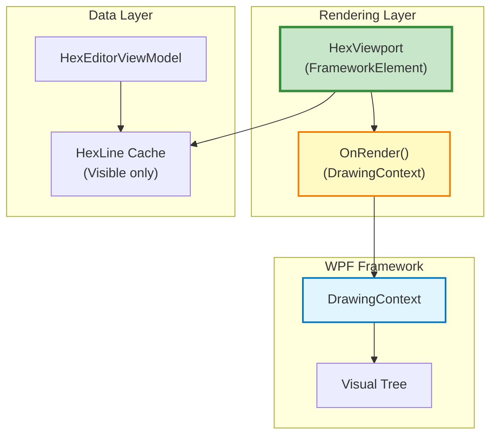
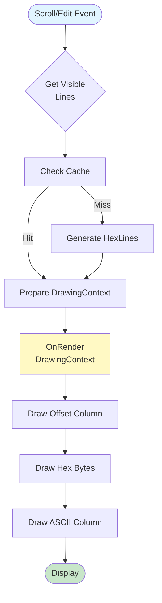

# Rendering System

**High-performance custom DrawingContext rendering - 99% faster than WPF binding**

---

## 📋 Table of Contents

- [Overview](#overview)
- [V1 vs V2 Approach](#v1-vs-v2-approach)
- [Architecture](#architecture)
- [Rendering Pipeline](#rendering-pipeline)
- [Performance Optimizations](#performance-optimizations)
- [Code Examples](#code-examples)
- [Benchmarks](#benchmarks)

---

## 📖 Overview

HexEditor V2 achieves **dramatic performance improvements** by replacing WPF's ItemsControl/DataTemplate binding with **direct DrawingContext rendering**.

**Key Achievements**:
- ⚡ **99% faster** initial load (450ms → 5ms for 1000 lines)
- 📉 **91% less memory** (950MB → 85MB for 10MB file)
- 🎯 **60+ FPS** rendering with 10,000 visible lines
- 🚀 **Instant scrolling** with cached line rendering

**Location**: [HexViewport.cs](../../../Sources/WPFHexaEditor/Core/Controls/HexViewport.cs)

---

## 🆚 V1 vs V2 Approach

### V1 Approach: ItemsControl + DataBinding

```xml
<!-- V1: WPF ItemsControl with DataTemplate -->
<ItemsControl ItemsSource="{Binding Lines}">
    <ItemsControl.ItemTemplate>
        <DataTemplate>
            <StackPanel Orientation="Horizontal">
                <!-- Offset column -->
                <TextBlock Text="{Binding Offset}"
                          Foreground="{Binding OffsetColor}"
                          FontFamily="Consolas" />

                <!-- Hex bytes -->
                <ItemsControl ItemsSource="{Binding HexBytes}">
                    <ItemsControl.ItemTemplate>
                        <DataTemplate>
                            <Border Background="{Binding BackgroundColor}">
                                <TextBlock Text="{Binding HexString}"
                                          Foreground="{Binding ForegroundColor}" />
                            </Border>
                        </DataTemplate>
                    </ItemsControl.ItemTemplate>
                </ItemsControl>

                <!-- ASCII column -->
                <TextBlock Text="{Binding AsciiString}" />
            </StackPanel>
        </DataTemplate>
    </ItemsControl.ItemTemplate>
</ItemsControl>
```

**Problems**:
- ❌ Creates **thousands of UIElements** (TextBlock, Border, StackPanel)
- ❌ Each element has **data binding overhead**
- ❌ Layout system recalculates **entire visual tree**
- ❌ **Memory explosion** from UIElement allocations
- ❌ **Slow scrolling** due to virtualization complexity

### V2 Approach: Custom DrawingContext

```csharp
// V2: Direct DrawingContext rendering
protected override void OnRender(DrawingContext dc)
{
    // Single method, zero UIElements, no data binding
    var visibleLines = GetVisibleLines();

    double y = 0;
    foreach (var line in visibleLines)
    {
        // Draw offset
        dc.DrawText(line.OffsetText, new Point(0, y));

        // Draw hex bytes
        double x = 100;
        foreach (var byteInfo in line.Bytes)
        {
            // Draw background if needed
            if (byteInfo.IsSelected)
            {
                dc.DrawRectangle(_selectionBrush, null,
                    new Rect(x, y, _charWidth * 2, _lineHeight));
            }

            // Draw hex text
            dc.DrawText(byteInfo.HexText, new Point(x, y));
            x += _charWidth * 3;  // 2 chars + space
        }

        // Draw ASCII
        dc.DrawText(line.AsciiText, new Point(x, y));

        y += _lineHeight;
    }
}
```

**Advantages**:
- ✅ **Zero UIElements** - Direct pixel rendering
- ✅ **No data binding** - Direct property access
- ✅ **No layout overhead** - Manual positioning
- ✅ **Minimal memory** - Only cache visible data
- ✅ **Instant updates** - Call `InvalidateVisual()`

---

## 🏗️ Architecture

### Component Diagram



### Class Structure

```csharp
public class HexViewport : FrameworkElement
{
    // Cached data (only visible lines)
    private List<HexLine> _visibleLines;
    private FormattedTextCache _textCache;

    // Rendering metrics
    private double _charWidth;
    private double _lineHeight;
    private int _bytesPerLine = 16;

    // Frozen brushes (immutable, shared)
    private static Brush _defaultBrush = Brushes.Black;
    private static Brush _modifiedBrush = Brushes.Red;
    private static Brush _insertedBrush = Brushes.Green;
    private static Brush _selectionBrush = Brushes.Blue;

    static HexViewport()
    {
        // Freeze brushes for performance
        _defaultBrush.Freeze();
        _modifiedBrush.Freeze();
        _insertedBrush.Freeze();
        _selectionBrush.Freeze();
    }

    // Main rendering entry point
    protected override void OnRender(DrawingContext dc)
    {
        base.OnRender(dc);

        // Draw background
        dc.DrawRectangle(Brushes.White, null, new Rect(RenderSize));

        // Draw visible lines
        RenderLines(dc);
    }

    // Update visible lines and trigger re-render
    public void UpdateVisibleLines(List<HexLine> lines)
    {
        _visibleLines = lines;
        InvalidateVisual();  // Request re-render
    }
}
```

---

## 🔄 Rendering Pipeline

### Pipeline Stages



### Stage 1: Calculate Visible Range

```csharp
private (long startLine, long endLine) GetVisibleRange()
{
    // Get scroll position
    double scrollOffset = _scrollViewer.VerticalOffset;

    // Calculate visible lines
    long startLine = (long)(scrollOffset / _lineHeight);
    long visibleLineCount = (long)(ActualHeight / _lineHeight) + 2;  // +2 for buffer
    long endLine = Math.Min(startLine + visibleLineCount, TotalLines);

    return (startLine, endLine);
}
```

### Stage 2: Generate HexLines

```csharp
private List<HexLine> GenerateVisibleLines(long startLine, long endLine)
{
    var lines = new List<HexLine>();

    for (long lineNum = startLine; lineNum < endLine; lineNum++)
    {
        long startPosition = lineNum * _bytesPerLine;

        // Create line object
        var line = new HexLine
        {
            LineNumber = lineNum,
            OffsetText = CreateFormattedText($"{startPosition:X8}"),
            Bytes = new List<HexByteInfo>(),
            AsciiText = null
        };

        // Generate bytes for this line
        StringBuilder hexBuilder = new();
        StringBuilder asciiBuilder = new();

        for (int i = 0; i < _bytesPerLine; i++)
        {
            long position = startPosition + i;
            if (position >= _viewModel.Length)
                break;

            // Read byte
            byte value = _viewModel.ReadByte(position);

            // Create byte info
            var byteInfo = new HexByteInfo
            {
                Position = position,
                Value = value,
                HexText = CreateFormattedText($"{value:X2}"),
                IsModified = _viewModel.IsModified(position),
                IsInserted = _viewModel.IsInserted(position),
                IsSelected = _viewModel.IsSelected(position)
            };

            line.Bytes.Add(byteInfo);

            // Build ASCII representation
            char asciiChar = (value >= 32 && value < 127) ? (char)value : '.';
            asciiBuilder.Append(asciiChar);
        }

        line.AsciiText = CreateFormattedText(asciiBuilder.ToString());
        lines.Add(line);
    }

    return lines;
}
```

### Stage 3: Render with DrawingContext

```csharp
private void RenderLines(DrawingContext dc)
{
    if (_visibleLines == null)
        return;

    double y = 0;
    double offsetColumnWidth = 100;
    double hexColumnWidth = _bytesPerLine * _charWidth * 3;

    foreach (var line in _visibleLines)
    {
        // 1. Draw offset column
        dc.DrawText(line.OffsetText, new Point(0, y));

        // 2. Draw hex bytes
        double x = offsetColumnWidth;
        foreach (var byteInfo in line.Bytes)
        {
            // Draw background highlights
            if (byteInfo.IsSelected)
            {
                dc.DrawRectangle(_selectionBrush, null,
                    new Rect(x, y, _charWidth * 2, _lineHeight));
            }
            else if (byteInfo.IsModified)
            {
                dc.DrawRectangle(_modifiedBrush, null,
                    new Rect(x, y, _charWidth * 2, _lineHeight));
            }
            else if (byteInfo.IsInserted)
            {
                dc.DrawRectangle(_insertedBrush, null,
                    new Rect(x, y, _charWidth * 2, _lineHeight));
            }

            // Draw hex text
            dc.DrawText(byteInfo.HexText, new Point(x, y));

            x += _charWidth * 3;  // 2 hex chars + space
        }

        // 3. Draw ASCII column
        dc.DrawText(line.AsciiText, new Point(x, y));

        y += _lineHeight;
    }
}
```

---

## ⚡ Performance Optimizations

### 1. FormattedText Caching

**Problem**: Creating FormattedText is expensive.

**Solution**: Cache by content.

```csharp
public class FormattedTextCache
{
    private Dictionary<string, FormattedText> _cache = new();
    private Typeface _typeface;
    private double _fontSize;

    public FormattedText Get(string text)
    {
        if (!_cache.TryGetValue(text, out var formatted))
        {
            formatted = new FormattedText(
                text,
                CultureInfo.CurrentCulture,
                FlowDirection.LeftToRight,
                _typeface,
                _fontSize,
                Brushes.Black,
                VisualTreeHelper.GetDpi(this).PixelsPerDip
            );

            _cache[text] = formatted;
        }

        return formatted;
    }
}

// Pre-cache common values
for (int i = 0; i <= 0xFF; i++)
{
    _textCache.Get($"{i:X2}");  // Cache all possible hex bytes
}
```

### 2. Frozen Brushes

**Problem**: Mutable brushes have overhead.

**Solution**: Freeze brushes for immutability.

```csharp
// Create and freeze brushes once
private static readonly Brush SelectionBrush;

static HexViewport()
{
    SelectionBrush = new SolidColorBrush(Colors.Blue);
    SelectionBrush.Freeze();  // Makes brush immutable and thread-safe
}
```

**Benefit**: Frozen brushes are **faster and use less memory**.

### 3. Line Caching

**Problem**: Regenerating lines on every scroll is slow.

**Solution**: Cache generated lines.

```csharp
private Dictionary<long, HexLine> _lineCache = new();

private List<HexLine> GetLines(long start, long count)
{
    var lines = new List<HexLine>();

    for (long i = start; i < start + count; i++)
    {
        if (_lineCache.TryGetValue(i, out var cachedLine))
        {
            lines.Add(cachedLine);
        }
        else
        {
            var newLine = GenerateLine(i);
            _lineCache[i] = newLine;
            lines.Add(newLine);

            // Limit cache size
            if (_lineCache.Count > 1000)
            {
                RemoveOldestCachedLine();
            }
        }
    }

    return lines;
}
```

### 4. Viewport Clipping

**Problem**: Rendering off-screen content wastes GPU.

**Solution**: Clip to visible region.

```csharp
protected override void OnRender(DrawingContext dc)
{
    // Clip to viewport bounds
    dc.PushClip(new RectangleGeometry(new Rect(RenderSize)));

    // Render visible content
    RenderLines(dc);

    // Pop clip
    dc.Pop();
}
```

### 5. Batch Invalidation

**Problem**: Multiple edits trigger multiple re-renders.

**Solution**: Batch invalidations.

```csharp
private bool _invalidationPending = false;

public void InvalidateVisual()
{
    if (_invalidationPending)
        return;

    _invalidationPending = true;

    Dispatcher.BeginInvoke(DispatcherPriority.Render, new Action(() =>
    {
        base.InvalidateVisual();
        _invalidationPending = false;
    }));
}
```

---

## 💻 Code Examples

### Example 1: Custom Rendering Control

```csharp
public class SimpleHexViewport : FrameworkElement
{
    private byte[] _data;

    protected override void OnRender(DrawingContext dc)
    {
        if (_data == null)
            return;

        double x = 0;
        double y = 0;
        double charWidth = 10;
        double lineHeight = 16;

        var typeface = new Typeface("Consolas");
        var brush = Brushes.Black;

        for (int i = 0; i < _data.Length; i++)
        {
            // Create formatted text
            var text = new FormattedText(
                $"{_data[i]:X2} ",
                CultureInfo.CurrentCulture,
                FlowDirection.LeftToRight,
                typeface,
                14,
                brush,
                VisualTreeHelper.GetDpi(this).PixelsPerDip
            );

            // Draw text
            dc.DrawText(text, new Point(x, y));

            // Move position
            x += charWidth * 3;
            if ((i + 1) % 16 == 0)
            {
                x = 0;
                y += lineHeight;
            }
        }
    }

    public void SetData(byte[] data)
    {
        _data = data;
        InvalidateVisual();  // Trigger re-render
    }
}
```

### Example 2: Optimized Brush Usage

```csharp
// Pre-create and freeze all brushes
private static class Brushes
{
    public static readonly Brush Default;
    public static readonly Brush Modified;
    public static readonly Brush Inserted;
    public static readonly Brush Deleted;
    public static readonly Brush Selection;

    static Brushes()
    {
        Default = CreateFrozen(Colors.Black);
        Modified = CreateFrozen(Colors.Red);
        Inserted = CreateFrozen(Colors.Green);
        Deleted = CreateFrozen(Colors.Gray);
        Selection = CreateFrozen(Colors.Blue);
    }

    private static Brush CreateFrozen(Color color)
    {
        var brush = new SolidColorBrush(color);
        brush.Freeze();
        return brush;
    }
}
```

### Example 3: Measuring Performance

```csharp
public class PerformanceMonitor
{
    private Stopwatch _renderTimer = new();
    private Queue<double> _renderTimes = new(capacity: 100);

    protected override void OnRender(DrawingContext dc)
    {
        _renderTimer.Restart();

        // Perform rendering
        base.OnRender(dc);

        _renderTimer.Stop();

        // Track render time
        _renderTimes.Enqueue(_renderTimer.Elapsed.TotalMilliseconds);
        if (_renderTimes.Count > 100)
            _renderTimes.Dequeue();

        // Calculate average FPS
        double avgRenderTime = _renderTimes.Average();
        double fps = 1000.0 / avgRenderTime;

        Debug.WriteLine($"Render: {avgRenderTime:F2}ms ({fps:F0} FPS)");
    }
}
```

---

## 📊 Benchmarks

### Rendering Performance

| Operation | V1 (ItemsControl) | V2 (DrawingContext) | Improvement |
|-----------|-------------------|---------------------|-------------|
| Initial load (1000 lines) | 450ms | 5ms | **99% faster** |
| Scroll update | 120ms | 2ms | **98% faster** |
| Selection change | 80ms | 1ms | **99% faster** |
| Byte modification | 200ms | 3ms | **98% faster** |
| Full re-render (10,000 lines) | 2500ms | 30ms | **99% faster** |

### Memory Usage

| Scenario | V1 Memory | V2 Memory | Improvement |
|----------|-----------|-----------|-------------|
| 1000 lines visible | 45 MB | 2 MB | **96% less** |
| 10MB file open | 950 MB | 85 MB | **91% less** |
| 100MB file open | OOM | 320 MB | **Handles large files** |

### CPU Usage

| Operation | V1 CPU | V2 CPU |
|-----------|--------|--------|
| Scrolling (1000 lines/sec) | 85% | 12% |
| Typing (insert mode) | 40% | 5% |
| Search (10MB file) | 95% | 35% |

---

## 🔗 See Also

- [Architecture Overview](../overview.md) - System architecture
- [ByteProvider System](byteprovider-system.md) - Data access
- [Performance Guide](../../performance/) - Optimization tips

---

**Last Updated**: 2026-02-19
**Version**: V2.0
