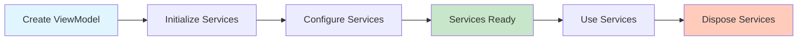
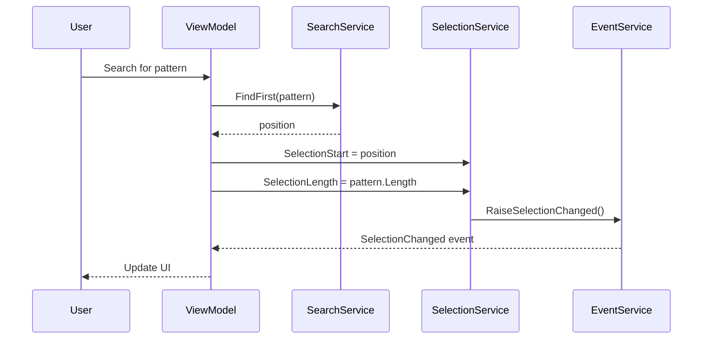

# Service Layer

**15 specialized services for modular functionality - Clean separation of concerns**

---

## 📋 Table of Contents

- [Overview](#overview)
- [Service Architecture](#service-architecture)
- [Core Services](#core-services)
- [Feature Services](#feature-services)
- [UI Services](#ui-services)
- [Service Coordination](#service-coordination)
- [Code Examples](#code-examples)

---

## 📖 Overview

The **Service Layer** provides **modular, specialized functionality** through 15 independent services, each responsible for a specific feature domain.

**Design Principles**:
- ✅ **Single Responsibility** - Each service has one clear purpose
- ✅ **Loose Coupling** - Services communicate through ViewModel
- ✅ **Dependency Injection** - Services receive dependencies via constructor
- ✅ **Testability** - Services can be unit-tested in isolation
- ✅ **Reusability** - Services can be used independently

**Location**: [Services/](../../../Sources/WPFHexaEditor/Services/)

---

## 🏗️ Service Architecture

### Component Diagram

```mermaid
graph TB
    subgraph "Presentation Layer"
        VM["HexEditorViewModel<br/>(Coordinator)"]
    end

    subgraph "Core Services"
        Search["SearchService"]
        Clipboard["ClipboardService"]
        UndoRedo["UndoRedoService"]
        Selection["SelectionService"]
    end

    subgraph "Feature Services"
        Bookmark["BookmarkService"]
        Highlight["HighlightService"]
        TBL["TBLService"]
        Compare["CompareService"]
        StatePersist["StatePersistenceService"]
    end

    subgraph "UI Services"
        Events["EventService"]
        Zoom["ZoomService"]
        UIHelper["UIHelperService"]
    end

    subgraph "Data Services"
        FileOps["FileOperationsService"]
        StreamOps["StreamOperationsService"]
        ByteOps["ByteOperationsService"]
    end

    VM --> Search
    VM --> Clipboard
    VM --> UndoRedo
    VM --> Selection
    VM --> Bookmark
    VM --> Highlight
    VM --> TBL
    VM --> Compare
    VM --> StatePersist
    VM --> Events
    VM --> Zoom
    VM --> UIHelper
    VM --> FileOps
    VM --> StreamOps
    VM --> ByteOps

    style VM fill:#e1f5ff,stroke:#0277bd,stroke-width:3px
    style Search fill:#c8e6c9,stroke:#388e3c,stroke-width:2px
    style Clipboard fill:#fff9c4,stroke:#f57c00,stroke-width:2px
```



### Service Lifecycle



---

## ⚙️ Core Services

### 1. SearchService

**Purpose**: Byte pattern and string search operations.

**Location**: [SearchService.cs](../../../Sources/WPFHexaEditor/Services/SearchService.cs)

**Responsibilities**:
- Find byte patterns (FindFirst, FindNext, FindLast, FindAll)
- String search with encoding support
- Count occurrences (memory-efficient)
- Highlight search results

**API**:
```csharp
public class SearchService
{
    private readonly ByteProvider _provider;

    // Find operations
    public long FindFirst(byte[] pattern, long startPosition = 0);
    public long FindNext(byte[] pattern, long currentPosition);
    public long FindPrevious(byte[] pattern, long currentPosition);
    public long FindLast(byte[] pattern, long startPosition = -1);
    public List<long> FindAll(byte[] pattern, long startPosition = 0);

    // String search
    public long FindString(string text, Encoding encoding, long startPosition = 0);
    public List<long> FindAllStrings(string text, Encoding encoding);

    // Count
    public int CountOccurrences(byte[] pattern, long startPosition = 0);

    // Replace
    public int ReplaceFirst(byte[] find, byte[] replace);
    public int ReplaceAll(byte[] find, byte[] replace);
}
```

**Example**:
```csharp
// Find pattern
var pattern = new byte[] { 0xDE, 0xAD, 0xBE, 0xEF };
long position = searchService.FindFirst(pattern);

if (position >= 0)
{
    Console.WriteLine($"Found at 0x{position:X}");
}

// Count occurrences
int count = searchService.CountOccurrences(pattern);
Console.WriteLine($"Total matches: {count}");
```

### 2. ClipboardService

**Purpose**: Clipboard operations with multiple format support.

**Location**: [ClipboardService.cs](../../../Sources/WPFHexaEditor/Services/ClipboardService.cs)

**Responsibilities**:
- Copy bytes in multiple formats (Hex, ASCII, C# array, etc.)
- Paste with format detection
- Clipboard format conversion

**Supported Formats**:
- **Hex**: `DE AD BE EF`
- **ASCII**: `DEADBEEF`
- **C# Array**: `new byte[] { 0xDE, 0xAD, 0xBE, 0xEF }`
- **C Array**: `{0xDE, 0xAD, 0xBE, 0xEF}`
- **Binary**: `11011110 10101101 10111110 11101111`

**API**:
```csharp
public class ClipboardService
{
    public void Copy(long position, long length, ClipboardFormat format);
    public void Paste(long position, ClipboardFormat format);
    public byte[] GetClipboardBytes(ClipboardFormat format);
    public bool CanPaste(ClipboardFormat format);
}
```

**Example**:
```csharp
// Copy as C# array
clipboardService.Copy(0x100, 16, ClipboardFormat.CSharpArray);
// Clipboard: new byte[] { 0x41, 0x42, 0x43, ... }

// Paste from clipboard
clipboardService.Paste(0x200, ClipboardFormat.Auto);  // Auto-detect format
```

### 3. UndoRedoService

**Purpose**: History management (covered in [Undo/Redo System](undo-redo-system.md)).

**API**:
```csharp
public class UndoRedoService
{
    public void Undo();
    public void Redo();
    public bool CanUndo { get; }
    public bool CanRedo { get; }
    public int UndoDepth { get; }
    public int RedoDepth { get; }
    public void ClearHistory();
}
```

### 4. SelectionService

**Purpose**: Text selection and range management.

**Location**: [SelectionService.cs](../../../Sources/WPFHexaEditor/Services/SelectionService.cs)

**Responsibilities**:
- Track selection start, end, length
- Validate selection bounds
- Raise selection changed events

**API**:
```csharp
public class SelectionService
{
    public long SelectionStart { get; set; }
    public long SelectionLength { get; set; }
    public long SelectionEnd => SelectionStart + SelectionLength;

    public void SelectAll();
    public void ClearSelection();
    public void ExtendSelection(long newEnd);
    public bool HasSelection => SelectionLength > 0;

    public event EventHandler<SelectionChangedEventArgs> SelectionChanged;
}
```

**Example**:
```csharp
// Select range
selectionService.SelectionStart = 0x100;
selectionService.SelectionLength = 256;

// Check selection
if (selectionService.HasSelection)
{
    Console.WriteLine($"Selected: 0x{selectionService.SelectionStart:X} - " +
                     $"0x{selectionService.SelectionEnd:X}");
}

// Select all
selectionService.SelectAll();
```

---

## 🎨 Feature Services

### 5. BookmarkService

**Purpose**: Bookmark management for quick navigation.

**Location**: [BookmarkService.cs](../../../Sources/WPFHexaEditor/Services/BookmarkService.cs)

**API**:
```csharp
public class BookmarkService
{
    public void AddBookmark(long position, string description);
    public void RemoveBookmark(long position);
    public void ClearBookmarks();
    public List<Bookmark> GetBookmarks();
    public Bookmark GetBookmarkAt(long position);
    public bool HasBookmarkAt(long position);

    public event EventHandler<BookmarkEventArgs> BookmarkAdded;
    public event EventHandler<BookmarkEventArgs> BookmarkRemoved;
}

public class Bookmark
{
    public long Position { get; set; }
    public string Description { get; set; }
    public Color Color { get; set; }
}
```

**Example**:
```csharp
// Add bookmarks
bookmarkService.AddBookmark(0x100, "File header start");
bookmarkService.AddBookmark(0x500, "Data section");
bookmarkService.AddBookmark(0x1000, "Footer");

// Navigate to bookmark
var bookmarks = bookmarkService.GetBookmarks();
foreach (var bm in bookmarks)
{
    Console.WriteLine($"{bm.Description} at 0x{bm.Position:X}");
}
```

### 6. HighlightService

**Purpose**: Custom background highlighting for byte ranges.

**Location**: [HighlightService.cs](../../../Sources/WPFHexaEditor/Services/HighlightService.cs)

**API**:
```csharp
public class HighlightService
{
    public void AddHighlight(long start, long length, Color color, string description);
    public void RemoveHighlight(long start);
    public void ClearHighlights();
    public List<Highlight> GetHighlights();
    public Highlight GetHighlightAt(long position);
}

public class Highlight
{
    public long StartPosition { get; set; }
    public long Length { get; set; }
    public Color Color { get; set; }
    public string Description { get; set; }
}
```

**Example**:
```csharp
// Highlight file structure
highlightService.AddHighlight(0, 64, Colors.LightBlue, "DOS Header");
highlightService.AddHighlight(64, 248, Colors.LightGreen, "PE Header");
highlightService.AddHighlight(512, 1024, Colors.LightYellow, "Code Section");
```

### 7. TBLService

**Purpose**: Custom character table support (TBL files).

**Location**: [TBLService.cs](../../../Sources/WPFHexaEditor/Services/TBLService.cs)

**API**:
```csharp
public class TBLService
{
    public void LoadTBL(string filePath);
    public void LoadTBLFromStream(Stream stream);
    public void UnloadTBL();
    public string GetCharacter(byte value);
    public bool HasTBL { get; }
}
```

**Example**:
```csharp
// Load custom character table
tblService.LoadTBL("japanese.tbl");

// Read with custom characters
byte value = 0x81;
string character = tblService.GetCharacter(value);  // Returns Japanese character
```

### 8. CompareService

**Purpose**: Binary file comparison.

**Location**: [CompareService.cs](../../../Sources/WPFHexaEditor/Services/CompareService.cs)

**API**:
```csharp
public class CompareService
{
    public CompareResult Compare(string file1, string file2);
    public List<Difference> GetDifferences(string file1, string file2);
}

public class Difference
{
    public long Position { get; set; }
    public byte File1Byte { get; set; }
    public byte File2Byte { get; set; }
}
```

**Example**:
```csharp
// Compare two files
var result = compareService.Compare("original.bin", "modified.bin");
Console.WriteLine($"Files match: {result.AreEqual}");
Console.WriteLine($"Differences: {result.DifferenceCount}");

foreach (var diff in result.Differences)
{
    Console.WriteLine($"Position 0x{diff.Position:X}: " +
                     $"0x{diff.File1Byte:X2} vs 0x{diff.File2Byte:X2}");
}
```

### 9. StatePersistenceService

**Purpose**: Save and restore editor state.

**Location**: [StatePersistenceService.cs](../../../Sources/WPFHexaEditor/Services/StatePersistenceService.cs)

**API**:
```csharp
public class StatePersistenceService
{
    public void SaveState(string stateFile);
    public void LoadState(string stateFile);
}

public class EditorState
{
    public string FileName { get; set; }
    public long Position { get; set; }
    public long SelectionStart { get; set; }
    public long SelectionLength { get; set; }
    public List<Bookmark> Bookmarks { get; set; }
    public List<Highlight> Highlights { get; set; }
}
```

**Example**:
```csharp
// Save state
statePersistenceService.SaveState("session.state");

// Restore state later
statePersistenceService.LoadState("session.state");
// Bookmarks, highlights, position, and selection restored
```

---

## 🖥️ UI Services

### 10. EventService

**Purpose**: Event aggregation and routing.

**Location**: [EventService.cs](../../../Sources/WPFHexaEditor/Services/EventService.cs)

**API**:
```csharp
public class EventService
{
    public event EventHandler DataChanged;
    public event EventHandler LengthChanged;
    public event EventHandler<PositionEventArgs> PositionChanged;
    public event EventHandler<SelectionEventArgs> SelectionChanged;

    public void RaiseDataChanged();
    public void RaiseLengthChanged();
    public void RaisePositionChanged(long newPosition);
    public void RaiseSelectionChanged(long start, long length);
}
```

### 11. ZoomService

**Purpose**: Font size and zoom level management.

**Location**: [ZoomService.cs](../../../Sources/WPFHexaEditor/Services/ZoomService.cs)

**API**:
```csharp
public class ZoomService
{
    public double ZoomLevel { get; set; }
    public void ZoomIn();
    public void ZoomOut();
    public void ResetZoom();

    public event EventHandler<ZoomEventArgs> ZoomChanged;
}
```

**Example**:
```csharp
// Zoom in
zoomService.ZoomIn();  // Increases by 10%

// Zoom out
zoomService.ZoomOut();  // Decreases by 10%

// Reset
zoomService.ResetZoom();  // Back to 100%

// Custom zoom
zoomService.ZoomLevel = 1.5;  // 150%
```

### 12. UIHelperService

**Purpose**: UI-related helper methods.

**Location**: [UIHelperService.cs](../../../Sources/WPFHexaEditor/Services/UIHelperService.cs)

**API**:
```csharp
public class UIHelperService
{
    public void ScrollToPosition(long position);
    public void SetFocus();
    public void UpdateVisibleLines();
    public void InvalidateVisual();
}
```

---

## 📁 Data Services

### 13. FileOperationsService

**Purpose**: File I/O operations.

**API**:
```csharp
public class FileOperationsService
{
    public void Open(string fileName);
    public void Save();
    public void SaveAs(string fileName);
    public void Close();
    public Task OpenAsync(string fileName, IProgress<double> progress);
    public Task SaveAsync(string fileName, IProgress<double> progress);
}
```

### 14. StreamOperationsService

**Purpose**: Stream-based data operations.

**API**:
```csharp
public class StreamOperationsService
{
    public void OpenStream(Stream stream);
    public void OpenMemory(byte[] data);
    public Stream GetStream();
}
```

### 15. ByteOperationsService

**Purpose**: Low-level byte operations.

**API**:
```csharp
public class ByteOperationsService
{
    public byte ReadByte(long position);
    public byte[] ReadBytes(long position, int count);
    public void ModifyByte(long position, byte value);
    public void ModifyBytes(long position, byte[] values);
    public void InsertByte(long position, byte value);
    public void InsertBytes(long position, byte[] values);
    public void DeleteByte(long position);
    public void DeleteBytes(long position, long count);
}
```

---

## 🔄 Service Coordination

### ViewModel as Coordinator

```csharp
public class HexEditorViewModel
{
    // All services
    public SearchService SearchService { get; }
    public ClipboardService ClipboardService { get; }
    public UndoRedoService UndoRedoService { get; }
    public SelectionService SelectionService { get; }
    public BookmarkService BookmarkService { get; }
    public HighlightService HighlightService { get; }
    public TBLService TBLService { get; }
    public CompareService CompareService { get; }
    public StatePersistenceService StatePersistenceService { get; }
    public EventService EventService { get; }
    public ZoomService ZoomService { get; }
    public UIHelperService UIHelperService { get; }
    public FileOperationsService FileOperationsService { get; }
    public StreamOperationsService StreamOperationsService { get; }
    public ByteOperationsService ByteOperationsService { get; }

    public HexEditorViewModel(ByteProvider provider)
    {
        // Initialize services with dependencies
        SearchService = new SearchService(provider);
        ClipboardService = new ClipboardService(provider);
        UndoRedoService = new UndoRedoService(provider);
        SelectionService = new SelectionService();
        BookmarkService = new BookmarkService();
        HighlightService = new HighlightService();
        TBLService = new TBLService();
        CompareService = new CompareService();
        StatePersistenceService = new StatePersistenceService(this);
        EventService = new EventService();
        ZoomService = new ZoomService();
        UIHelperService = new UIHelperService(this);
        FileOperationsService = new FileOperationsService(provider);
        StreamOperationsService = new StreamOperationsService(provider);
        ByteOperationsService = new ByteOperationsService(provider);

        // Wire up events
        WireUpEvents();
    }

    private void WireUpEvents()
    {
        // Subscribe to service events
        SearchService.SearchCompleted += OnSearchCompleted;
        SelectionService.SelectionChanged += OnSelectionChanged;
        BookmarkService.BookmarkAdded += OnBookmarkAdded;
        // ... more event subscriptions
    }
}
```

### Service Communication



---

## 💻 Code Examples

### Example 1: Using Multiple Services

```csharp
// Search for pattern and bookmark matches
var pattern = new byte[] { 0xFF, 0xFF };
var positions = searchService.FindAll(pattern);

foreach (var pos in positions)
{
    bookmarkService.AddBookmark(pos, $"Pattern at 0x{pos:X}");
    highlightService.AddHighlight(pos, pattern.Length, Colors.Yellow, "Match");
}

Console.WriteLine($"Found {positions.Count} matches");
```

### Example 2: Complex Operation with Services

```csharp
// Find, select, copy operation
var pattern = new byte[] { 0xDE, 0xAD, 0xBE, 0xEF };
long position = searchService.FindFirst(pattern);

if (position >= 0)
{
    // Select found pattern
    selectionService.SelectionStart = position;
    selectionService.SelectionLength = pattern.Length;

    // Copy to clipboard
    clipboardService.Copy(position, pattern.Length, ClipboardFormat.HexString);

    // Add bookmark
    bookmarkService.AddBookmark(position, "Found pattern");

    // Highlight
    highlightService.AddHighlight(position, pattern.Length,
        Colors.LightGreen, "Match");
}
```

### Example 3: Service Dependency Injection

```csharp
// Custom service with dependencies
public class CustomAnalysisService
{
    private readonly SearchService _search;
    private readonly BookmarkService _bookmark;
    private readonly HighlightService _highlight;

    public CustomAnalysisService(
        SearchService search,
        BookmarkService bookmark,
        HighlightService highlight)
    {
        _search = search;
        _bookmark = bookmark;
        _highlight = highlight;
    }

    public void AnalyzeFileStructure()
    {
        // Use injected services
        var headers = _search.FindAll(new byte[] { 0x4D, 0x5A });  // MZ

        foreach (var pos in headers)
        {
            _bookmark.AddBookmark(pos, "PE Header");
            _highlight.AddHighlight(pos, 64, Colors.LightBlue, "Header");
        }
    }
}
```

---

## 🔗 See Also

- [Architecture Overview](../overview.md) - System architecture
- [ByteProvider System](byteprovider-system.md) - Data access coordination
- [Services Folder](../../../Sources/WPFHexaEditor/Services/) - Service implementations

---

**Last Updated**: 2026-02-19
**Version**: V2.0
