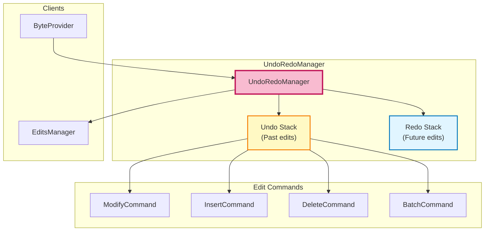
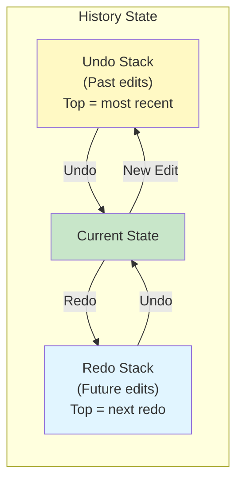

# Undo/Redo System

**Complete history management with unlimited undo/redo and granular control**

---

## 📋 Table of Contents

- [Overview](#overview)
- [Architecture](#architecture)
- [Edit Commands](#edit-commands)
- [Stack Management](#stack-management)
- [Algorithms](#algorithms)
- [Code Examples](#code-examples)
- [Performance](#performance)

---

## 📖 Overview

The **UndoRedoManager** provides comprehensive history tracking with **unlimited undo/redo** depth, allowing users to reverse any operation and navigate through edit history.

**Key Features**:
- ✅ **Unlimited history** - No artificial limits on undo depth
- ✅ **All edit types** - Modify, insert, delete operations
- ✅ **Batch support** - Group multiple edits into single undo unit
- ✅ **State preservation** - Exact restore of previous states
- ✅ **Memory efficient** - Only store delta changes

**Location**: [UndoRedoManager.cs](../../../Sources/WPFHexaEditor/Core/Bytes/UndoRedoManager.cs)

---

## 🏗️ Architecture

### Component Diagram



### Two-Stack Architecture



---

## 🎯 Edit Commands

### Command Pattern

Each edit is encapsulated as a **command object** implementing a common interface:

```csharp
public interface IEditCommand
{
    void Execute(EditsManager edits);    // Apply the edit
    void Undo(EditsManager edits);       // Reverse the edit
    string Description { get; }          // Human-readable description
}
```

### Command Types

#### 1. ModifyCommand

**Purpose**: Store byte value modification

```csharp
public class ModifyCommand : IEditCommand
{
    public long Position { get; }
    public byte OldValue { get; }
    public byte NewValue { get; }

    public void Execute(EditsManager edits)
    {
        edits.AddModification(Position, NewValue);
    }

    public void Undo(EditsManager edits)
    {
        if (OldValue == edits.GetOriginalByte(Position))
        {
            // Restore to original: remove modification
            edits.RemoveModification(Position);
        }
        else
        {
            // Restore to previous modification
            edits.AddModification(Position, OldValue);
        }
    }

    public string Description =>
        $"Modify 0x{Position:X} from 0x{OldValue:X2} to 0x{NewValue:X2}";
}
```

#### 2. InsertCommand

**Purpose**: Store byte insertion

```csharp
public class InsertCommand : IEditCommand
{
    public long Position { get; }
    public byte Value { get; }

    public void Execute(EditsManager edits)
    {
        edits.AddInsertion(Position, Value);
    }

    public void Undo(EditsManager edits)
    {
        // Remove the insertion (pop from LIFO stack)
        edits.RemoveInsertion(Position);
    }

    public string Description =>
        $"Insert 0x{Value:X2} at position 0x{Position:X}";
}
```

#### 3. DeleteCommand

**Purpose**: Store byte deletion with original data

```csharp
public class DeleteCommand : IEditCommand
{
    public long Position { get; }
    public byte[] DeletedBytes { get; }  // Original data

    public void Execute(EditsManager edits)
    {
        edits.AddDeletion(Position, DeletedBytes.Length);
    }

    public void Undo(EditsManager edits)
    {
        // Remove deletion
        edits.RemoveDeletion(Position, DeletedBytes.Length);

        // Restore original bytes as modifications
        for (int i = 0; i < DeletedBytes.Length; i++)
        {
            edits.AddModification(Position + i, DeletedBytes[i]);
        }
    }

    public string Description =>
        $"Delete {DeletedBytes.Length} byte(s) at position 0x{Position:X}";
}
```

#### 4. BatchCommand

**Purpose**: Group multiple edits into single undo unit

```csharp
public class BatchCommand : IEditCommand
{
    private List<IEditCommand> _commands = new();

    public void AddCommand(IEditCommand command)
    {
        _commands.Add(command);
    }

    public void Execute(EditsManager edits)
    {
        // Execute all commands in order
        foreach (var cmd in _commands)
        {
            cmd.Execute(edits);
        }
    }

    public void Undo(EditsManager edits)
    {
        // Undo all commands in reverse order
        for (int i = _commands.Count - 1; i >= 0; i--)
        {
            _commands[i].Undo(edits);
        }
    }

    public string Description =>
        $"Batch: {_commands.Count} operation(s)";
}
```

---

## 📚 Stack Management

### Stack Operations

```csharp
public class UndoRedoManager
{
    private Stack<IEditCommand> _undoStack = new();
    private Stack<IEditCommand> _redoStack = new();
    private BatchCommand _currentBatch = null;
    private int _maxHistorySize = 10000;  // Default limit

    // Push new edit to undo stack
    public void PushEdit(IEditCommand command)
    {
        if (_currentBatch != null)
        {
            // Add to current batch
            _currentBatch.AddCommand(command);
        }
        else
        {
            // Push directly to undo stack
            _undoStack.Push(command);

            // Clear redo stack (new edit creates new timeline)
            _redoStack.Clear();

            // Enforce max history size
            if (_undoStack.Count > _maxHistorySize)
            {
                TrimOldestEdit();
            }
        }
    }

    // Undo last edit
    public void Undo()
    {
        if (!CanUndo)
            throw new InvalidOperationException("Nothing to undo");

        // Pop from undo stack
        var command = _undoStack.Pop();

        // Execute undo
        command.Undo(_editsManager);

        // Push to redo stack
        _redoStack.Push(command);

        OnHistoryChanged();
    }

    // Redo next edit
    public void Redo()
    {
        if (!CanRedo)
            throw new InvalidOperationException("Nothing to redo");

        // Pop from redo stack
        var command = _redoStack.Pop();

        // Execute redo (same as execute)
        command.Execute(_editsManager);

        // Push back to undo stack
        _undoStack.Push(command);

        OnHistoryChanged();
    }

    // Properties
    public bool CanUndo => _undoStack.Count > 0 && _currentBatch == null;
    public bool CanRedo => _redoStack.Count > 0 && _currentBatch == null;
    public int UndoDepth => _undoStack.Count;
    public int RedoDepth => _redoStack.Count;
}
```

### Batch Mode

```csharp
// Begin batch: group multiple edits
public void BeginBatch()
{
    if (_currentBatch != null)
        throw new InvalidOperationException("Batch already started");

    _currentBatch = new BatchCommand();
}

// End batch: push as single undo unit
public void EndBatch()
{
    if (_currentBatch == null)
        throw new InvalidOperationException("No batch to end");

    // Only push if batch has commands
    if (_currentBatch.CommandCount > 0)
    {
        _undoStack.Push(_currentBatch);
        _redoStack.Clear();
    }

    _currentBatch = null;
    OnHistoryChanged();
}

// Cancel batch: discard all edits in batch
public void CancelBatch()
{
    if (_currentBatch == null)
        throw new InvalidOperationException("No batch to cancel");

    // Undo all commands in batch
    _currentBatch.Undo(_editsManager);

    _currentBatch = null;
}
```

---

## 🔢 Algorithms

### Algorithm 1: Push Edit

```csharp
public void PushEdit(IEditCommand command)
{
    // 1. Check if in batch mode
    if (_currentBatch != null)
    {
        _currentBatch.AddCommand(command);
        return;
    }

    // 2. Push to undo stack
    _undoStack.Push(command);

    // 3. Clear redo stack (new edit invalidates future)
    _redoStack.Clear();

    // 4. Trim history if needed
    if (_undoStack.Count > _maxHistorySize)
    {
        // Remove oldest edit (bottom of stack)
        var oldStack = _undoStack.ToList();
        oldStack.RemoveAt(oldStack.Count - 1);  // Remove bottom
        _undoStack = new Stack<IEditCommand>(oldStack.Reverse<IEditCommand>());
    }

    // 5. Raise event
    OnHistoryChanged();
}
```

**Time Complexity**: O(1) normally, O(n) when trimming (rare)

### Algorithm 2: Undo Operation

```csharp
public void Undo()
{
    // 1. Validate state
    if (!CanUndo)
        throw new InvalidOperationException("Nothing to undo");

    // 2. Pop command from undo stack
    var command = _undoStack.Pop();

    // 3. Execute undo (reverse the operation)
    command.Undo(_editsManager);

    // 4. Push to redo stack
    _redoStack.Push(command);

    // 5. Raise events
    OnHistoryChanged();
    OnUndoExecuted(command);
}
```

**Time Complexity**: O(1) for stack operation + O(k) for undo execution where k = affected bytes

### Algorithm 3: Redo Operation

```csharp
public void Redo()
{
    // 1. Validate state
    if (!CanRedo)
        throw new InvalidOperationException("Nothing to redo");

    // 2. Pop command from redo stack
    var command = _redoStack.Pop();

    // 3. Execute command (reapply the operation)
    command.Execute(_editsManager);

    // 4. Push back to undo stack
    _undoStack.Push(command);

    // 5. Raise events
    OnHistoryChanged();
    OnRedoExecuted(command);
}
```

**Time Complexity**: O(1) for stack operation + O(k) for redo execution

### Algorithm 4: Clear History

```csharp
public void ClearHistory()
{
    // Clear both stacks
    _undoStack.Clear();
    _redoStack.Clear();

    // Cancel any active batch
    if (_currentBatch != null)
    {
        _currentBatch = null;
    }

    // Raise event
    OnHistoryChanged();
}
```

**Time Complexity**: O(1)

---

## 💻 Code Examples

### Example 1: Basic Undo/Redo

```csharp
var undo = new UndoRedoManager(editsManager);

// Make some edits
undo.PushEdit(new ModifyCommand(0x100, oldValue: 0x42, newValue: 0xFF));
undo.PushEdit(new InsertCommand(0x200, value: 0xAA));
undo.PushEdit(new DeleteCommand(0x300, deletedBytes: new byte[] { 0x11, 0x22 }));

Console.WriteLine($"Can undo: {undo.CanUndo}");  // True
Console.WriteLine($"Undo depth: {undo.UndoDepth}");  // 3

// Undo last edit (delete)
undo.Undo();
Console.WriteLine($"Undo depth: {undo.UndoDepth}");  // 2
Console.WriteLine($"Can redo: {undo.CanRedo}");  // True

// Redo
undo.Redo();
Console.WriteLine($"Undo depth: {undo.UndoDepth}");  // 3
Console.WriteLine($"Can redo: {undo.CanRedo}");  // False
```

### Example 2: Batch Operations

```csharp
// Group multiple edits into single undo
undo.BeginBatch();
try
{
    for (int i = 0; i < 1000; i++)
    {
        undo.PushEdit(new ModifyCommand(i, oldValue: 0x00, newValue: 0xFF));
    }
}
finally
{
    undo.EndBatch();
}

Console.WriteLine($"Undo depth: {undo.UndoDepth}");  // 1 (batch counts as one)

// Undo entire batch in one operation
undo.Undo();
Console.WriteLine("All 1000 modifications undone");
```

### Example 3: Undo History Navigation

```csharp
// Get undo history
var history = undo.GetUndoHistory();

foreach (var command in history)
{
    Console.WriteLine($"- {command.Description}");
}

// Output:
// - Modify 0x100 from 0x42 to 0xFF
// - Insert 0xAA at position 0x200
// - Delete 2 byte(s) at position 0x300

// Undo to specific point (undo last 2 operations)
for (int i = 0; i < 2; i++)
{
    undo.Undo();
}
```

### Example 4: Transaction with Rollback

```csharp
// Start transaction (batch)
undo.BeginBatch();

try
{
    // Perform complex operation
    PerformComplexEdit();

    // Commit transaction
    undo.EndBatch();
}
catch (Exception ex)
{
    // Rollback on error
    undo.CancelBatch();
    Console.WriteLine($"Transaction rolled back: {ex.Message}");
}
```

### Example 5: Custom Command

```csharp
// Create custom command for complex operation
public class ReplacePatternCommand : IEditCommand
{
    private long[] _positions;
    private byte[] _oldPattern;
    private byte[] _newPattern;

    public void Execute(EditsManager edits)
    {
        foreach (var pos in _positions)
        {
            for (int i = 0; i < _newPattern.Length; i++)
            {
                edits.AddModification(pos + i, _newPattern[i]);
            }
        }
    }

    public void Undo(EditsManager edits)
    {
        foreach (var pos in _positions)
        {
            for (int i = 0; i < _oldPattern.Length; i++)
            {
                edits.AddModification(pos + i, _oldPattern[i]);
            }
        }
    }

    public string Description =>
        $"Replace pattern at {_positions.Length} location(s)";
}

// Usage
var replaceCmd = new ReplacePatternCommand(
    positions: new long[] { 0x100, 0x500, 0x900 },
    oldPattern: new byte[] { 0xDE, 0xAD },
    newPattern: new byte[] { 0xCA, 0xFE }
);

undo.PushEdit(replaceCmd);
```

### Example 6: History Size Limit

```csharp
// Set maximum history size
undo.MaxHistorySize = 5000;

// Add more than max
for (int i = 0; i < 10000; i++)
{
    undo.PushEdit(new ModifyCommand(i, 0x00, 0xFF));
}

Console.WriteLine($"Undo depth: {undo.UndoDepth}");  // 5000 (oldest trimmed)
```

### Example 7: Undo/Redo Events

```csharp
// Subscribe to events
undo.HistoryChanged += (s, e) =>
{
    Console.WriteLine($"History: {undo.UndoDepth} undo, {undo.RedoDepth} redo");
};

undo.UndoExecuted += (s, cmd) =>
{
    Console.WriteLine($"Undone: {cmd.Description}");
};

undo.RedoExecuted += (s, cmd) =>
{
    Console.WriteLine($"Redone: {cmd.Description}");
};

// Make edits
undo.PushEdit(new ModifyCommand(0x100, 0x42, 0xFF));
// Output: History: 1 undo, 0 redo

undo.Undo();
// Output: Undone: Modify 0x100 from 0x42 to 0xFF
// Output: History: 0 undo, 1 redo

undo.Redo();
// Output: Redone: Modify 0x100 from 0x42 to 0xFF
// Output: History: 1 undo, 0 redo
```

---

## ⚡ Performance

### Time Complexity

| Operation | Complexity | Notes |
|-----------|-----------|-------|
| PushEdit | O(1) | Stack push |
| Undo | O(1) + O(k) | Stack pop + undo execution |
| Redo | O(1) + O(k) | Stack pop + redo execution |
| BeginBatch | O(1) | Create batch object |
| EndBatch | O(1) | Push batch to stack |
| CancelBatch | O(n) | Undo all commands in batch |
| ClearHistory | O(1) | Clear stacks |
| GetUndoHistory | O(n) | Convert stack to list |

Where:
- k = number of bytes affected by edit
- n = number of commands in batch

### Space Complexity

| Data | Size Per Command | 10,000 Commands |
|------|-----------------|----------------|
| ModifyCommand | 24 bytes | ~240 KB |
| InsertCommand | 16 bytes | ~160 KB |
| DeleteCommand | 24 + data size | ~240 KB + data |
| BatchCommand | 16 + child commands | Variable |

**Memory Usage Example**:
- 10,000 modifications = ~240 KB
- 10,000 insertions = ~160 KB
- 10,000 deletions (1 byte each) = ~250 KB
- **Total**: ~650 KB for 10,000 operations

### Optimization Strategies

```csharp
// 1. Compress batch commands
public class CompressedBatchCommand : BatchCommand
{
    public override void Execute(EditsManager edits)
    {
        // Merge consecutive modifications at same position
        var merged = MergeConsecutiveEdits(_commands);
        foreach (var cmd in merged)
        {
            cmd.Execute(edits);
        }
    }
}

// 2. Limit history by memory instead of count
private long _maxMemoryBytes = 10 * 1024 * 1024;  // 10 MB

public void PushEdit(IEditCommand command)
{
    _undoStack.Push(command);

    while (GetTotalMemoryUsage() > _maxMemoryBytes)
    {
        RemoveOldestEdit();
    }
}

// 3. Lazy undo data loading
public class LazyDeleteCommand : IEditCommand
{
    private long _position;
    private long _count;
    private byte[] _deletedBytes;  // Loaded on-demand

    public void Undo(EditsManager edits)
    {
        if (_deletedBytes == null)
        {
            // Load from file only when undoing
            _deletedBytes = LoadFromBackup(_position, _count);
        }

        // Restore bytes
        RestoreBytes(_deletedBytes);
    }
}
```

---

## 🔗 See Also

- [ByteProvider System](byteprovider-system.md) - Coordination layer
- [Edit Tracking](edit-tracking.md) - EditsManager details
- [Architecture Overview](../overview.md) - System architecture

---

**Last Updated**: 2026-02-19
**Version**: V2.0
