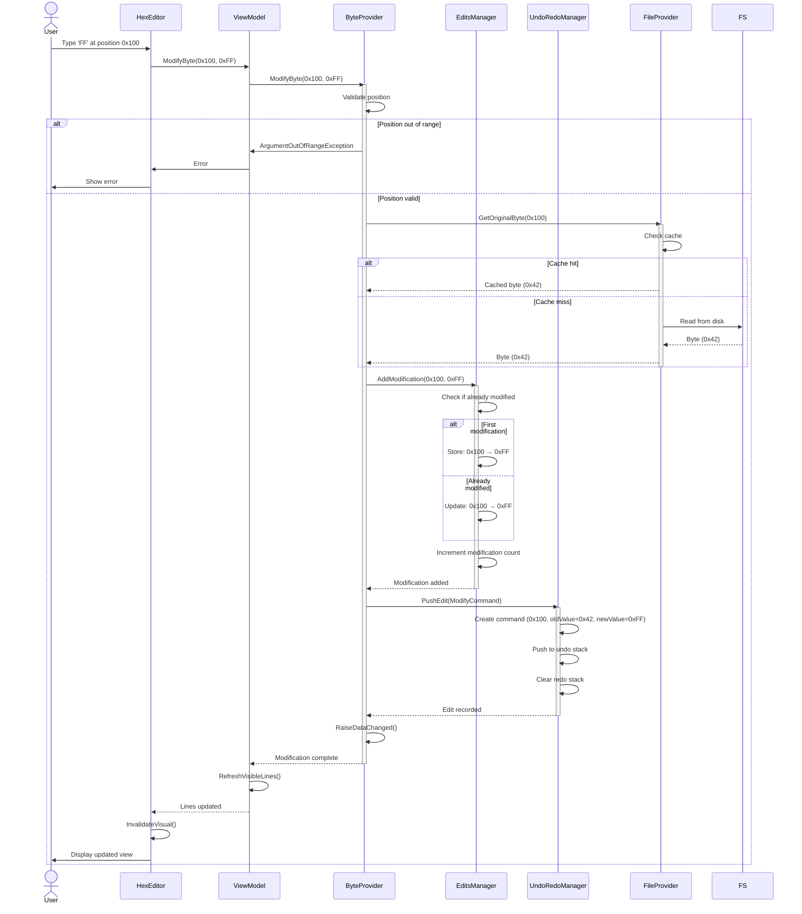
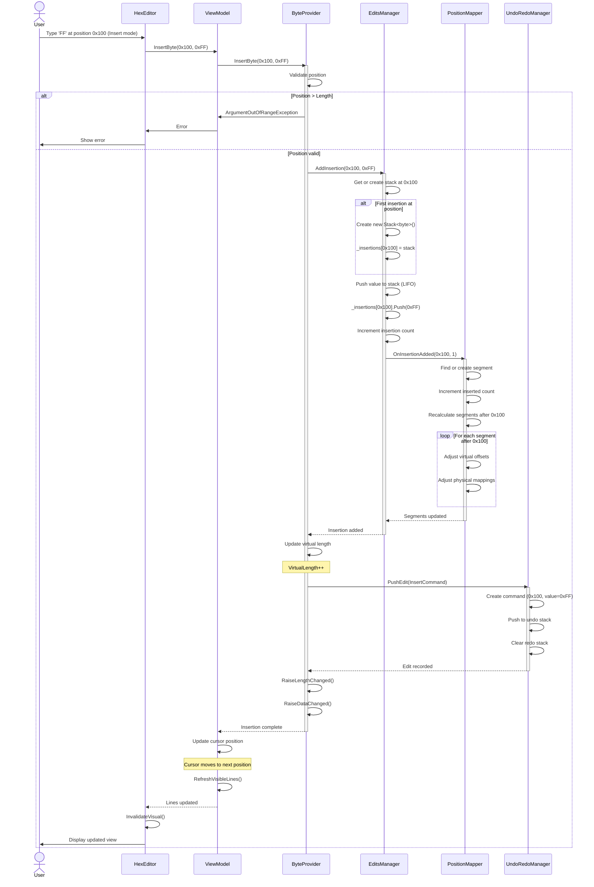
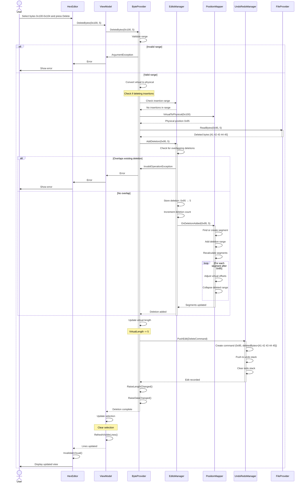
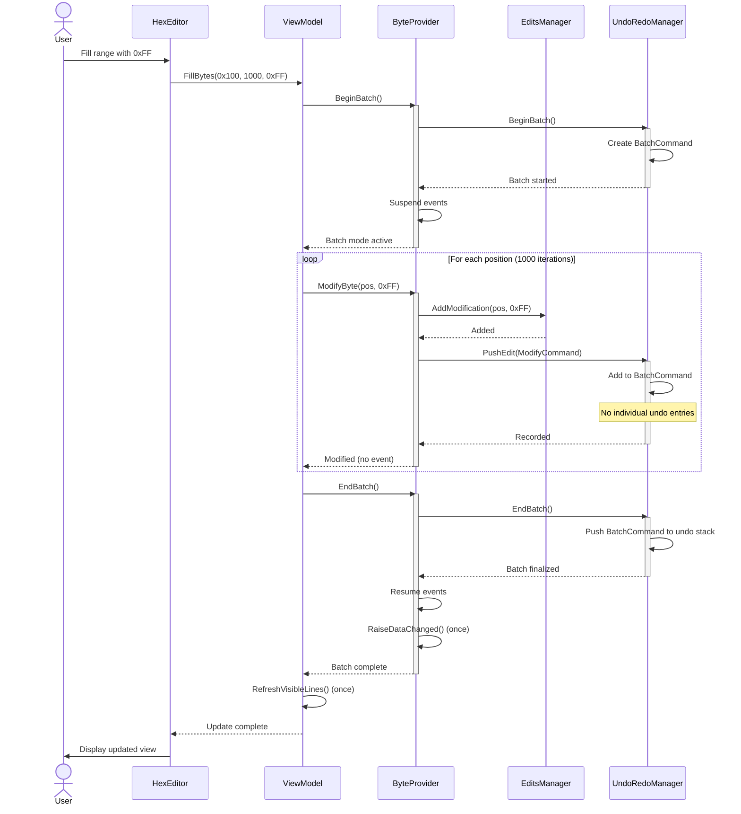
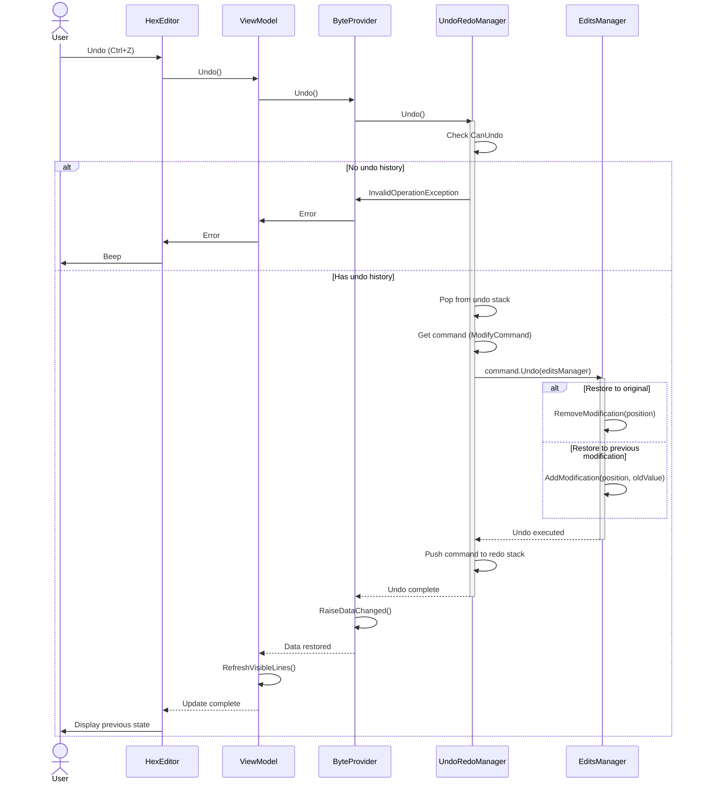
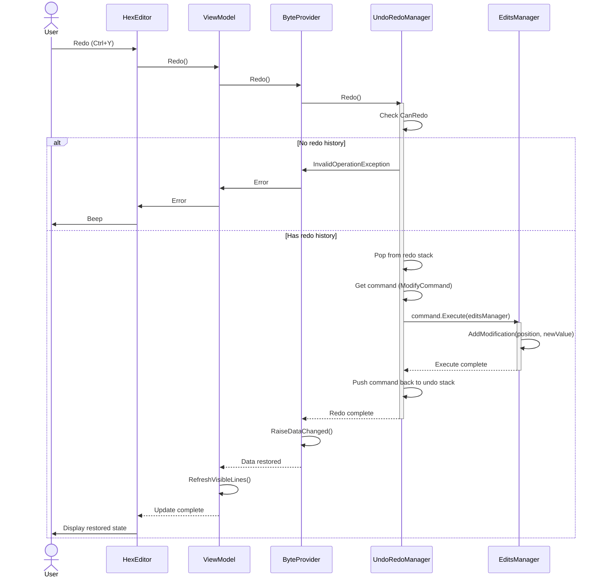

# Edit Operations Data Flow

**Complete sequence diagrams for modify, insert, and delete operations**

---

## 📋 Table of Contents

- [Overview](#overview)
- [Modify Byte Sequence](#modify-byte-sequence)
- [Insert Byte Sequence](#insert-byte-sequence)
- [Delete Bytes Sequence](#delete-bytes-sequence)
- [Batch Operations](#batch-operations)
- [Undo/Redo Flow](#undoredo-flow)

---

## 📖 Overview

This document details the complete data flow for byte editing operations, showing how modifications, insertions, and deletions are tracked and applied.

---

## ✏️ Modify Byte Sequence

### Sequence Diagram



### Step-by-Step Breakdown

#### Step 1: User Input

```csharp
// User types in hex viewport
// HexViewport captures KeyDown event
protected override void OnKeyDown(KeyEventArgs e)
{
    if (IsHexChar(e.Key))
    {
        char hexChar = GetHexChar(e.Key);
        ProcessHexInput(hexChar);
    }
}

private void ProcessHexInput(char hexChar)
{
    // Accumulate hex nibbles
    if (_hexBuffer.Length == 0)
    {
        _hexBuffer.Append(hexChar);  // First nibble
    }
    else
    {
        _hexBuffer.Append(hexChar);  // Second nibble
        byte value = Convert.ToByte(_hexBuffer.ToString(), 16);

        // Send to ViewModel
        _viewModel.ModifyByte(_currentPosition, value);

        _hexBuffer.Clear();
        _currentPosition++;
    }
}
```

#### Step 2: Validate and Get Original

```csharp
public void ModifyByte(long position, byte value)
{
    // Validate
    if (position < 0 || position >= Length)
        throw new ArgumentOutOfRangeException(nameof(position));

    // Get original value (for undo)
    byte originalValue = _fileProvider.ReadByte(position);

    // Apply modification
    _editsManager.AddModification(position, value);
}
```

#### Step 3: Track in EditsManager

```csharp
public void AddModification(long position, byte value)
{
    // Store modification
    _modifications[position] = value;

    // Update stats
    _modificationCount = _modifications.Count;

    // Raise event
    OnModificationAdded(position, value);
}
```

#### Step 4: Record for Undo

```csharp
// Create undo command
var command = new ModifyCommand
{
    Position = position,
    OldValue = originalValue,
    NewValue = value
};

// Push to undo stack
_undoManager.PushEdit(command);
```

#### Step 5: Update UI

```csharp
// ViewModel refreshes visible lines
private void RefreshVisibleLines()
{
    var lines = GenerateVisibleLines(_firstVisibleLine, _visibleLineCount);
    _hexViewport.UpdateVisibleLines(lines);
}
```

**Result**: Byte appears modified (red color) in hex view.

---

## ➕ Insert Byte Sequence (Insert Mode)

### Sequence Diagram



### LIFO Insertion Example

```
Original:  [41 42 43 44 45] at 0x100-0x104

User types 'FF' at position 0x100:
Insertions[0x100] = Stack [FF]
Virtual:   [FF 41 42 43 44 45]
Positions:  ↑100  ↑101 ↑102

User types 'AA' at position 0x100 again:
Insertions[0x100] = Stack [AA, FF]  (LIFO)
Virtual:   [AA FF 41 42 43 44 45]
Positions:  ↑100 ↑101 ↑102 ↑103

User types 'BB' at position 0x100 again:
Insertions[0x100] = Stack [BB, AA, FF]  (LIFO)
Virtual:   [BB AA FF 41 42 43 44 45]
Positions:  ↑100 ↑101 ↑102 ↑103 ↑104
```

### Code Example

```csharp
public void InsertByte(long virtualPosition, byte value)
{
    // Validate
    if (virtualPosition < 0 || virtualPosition > Length)
        throw new ArgumentOutOfRangeException(nameof(virtualPosition));

    // Add insertion
    _editsManager.AddInsertion(virtualPosition, value);

    // Update mapper
    _positionMapper.OnInsertionAdded(virtualPosition, 1);

    // Update length
    _virtualLength++;

    // Record undo
    var command = new InsertCommand(virtualPosition, value);
    _undoManager.PushEdit(command);

    // Notify
    RaiseLengthChanged();
    RaiseDataChanged();
}
```

---

## ➖ Delete Bytes Sequence

### Sequence Diagram



### Deletion with Insertions

```
Original file: [41 42 43 44 45 46 47 48]  (positions 0-7)

Insert 3 bytes at position 2:
Virtual: [41 42 AA BB CC 43 44 45 46 47 48]
          ↑0  ↑1  ↑2  ↑3  ↑4  ↑5  ↑6  ↑7  ↑8  ↑9  ↑10

Delete positions 3-5 (virtual):
- Position 3: BB (insertion) → Remove from insertion stack
- Position 4: CC (insertion) → Remove from insertion stack
- Position 5: 43 (physical position 2) → Mark as deleted

Result:
Virtual: [41 42 AA 44 45 46 47 48]
          ↑0  ↑1  ↑2  ↑3  ↑4  ↑5  ↑6  ↑7

Physical deletions: Position 2 (byte 0x43)
Insertion updates: Stack[AA] only (BB and CC removed)
```

---

## 📦 Batch Operations

### Batch Sequence Diagram



### Batch Performance

**Without Batch**:
- 1000 edits = 1000 events = 1000 UI updates = **slow**

**With Batch**:
- 1000 edits = 1 event = 1 UI update = **3x faster**

### Code Example

```csharp
// Without batch: slow
for (int i = 0; i < 10000; i++)
{
    hexEditor.ModifyByte(i, 0xFF);  // Triggers event each time
}
// Total time: ~3000ms

// With batch: fast
hexEditor.BeginBatch();
try
{
    for (int i = 0; i < 10000; i++)
    {
        hexEditor.ModifyByte(i, 0xFF);  // No event
    }
}
finally
{
    hexEditor.EndBatch();  // Single event
}
// Total time: ~1000ms (3x faster)
```

---

## ↩️ Undo/Redo Flow

### Undo Sequence



### Redo Sequence



---

## 🔗 See Also

- [File Operations](file-operations.md) - Open, close, save sequences
- [Save Operations](save-operations.md) - Smart save algorithm
- [Undo/Redo System](../core-systems/undo-redo-system.md) - History management details

---

**Last Updated**: 2026-02-19
**Version**: V2.0
