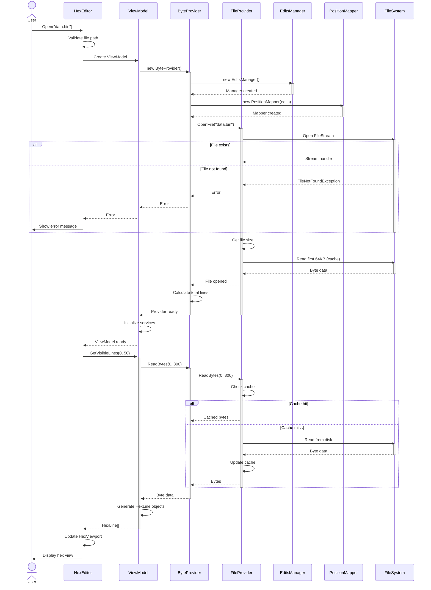
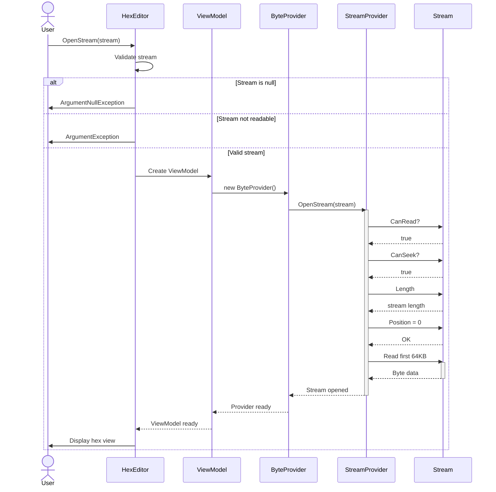
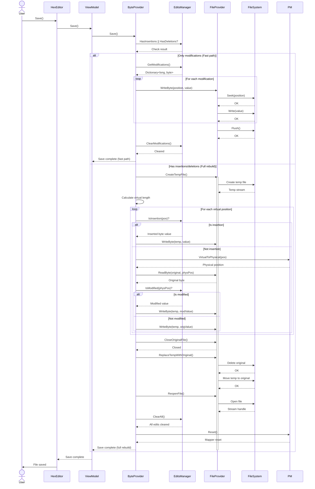
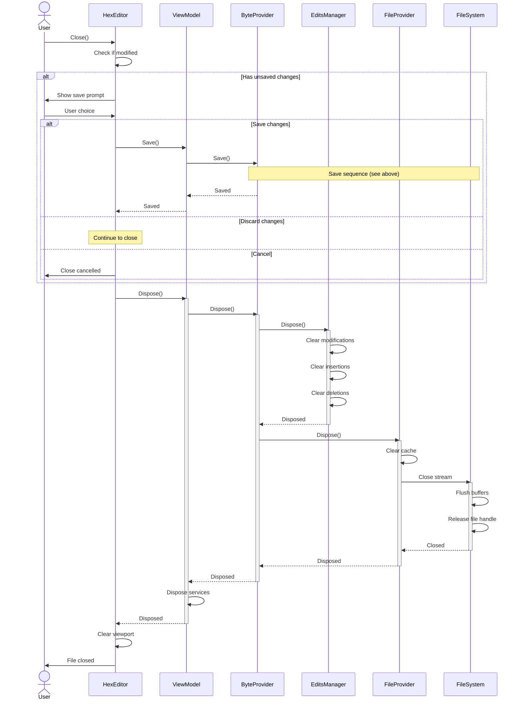
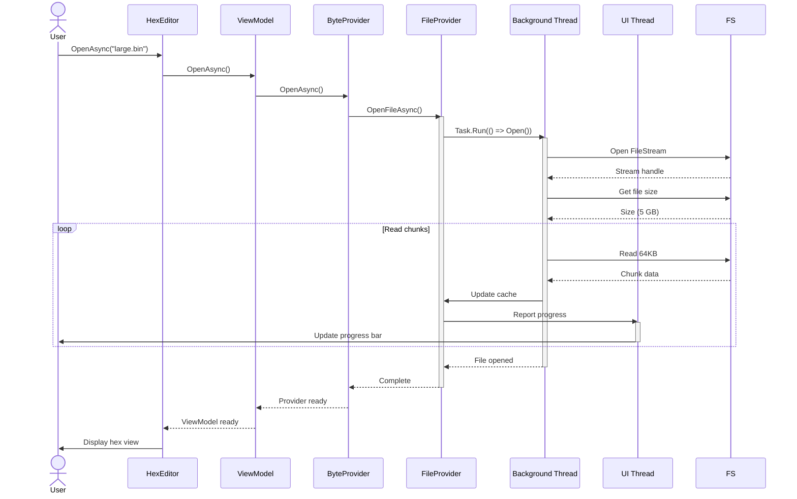

# File Operations Data Flow

**Complete sequence diagrams for file open, close, and save operations**

---

## 📋 Table of Contents

- [Overview](#overview)
- [Open File Sequence](#open-file-sequence)
- [Open Stream Sequence](#open-stream-sequence)
- [Save File Sequence](#save-file-sequence)
- [Close File Sequence](#close-file-sequence)
- [Async Operations](#async-operations)

---

## 📖 Overview

This document details the complete data flow for file operations, showing how components interact during open, save, and close operations.

---

## 📂 Open File Sequence

### Sequence Diagram



### Step-by-Step Breakdown

#### Step 1: User Initiates Open

```csharp
// User code
hexEditor.FileName = "data.bin";

// Or programmatically
hexEditor.Open("data.bin");
```

**Actions**:
1. Validate file path
2. Check file exists
3. Check read permissions

#### Step 2: Create ViewModel

```csharp
// HexEditor creates ViewModel
_viewModel = new HexEditorViewModel();
```

**Actions**:
1. Allocate ViewModel instance
2. Initialize properties
3. Prepare for ByteProvider

#### Step 3: Create ByteProvider

```csharp
// ViewModel creates ByteProvider
_provider = new ByteProvider();
_provider.Open(fileName);
```

**Actions**:
1. Create EditsManager (empty)
2. Create PositionMapper
3. Create FileProvider
4. Open file stream

#### Step 4: Open FileStream

```csharp
// FileProvider opens stream
_fileStream = File.Open(fileName, FileMode.Open, FileAccess.ReadWrite, FileShare.Read);
_fileSize = _fileStream.Length;
```

**Actions**:
1. Open file with read/write access
2. Get file size
3. Initialize cache

#### Step 5: Cache First Chunk

```csharp
// FileProvider caches first 64KB
byte[] cache = new byte[65536];
_fileStream.Read(cache, 0, cache.Length);
_cache.Add(0, cache);
```

**Benefit**: Instant access to file header and initial data.

#### Step 6: Generate Visible Lines

```csharp
// ViewModel generates lines for viewport
var lines = new List<HexLine>();
for (long line = 0; line < 50; line++)
{
    long position = line * 16;
    byte[] lineBytes = _provider.ReadBytes(position, 16);
    lines.Add(CreateHexLine(line, lineBytes));
}
```

**Actions**:
1. Calculate visible range
2. Read bytes for each line
3. Format hex and ASCII strings
4. Return HexLine objects

#### Step 7: Display in UI

```csharp
// HexEditor updates viewport
_hexViewport.UpdateVisibleLines(lines);
_hexViewport.InvalidateVisual();  // Trigger render
```

**Result**: User sees hex view of file.

---

## 🌊 Open Stream Sequence

### Sequence Diagram



### Stream Requirements

```csharp
public void OpenStream(Stream stream)
{
    // Validate stream
    if (stream == null)
        throw new ArgumentNullException(nameof(stream));

    if (!stream.CanRead)
        throw new ArgumentException("Stream must be readable");

    if (!stream.CanSeek)
        throw new ArgumentException("Stream must be seekable");

    // Use stream
    _stream = stream;
    _length = stream.Length;

    // Cache first chunk
    CacheStreamData(0, 65536);
}
```

---

## 💾 Save File Sequence

### Sequence Diagram (Smart Save)



### Fast Path vs Full Rebuild

**Fast Path** (modifications only):
- ✅ Seek to each modified position
- ✅ Write new byte value
- ✅ No file length change
- ⚡ **100x faster** for small edit counts

**Full Rebuild** (insertions/deletions):
- 📝 Create temporary file
- 🔄 Iterate virtual positions
- 💾 Write bytes in virtual order
- 🔄 Replace original with temp
- ⏱️ **Takes longer** but handles all edits

---

## 🚪 Close File Sequence

### Sequence Diagram



---

## ⚡ Async Operations

### Async Open Sequence



### Code Example

```csharp
// Async open with progress
var progress = new Progress<double>(percent =>
{
    progressBar.Value = percent;
    statusLabel.Text = $"Opening: {percent:F1}%";
});

await hexEditor.OpenAsync("large.bin", progress);
Console.WriteLine("File opened");
```

---

## 🔗 See Also

- [Edit Operations](edit-operations.md) - Modify, insert, delete sequences
- [Save Operations](save-operations.md) - Detailed save algorithm
- [Search Operations](search-operations.md) - Find and replace sequences

---

**Last Updated**: 2026-02-19
**Version**: V2.0
