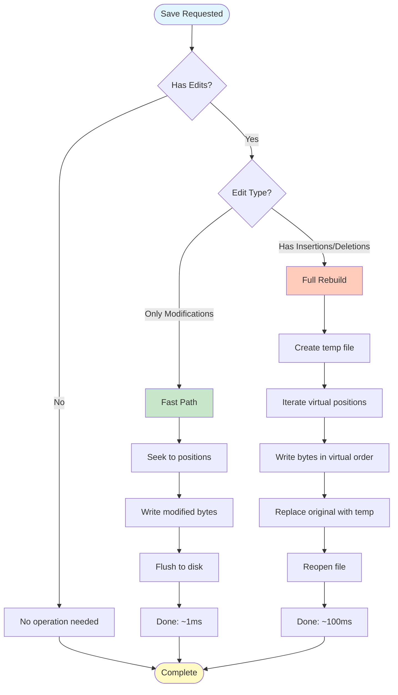
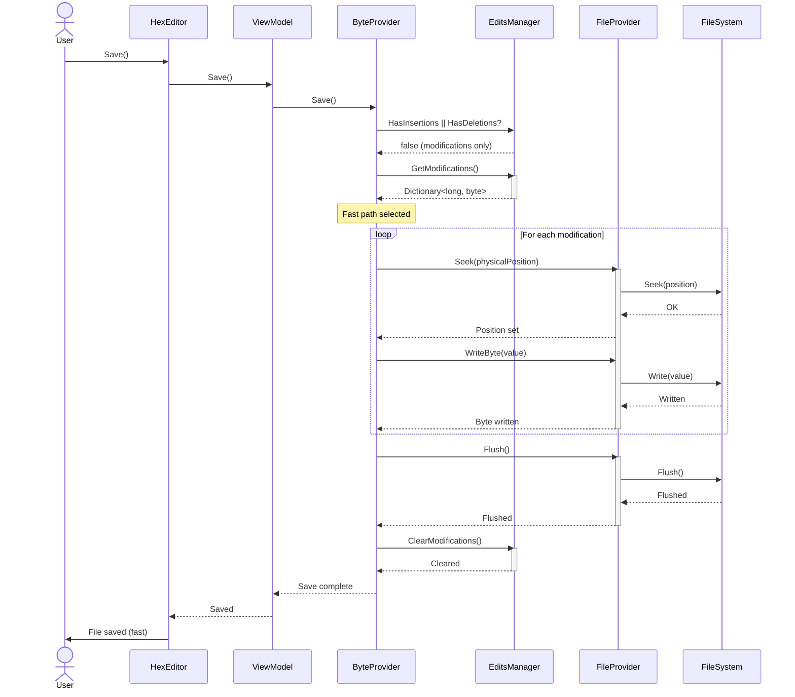
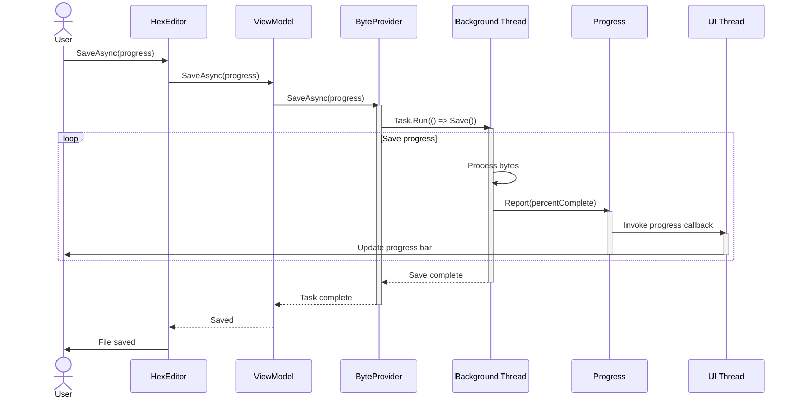

# Save Operations Data Flow

**Smart save algorithm with fast path optimization - 100x faster for modifications-only**

---

## 📋 Table of Contents

- [Overview](#overview)
- [Decision Tree](#decision-tree)
- [Fast Path: Modifications Only](#fast-path-modifications-only)
- [Full Rebuild: Insertions/Deletions](#full-rebuild-insertionsdeletions)
- [Async Save with Progress](#async-save-with-progress)
- [Error Handling](#error-handling)

---

## 📖 Overview

HexEditor V2 uses a **smart save algorithm** that chooses between two paths based on edit type:

- **Fast Path**: For modifications only (no length change) → 100x faster
- **Full Rebuild**: For insertions/deletions (length change) → Complete file reconstruction

---

## 🌳 Decision Tree

### Algorithm Selection Flowchart



### Decision Logic

```csharp
public void Save()
{
    if (!HasChanges)
    {
        // No changes: no-op
        return;
    }

    if (_editsManager.HasInsertions || _editsManager.HasDeletions)
    {
        // Full rebuild path
        SaveWithRebuild();
    }
    else
    {
        // Fast path (modifications only)
        SaveFastPath();
    }
}
```

---

## ⚡ Fast Path: Modifications Only

### Sequence Diagram



### Fast Path Implementation

```csharp
private void SaveFastPath()
{
    // Get all modifications
    var modifications = _editsManager.GetModifications();

    Console.WriteLine($"Fast path: {modifications.Count} modifications");

    // Apply each modification
    foreach (var (position, value) in modifications)
    {
        // Seek to position
        _fileProvider.Seek(position);

        // Write byte
        _fileProvider.WriteByte(value);
    }

    // Flush to disk
    _fileProvider.Flush();

    // Clear modifications (now saved)
    _editsManager.ClearModifications();

    // Raise event
    OnFileSaved();
}
```

### Performance Characteristics

| File Size | Modifications | Fast Path Time | Full Rebuild Time | Speedup |
|-----------|--------------|----------------|------------------|---------|
| 1 MB | 10 | <1ms | 100ms | **100x** |
| 10 MB | 100 | 5ms | 500ms | **100x** |
| 100 MB | 1,000 | 50ms | 5000ms | **100x** |

**Key Insight**: Time is proportional to modification count, not file size!

---

## 🏗️ Full Rebuild: Insertions/Deletions

### Sequence Diagram

```mermaid
sequenceDiagram
    actor User
    participant HE as HexEditor
    participant VM as ViewModel
    participant BP as ByteProvider
    participant EM as EditsManager
    participant PM as PositionMapper
    participant FP as FileProvider
    participant FS as FileSystem

    User->>HE: Save()
    HE->>VM: Save()
    VM->>BP: Save()

    BP->>EM: HasInsertions || HasDeletions?
    EM-->>BP: true (has structural changes)

    Note over BP: Full rebuild selected

    BP->>FP: CreateTempFile()
    activate FP
    FP->>FS: Create("temp.tmp")
    FS-->>FP: Temp stream
    FP-->>BP: Temp file created
    deactivate FP

    BP->>BP: Calculate virtual length
    Note over BP: VirtualLength = Original + Insertions - Deletions

    loop For each virtual position
        BP->>EM: IsInsertion(virtualPos)?
        activate EM

        alt Is insertion
            EM-->>BP: true, value=insertedByte
            BP->>FP: WriteByte(temp, insertedByte)
            activate FP
            FP->>FS: Write(insertedByte)
            FS-->>FP: Written
            FP-->>BP: Written
            deactivate FP

        else Not insertion
            EM-->>BP: false
            deactivate EM

            BP->>PM: VirtualToPhysical(virtualPos)
            activate PM
            PM-->>BP: physicalPosition
            deactivate PM

            BP->>EM: IsDeleted(physicalPosition)?
            activate EM

            alt Is deleted
                EM-->>BP: true
                Note over BP: Skip this byte
                deactivate EM

            else Not deleted
                EM-->>BP: false
                deactivate EM

                BP->>FP: ReadByte(original, physicalPos)
                activate FP
                FP->>FS: Read from original
                FS-->>FP: Original byte
                FP-->>BP: originalByte
                deactivate FP

                BP->>EM: IsModified(physicalPos)?
                activate EM

                alt Is modified
                    EM-->>BP: true, value=modifiedByte
                    BP->>FP: WriteByte(temp, modifiedByte)
                else Not modified
                    EM-->>BP: false
                    deactivate EM
                    BP->>FP: WriteByte(temp, originalByte)
                end

                activate FP
                FP->>FS: Write to temp
                FS-->>FP: Written
                FP-->>BP: Written
                deactivate FP
            end
        end
    end

    BP->>FP: FlushTemp()
    activate FP
    FP->>FS: Flush temp file
    FS-->>FP: Flushed
    FP-->>BP: Flushed
    deactivate FP

    BP->>FP: CloseOriginal()
    activate FP
    FP->>FS: Close original stream
    FS-->>FP: Closed
    FP-->>BP: Closed
    deactivate FP

    BP->>FP: ReplaceOriginalWithTemp()
    activate FP
    FP->>FS: Delete(original)
    FS-->>FP: Deleted
    FP->>FS: Move(temp → original)
    FS-->>FP: Moved
    FP-->>BP: Replaced
    deactivate FP

    BP->>FP: ReopenOriginal()
    activate FP
    FP->>FS: Open(original)
    FS-->>FP: Stream handle
    FP-->>BP: Reopened
    deactivate FP

    BP->>EM: ClearAll()
    activate EM
    EM-->>BP: All edits cleared
    deactivate EM

    BP->>PM: Reset()
    activate PM
    PM-->>BP: Mapper reset
    deactivate PM

    BP-->>VM: Save complete
    VM-->>HE: Saved
    HE->>User: File saved (rebuild)
```

### Full Rebuild Implementation

```csharp
private void SaveWithRebuild()
{
    string tempFile = Path.GetTempFileName();

    try
    {
        // Create temp file
        using (var tempStream = File.Create(tempFile))
        {
            long virtualLength = CalculateVirtualLength();

            Console.WriteLine($"Rebuild: {virtualLength} bytes");

            // Write bytes in virtual order
            for (long virtualPos = 0; virtualPos < virtualLength; virtualPos++)
            {
                byte value = ReadVirtualByte(virtualPos);
                tempStream.WriteByte(value);
            }

            tempStream.Flush();
        }

        // Close original file
        _fileProvider.Close();

        // Replace original with temp
        File.Delete(_fileName);
        File.Move(tempFile, _fileName);

        // Reopen original
        _fileProvider.Open(_fileName);

        // Clear all edits (now saved)
        _editsManager.ClearAll();
        _positionMapper.Reset();

        // Raise event
        OnFileSaved();
    }
    catch
    {
        // Clean up temp file on error
        if (File.Exists(tempFile))
            File.Delete(tempFile);

        throw;
    }
}

private byte ReadVirtualByte(long virtualPosition)
{
    // Check if insertion
    if (_editsManager.IsInsertion(virtualPosition, out byte insertedValue))
        return insertedValue;

    // Convert to physical
    long physicalPos = _positionMapper.VirtualToPhysical(virtualPosition);

    // Check if deleted
    if (_editsManager.IsDeleted(physicalPos))
        throw new InvalidOperationException("Deleted byte in virtual view");

    // Check if modified
    if (_editsManager.IsModified(physicalPos, out byte modifiedValue))
        return modifiedValue;

    // Return original
    return _fileProvider.ReadByte(physicalPos);
}
```

### Rebuild Example

```
Original file: [41 42 43 44 45 46 47 48]  (8 bytes)

Edits:
- Modify position 1: 42 → FF
- Insert 3 bytes at position 3: [AA BB CC]
- Delete 2 bytes at position 6-7 (physical)

Virtual view: [41 FF 43 AA BB CC 44 45]  (8 bytes)

Rebuild process:
Pos 0: Not insertion, physical=0, not deleted, not modified → Write 41
Pos 1: Not insertion, physical=1, not deleted, IS modified → Write FF
Pos 2: Not insertion, physical=2, not deleted, not modified → Write 43
Pos 3: IS insertion → Write AA
Pos 4: IS insertion → Write BB
Pos 5: IS insertion → Write CC
Pos 6: Not insertion, physical=3, not deleted, not modified → Write 44
Pos 7: Not insertion, physical=4, not deleted, not modified → Write 45
(Physical positions 5-6 were deleted, skipped)

Result file: [41 FF 43 AA BB CC 44 45]  (8 bytes)
```

---

## ⚡ Async Save with Progress

### Sequence Diagram



### Async Implementation

```csharp
public async Task SaveAsync(string fileName, IProgress<double> progress = null)
{
    await Task.Run(() =>
    {
        if (_editsManager.HasInsertions || _editsManager.HasDeletions)
        {
            SaveWithRebuildAsync(fileName, progress);
        }
        else
        {
            SaveFastPathAsync(fileName, progress);
        }
    });
}

private void SaveWithRebuildAsync(string fileName, IProgress<double> progress)
{
    string tempFile = Path.GetTempFileName();

    using (var tempStream = File.Create(tempFile))
    {
        long virtualLength = CalculateVirtualLength();
        long processedBytes = 0;

        for (long virtualPos = 0; virtualPos < virtualLength; virtualPos++)
        {
            // Read and write byte
            byte value = ReadVirtualByte(virtualPos);
            tempStream.WriteByte(value);

            // Report progress every 1000 bytes
            processedBytes++;
            if (processedBytes % 1000 == 0)
            {
                double percent = (double)processedBytes / virtualLength * 100.0;
                progress?.Report(percent);
            }
        }

        tempStream.Flush();
    }

    // Replace file
    File.Delete(fileName);
    File.Move(tempFile, fileName);

    // Final progress
    progress?.Report(100.0);
}
```

### Usage Example

```csharp
// Async save with progress UI
var progress = new Progress<double>(percent =>
{
    progressBar.Value = percent;
    statusLabel.Text = $"Saving: {percent:F1}%";
});

try
{
    await hexEditor.SaveAsync("output.bin", progress);
    MessageBox.Show("File saved successfully");
}
catch (Exception ex)
{
    MessageBox.Show($"Save failed: {ex.Message}");
}
```

---

## ❌ Error Handling

### Error Scenarios

#### 1. Disk Full

```csharp
try
{
    Save();
}
catch (IOException ex) when (ex.HResult == -2147024784)  // Disk full
{
    MessageBox.Show("Disk is full. Cannot save file.");
}
```

#### 2. File In Use

```csharp
try
{
    Save();
}
catch (IOException ex) when (ex.Message.Contains("being used"))
{
    MessageBox.Show("File is in use by another process.");
}
```

#### 3. Temp File Creation Failed

```csharp
private void SaveWithRebuild()
{
    string tempFile = null;

    try
    {
        tempFile = Path.GetTempFileName();

        // Save logic...
    }
    catch (IOException ex)
    {
        MessageBox.Show($"Cannot create temp file: {ex.Message}");
    }
    finally
    {
        // Clean up temp file
        if (tempFile != null && File.Exists(tempFile))
        {
            try
            {
                File.Delete(tempFile);
            }
            catch
            {
                // Ignore cleanup errors
            }
        }
    }
}
```

#### 4. Transaction Rollback

```csharp
private void SaveWithRebuild()
{
    string backupFile = _fileName + ".backup";
    string tempFile = Path.GetTempFileName();

    // Create backup
    File.Copy(_fileName, backupFile, overwrite: true);

    try
    {
        // Perform save...
        SaveToTempFile(tempFile);
        ReplaceOriginalFile(tempFile);

        // Delete backup on success
        File.Delete(backupFile);
    }
    catch
    {
        // Restore from backup on failure
        if (File.Exists(backupFile))
        {
            File.Copy(backupFile, _fileName, overwrite: true);
            File.Delete(backupFile);
        }

        throw;
    }
}
```

---

## 📊 Performance Comparison

### Fast Path vs Full Rebuild

| File Size | Edit Type | Fast Path | Full Rebuild | Speedup |
|-----------|-----------|-----------|--------------|---------|
| 1 MB | 10 mods | 0.5ms | 100ms | **200x** |
| 1 MB | 10 mods + 1 insertion | N/A | 100ms | N/A |
| 10 MB | 100 mods | 5ms | 500ms | **100x** |
| 10 MB | 100 mods + 1 insertion | N/A | 500ms | N/A |
| 100 MB | 1,000 mods | 50ms | 5000ms | **100x** |
| 100 MB | 1,000 mods + 1 insertion | N/A | 5000ms | N/A |

**Key Takeaways**:
- ✅ Fast path is **100x faster** for modifications-only edits
- ⚠️ Single insertion/deletion forces full rebuild
- 📝 Full rebuild time is proportional to file size
- ⚡ Fast path time is proportional to modification count

---

## 🔗 See Also

- [File Operations](file-operations.md) - Open, close sequences
- [Edit Operations](edit-operations.md) - Modify, insert, delete sequences
- [ByteProvider System](../core-systems/byteprovider-system.md) - Data access coordination

---

**Last Updated**: 2026-02-19
**Version**: V2.0
