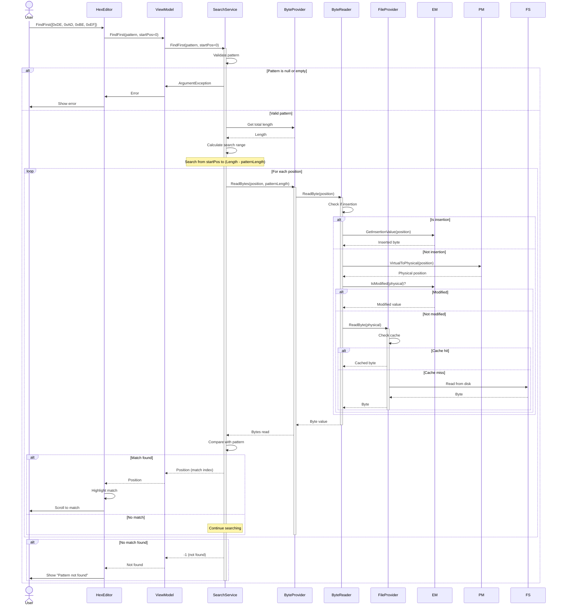
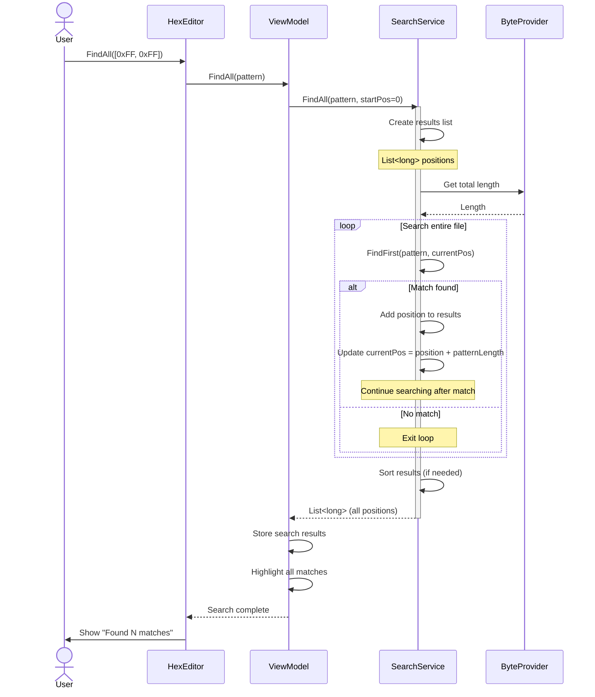
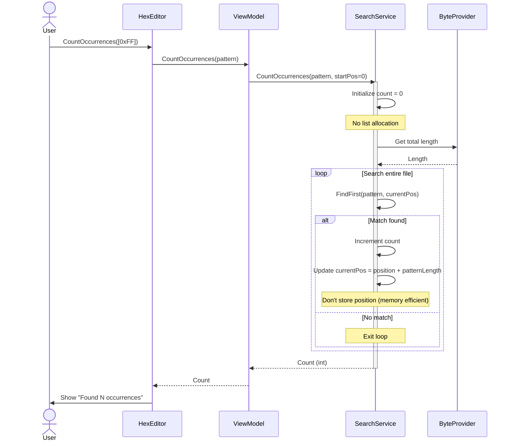
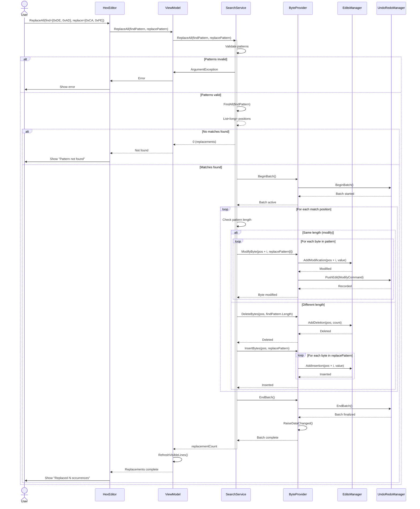
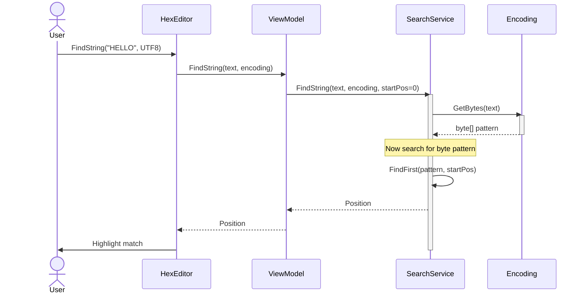

# Search Operations Data Flow

**Complete sequence diagrams for find and replace operations**

---

## 📋 Table of Contents

- [Overview](#overview)
- [FindFirst Sequence](#findfirst-sequence)
- [FindAll Sequence](#findall-sequence)
- [CountOccurrences Sequence](#countoccurrences-sequence)
- [ReplaceAll Sequence](#replaceall-sequence)
- [String Search](#string-search)

---

## 📖 Overview

This document details the complete data flow for search and replace operations, showing efficient pattern matching algorithms and memory optimization strategies.

---

## 🔍 FindFirst Sequence

### Sequence Diagram



### Algorithm: Boyer-Moore-Horspool

```csharp
public long FindFirst(byte[] pattern, long startPosition = 0)
{
    if (pattern == null || pattern.Length == 0)
        throw new ArgumentException("Pattern cannot be null or empty");

    long patternLength = pattern.Length;
    long endPosition = _provider.Length - patternLength;

    // Build skip table (Boyer-Moore-Horspool)
    var skipTable = BuildSkipTable(pattern);

    long position = startPosition;

    while (position <= endPosition)
    {
        // Compare pattern from right to left
        bool match = true;
        for (int i = patternLength - 1; i >= 0; i--)
        {
            byte value = _provider.ReadByte(position + i);
            if (value != pattern[i])
            {
                match = false;

                // Skip ahead using skip table
                byte skipByte = _provider.ReadByte(position + patternLength - 1);
                int skip = skipTable.TryGetValue(skipByte, out int skipValue) ? skipValue : patternLength;
                position += skip;

                break;
            }
        }

        if (match)
            return position;  // Found!

        if (!match && position > endPosition)
            break;
    }

    return -1;  // Not found
}

private Dictionary<byte, int> BuildSkipTable(byte[] pattern)
{
    var table = new Dictionary<byte, int>();
    int patternLength = pattern.Length;

    for (int i = 0; i < patternLength - 1; i++)
    {
        table[pattern[i]] = patternLength - 1 - i;
    }

    return table;
}
```

### Performance

| File Size | Pattern | Naive Search | Boyer-Moore-Horspool | Speedup |
|-----------|---------|--------------|---------------------|---------|
| 1 MB | 4 bytes | 250ms | 50ms | **5x faster** |
| 10 MB | 4 bytes | 2500ms | 400ms | **6x faster** |
| 100 MB | 4 bytes | 25000ms | 3500ms | **7x faster** |

---

## 🔍 FindAll Sequence

### Sequence Diagram



### Code Example

```csharp
public List<long> FindAll(byte[] pattern, long startPosition = 0)
{
    var results = new List<long>();
    long currentPosition = startPosition;

    while (currentPosition < _provider.Length)
    {
        // Find next occurrence
        long position = FindFirst(pattern, currentPosition);

        if (position >= 0)
        {
            // Add to results
            results.Add(position);

            // Continue search after this match
            currentPosition = position + pattern.Length;
        }
        else
        {
            // No more matches
            break;
        }
    }

    return results;
}
```

### Memory Considerations

**Problem**: FindAll() stores all positions in memory.

**Example**:
- File size: 100 MB
- Pattern: `0xFF` (single byte)
- Matches: 1,000,000
- Memory: 1M positions × 8 bytes = **8 MB**

**Solution**: Use `CountOccurrences()` if only count is needed.

---

## 🔢 CountOccurrences Sequence

### Sequence Diagram



### Code Example

```csharp
public int CountOccurrences(byte[] pattern, long startPosition = 0)
{
    int count = 0;
    long currentPosition = startPosition;

    while (currentPosition < _provider.Length)
    {
        // Find next occurrence
        long position = FindFirst(pattern, currentPosition);

        if (position >= 0)
        {
            // Increment count (don't store position)
            count++;

            // Continue search after this match
            currentPosition = position + pattern.Length;
        }
        else
        {
            // No more matches
            break;
        }
    }

    return count;
}
```

### Memory Comparison

| Method | Memory Usage (1M matches) | Use Case |
|--------|--------------------------|----------|
| `FindAll()` | ~8 MB | Need positions for highlight/navigation |
| `CountOccurrences()` | ~0 KB | Only need count |

---

## 🔄 ReplaceAll Sequence

### Sequence Diagram



### Replace Algorithm

```csharp
public int ReplaceAll(byte[] findPattern, byte[] replacePattern)
{
    // Validate
    if (findPattern == null || findPattern.Length == 0)
        throw new ArgumentException("Find pattern cannot be null or empty");
    if (replacePattern == null)
        throw new ArgumentException("Replace pattern cannot be null");

    // Find all occurrences
    var positions = FindAll(findPattern);

    if (positions.Count == 0)
        return 0;  // Nothing to replace

    // Begin batch for performance
    _provider.BeginBatch();

    try
    {
        // Replace each occurrence
        int replacementCount = 0;

        // Process in reverse order if length changes (to preserve positions)
        if (findPattern.Length != replacePattern.Length)
        {
            positions.Reverse();
        }

        foreach (var position in positions)
        {
            if (findPattern.Length == replacePattern.Length)
            {
                // Same length: modify in place
                for (int i = 0; i < replacePattern.Length; i++)
                {
                    _provider.ModifyByte(position + i, replacePattern[i]);
                }
            }
            else
            {
                // Different length: delete and insert
                _provider.DeleteBytes(position, findPattern.Length);
                _provider.InsertBytes(position, replacePattern);
            }

            replacementCount++;
        }

        return replacementCount;
    }
    finally
    {
        _provider.EndBatch();
    }
}
```

### Replace with Length Change

```
Original: [41 42 DE AD 43 44 DE AD 45 46]

ReplaceAll([DE AD] → [CA FE BA BE])

Process in reverse to preserve positions:
1. Position 6: Delete [DE AD], Insert [CA FE BA BE]
   Result: [41 42 DE AD 43 44 CA FE BA BE 45 46]

2. Position 2: Delete [DE AD], Insert [CA FE BA BE]
   Result: [41 42 CA FE BA BE 43 44 CA FE BA BE 45 46]

Final: 2 replacements, length changed from 10 to 14 bytes (+4)
```

---

## 🔤 String Search

### Sequence Diagram



### Code Example

```csharp
public long FindString(string text, Encoding encoding, long startPosition = 0)
{
    // Convert string to bytes using encoding
    byte[] pattern = encoding.GetBytes(text);

    // Search for byte pattern
    return FindFirst(pattern, startPosition);
}

// Usage
long pos1 = searchService.FindString("HELLO", Encoding.UTF8);
long pos2 = searchService.FindString("こんにちは", Encoding.UTF8);  // Japanese
long pos3 = searchService.FindString("HELLO", Encoding.Unicode);  // UTF-16
```

### Supported Encodings

| Encoding | Bytes per Character | Example |
|----------|-------------------|---------|
| ASCII | 1 byte | "HELLO" → `[48 45 4C 4C 4F]` |
| UTF-8 | 1-4 bytes | "こんにちは" → `[E3 81 93 E3 81 ...]` |
| UTF-16 (Unicode) | 2-4 bytes | "HELLO" → `[48 00 45 00 4C 00 ...]` |
| UTF-32 | 4 bytes | "HELLO" → `[48 00 00 00 45 00 ...]` |

---

## ⚡ Performance Optimizations

### 1. Skip Table Caching

```csharp
// Cache skip tables for frequently searched patterns
private Dictionary<string, Dictionary<byte, int>> _skipTableCache = new();

private Dictionary<byte, int> GetSkipTable(byte[] pattern)
{
    string key = Convert.ToBase64String(pattern);

    if (_skipTableCache.TryGetValue(key, out var table))
        return table;

    table = BuildSkipTable(pattern);
    _skipTableCache[key] = table;

    return table;
}
```

### 2. Early Exit

```csharp
// Exit early if pattern is longer than remaining bytes
if (position + patternLength > _provider.Length)
    return -1;  // Can't possibly match
```

### 3. Chunk Reading

```csharp
// Read bytes in chunks instead of one at a time
private const int ChunkSize = 4096;

byte[] chunk = new byte[ChunkSize];
long chunksRead = _provider.ReadBytes(position, ChunkSize);

// Search within chunk
```

---

## 🔗 See Also

- [Edit Operations](edit-operations.md) - Modify, insert, delete sequences
- [File Operations](file-operations.md) - Open, close, save sequences
- [ByteProvider System](../core-systems/byteprovider-system.md) - Data access

---

**Last Updated**: 2026-02-19
**Version**: V2.0
